# API Reference

<cite>
**Referenced Files in This Document**
- [README.md](file://README.md)
- [package.json](file://package.json)
- [vite.config.ts](file://vite.config.ts)
- [App.tsx](file://App.tsx)
- [types.ts](file://types.ts)
- [constants.tsx](file://constants.tsx)
- [services/supabaseService.ts](file://services/supabaseService.ts)
- [services/geminiService.ts](file://services/geminiService.ts)
- [services/emailService.ts](file://services/emailService.ts)
- [pages/SigninPage.tsx](file://pages/SigninPage.tsx)
- [pages/SignupPage.tsx](file://pages/SignupPage.tsx)
- [pages/ForgotPasswordPage.tsx](file://pages/ForgotPasswordPage.tsx)
- [pages/VerifyEmailPage.tsx](file://pages/VerifyEmailPage.tsx)
</cite>

## Table of Contents
1. [Introduction](#introduction)
2. [Project Structure](#project-structure)
3. [Core Components](#core-components)
4. [Architecture Overview](#architecture-overview)
5. [Detailed Component Analysis](#detailed-component-analysis)
6. [Dependency Analysis](#dependency-analysis)
7. [Performance Considerations](#performance-considerations)
8. [Troubleshooting Guide](#troubleshooting-guide)
9. [Conclusion](#conclusion)
10. [Appendices](#appendices)

## Introduction
This document provides comprehensive API documentation for the ZPRIA service integrations. It covers:
- Supabase authentication and database operations for user management, sessions, and data persistence
- Google Gemini AI integration for contextual content generation and recommendations
- EmailJS integration for OTP delivery, welcome notifications, and security alerts
- Request/response schemas, authentication methods, error handling, and operational notes
- Practical usage examples, parameter specifications, and return value handling
- Service interfaces defined in types.ts, integration best practices, and versioning/migration guidance

## Project Structure
The application is a React client that integrates three primary services:
- Supabase for authentication and relational data
- Google Gemini for AI-generated content
- EmailJS for transactional email delivery

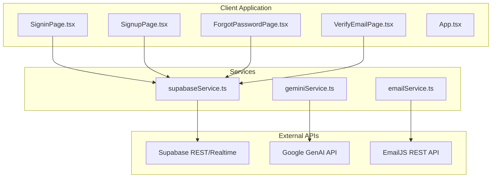

**Diagram sources**
- [App.tsx](file://App.tsx#L252-L272)
- [services/supabaseService.ts](file://services/supabaseService.ts#L1-L67)
- [services/geminiService.ts](file://services/geminiService.ts#L1-L39)
- [services/emailService.ts](file://services/emailService.ts#L1-L194)

**Section sources**
- [README.md](file://README.md#L1-L21)
- [package.json](file://package.json#L12-L18)
- [vite.config.ts](file://vite.config.ts#L13-L16)

## Core Components
- Supabase service: Authentication helpers, availability checks, login attempt handling, and password hashing
- Gemini service: AI greeting and security recommendation generation
- EmailJS service: OTP dispatch, welcome alerts, and password change notifications

**Section sources**
- [services/supabaseService.ts](file://services/supabaseService.ts#L1-L67)
- [services/geminiService.ts](file://services/geminiService.ts#L1-L39)
- [services/emailService.ts](file://services/emailService.ts#L1-L194)

## Architecture Overview
The client orchestrates user journeys through page components that call service functions. Services encapsulate external API interactions and expose typed functions to the UI.

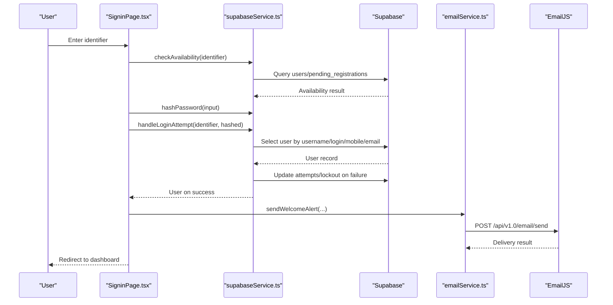

**Diagram sources**
- [pages/SigninPage.tsx](file://pages/SigninPage.tsx#L23-L95)
- [services/supabaseService.ts](file://services/supabaseService.ts#L9-L66)
- [services/emailService.ts](file://services/emailService.ts#L70-L137)

## Detailed Component Analysis

### Supabase Authentication and Database API
- Purpose: User lookup, availability checks, login attempt handling, and password hashing
- Exposed functions:
  - hashPassword(password): Returns SHA-256 hex string of trimmed password
  - checkAvailability(field, value): Ensures username/email is free across users and pending registrations
  - handleLoginAttempt(identifier, passwordHash): Multi-field lookup, lockout enforcement, attempt tracking, and success/failure handling

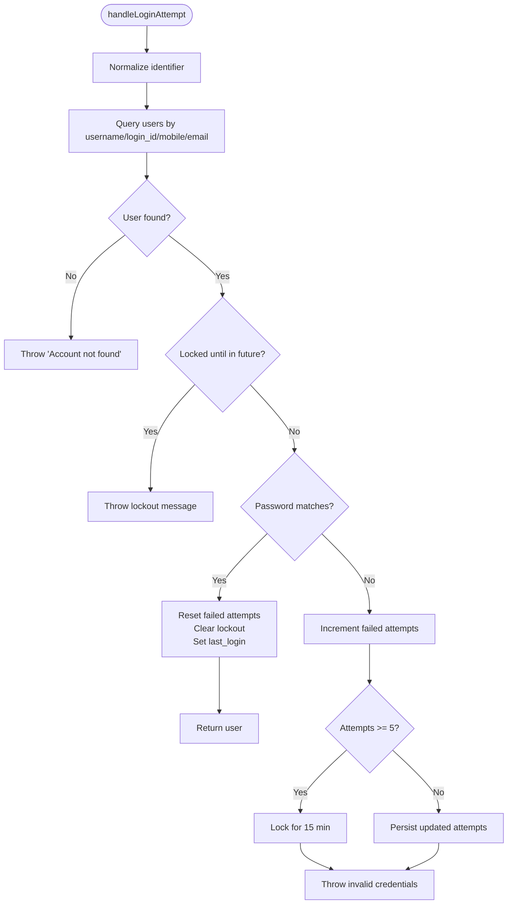

**Diagram sources**
- [services/supabaseService.ts](file://services/supabaseService.ts#L26-L66)

**Section sources**
- [services/supabaseService.ts](file://services/supabaseService.ts#L9-L66)

#### Supabase Data Models Used
- users: Stores verified identities with security fields and audit timestamps
- pending_registrations: Temporary staging for new sign-ups awaiting verification
- otp_verifications: Stores OTP codes with purpose and expiration

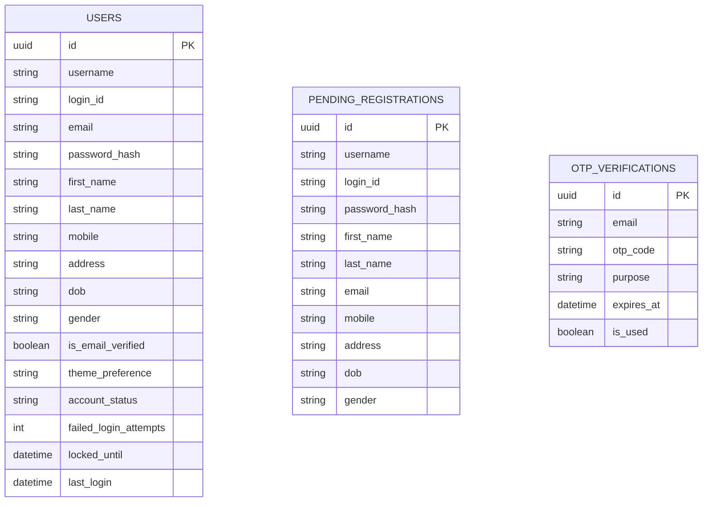

**Diagram sources**
- [services/supabaseService.ts](file://services/supabaseService.ts#L17-L24)
- [pages/SignupPage.tsx](file://pages/SignupPage.tsx#L117-L137)
- [pages/VerifyEmailPage.tsx](file://pages/VerifyEmailPage.tsx#L107-L117)

### Google Gemini AI API Integration
- Purpose: Generate contextual greetings and security recommendations
- Functions:
  - getGeminiGreeting(name): Returns a short, enthusiastic welcome message
  - getSecurityRecommendation(status): Returns a concise security tip based on verification status
- Model: gemini-3-flash-preview
- Environment: Requires API_KEY via Vite define config

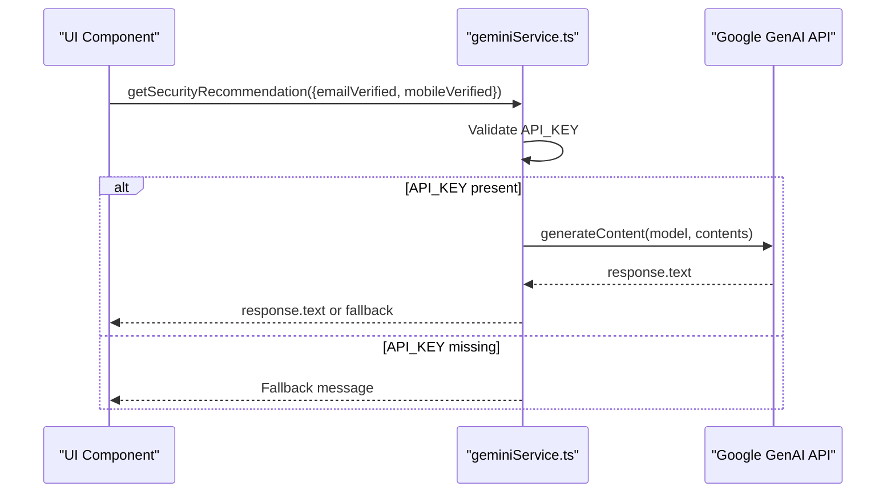

**Diagram sources**
- [services/geminiService.ts](file://services/geminiService.ts#L22-L38)
- [vite.config.ts](file://vite.config.ts#L13-L16)

**Section sources**
- [services/geminiService.ts](file://services/geminiService.ts#L1-L39)
- [vite.config.ts](file://vite.config.ts#L13-L16)

### EmailJS API Integration
- Purpose: Send OTP emails, welcome alerts, and password change notifications
- Endpoints:
  - POST https://api.emailjs.com/api/v1.0/email/send
- Templates and Services:
  - OTP: service_6dasibh + template_ituj83r
  - Welcome: service_d0xcjoj + template_m53qmps
- Security context: IP capture with timeout, device info, login time
- Return values: Boolean success indicator; errors logged and surfaced to caller

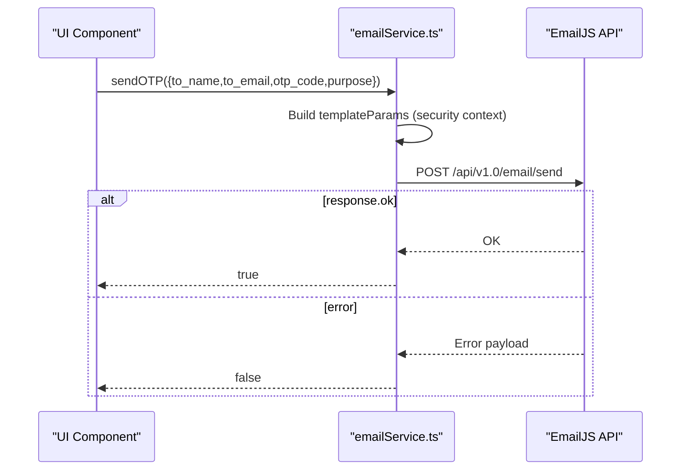

**Diagram sources**
- [services/emailService.ts](file://services/emailService.ts#L70-L137)

**Section sources**
- [services/emailService.ts](file://services/emailService.ts#L1-L194)

### Page-Level Workflows and Service Calls

#### Sign-In Flow
- Validates identifier presence
- Queries user by username/login_id/mobile/email
- Hashes password and authenticates with Supabase
- Sends welcome alert via EmailJS
- Persists user session and navigates to dashboard

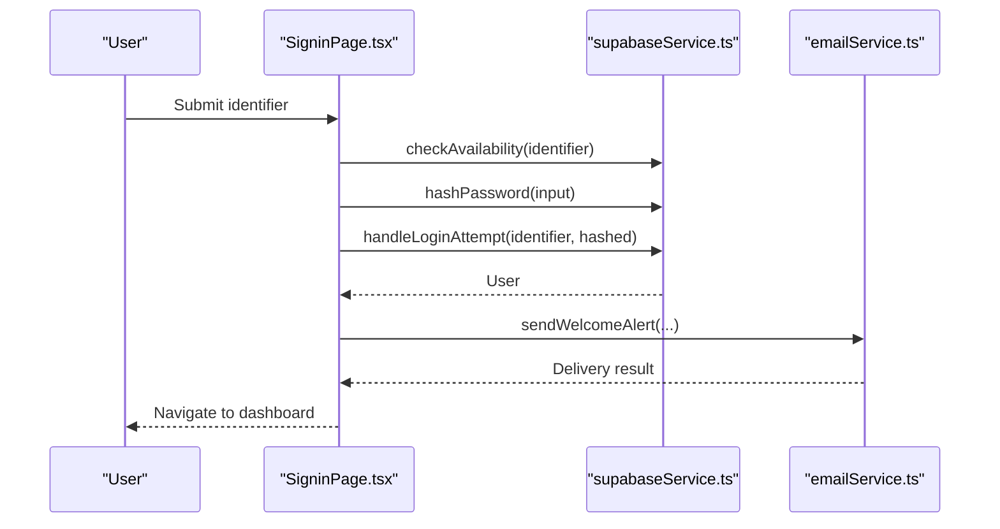

**Diagram sources**
- [pages/SigninPage.tsx](file://pages/SigninPage.tsx#L23-L95)
- [services/supabaseService.ts](file://services/supabaseService.ts#L9-L66)
- [services/emailService.ts](file://services/emailService.ts#L152-L172)

**Section sources**
- [pages/SigninPage.tsx](file://pages/SigninPage.tsx#L23-L95)

#### Sign-Up Flow
- Validates form fields and age
- Checks availability of username and email
- Inserts pending registration
- Creates OTP with expiry and sends OTP email
- Navigates to verification page

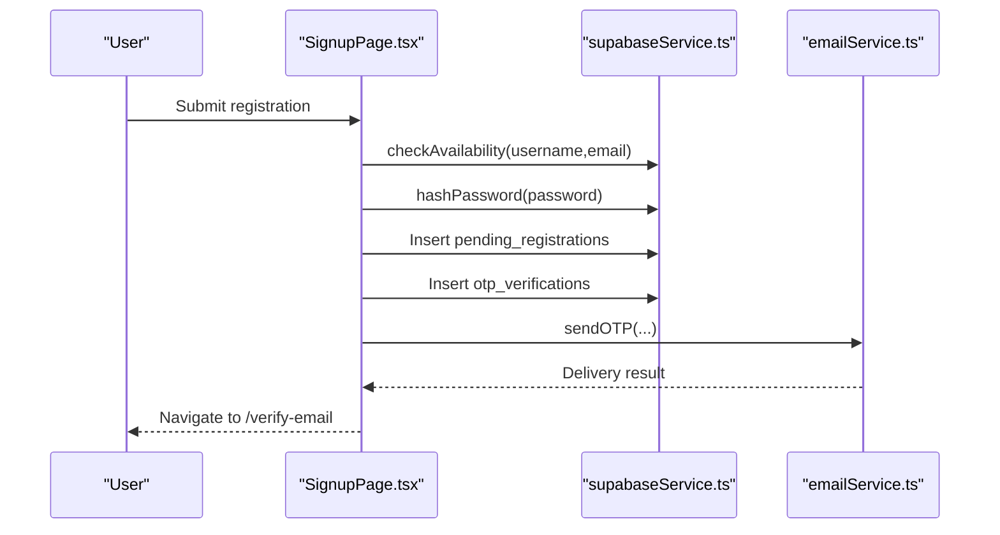

**Diagram sources**
- [pages/SignupPage.tsx](file://pages/SignupPage.tsx#L82-L149)
- [services/supabaseService.ts](file://services/supabaseService.ts#L17-L24)
- [services/emailService.ts](file://services/emailService.ts#L139-L147)

**Section sources**
- [pages/SignupPage.tsx](file://pages/SignupPage.tsx#L82-L149)

#### Forgot Password Flow
- Searches for accounts by email/username/mobile
- Generates OTP for password reset
- Sends OTP email and navigates to verification

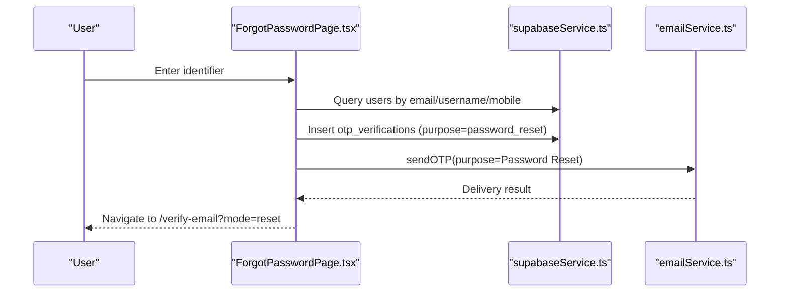

**Diagram sources**
- [pages/ForgotPasswordPage.tsx](file://pages/ForgotPasswordPage.tsx#L34-L110)
- [services/emailService.ts](file://services/emailService.ts#L139-L147)

**Section sources**
- [pages/ForgotPasswordPage.tsx](file://pages/ForgotPasswordPage.tsx#L34-L110)

#### Email Verification Flow
- Accepts 8-digit OTP input
- Verifies against otp_verifications
- On success:
  - Password reset: sets authorized flags and navigates to reset page
  - Registration: moves from pending_registrations to users, sends welcome, clears pending

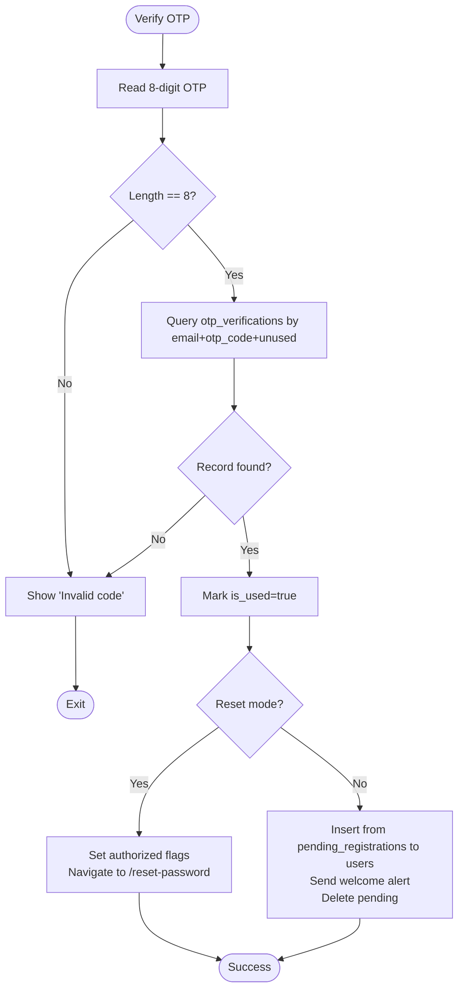

**Diagram sources**
- [pages/VerifyEmailPage.tsx](file://pages/VerifyEmailPage.tsx#L99-L162)

**Section sources**
- [pages/VerifyEmailPage.tsx](file://pages/VerifyEmailPage.tsx#L99-L162)

## Dependency Analysis
- External libraries:
  - @supabase/supabase-js for Supabase client
  - @google/genai for Gemini integration
  - React and React Router for routing and UI
- Environment configuration:
  - Vite injects GEMINI_API_KEY via define to process.env.API_KEY
- Runtime dependencies and versions are declared in package.json

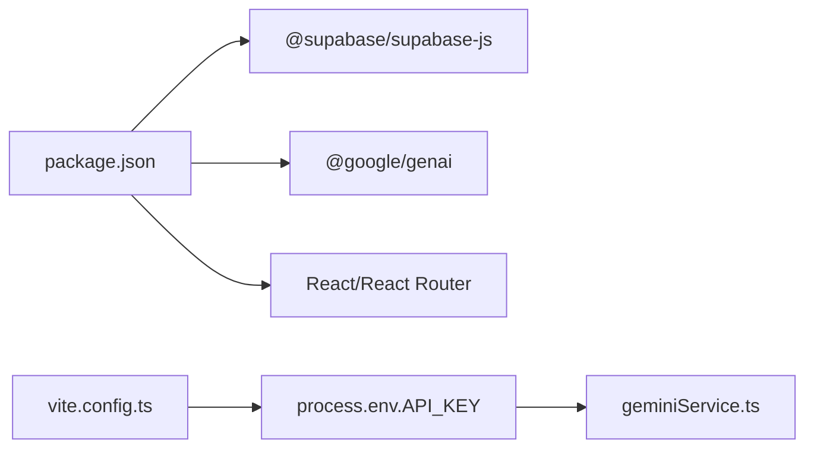

**Diagram sources**
- [package.json](file://package.json#L12-L18)
- [vite.config.ts](file://vite.config.ts#L13-L16)

**Section sources**
- [package.json](file://package.json#L12-L18)
- [vite.config.ts](file://vite.config.ts#L13-L16)

## Performance Considerations
- Supabase queries:
  - Prefer selective field lists and indexed lookups (username, login_id, email, mobile)
  - Use maybeSingle for single-record retrieval to reduce overhead
- EmailJS:
  - Use lightweight fetch with minimal JSON payload
  - Consider retry/backoff for transient network errors
- Gemini:
  - API_KEY presence guards to avoid unnecessary requests
  - Keep prompts concise to minimize latency and cost
- UI responsiveness:
  - Debounce OTP input and enforce numeric-only entries
  - Use loading states during async operations

## Troubleshooting Guide
- Supabase authentication
  - “Account not found”: Verify identifier normalization and multi-field search
  - “Account locked for X minutes”: Wait for lockout to expire or reduce repeated failures
  - “Invalid credentials”: Confirm password hashing and attempt thresholds
- EmailJS
  - Missing recipient: Ensure to_email is present before dispatch
  - Network errors: Inspect response.ok and log error payloads
  - Rate limits: Respect provider limits; implement exponential backoff
- Gemini
  - Missing API_KEY: Falls back to default messages; set GEMINI_API_KEY in environment
  - Generation errors: Logs are printed; UI falls back gracefully

**Section sources**
- [services/supabaseService.ts](file://services/supabaseService.ts#L36-L65)
- [services/emailService.ts](file://services/emailService.ts#L70-L137)
- [services/geminiService.ts](file://services/geminiService.ts#L5-L19)

## Conclusion
The ZPRIA service integrations combine Supabase for robust identity and data management, Google Gemini for contextual AI assistance, and EmailJS for reliable email delivery. The documented flows, schemas, and error handling patterns enable predictable operation and facilitate maintenance and extension.

## Appendices

### Service Interfaces and Types
- UserProfile: Core user identity and preferences
- AuthState: Application-wide authentication state
- ProductType and ZipraProduct: Product catalog models

**Section sources**
- [types.ts](file://types.ts#L11-L78)

### Authentication Methods
- Supabase authentication:
  - Identifier-based lookup across username, login_id, mobile, and email
  - SHA-256 password hashing with trimming
  - Attempt-based lockout and audit fields
- Session handling:
  - Frontend persists user profile in localStorage
  - Navigation guarded by route definitions

**Section sources**
- [services/supabaseService.ts](file://services/supabaseService.ts#L26-L66)
- [App.tsx](file://App.tsx#L218-L242)

### Request/Response Schemas

- Supabase
  - Users table fields used in authentication and profile retrieval
  - Pending registrations and OTP verifications for lifecycle management
- Gemini
  - Inputs: model name and prompt content
  - Outputs: generated text or fallback message
- EmailJS
  - Endpoint: POST https://api.emailjs.com/api/v1.0/email/send
  - Required fields: service_id, template_id, user_id, accessToken, template_params
  - TemplateParams include security context and branding fields

**Section sources**
- [services/supabaseService.ts](file://services/supabaseService.ts#L17-L24)
- [services/geminiService.ts](file://services/geminiService.ts#L10-L19)
- [services/emailService.ts](file://services/emailService.ts#L114-L137)

### Error Codes and Handling
- Supabase
  - Throws descriptive errors for not found, lockout, and invalid credentials
- EmailJS
  - Returns false on non-OK responses; logs underlying error text
- Gemini
  - Returns fallback messages when API_KEY is missing or generation fails

**Section sources**
- [services/supabaseService.ts](file://services/supabaseService.ts#L36-L65)
- [services/emailService.ts](file://services/emailService.ts#L127-L136)
- [services/geminiService.ts](file://services/geminiService.ts#L16-L19)

### Rate Limiting Information
- Supabase: Subject to provider limits; optimize queries and caching
- EmailJS: Subject to provider limits; implement retries and backoff
- Gemini: Subject to provider quotas; guard with API_KEY presence and concise prompts

[No sources needed since this section provides general guidance]

### API Versioning and Migration
- Supabase
  - Use migrations to evolve users, pending_registrations, and otp_verifications tables
  - Maintain backward compatibility by preserving existing column names and defaults
- Gemini
  - Pin model identifiers in code; update only after testing
  - Guard optional features behind API_KEY presence
- EmailJS
  - Keep template IDs and service IDs in constants; update only with new templates
  - Maintain template_params parity to avoid runtime errors

[No sources needed since this section provides general guidance]