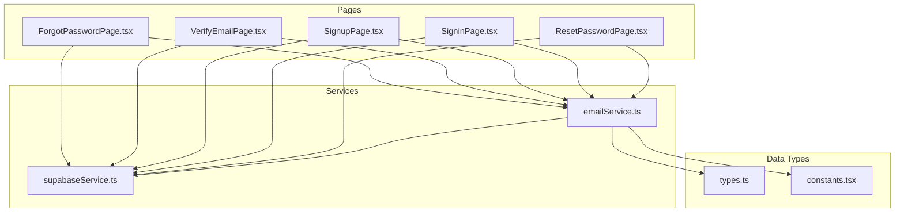
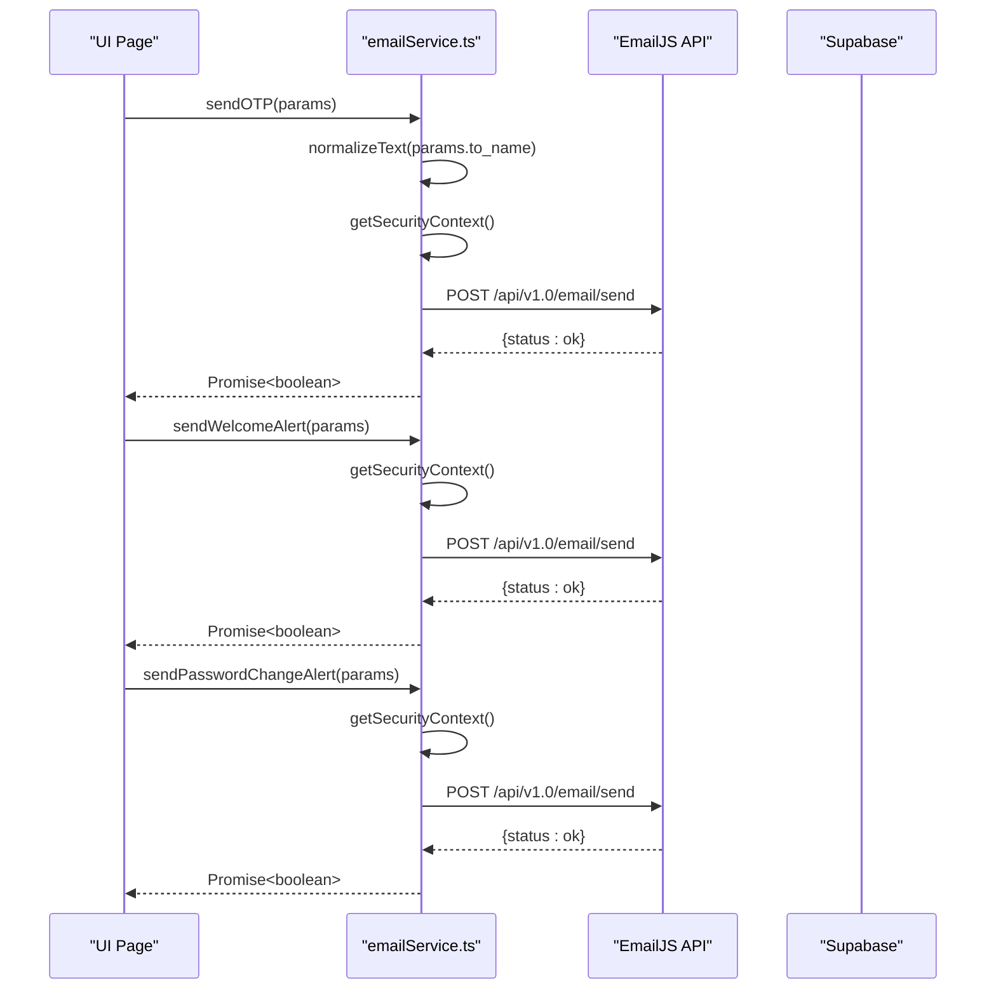
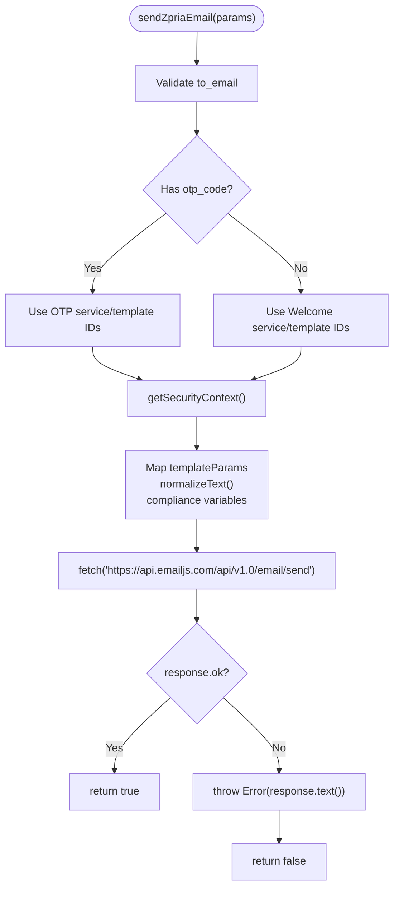
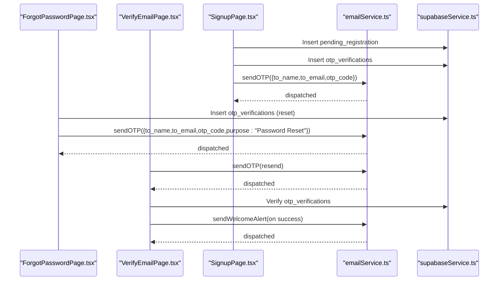
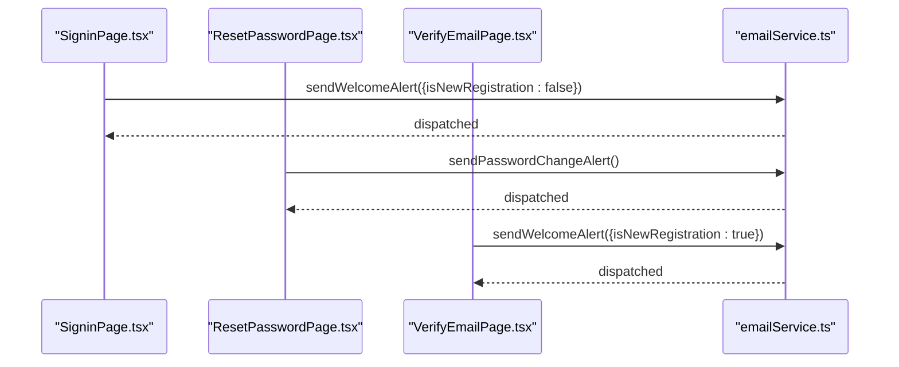
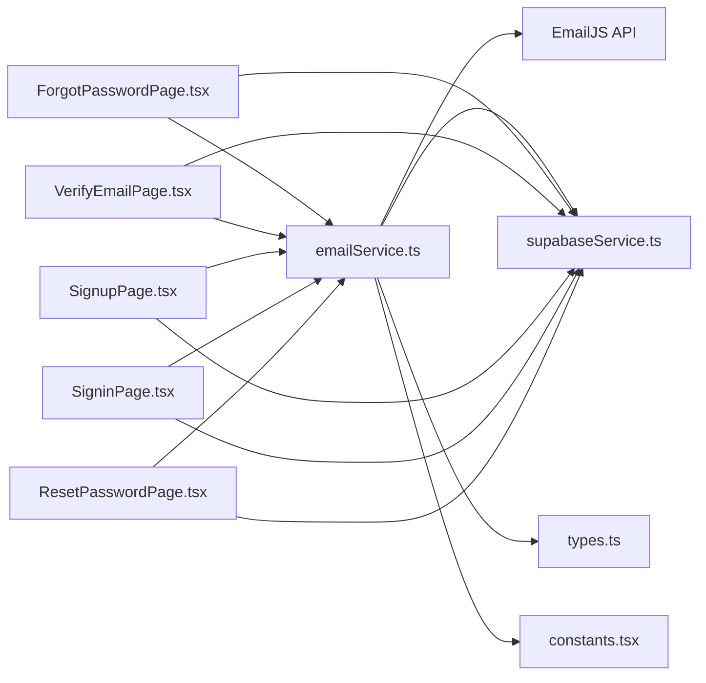

# Email Service API Integration

<cite>
**Referenced Files in This Document**
- [emailService.ts](file://services/emailService.ts)
- [supabaseService.ts](file://services/supabaseService.ts)
- [ForgotPasswordPage.tsx](file://pages/ForgotPasswordPage.tsx)
- [VerifyEmailPage.tsx](file://pages/VerifyEmailPage.tsx)
- [SignupPage.tsx](file://pages/SignupPage.tsx)
- [SigninPage.tsx](file://pages/SigninPage.tsx)
- [ResetPasswordPage.tsx](file://pages/ResetPasswordPage.tsx)
- [types.ts](file://types.ts)
- [constants.tsx](file://constants.tsx)
</cite>

## Table of Contents
1. [Introduction](#introduction)
2. [Project Structure](#project-structure)
3. [Core Components](#core-components)
4. [Architecture Overview](#architecture-overview)
5. [Detailed Component Analysis](#detailed-component-analysis)
6. [Dependency Analysis](#dependency-analysis)
7. [Performance Considerations](#performance-considerations)
8. [Troubleshooting Guide](#troubleshooting-guide)
9. [Conclusion](#conclusion)

## Introduction
This document provides comprehensive API documentation for the EmailJS service integration within the ZPRIA application. It covers email service configuration, template management, and notification workflows. The documentation details email sending capabilities for OTP verification emails, welcome notifications, and security alerts. It includes request/response schemas for email operations, template variables, and recipient management. Authentication methods, API key configuration, and security considerations are documented alongside practical integration patterns, template customization guidelines, error handling strategies, and troubleshooting advice for common email delivery issues.

## Project Structure
The email integration spans several key areas:
- Email service module encapsulating EmailJS configuration and dispatch logic
- Page components orchestrating email-triggered workflows (registration, password reset, sign-in)
- Supabase service for user data and OTP management
- Types and constants supporting user profiles and UI assets

**Diagram sources**
- [emailService.ts](file://services/emailService.ts#L1-L194)
- [supabaseService.ts](file://services/supabaseService.ts#L1-L67)
- [ForgotPasswordPage.tsx](file://pages/ForgotPasswordPage.tsx#L1-L265)
- [VerifyEmailPage.tsx](file://pages/VerifyEmailPage.tsx#L1-L255)
- [SignupPage.tsx](file://pages/SignupPage.tsx#L1-L293)
- [SigninPage.tsx](file://pages/SigninPage.tsx#L1-L231)
- [ResetPasswordPage.tsx](file://pages/ResetPasswordPage.tsx#L1-L236)
- [types.ts](file://types.ts#L1-L79)
- [constants.tsx](file://constants.tsx#L1-L361)

**Section sources**
- [emailService.ts](file://services/emailService.ts#L1-L194)
- [supabaseService.ts](file://services/supabaseService.ts#L1-L67)
- [ForgotPasswordPage.tsx](file://pages/ForgotPasswordPage.tsx#L1-L265)
- [VerifyEmailPage.tsx](file://pages/VerifyEmailPage.tsx#L1-L255)
- [SignupPage.tsx](file://pages/SignupPage.tsx#L1-L293)
- [SigninPage.tsx](file://pages/SigninPage.tsx#L1-L231)
- [ResetPasswordPage.tsx](file://pages/ResetPasswordPage.tsx#L1-L236)
- [types.ts](file://types.ts#L1-L79)
- [constants.tsx](file://constants.tsx#L1-L361)

## Core Components
- EmailJS configuration and dispatch logic
- OTP generation and verification workflows
- Welcome and security alert notifications
- Template variable mapping and normalization
- Security context capture for alerts

**Section sources**
- [emailService.ts](file://services/emailService.ts#L2-L137)
- [ForgotPasswordPage.tsx](file://pages/ForgotPasswordPage.tsx#L81-L110)
- [VerifyEmailPage.tsx](file://pages/VerifyEmailPage.tsx#L68-L162)
- [SignupPage.tsx](file://pages/SignupPage.tsx#L102-L142)
- [SigninPage.tsx](file://pages/SigninPage.tsx#L77-L95)
- [ResetPasswordPage.tsx](file://pages/ResetPasswordPage.tsx#L64-L125)

## Architecture Overview
The email integration follows a layered architecture:
- Presentation layer: page components orchestrate user actions and trigger email events
- Service layer: emailService manages EmailJS configuration and dispatch
- Data layer: supabaseService handles user data, OTP storage, and authentication
- Template layer: EmailJS templates receive mapped variables for rendering

**Diagram sources**
- [emailService.ts](file://services/emailService.ts#L70-L137)
- [ForgotPasswordPage.tsx](file://pages/ForgotPasswordPage.tsx#L96-L101)
- [VerifyEmailPage.tsx](file://pages/VerifyEmailPage.tsx#L146-L152)
- [ResetPasswordPage.tsx](file://pages/ResetPasswordPage.tsx#L78-L83)

## Detailed Component Analysis

### Email Service Module
The email service encapsulates EmailJS configuration and dispatch logic. It defines service identifiers, template IDs, and public/private keys. The core dispatch function accepts a typed parameter object and maps it to EmailJS template parameters. It includes normalization for text fields, security context capture, and compliance variables.

Key responsibilities:
- Normalize text to avoid spam detection
- Capture security context (IP, location, device info, login time)
- Map template variables for OTP and welcome/alert emails
- Dispatch to EmailJS API with proper authentication
- Handle errors and return boolean outcomes

**Diagram sources**
- [emailService.ts](file://services/emailService.ts#L70-L137)

**Section sources**
- [emailService.ts](file://services/emailService.ts#L2-L137)

### OTP Verification Workflows
OTP workflows span registration, password reset, and verification flows. Pages coordinate OTP generation, storage, and dispatch while the email service sends verification emails.

**Diagram sources**
- [SignupPage.tsx](file://pages/SignupPage.tsx#L117-L142)
- [ForgotPasswordPage.tsx](file://pages/ForgotPasswordPage.tsx#L89-L110)
- [VerifyEmailPage.tsx](file://pages/VerifyEmailPage.tsx#L75-L162)
- [emailService.ts](file://services/emailService.ts#L139-L147)

**Section sources**
- [SignupPage.tsx](file://pages/SignupPage.tsx#L102-L142)
- [ForgotPasswordPage.tsx](file://pages/ForgotPasswordPage.tsx#L81-L110)
- [VerifyEmailPage.tsx](file://pages/VerifyEmailPage.tsx#L68-L162)
- [emailService.ts](file://services/emailService.ts#L139-L147)

### Welcome and Security Alerts
Welcome and security alerts are triggered during sign-in, password reset completion, and registration success. The email service composes appropriate messages based on context.

**Diagram sources**
- [SigninPage.tsx](file://pages/SigninPage.tsx#L77-L95)
- [ResetPasswordPage.tsx](file://pages/ResetPasswordPage.tsx#L77-L125)
- [VerifyEmailPage.tsx](file://pages/VerifyEmailPage.tsx#L146-L152)
- [emailService.ts](file://services/emailService.ts#L152-L193)

**Section sources**
- [SigninPage.tsx](file://pages/SigninPage.tsx#L77-L95)
- [ResetPasswordPage.tsx](file://pages/ResetPasswordPage.tsx#L77-L125)
- [VerifyEmailPage.tsx](file://pages/VerifyEmailPage.tsx#L146-L152)
- [emailService.ts](file://services/emailService.ts#L152-L193)

### Template Variables and Request Schema
The email service maps a typed parameter object to EmailJS template parameters. The following variables are supported:

- Recipient identification
  - to_name: string
  - to_email: string

- OTP-specific variables
  - otp_code: string (optional)
  - purpose: string (optional)
  - expires_in: string (optional)

- Content and branding
  - success_title: string (optional)
  - welcome_message: string (optional)
  - action_type: string (optional)
  - username: string (optional)
  - login_id: string (optional)
  - subject: string (optional)

- Security context (automatically populated)
  - device_info: string
  - ip_address: string
  - login_time: string
  - location: string

- Compliance variables
  - unsubscribe_url: string
  - physical_address: string

These variables are normalized and mapped into template_params for EmailJS.

**Section sources**
- [emailService.ts](file://services/emailService.ts#L11-L25)
- [emailService.ts](file://services/emailService.ts#L83-L112)

### Authentication Methods and API Keys
The email service uses EmailJS public and private keys for authentication. The configuration includes:
- Public user ID (public_key)
- Private access token (private_key)
- Service IDs for OTP and welcome templates
- Template IDs for OTP and welcome messages

Security considerations:
- Keys are embedded in client-side code; consider server-side proxy for production
- Template variables include unsubscribe and physical address for compliance
- Subject lines are normalized for professional appearance

**Section sources**
- [emailService.ts](file://services/emailService.ts#L3-L6)
- [emailService.ts](file://services/emailService.ts#L114-L125)

### Delivery Tracking and Retry Mechanisms
The email service returns boolean outcomes indicating success or failure. Pages implement retry mechanisms:
- VerifyEmailPage provides a resend timer and manual resend button
- ForgotPasswordPage and VerifyEmailPage regenerate OTPs and re-send emails
- Supabase stores OTP records with expiration timestamps

Retry strategies:
- Resend after countdown completes
- Immediate resend on user request
- Expiration-based cleanup of OTP records

**Section sources**
- [VerifyEmailPage.tsx](file://pages/VerifyEmailPage.tsx#L63-L97)
- [ForgotPasswordPage.tsx](file://pages/ForgotPasswordPage.tsx#L81-L110)

### Spam Prevention Measures
The email service implements several anti-spam measures:
- Text normalization for consistent formatting
- Professional subject lines
- Unsubscribe URL and physical address inclusion
- Security context disclosure for transparency
- Device and location information for user awareness

**Section sources**
- [emailService.ts](file://services/emailService.ts#L29-L34)
- [emailService.ts](file://services/emailService.ts#L88-L90)
- [emailService.ts](file://services/emailService.ts#L104-L111)

## Dependency Analysis
The email service integrates with multiple components across the application:

**Diagram sources**
- [emailService.ts](file://services/emailService.ts#L1-L194)
- [supabaseService.ts](file://services/supabaseService.ts#L1-L67)
- [ForgotPasswordPage.tsx](file://pages/ForgotPasswordPage.tsx#L1-L265)
- [VerifyEmailPage.tsx](file://pages/VerifyEmailPage.tsx#L1-L255)
- [SignupPage.tsx](file://pages/SignupPage.tsx#L1-L293)
- [SigninPage.tsx](file://pages/SigninPage.tsx#L1-L231)
- [ResetPasswordPage.tsx](file://pages/ResetPasswordPage.tsx#L1-L236)
- [types.ts](file://types.ts#L1-L79)
- [constants.tsx](file://constants.tsx#L1-L361)

**Section sources**
- [emailService.ts](file://services/emailService.ts#L1-L194)
- [supabaseService.ts](file://services/supabaseService.ts#L1-L67)
- [ForgotPasswordPage.tsx](file://pages/ForgotPasswordPage.tsx#L1-L265)
- [VerifyEmailPage.tsx](file://pages/VerifyEmailPage.tsx#L1-L255)
- [SignupPage.tsx](file://pages/SignupPage.tsx#L1-L293)
- [SigninPage.tsx](file://pages/SigninPage.tsx#L1-L231)
- [ResetPasswordPage.tsx](file://pages/ResetPasswordPage.tsx#L1-L236)
- [types.ts](file://types.ts#L1-L79)
- [constants.tsx](file://constants.tsx#L1-L361)

## Performance Considerations
- Minimize network requests by batching OTP generation and email dispatch
- Cache security context data when appropriate to reduce external API calls
- Use exponential backoff for retries in case of transient failures
- Optimize template rendering by limiting dynamic content
- Monitor EmailJS rate limits and implement throttling if needed

## Troubleshooting Guide
Common issues and resolutions:
- Missing recipient email: Ensure to_email is provided before dispatch
- EmailJS API errors: Check service_id, template_id, user_id, and access token
- Security context timeouts: The security context fetch has a 2-second timeout; handle gracefully
- OTP verification failures: Verify OTP records exist, are unexpired, and not marked as used
- Session expiration: Pages rely on local/session storage for temporary data; ensure keys are present

Error handling patterns:
- Return boolean outcomes from email dispatch functions
- Log detailed error messages with service IDs
- Provide user-friendly error messages in UI components
- Implement retry mechanisms with clear feedback

**Section sources**
- [emailService.ts](file://services/emailService.ts#L70-L137)
- [VerifyEmailPage.tsx](file://pages/VerifyEmailPage.tsx#L107-L162)
- [ForgotPasswordPage.tsx](file://pages/ForgotPasswordPage.tsx#L34-L79)

## Conclusion
The EmailJS integration in ZPRIA provides a robust foundation for email-based workflows including OTP verification, welcome notifications, and security alerts. The service module centralizes configuration and dispatch logic, while page components orchestrate user interactions. The integration includes built-in anti-spam measures, security context disclosure, and retry mechanisms. For production deployments, consider moving sensitive keys to a server-side proxy and implementing comprehensive monitoring and logging for email delivery metrics.