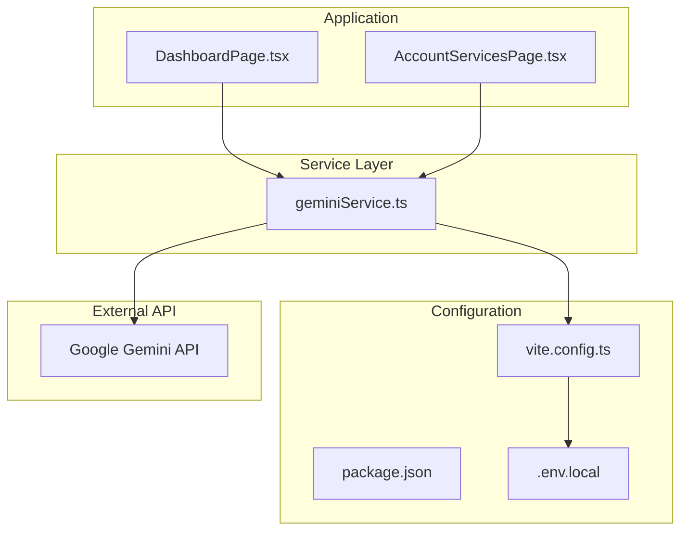
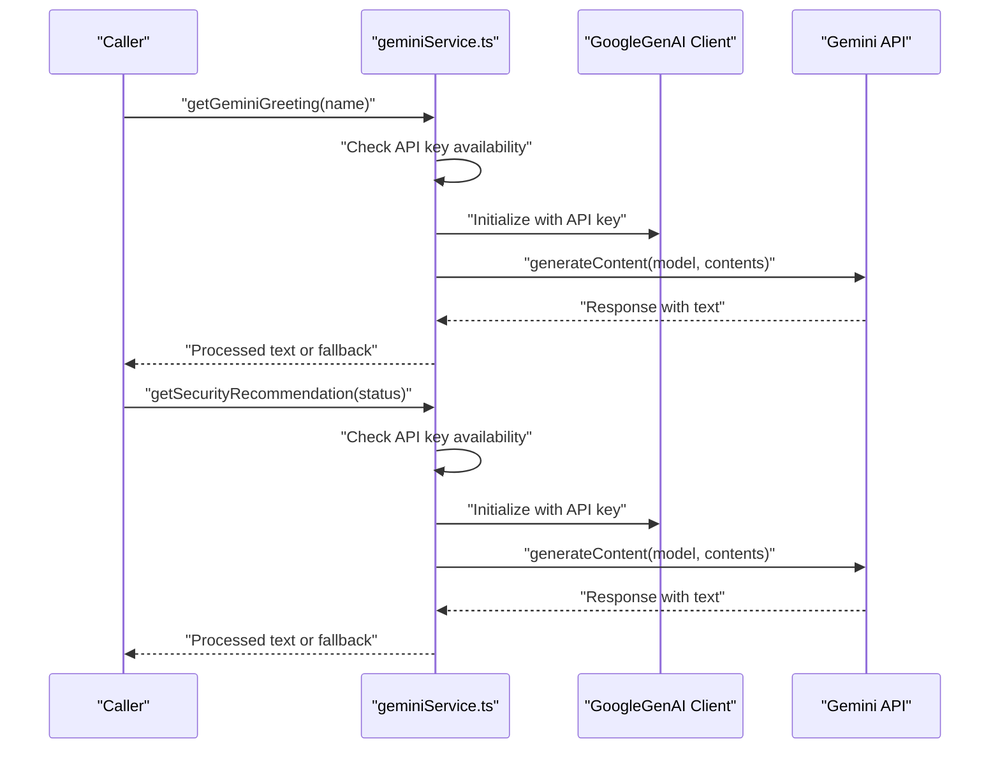
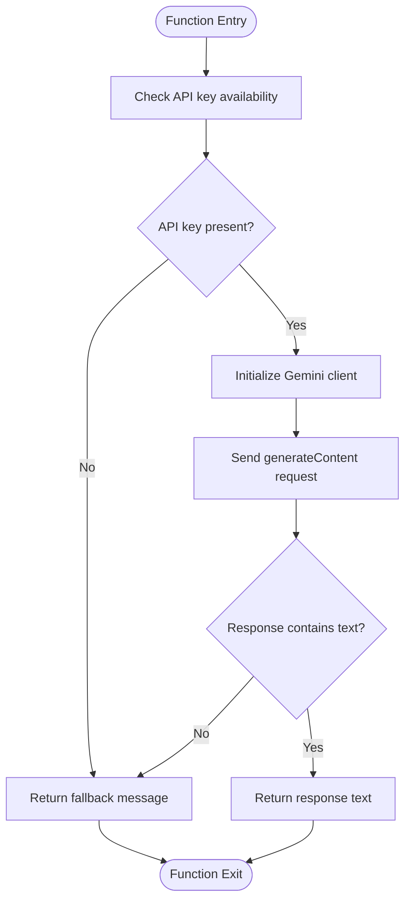
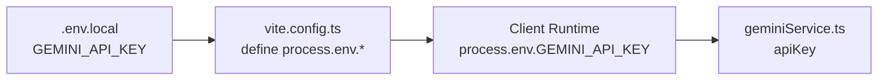
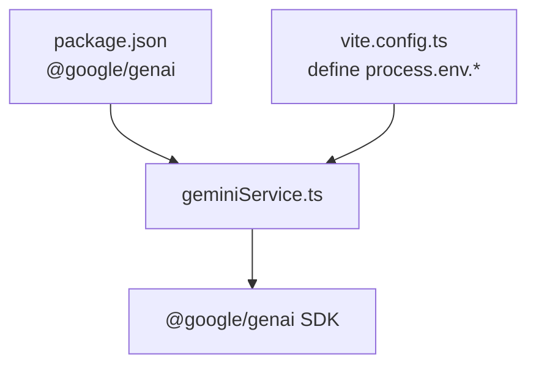

# Google Gemini AI API Integration

<cite>
**Referenced Files in This Document**
- [geminiService.ts](file://services/geminiService.ts)
- [vite.config.ts](file://vite.config.ts)
- [package.json](file://package.json)
- [README.md](file://README.md)
- [types.ts](file://types.ts)
- [DashboardPage.tsx](file://pages/DashboardPage.tsx)
</cite>

## Table of Contents
1. [Introduction](#introduction)
2. [Project Structure](#project-structure)
3. [Core Components](#core-components)
4. [Architecture Overview](#architecture-overview)
5. [Detailed Component Analysis](#detailed-component-analysis)
6. [Dependency Analysis](#dependency-analysis)
7. [Performance Considerations](#performance-considerations)
8. [Troubleshooting Guide](#troubleshooting-guide)
9. [Conclusion](#conclusion)
10. [Appendices](#appendices)

## Introduction
This document provides comprehensive API documentation for the Google Gemini AI service integration within the ZPRIA application. It covers client setup, authentication configuration, content generation capabilities, and practical guidance for AI-powered features such as contextual greeting generation, security recommendations, and content personalization. The guide includes request/response considerations, model configuration, error handling, rate limiting awareness, fallback mechanisms, prompt engineering guidelines, and performance optimization strategies.

## Project Structure
The Gemini integration is encapsulated in a dedicated service module and configured via Vite environment injection. The service exposes two primary functions for generating contextual content and security recommendations.

**Diagram sources**
- [geminiService.ts](file://services/geminiService.ts#L1-L39)
- [vite.config.ts](file://vite.config.ts#L1-L24)
- [package.json](file://package.json#L1-L27)
- [DashboardPage.tsx](file://pages/DashboardPage.tsx#L1-L217)

**Section sources**
- [geminiService.ts](file://services/geminiService.ts#L1-L39)
- [vite.config.ts](file://vite.config.ts#L1-L24)
- [package.json](file://package.json#L1-L27)
- [README.md](file://README.md#L1-L21)

## Core Components
- Gemini Service Module: Provides asynchronous functions to generate contextual greetings and security recommendations using the Google Gemini API.
- Authentication Configuration: Uses Vite's environment injection to expose the Gemini API key to the client-side runtime.
- Model Selection: Currently configured to use a specific preview model optimized for fast, concise responses.

Key responsibilities:
- Initialize the Gemini client with the API key from environment configuration.
- Construct prompts tailored to the requested AI feature.
- Handle errors gracefully with fallback responses.
- Return processed text content from the model response.

**Section sources**
- [geminiService.ts](file://services/geminiService.ts#L4-L20)
- [geminiService.ts](file://services/geminiService.ts#L22-L38)
- [vite.config.ts](file://vite.config.ts#L13-L16)

## Architecture Overview
The integration follows a straightforward request-response pattern:
- The service initializes the Gemini client with the API key.
- It sends a content generation request with a model identifier and a constructed prompt.
- The response is processed to extract the generated text.
- Errors are caught and handled with fallback messages.

**Diagram sources**
- [geminiService.ts](file://services/geminiService.ts#L4-L20)
- [geminiService.ts](file://services/geminiService.ts#L22-L38)

## Detailed Component Analysis

### Gemini Service Functions
The service exports two primary functions:
- getGeminiGreeting: Generates a contextual welcome message for a user based on their name.
- getSecurityRecommendation: Provides a concise security tip based on the user's verification status.

Implementation highlights:
- Environment-driven authentication: The API key is retrieved from the environment and injected at build-time via Vite.
- Model configuration: Uses a specific model identifier suitable for fast, concise outputs.
- Prompt construction: Embeds user-specific data into prompts to tailor responses.
- Response processing: Extracts the generated text from the model response.
- Error handling: Catches exceptions and returns sensible fallback messages.

**Diagram sources**
- [geminiService.ts](file://services/geminiService.ts#L4-L20)
- [geminiService.ts](file://services/geminiService.ts#L22-L38)

**Section sources**
- [geminiService.ts](file://services/geminiService.ts#L4-L20)
- [geminiService.ts](file://services/geminiService.ts#L22-L38)

### Authentication Configuration
- Environment Injection: Vite injects the Gemini API key into the client-side runtime during development and build.
- Runtime Access: The service reads the API key from the environment variable to initialize the Gemini client.
- Security Note: Exposing API keys in client-side code increases risk. Consider backend proxying for production deployments.

**Diagram sources**
- [vite.config.ts](file://vite.config.ts#L13-L16)
- [geminiService.ts](file://services/geminiService.ts#L8-L9)

**Section sources**
- [vite.config.ts](file://vite.config.ts#L13-L16)
- [README.md](file://README.md#L18-L18)

### Request/Response Schema and Parameters
- Model: Configured to use a specific preview model optimized for speed and conciseness.
- Input Parameters:
  - model: Identifier for the selected Gemini model.
  - contents: String prompt containing user-specific data and instructions.
- Output:
  - Response object includes a text field representing the generated content.
  - The service returns the text content or a fallback string if unavailable.

Note: The current implementation does not expose structured request/response schemas. Responses are treated as plain text.

**Section sources**
- [geminiService.ts](file://services/geminiService.ts#L10-L15)
- [geminiService.ts](file://services/geminiService.ts#L27-L33)

### Prompt Engineering Guidelines
- Clarity and Conciseness: Keep prompts short and focused to reduce token usage and latency.
- Contextual Anchoring: Include relevant user data (e.g., name, verification status) to personalize responses.
- Instructional Precision: Specify desired tone, length, and format constraints to guide model behavior.
- Safety and Relevance: Ensure prompts align with brand voice and avoid ambiguous instructions.

[No sources needed since this section provides general guidance]

### Error Handling and Fallback Mechanisms
- API Key Absent: Returns a default friendly message when the API key is missing.
- Generation Failure: Catches errors during content generation and returns a fallback message.
- Logging: Errors are logged to the console for diagnostics.

**Section sources**
- [geminiService.ts](file://services/geminiService.ts#L5-L5)
- [geminiService.ts](file://services/geminiService.ts#L16-L19)
- [geminiService.ts](file://services/geminiService.ts#L22-L23)
- [geminiService.ts](file://services/geminiService.ts#L34-L37)

### Integration Patterns
- Contextual Greeting: Use user name to generate a personalized welcome message upon dashboard access.
- Security Recommendation: Use verification status to tailor security advice for the user's current profile.

Note: The current codebase demonstrates these integrations at the service level. Pages consume these services to render dynamic content.

**Section sources**
- [geminiService.ts](file://services/geminiService.ts#L4-L20)
- [geminiService.ts](file://services/geminiService.ts#L22-L38)
- [DashboardPage.tsx](file://pages/DashboardPage.tsx#L1-L217)

## Dependency Analysis
The integration relies on the official Google Gemini SDK and Vite for environment configuration.

**Diagram sources**
- [package.json](file://package.json#L16-L16)
- [vite.config.ts](file://vite.config.ts#L13-L16)
- [geminiService.ts](file://services/geminiService.ts#L2-L2)

**Section sources**
- [package.json](file://package.json#L16-L16)
- [vite.config.ts](file://vite.config.ts#L13-L16)

## Performance Considerations
- Model Selection: The configured model prioritizes speed and brevity, reducing latency for UI interactions.
- Prompt Efficiency: Keep prompts concise to minimize token count and generation time.
- Caching: Consider caching frequently requested recommendations to reduce repeated API calls.
- Rate Limiting Awareness: Monitor API quotas and implement retry/backoff strategies if encountering throttling.
- Cost Optimization: Prefer smaller, targeted prompts and avoid unnecessary requests.

[No sources needed since this section provides general guidance]

## Troubleshooting Guide
Common issues and resolutions:
- Missing API Key:
  - Symptom: Fallback messages are returned consistently.
  - Resolution: Ensure the environment variable is set in the local environment and injected by Vite.
- Network/Rate Limit Errors:
  - Symptom: Exceptions thrown during content generation.
  - Resolution: Implement retry logic with exponential backoff and monitor quota usage.
- Unexpected Output:
  - Symptom: Generated text does not match expectations.
  - Resolution: Refine prompts with clearer instructions and constraints.

**Section sources**
- [geminiService.ts](file://services/geminiService.ts#L5-L5)
- [geminiService.ts](file://services/geminiService.ts#L16-L19)
- [geminiService.ts](file://services/geminiService.ts#L22-L23)
- [geminiService.ts](file://services/geminiService.ts#L34-L37)

## Conclusion
The Google Gemini AI integration in ZPRIA provides lightweight, contextual AI assistance for greetings and security recommendations. By leveraging environment-driven configuration and a focused model, the service delivers responsive, personalized experiences. For production, consider moving sensitive API keys to a backend proxy and implementing robust error handling, caching, and rate-limiting strategies.

[No sources needed since this section summarizes without analyzing specific files]

## Appendices

### API Versioning and Model Selection
- Current Model: A specific preview model optimized for speed and conciseness.
- Versioning: No explicit API version is specified in the service; updates to the SDK may change behavior.
- Recommendations: Pin SDK versions and test model changes in staging environments.

**Section sources**
- [geminiService.ts](file://services/geminiService.ts#L11-L11)
- [package.json](file://package.json#L16-L16)

### Practical Usage Examples
- Contextual Greeting:
  - Input: User name.
  - Output: Personalized welcome message.
- Security Recommendation:
  - Input: Verification status (email and mobile).
  - Output: Concise security tip tailored to the user's profile.

**Section sources**
- [geminiService.ts](file://services/geminiService.ts#L4-L20)
- [geminiService.ts](file://services/geminiService.ts#L22-L38)