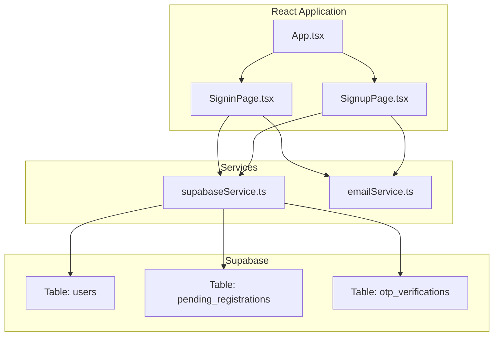
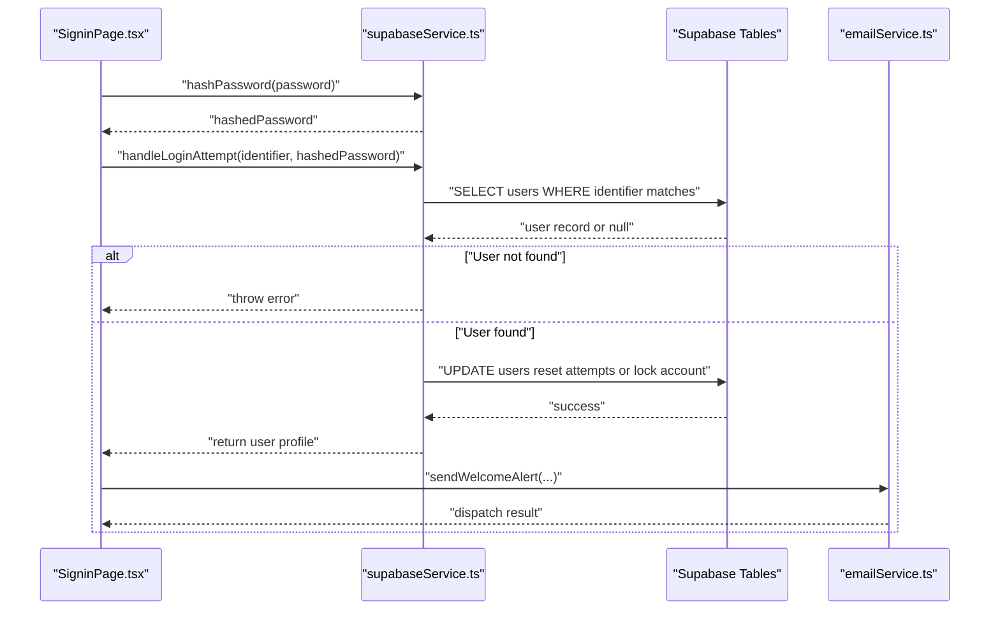
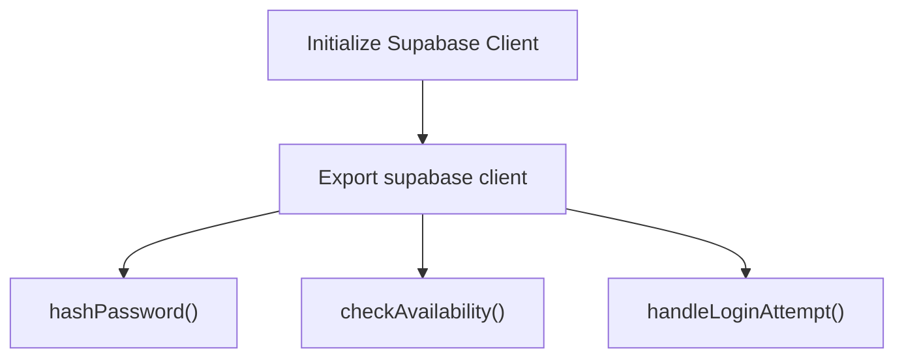
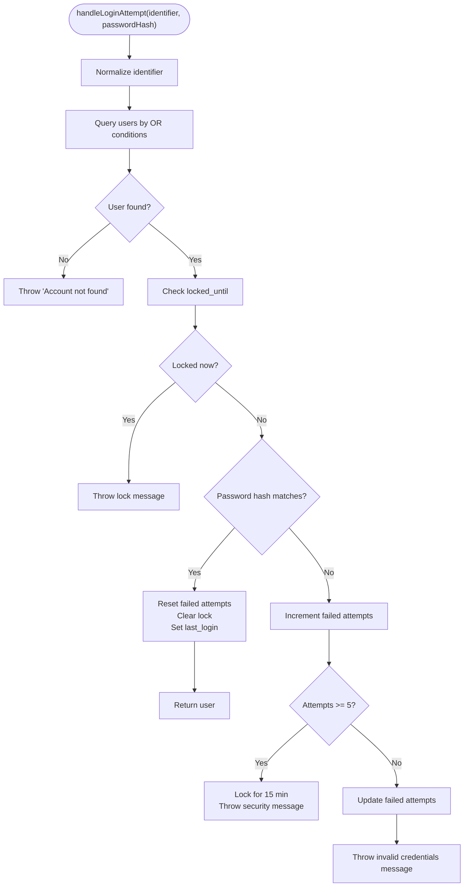
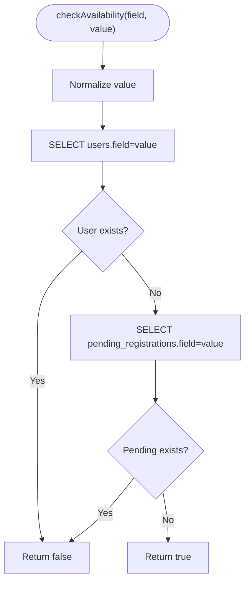
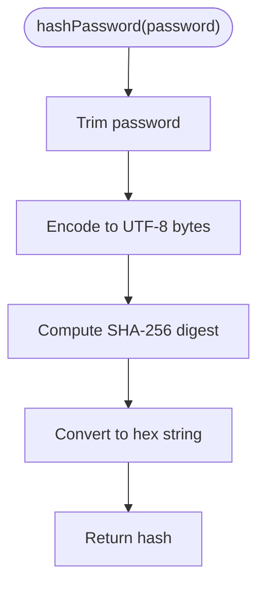
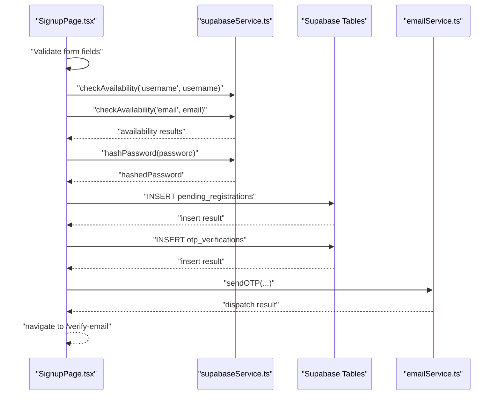
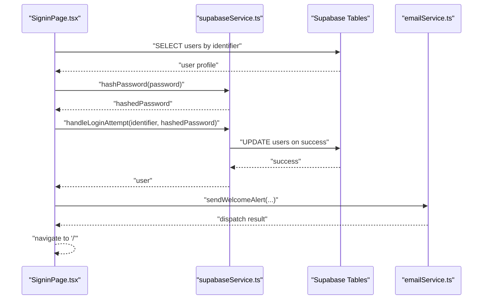
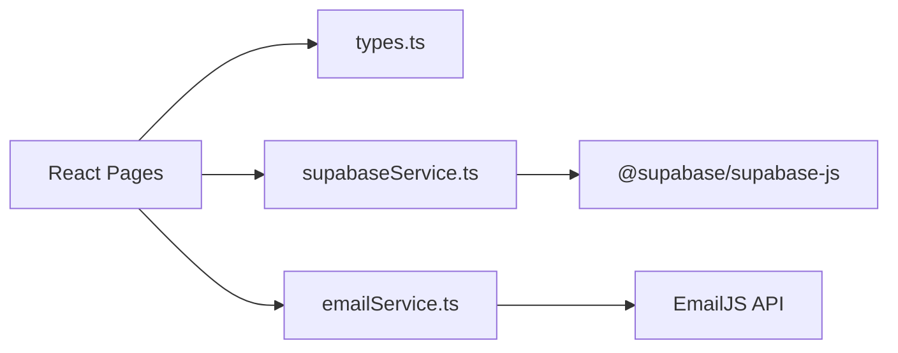

# Supabase Authentication & Database API

<cite>
**Referenced Files in This Document**
- [supabaseService.ts](file://services/supabaseService.ts)
- [SigninPage.tsx](file://pages/SigninPage.tsx)
- [SignupPage.tsx](file://pages/SignupPage.tsx)
- [emailService.ts](file://services/emailService.ts)
- [types.ts](file://types.ts)
- [constants.tsx](file://constants.tsx)
- [App.tsx](file://App.tsx)
- [package.json](file://package.json)
</cite>

## Table of Contents
1. [Introduction](#introduction)
2. [Project Structure](#project-structure)
3. [Core Components](#core-components)
4. [Architecture Overview](#architecture-overview)
5. [Detailed Component Analysis](#detailed-component-analysis)
6. [Dependency Analysis](#dependency-analysis)
7. [Performance Considerations](#performance-considerations)
8. [Troubleshooting Guide](#troubleshooting-guide)
9. [Conclusion](#conclusion)
10. [Appendices](#appendices)

## Introduction
This document provides comprehensive API documentation for the Supabase service integration used in the ZPRIA account system. It covers client initialization, authentication endpoints, database operations, user authentication flow, availability checks, password hashing, request/response schemas, error handling patterns, configuration, security considerations, and practical integration examples with the React application.

## Project Structure
The authentication and database integration spans several modules:
- Supabase client initialization and utilities
- Authentication flows (login and registration)
- Email notification service
- React page components that orchestrate authentication
- Shared types and constants

**Diagram sources**
- [App.tsx](file://App.tsx#L218-L276)
- [SigninPage.tsx](file://pages/SigninPage.tsx#L14-L231)
- [SignupPage.tsx](file://pages/SignupPage.tsx#L12-L293)
- [supabaseService.ts](file://services/supabaseService.ts#L1-L67)
- [emailService.ts](file://services/emailService.ts#L1-L194)

**Section sources**
- [App.tsx](file://App.tsx#L218-L276)
- [package.json](file://package.json#L12-L26)

## Core Components
- Supabase client initialization and configuration
- Password hashing utility using SHA-256
- Availability checker for usernames and emails
- Login attempt handler with lockout protection and failed attempt tracking
- React page components orchestrating authentication flows

**Section sources**
- [supabaseService.ts](file://services/supabaseService.ts#L1-L67)
- [SigninPage.tsx](file://pages/SigninPage.tsx#L14-L231)
- [SignupPage.tsx](file://pages/SignupPage.tsx#L12-L293)

## Architecture Overview
The authentication architecture follows a layered approach:
- UI layer (React pages) handles user input and displays feedback
- Service layer (Supabase and Email) encapsulates backend interactions
- Database layer (Supabase tables) stores user data, pending registrations, and OTP verifications

**Diagram sources**
- [SigninPage.tsx](file://pages/SigninPage.tsx#L53-L95)
- [supabaseService.ts](file://services/supabaseService.ts#L26-L66)
- [emailService.ts](file://services/emailService.ts#L152-L172)

## Detailed Component Analysis

### Supabase Client Initialization
- Initializes the Supabase client with URL and anonymous key
- Exports the client instance for use across the app
- Provides utilities for hashing, availability checks, and login attempts

**Diagram sources**
- [supabaseService.ts](file://services/supabaseService.ts#L4-L15)

**Section sources**
- [supabaseService.ts](file://services/supabaseService.ts#L4-L7)

### Authentication Flow: handleLoginAttempt
- Normalizes the identifier (trim and lowercase)
- Queries users by username, login_id, mobile, or email using OR conditions
- Enforces lockout protection if locked_until is in the future
- On success: resets failed attempts, clears lock, updates last_login
- On failure: increments failed attempts; locks account after threshold; throws descriptive errors

**Diagram sources**
- [supabaseService.ts](file://services/supabaseService.ts#L26-L66)

**Section sources**
- [supabaseService.ts](file://services/supabaseService.ts#L26-L66)

### Availability Checker: checkAvailability
- Normalizes the input value (trim and lowercase)
- Checks both users and pending_registrations tables
- Returns false if either table contains a matching field, true otherwise

**Diagram sources**
- [supabaseService.ts](file://services/supabaseService.ts#L17-L24)

**Section sources**
- [supabaseService.ts](file://services/supabaseService.ts#L17-L24)

### Password Hashing Utility: hashPassword
- Trims the password to prevent hidden spaces
- Encodes to UTF-8 bytes
- Computes SHA-256 digest
- Converts buffer to hex string

**Diagram sources**
- [supabaseService.ts](file://services/supabaseService.ts#L9-L15)

**Section sources**
- [supabaseService.ts](file://services/supabaseService.ts#L9-L15)

### Registration Flow: SignupPage
- Validates form data (age, gender, username length, password strength, CAPTCHA, consent)
- Checks availability for username and email using checkAvailability
- Hashes password and inserts a pending registration record
- Inserts an OTP verification record
- Sends OTP email and navigates to verification page

**Diagram sources**
- [SignupPage.tsx](file://pages/SignupPage.tsx#L82-L149)
- [supabaseService.ts](file://services/supabaseService.ts#L17-L24)
- [emailService.ts](file://services/emailService.ts#L139-L147)

**Section sources**
- [SignupPage.tsx](file://pages/SignupPage.tsx#L82-L149)

### Login Flow: SigninPage
- First step: validates identifier and retrieves user profile
- Second step: hashes password, calls handleLoginAttempt, constructs UserProfile, triggers welcome alert, and navigates to home

**Diagram sources**
- [SigninPage.tsx](file://pages/SigninPage.tsx#L23-L95)
- [supabaseService.ts](file://services/supabaseService.ts#L26-L66)
- [emailService.ts](file://services/emailService.ts#L152-L172)

**Section sources**
- [SigninPage.tsx](file://pages/SigninPage.tsx#L23-L95)

### Request/Response Schemas

#### Authentication Endpoints
- POST /api/login (conceptual)
  - Request body: { identifier: string, password: string }
  - Response body: { user: UserProfile, token?: string }
  - Errors: "Account not found", "Invalid credentials", "Account locked", "Security Protocol"

- POST /api/register (conceptual)
  - Request body: { firstName: string, lastName: string, dob: string, gender: string, selectedCountry: string, username: string, email: string, password: string, mobile: string, agreed: boolean }
  - Response body: { success: boolean, verificationEmail?: string }
  - Errors: "Username already taken", "Recovery email already registered", "Password requirements not met", "CAPTCHA verification failed", "Age requirement not met"

#### Database Operations
- Table: users
  - Columns: id, username, login_id, first_name, last_name, email, mobile, address, dob, gender, is_email_verified, theme_preference, account_status, password_hash, failed_login_attempts, locked_until, last_login
  - Indexes: username, login_id, email, mobile (for OR queries)

- Table: pending_registrations
  - Columns: id, username, login_id, password_hash, first_name, last_name, email, mobile, dob, gender, address, created_at
  - Purpose: temporary storage during registration before approval

- Table: otp_verifications
  - Columns: id, email, otp_code, purpose, expires_at, created_at
  - Purpose: OTP delivery and verification

#### Email Notifications
- sendOTP(params: { to_name: string, to_email: string, otp_code: string })
  - Request body: { to_name, to_email, otp_code, purpose?, subject? }
  - Response body: boolean

- sendWelcomeAlert(params: { to_name: string, to_email: string, username: string, login_id: string, isNewRegistration?: boolean })
  - Request body: { to_name, to_email, username, login_id, success_title?, action_type?, subject?, welcome_message? }
  - Response body: boolean

**Section sources**
- [types.ts](file://types.ts#L11-L25)
- [supabaseService.ts](file://services/supabaseService.ts#L17-L24)
- [emailService.ts](file://services/emailService.ts#L139-L172)

## Dependency Analysis
- Supabase client depends on @supabase/supabase-js
- React pages depend on shared types and services
- Email service depends on EmailJS public/private keys and templates

**Diagram sources**
- [package.json](file://package.json#L17-L18)
- [App.tsx](file://App.tsx#L1-L279)

**Section sources**
- [package.json](file://package.json#L12-L26)

## Performance Considerations
- Use selective column queries (e.g., only required fields) to minimize payload size
- Prefer indexed fields for identifier lookups (username, login_id, email, mobile)
- Batch operations where possible (e.g., insert pending registration and OTP in sequence)
- Cache frequently accessed constants (e.g., country list) to reduce re-computation
- Debounce or throttle repeated availability checks to avoid excessive DB calls
- Optimize password hashing to occur only when necessary (after initial validation)

## Troubleshooting Guide
Common issues and resolutions:
- Account not found during login: Verify identifier normalization and ensure OR query covers all fields
- Invalid credentials: Confirm password hashing matches stored hash; check remaining attempts messaging
- Account locked: Respect locked_until; wait for lockout period to expire
- Availability conflicts: Ensure both users and pending_registrations are checked before insertion
- Email dispatch failures: Validate EmailJS credentials and template IDs; check network connectivity

**Section sources**
- [supabaseService.ts](file://services/supabaseService.ts#L26-L66)
- [emailService.ts](file://services/emailService.ts#L114-L137)

## Conclusion
The Supabase integration provides a robust foundation for authentication and user lifecycle management. The modular design separates concerns between UI, services, and database operations, enabling maintainable and scalable authentication flows. Proper indexing, hashing, and error handling contribute to a secure and responsive user experience.

## Appendices

### Practical Integration Patterns with React
- Initialize Supabase client once and reuse across components
- Centralize authentication state in a higher-order component or context
- Use lazy loading for heavy routes to improve initial load performance
- Persist user session in localStorage and hydrate on app start

### Security Considerations
- Never log sensitive credentials or tokens
- Use HTTPS for all API communications
- Validate and sanitize all user inputs
- Implement rate limiting for authentication endpoints
- Store only hashed passwords; never plaintext
- Regularly rotate API keys and secrets