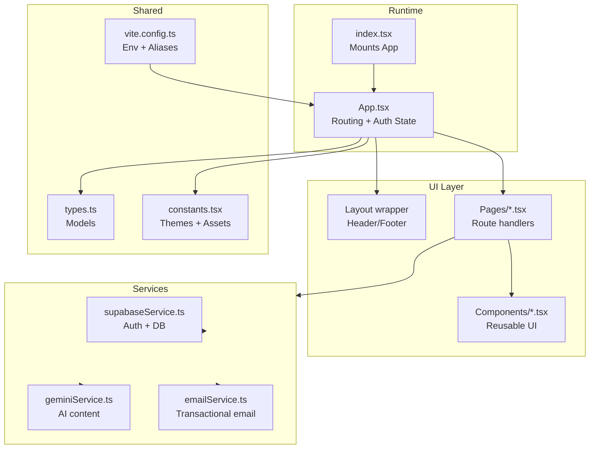
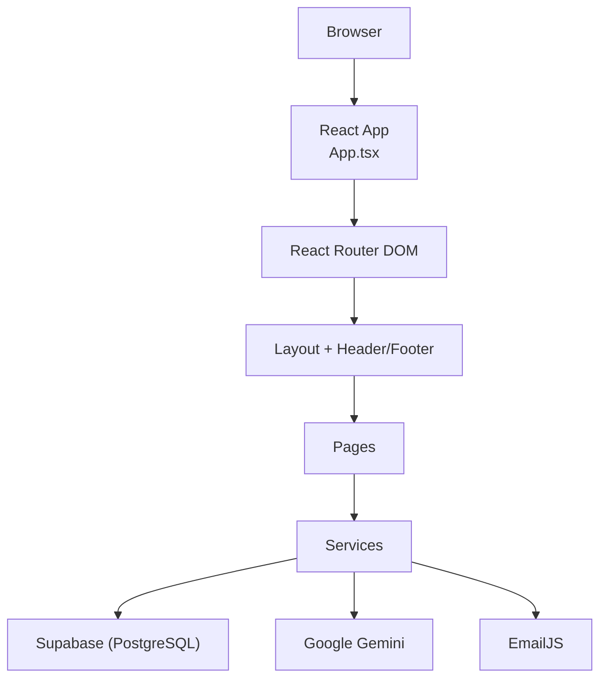
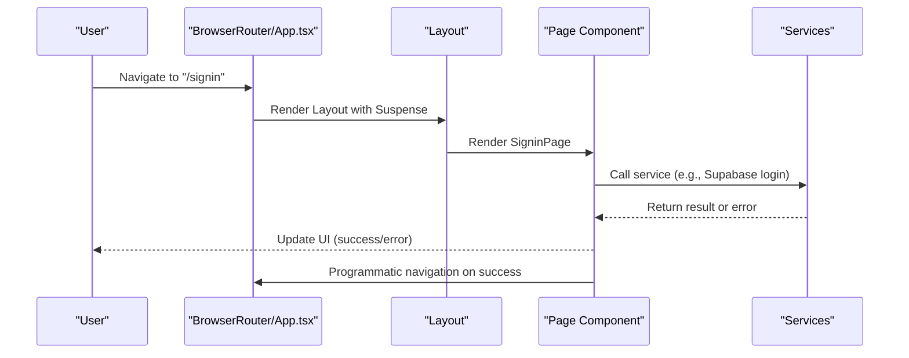
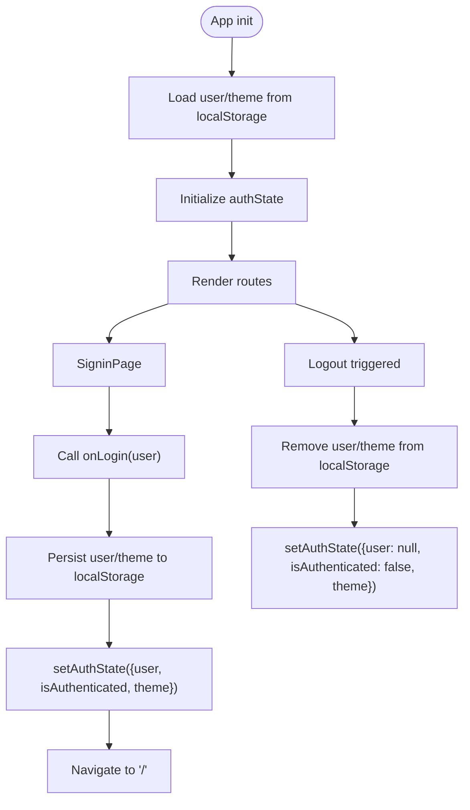
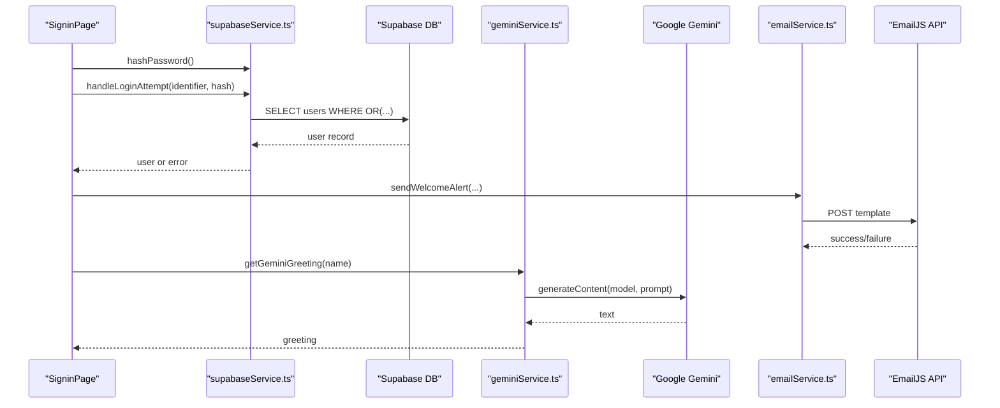
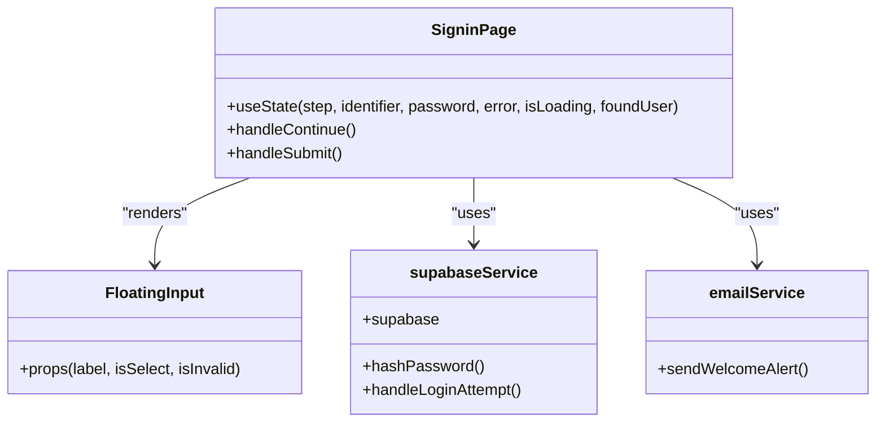
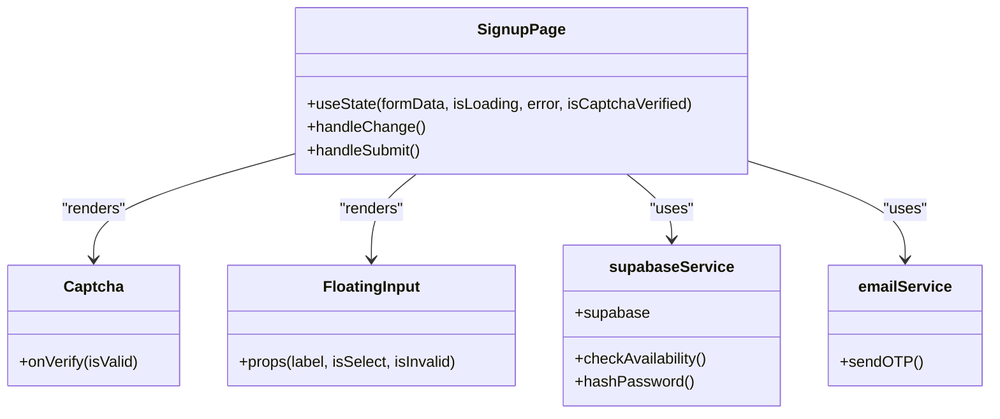
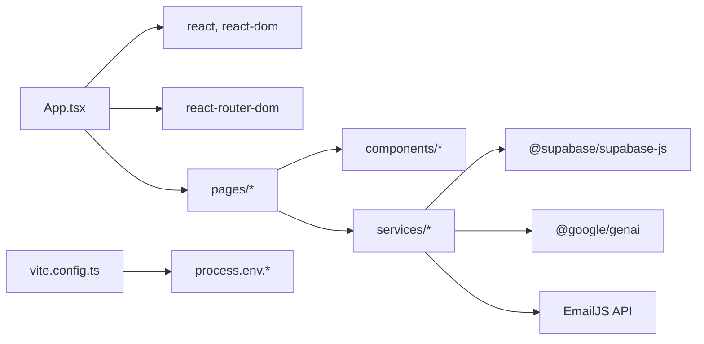

# Architecture Overview

<cite>
**Referenced Files in This Document**
- [App.tsx](file://App.tsx)
- [index.tsx](file://index.tsx)
- [types.ts](file://types.ts)
- [constants.tsx](file://constants.tsx)
- [vite.config.ts](file://vite.config.ts)
- [package.json](file://package.json)
- [README.md](file://README.md)
- [services/supabaseService.ts](file://services/supabaseService.ts)
- [services/geminiService.ts](file://services/geminiService.ts)
- [services/emailService.ts](file://services/emailService.ts)
- [pages/DashboardPage.tsx](file://pages/DashboardPage.tsx)
- [pages/SigninPage.tsx](file://pages/SigninPage.tsx)
- [pages/SignupPage.tsx](file://pages/SignupPage.tsx)
- [components/FloatingInput.tsx](file://components/FloatingInput.tsx)
- [components/Captcha.tsx](file://components/Captcha.tsx)
</cite>

## Table of Contents
1. [Introduction](#introduction)
2. [Project Structure](#project-structure)
3. [Core Components](#core-components)
4. [Architecture Overview](#architecture-overview)
5. [Detailed Component Analysis](#detailed-component-analysis)
6. [Dependency Analysis](#dependency-analysis)
7. [Performance Considerations](#performance-considerations)
8. [Troubleshooting Guide](#troubleshooting-guide)
9. [Conclusion](#conclusion)
10. [Appendices](#appendices)

## Introduction
This document describes the ZPRIA Account Management System architecture. It is a React-based application with TypeScript type safety, organized into modular directories for components, pages, services, and configuration. The system integrates with Supabase for identity and data persistence, Google Gemini for AI-driven content, and EmailJS for transactional email delivery. The architecture emphasizes centralized authentication state, lazy-loaded routes, and a clean separation of concerns between UI, services, and external integrations.

## Project Structure
The project follows a feature-based layout with clear boundaries:
- Root entry renders the application into the DOM.
- App orchestrates routing, layout, and global authentication state.
- Pages implement route-specific views and orchestrate service calls.
- Services encapsulate third-party integrations and data access.
- Components provide reusable UI building blocks.
- Constants and types define shared models and branding assets.
- Vite config defines runtime environment and aliases.

**Diagram sources**
- [index.tsx](file://index.tsx#L1-L17)
- [App.tsx](file://App.tsx#L218-L279)
- [services/supabaseService.ts](file://services/supabaseService.ts#L1-L67)
- [services/geminiService.ts](file://services/geminiService.ts#L1-L39)
- [services/emailService.ts](file://services/emailService.ts#L1-L194)
- [types.ts](file://types.ts#L1-L79)
- [constants.tsx](file://constants.tsx#L1-L361)
- [vite.config.ts](file://vite.config.ts#L1-L24)

**Section sources**
- [index.tsx](file://index.tsx#L1-L17)
- [App.tsx](file://App.tsx#L218-L279)
- [vite.config.ts](file://vite.config.ts#L1-L24)

## Core Components
- App: Central router and provider of global auth state. Uses React Router DOM for navigation, Suspense for lazy-loaded pages, and local storage for persistence. Exposes login/logout/updateTheme to child pages.
- Layout: Provides global header, sub-header, footer, and scroll-to-top behavior. Wraps page content with a Suspense boundary.
- Pages: Feature-specific screens such as Dashboard, Signin, and Signup. They consume services and pass callbacks to App for state updates.
- Services: Encapsulate Supabase, Gemini, and EmailJS integrations. Provide typed functions for authentication, hashing, availability checks, greeting generation, and email dispatch.
- Components: Reusable UI primitives like FloatingInput and Captcha used across forms.
- Types and Constants: Define models, theme variants, logos, and shared lists.

**Section sources**
- [App.tsx](file://App.tsx#L218-L279)
- [types.ts](file://types.ts#L1-L79)
- [constants.tsx](file://constants.tsx#L1-L361)
- [services/supabaseService.ts](file://services/supabaseService.ts#L1-L67)
- [services/geminiService.ts](file://services/geminiService.ts#L1-L39)
- [services/emailService.ts](file://services/emailService.ts#L1-L194)
- [pages/DashboardPage.tsx](file://pages/DashboardPage.tsx#L1-L217)
- [pages/SigninPage.tsx](file://pages/SigninPage.tsx#L1-L200)
- [pages/SignupPage.tsx](file://pages/SignupPage.tsx#L1-L200)
- [components/FloatingInput.tsx](file://components/FloatingInput.tsx#L1-L85)
- [components/Captcha.tsx](file://components/Captcha.tsx#L1-L117)

## Architecture Overview
The system uses a layered architecture:
- Presentation Layer: React components and pages.
- Application Layer: Pages coordinate UI state and orchestrate service calls.
- Service Layer: Encapsulates integrations with Supabase, Gemini, and EmailJS.
- External Systems: Supabase database, Gemini AI, and EmailJS API.

**Diagram sources**
- [App.tsx](file://App.tsx#L218-L279)
- [services/supabaseService.ts](file://services/supabaseService.ts#L1-L67)
- [services/geminiService.ts](file://services/geminiService.ts#L1-L39)
- [services/emailService.ts](file://services/emailService.ts#L1-L194)

## Detailed Component Analysis

### Routing and Navigation Flow
The routing system leverages React Router DOM with lazy-loaded pages and a central App component managing routes and layout. Navigation is controlled via Link and useNavigate hooks. Suspense ensures a loading experience while lazy chunks are fetched.

**Diagram sources**
- [App.tsx](file://App.tsx#L218-L279)
- [pages/SigninPage.tsx](file://pages/SigninPage.tsx#L1-L200)
- [services/supabaseService.ts](file://services/supabaseService.ts#L1-L67)

**Section sources**
- [App.tsx](file://App.tsx#L218-L279)
- [pages/SigninPage.tsx](file://pages/SigninPage.tsx#L1-L200)

### Authentication State Management
Authentication state is centralized in App with:
- Local storage persistence for user profile and theme selection.
- Functions exposed to pages to log in, log out, and update theme.
- Conditional rendering in header/footer based on authentication status.

**Diagram sources**
- [App.tsx](file://App.tsx#L218-L247)
- [pages/SigninPage.tsx](file://pages/SigninPage.tsx#L60-L95)

**Section sources**
- [App.tsx](file://App.tsx#L218-L247)

### Data Flow Between UI, Services, and External APIs
- Supabase: Used for user lookup, credential validation, availability checks, and password hashing. The service exports typed helpers and direct client usage within pages.
- Gemini: Provides AI-generated greetings and security recommendations. Fetches API key from environment and falls back gracefully.
- EmailJS: Handles OTP and welcome emails with security context and normalization.

**Diagram sources**
- [pages/SigninPage.tsx](file://pages/SigninPage.tsx#L60-L95)
- [services/supabaseService.ts](file://services/supabaseService.ts#L9-L66)
- [services/geminiService.ts](file://services/geminiService.ts#L4-L20)
- [services/emailService.ts](file://services/emailService.ts#L70-L137)

**Section sources**
- [services/supabaseService.ts](file://services/supabaseService.ts#L1-L67)
- [services/geminiService.ts](file://services/geminiService.ts#L1-L39)
- [services/emailService.ts](file://services/emailService.ts#L1-L194)
- [pages/SigninPage.tsx](file://pages/SigninPage.tsx#L1-L200)

### Component Interaction Diagrams

#### Signin Page Interaction

**Diagram sources**
- [pages/SigninPage.tsx](file://pages/SigninPage.tsx#L1-L200)
- [components/FloatingInput.tsx](file://components/FloatingInput.tsx#L1-L85)
- [services/supabaseService.ts](file://services/supabaseService.ts#L1-L67)
- [services/emailService.ts](file://services/emailService.ts#L1-L194)

#### Signup Page Interaction

**Diagram sources**
- [pages/SignupPage.tsx](file://pages/SignupPage.tsx#L1-L200)
- [components/Captcha.tsx](file://components/Captcha.tsx#L1-L117)
- [components/FloatingInput.tsx](file://components/FloatingInput.tsx#L1-L85)
- [services/supabaseService.ts](file://services/supabaseService.ts#L1-L67)
- [services/emailService.ts](file://services/emailService.ts#L1-L194)

## Dependency Analysis
- React and React Router DOM power the UI and routing.
- Supabase SDK provides database access and authentication primitives.
- Google GenAI SDK enables AI content generation.
- EmailJS SDK handles transactional email dispatch.
- Vite config injects environment variables and sets up aliases.

**Diagram sources**
- [package.json](file://package.json#L12-L25)
- [vite.config.ts](file://vite.config.ts#L13-L16)
- [App.tsx](file://App.tsx#L218-L279)

**Section sources**
- [package.json](file://package.json#L12-L25)
- [vite.config.ts](file://vite.config.ts#L1-L24)

## Performance Considerations
- Lazy loading: Pages are dynamically imported to reduce initial bundle size.
- Suspense: Ensures graceful loading states during chunk fetch.
- Local storage caching: Reduces repeated network calls for user and theme preferences.
- Environment injection: Vite injects API keys at build-time to avoid runtime overhead.
- UI primitives: Lightweight components minimize re-renders.

[No sources needed since this section provides general guidance]

## Troubleshooting Guide
Common issues and diagnostics:
- Missing environment variable: Ensure GEMINI_API_KEY is present in .env.local. The app reads it via Vite’s loadEnv and injects it into process.env at build time.
- Supabase connectivity: Verify URL and anonymous key. Confirm network access and CORS settings.
- Email dispatch failures: Check EmailJS service_id, template_id, public/private keys, and network connectivity.
- Authentication errors: Review lockout logic and failed attempts handling in the Supabase service.
- Gemini content generation: Confirm API key validity and model availability.

**Section sources**
- [README.md](file://README.md#L16-L20)
- [vite.config.ts](file://vite.config.ts#L13-L16)
- [services/supabaseService.ts](file://services/supabaseService.ts#L26-L66)
- [services/emailService.ts](file://services/emailService.ts#L114-L137)
- [services/geminiService.ts](file://services/geminiService.ts#L7-L20)

## Conclusion
The ZPRIA Account Management System employs a clean, modular architecture with clear separation between UI, services, and external systems. Centralized authentication state, lazy-loaded routes, and typed models enable maintainability and scalability. Integrations with Supabase, Gemini, and EmailJS are encapsulated in dedicated services, allowing the UI to remain focused on presentation and user interaction.

[No sources needed since this section summarizes without analyzing specific files]

## Appendices

### Technology Stack Rationale
- React + TypeScript: Strong typing and component composition for robust UI development.
- React Router DOM: Declarative routing with lazy loading and programmatic navigation.
- Supabase: Full-featured backend-as-a-service for authentication, database, and real-time needs.
- Google Gemini: On-demand AI content generation for dynamic user experiences.
- EmailJS: Reliable transactional email delivery with templates and security context.
- Vite: Fast build toolchain with environment injection and module resolution.

**Section sources**
- [package.json](file://package.json#L12-L25)
- [vite.config.ts](file://vite.config.ts#L1-L24)
- [README.md](file://README.md#L1-L21)