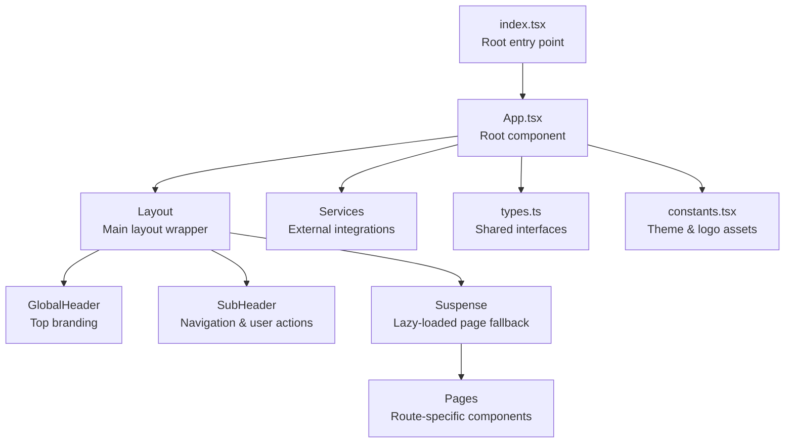
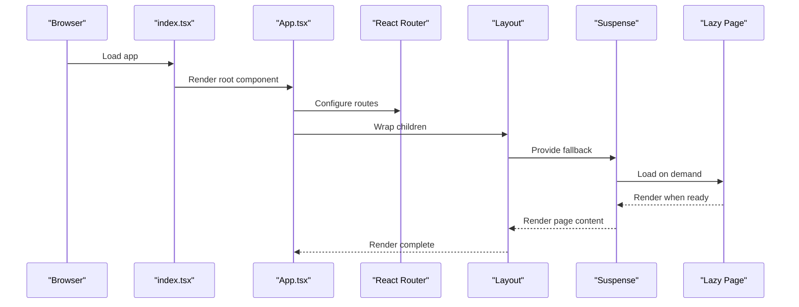
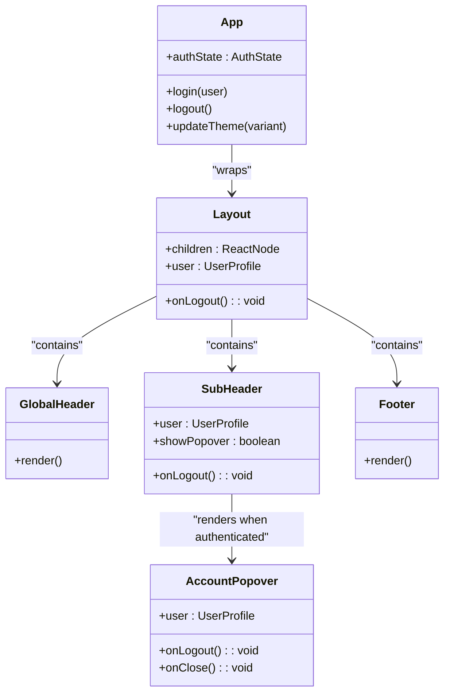
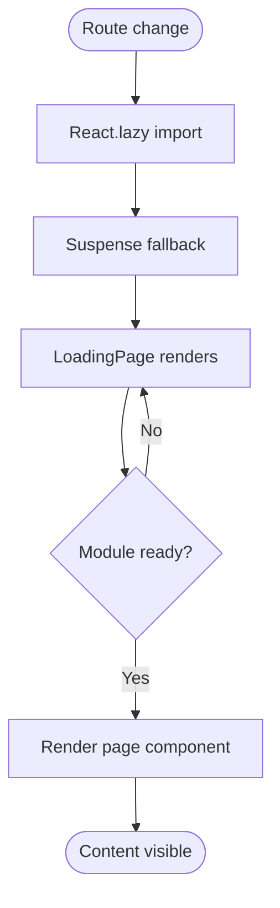
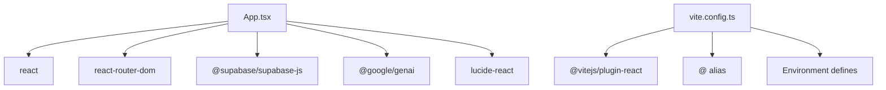

# Component Architecture

<cite>
**Referenced Files in This Document**
- [App.tsx](file://App.tsx)
- [index.tsx](file://index.tsx)
- [types.ts](file://types.ts)
- [constants.tsx](file://constants.tsx)
- [DashboardPage.tsx](file://pages/DashboardPage.tsx)
- [LoadingPage.tsx](file://pages/LoadingPage.tsx)
- [ProductHubPage.tsx](file://pages/ProductHubPage.tsx)
- [AccountServicesPage.tsx](file://pages/AccountServicesPage.tsx)
- [HelpPage.tsx](file://pages/HelpPage.tsx)
- [Captcha.tsx](file://components/Captcha.tsx)
- [FloatingInput.tsx](file://components/FloatingInput.tsx)
- [supabaseService.ts](file://services/supabaseService.ts)
- [vite.config.ts](file://vite.config.ts)
- [package.json](file://package.json)
</cite>

## Table of Contents
1. [Introduction](#introduction)
2. [Project Structure](#project-structure)
3. [Core Components](#core-components)
4. [Architecture Overview](#architecture-overview)
5. [Detailed Component Analysis](#detailed-component-analysis)
6. [Dependency Analysis](#dependency-analysis)
7. [Performance Considerations](#performance-considerations)
8. [Troubleshooting Guide](#troubleshooting-guide)
9. [Conclusion](#conclusion)

## Introduction
This document explains the ZPRIA component architecture, focusing on the hierarchical structure starting from the root App component, layout composition, header/footer components, and page-specific components. It documents the component composition pattern with GlobalHeader, SubHeader, AccountPopover, and Footer components, details the lazy loading strategy using React.lazy() with Suspense fallback handling, and outlines performance optimization techniques. It also covers component prop interfaces, state management patterns, reusability principles, and rendering optimization strategies.

## Project Structure
The application follows a feature-based organization with clear separation between pages, components, services, and shared utilities. The root entry point initializes the React application and mounts the App component. Routing is managed via React Router DOM, and the layout wraps all pages with consistent header, navigation, and footer elements.

**Diagram sources**
- [index.tsx](file://index.tsx#L1-L17)
- [App.tsx](file://App.tsx#L1-L279)
- [types.ts](file://types.ts#L1-L79)
- [constants.tsx](file://constants.tsx#L1-L361)

**Section sources**
- [index.tsx](file://index.tsx#L1-L17)
- [App.tsx](file://App.tsx#L1-L279)

## Core Components
This section documents the core layout and navigation components that form the backbone of the application.

- GlobalHeader: Provides top-level branding and navigation anchor.
- SubHeader: Implements responsive navigation with conditional rendering for guest and authenticated users, including the AccountPopover trigger.
- AccountPopover: A contextual popover displaying user identity and quick actions, with click-outside detection and navigation links.
- Footer: Standardized footer with legal links and copyright information.
- Layout: Wraps page content with the header, subheader, and footer, and provides a Suspense boundary for lazy-loaded routes.

Key prop interfaces:
- AccountPopover: user, onLogout, onClose
- SubHeader: user, onLogout
- Layout: children, user, onLogout

State management patterns:
- App maintains global authentication state (user, isAuthenticated, theme) with persistence in localStorage.
- SubHeader manages local popover visibility state.
- Pages manage their own component-local state (e.g., DashboardPage intro animation, ProductHubPage product filtering).

Reusability principles:
- Shared interfaces in types.ts enable consistent typing across components.
- constants.tsx centralizes theme variants and SVG logos for reuse.
- Suspense ensures consistent fallback behavior for lazy-loaded pages.

**Section sources**
- [App.tsx](file://App.tsx#L29-L107)
- [App.tsx](file://App.tsx#L109-L180)
- [App.tsx](file://App.tsx#L182-L193)
- [App.tsx](file://App.tsx#L195-L208)
- [types.ts](file://types.ts#L1-L79)
- [constants.tsx](file://constants.tsx#L1-L361)

## Architecture Overview
The architecture centers around a single-page application with route-based rendering. The App component orchestrates routing, authentication state, and layout composition. Secondary pages are lazily loaded to optimize initial bundle size, with a LoadingPage fallback during transitions.

**Diagram sources**
- [index.tsx](file://index.tsx#L1-L17)
- [App.tsx](file://App.tsx#L1-L279)
- [LoadingPage.tsx](file://pages/LoadingPage.tsx#L1-L67)

**Section sources**
- [App.tsx](file://App.tsx#L10-L28)
- [App.tsx](file://App.tsx#L201-L203)
- [LoadingPage.tsx](file://pages/LoadingPage.tsx#L1-L67)

## Detailed Component Analysis

### Layout and Navigation Components
The layout components provide a consistent shell for all pages. They handle global navigation, user state, and fallback rendering.

**Diagram sources**
- [App.tsx](file://App.tsx#L195-L208)
- [App.tsx](file://App.tsx#L109-L180)
- [App.tsx](file://App.tsx#L29-L107)
- [App.tsx](file://App.tsx#L182-L193)

**Section sources**
- [App.tsx](file://App.tsx#L195-L208)
- [App.tsx](file://App.tsx#L109-L180)
- [App.tsx](file://App.tsx#L29-L107)
- [App.tsx](file://App.tsx#L182-L193)

### Lazy Loading Strategy and Suspense Handling
Secondary pages are dynamically imported using React.lazy(), enabling code splitting and reduced initial load time. A Suspense boundary wraps the main content area and displays a LoadingPage while the page bundle downloads and mounts.

Implementation highlights:
- Dynamic imports for all secondary pages in App.tsx.
- Suspense fallback configured to LoadingPage.
- ScrollToTop ensures smooth navigation between routes.

**Diagram sources**
- [App.tsx](file://App.tsx#L10-L28)
- [App.tsx](file://App.tsx#L201-L203)
- [LoadingPage.tsx](file://pages/LoadingPage.tsx#L1-L67)

**Section sources**
- [App.tsx](file://App.tsx#L10-L28)
- [App.tsx](file://App.tsx#L201-L203)
- [LoadingPage.tsx](file://pages/LoadingPage.tsx#L1-L67)

### Page-Specific Components and Composition Patterns
Page components encapsulate their own state and rendering logic while leveraging shared layout and services.

- DashboardPage: Manages an intro animation sequence and conditional rendering for guests and authenticated users.
- ProductHubPage: Fetches product and type data from Supabase, filters products, and renders a grid with hover actions.
- AccountServicesPage: Minimal page demonstrating consistent spacing and link patterns.
- HelpPage: FAQ and quick action layout with navigation helpers.

Composition patterns:
- Pages receive user and onLogout props from the layout/App to maintain consistent authentication behavior.
- Shared constants (LOGO_VARIANTS, ZPRIA_MAIN_LOGO) are used for branding consistency.

**Section sources**
- [DashboardPage.tsx](file://pages/DashboardPage.tsx#L1-L217)
- [ProductHubPage.tsx](file://pages/ProductHubPage.tsx#L1-L243)
- [AccountServicesPage.tsx](file://pages/AccountServicesPage.tsx#L1-L40)
- [HelpPage.tsx](file://pages/HelpPage.tsx#L1-L162)
- [constants.tsx](file://constants.tsx#L1-L361)

### Utility Components and Services
Reusable utilities enhance form handling and security.

- FloatingInput: A floating label input/select component with focus/invalid states and consistent styling.
- Captcha: Canvas-based CAPTCHA generator with verification callback and refresh mechanism.
- supabaseService: Centralized Supabase client and utility functions for password hashing, availability checks, and login attempts.

**Section sources**
- [FloatingInput.tsx](file://components/FloatingInput.tsx#L1-L85)
- [Captcha.tsx](file://components/Captcha.tsx#L1-L117)
- [supabaseService.ts](file://services/supabaseService.ts#L1-L67)

## Dependency Analysis
External dependencies and build configuration influence component behavior and performance.

- React and React Router DOM: Core framework and routing.
- Supabase client: Backend-as-a-Service integration for authentication and data.
- Vite: Build tool with React plugin, environment variable injection, and path aliasing.

**Diagram sources**
- [package.json](file://package.json#L12-L25)
- [vite.config.ts](file://vite.config.ts#L1-L24)

**Section sources**
- [package.json](file://package.json#L12-L25)
- [vite.config.ts](file://vite.config.ts#L1-L24)

## Performance Considerations
Optimization techniques observed in the codebase:

- Code splitting: Secondary pages are lazy-loaded to reduce initial bundle size.
- Suspense fallback: LoadingPage provides immediate feedback during navigation.
- Local storage caching: Authentication and theme preferences persist across sessions.
- Efficient state updates: Local component state minimizes unnecessary re-renders.
- Responsive design: Tailwind-based responsive classes reduce duplication.
- Environment-aware builds: Vite configuration injects environment variables safely.

Recommendations:
- Consider preloading critical resources for frequently visited routes.
- Implement route-level caching for static content.
- Monitor bundle sizes and split additional heavy pages if needed.
- Use React.memo for expensive child components when appropriate.

**Section sources**
- [App.tsx](file://App.tsx#L10-L28)
- [App.tsx](file://App.tsx#L219-L246)
- [LoadingPage.tsx](file://pages/LoadingPage.tsx#L1-L67)
- [vite.config.ts](file://vite.config.ts#L13-L16)

## Troubleshooting Guide
Common issues and resolutions:

- Lazy loading errors: Ensure dynamic imports resolve correctly and Suspense fallback is present.
- Authentication state inconsistencies: Verify localStorage keys and initialization logic in App.tsx.
- Navigation scroll behavior: ScrollToTop resets viewport on route changes; confirm it is included in the layout.
- Supabase connectivity: Check API keys and network access; verify service functions return expected results.
- Build environment variables: Confirm Vite environment injection and aliases are configured.

**Section sources**
- [App.tsx](file://App.tsx#L219-L246)
- [App.tsx](file://App.tsx#L210-L216)
- [supabaseService.ts](file://services/supabaseService.ts#L4-L7)
- [vite.config.ts](file://vite.config.ts#L13-L16)

## Conclusion
The ZPRIA component architecture demonstrates a clean separation of concerns with a robust layout system, consistent navigation, and efficient lazy loading. The use of shared interfaces, constants, and services promotes reusability and maintainability. By leveraging Suspense and local storage, the application achieves responsive navigation and persistent user experiences. The outlined patterns and recommendations provide a foundation for scaling the component library and optimizing performance as the application grows.