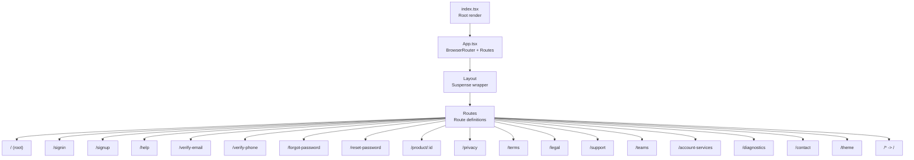
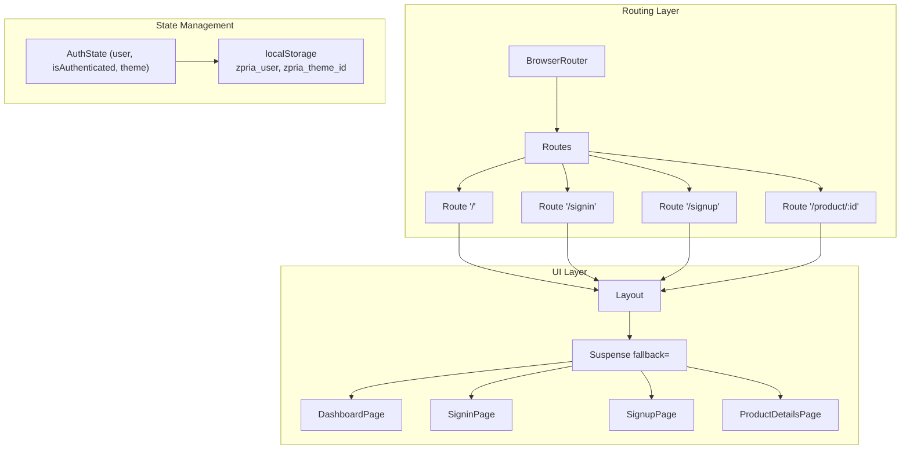
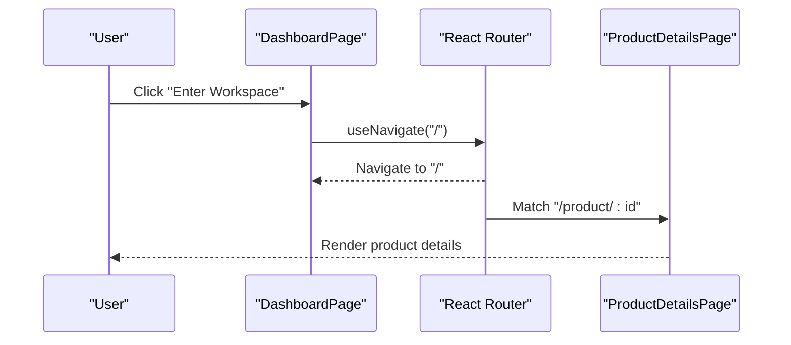
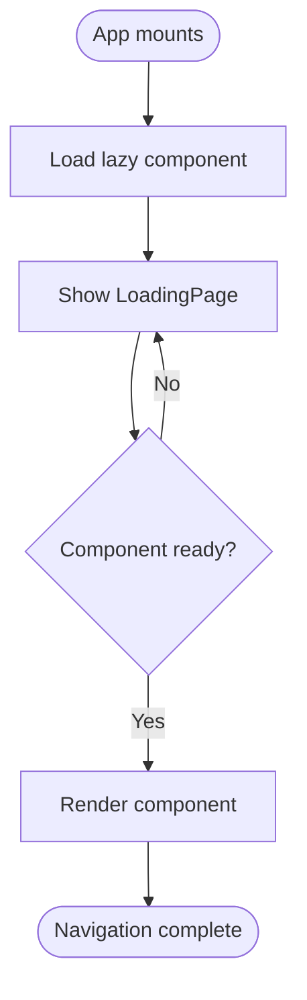
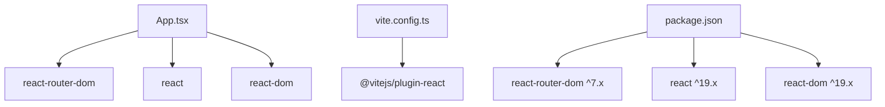

# Routing System

<cite>
**Referenced Files in This Document**
- [App.tsx](file://App.tsx)
- [index.tsx](file://index.tsx)
- [package.json](file://package.json)
- [vite.config.ts](file://vite.config.ts)
- [DashboardPage.tsx](file://pages/DashboardPage.tsx)
- [SigninPage.tsx](file://pages/SigninPage.tsx)
- [SignupPage.tsx](file://pages/SignupPage.tsx)
- [ProductDetailsPage.tsx](file://pages/ProductDetailsPage.tsx)
- [LoadingPage.tsx](file://pages/LoadingPage.tsx)
- [types.ts](file://types.ts)
- [constants.tsx](file://constants.tsx)
- [supabaseService.ts](file://services/supabaseService.ts)
</cite>

## Table of Contents
1. [Introduction](#introduction)
2. [Project Structure](#project-structure)
3. [Core Components](#core-components)
4. [Architecture Overview](#architecture-overview)
5. [Detailed Component Analysis](#detailed-component-analysis)
6. [Dependency Analysis](#dependency-analysis)
7. [Performance Considerations](#performance-considerations)
8. [Troubleshooting Guide](#troubleshooting-guide)
9. [Conclusion](#conclusion)

## Introduction
This document explains the ZPRIA routing system built with React Router DOM. It covers route configuration in App.tsx, navigation patterns, route parameters, programmatic navigation, lazy-loaded routes for performance, Suspense integration, fallback handling, and best practices for route guards and navigation state management.

## Project Structure
The routing system centers around a single-page application with a router configured at the root. Pages are organized under a pages directory, and the application uses React Router DOM for declarative routing and navigation.

**Diagram sources**
- [index.tsx](file://index.tsx#L1-L17)
- [App.tsx](file://App.tsx#L218-L276)

**Section sources**
- [index.tsx](file://index.tsx#L1-L17)
- [App.tsx](file://App.tsx#L218-L276)

## Core Components
- App.tsx: Configures the router, defines all routes, and manages authentication state and theme preferences.
- Layout: Wraps the routed content with Suspense to enable lazy-loading fallbacks.
- Page components: Individual pages such as DashboardPage, SigninPage, SignupPage, ProductDetailsPage, and others.
- Navigation utilities: useNavigate for programmatic navigation and Link for declarative navigation.

Key responsibilities:
- Route configuration and lazy loading
- Authentication state management and persistence
- Programmatic navigation using useNavigate
- Route parameters (e.g., product/:id)
- Suspense-based fallback handling

**Section sources**
- [App.tsx](file://App.tsx#L1-L279)
- [DashboardPage.tsx](file://pages/DashboardPage.tsx#L1-L217)
- [SigninPage.tsx](file://pages/SigninPage.tsx#L1-L231)
- [SignupPage.tsx](file://pages/SignupPage.tsx#L1-L293)
- [ProductDetailsPage.tsx](file://pages/ProductDetailsPage.tsx#L1-L391)

## Architecture Overview
The routing architecture uses React Router DOM with lazy-loaded components and Suspense for improved performance. Authentication state is managed at the root level and passed down to pages. Navigation is performed via both declarative Link components and programmatic useNavigate hooks.

**Diagram sources**
- [App.tsx](file://App.tsx#L218-L276)
- [LoadingPage.tsx](file://pages/LoadingPage.tsx#L1-L67)

## Detailed Component Analysis

### Route Configuration and Lazy Loading
- Main routes include home, sign-in, sign-up, help, verification flows, password reset, product details, legal pages, support, teams, account services, diagnostics, contact, and theme selection.
- Secondary pages are lazy-loaded using React.lazy to reduce initial bundle size.
- Suspense wraps the Layout to provide a loading experience while lazy components are being fetched.

Best practices demonstrated:
- Grouping lazy imports near the top of the file for clarity.
- Using Suspense at the layout level to wrap all routes.
- Providing a dedicated LoadingPage component for suspense fallback.

**Section sources**
- [App.tsx](file://App.tsx#L10-L28)
- [App.tsx](file://App.tsx#L201-L203)
- [LoadingPage.tsx](file://pages/LoadingPage.tsx#L1-L67)

### Authentication State and Navigation Guards
- Authentication state is initialized from localStorage and includes user profile, authentication status, and theme preference.
- The root route conditionally renders either the dashboard or product hub based on authentication status.
- Programmatic navigation occurs after successful login to redirect users to the home route.

Navigation patterns:
- useNavigate for programmatic navigation within components (e.g., SigninPage navigates to home after login).
- useLocation for conditional UI rendering based on current path.

**Section sources**
- [App.tsx](file://App.tsx#L219-L246)
- [App.tsx](file://App.tsx#L253)
- [SigninPage.tsx](file://pages/SigninPage.tsx#L89-L95)
- [DashboardPage.tsx](file://pages/DashboardPage.tsx#L14-L53)

### Route Parameters and Programmatic Navigation
- Product details route uses a parameterized path product/:id to display specific product information.
- Programmatic navigation is used to move between pages (e.g., navigating to home after login, navigating to product details, or returning to hub).

**Diagram sources**
- [DashboardPage.tsx](file://pages/DashboardPage.tsx#L118-L138)
- [ProductDetailsPage.tsx](file://pages/ProductDetailsPage.tsx#L23-L57)

**Section sources**
- [App.tsx](file://App.tsx#L261)
- [ProductDetailsPage.tsx](file://pages/ProductDetailsPage.tsx#L23-L57)

### Navigation Patterns and UI Integration
- Declarative navigation via Link components for internal links (e.g., to privacy, terms, legal, support).
- Programmatic navigation via useNavigate for dynamic actions (e.g., navigating after form submission or button clicks).
- Conditional rendering in header/sub-header based on authentication state and current path.

**Section sources**
- [App.tsx](file://App.tsx#L101-L104)
- [App.tsx](file://App.tsx#L149-L175)
- [DashboardPage.tsx](file://pages/DashboardPage.tsx#L118-L138)

### Route-Based Code Splitting and Suspense Integration
- Lazy loading is implemented for frequently accessed pages to improve initial load performance.
- Suspense fallback is centralized in the Layout component, ensuring consistent UX during component loading.

**Diagram sources**
- [App.tsx](file://App.tsx#L10-L28)
- [App.tsx](file://App.tsx#L201-L203)
- [LoadingPage.tsx](file://pages/LoadingPage.tsx#L1-L67)

**Section sources**
- [App.tsx](file://App.tsx#L10-L28)
- [App.tsx](file://App.tsx#L201-L203)

### Route Guards Implementation
- Authentication guard is implicit through conditional rendering in the root route and header navigation.
- No explicit route guard components are defined; guards rely on authentication state and conditional UI.

Recommended enhancements:
- Implement a dedicated route guard component that checks authentication and redirects unauthenticated users to sign-in.
- Use a higher-order component or a custom hook to encapsulate guard logic for reuse across routes.

**Section sources**
- [App.tsx](file://App.tsx#L253)
- [App.tsx](file://App.tsx#L149-L175)

### Navigation State Management Patterns
- Authentication state is persisted in localStorage and restored on app initialization.
- Theme preference is stored and applied consistently across sessions.
- Programmatic navigation is used to maintain stateless routing behavior.

**Section sources**
- [App.tsx](file://App.tsx#L219-L246)
- [constants.tsx](file://constants.tsx#L5-L25)

## Dependency Analysis
External dependencies relevant to routing:
- react-router-dom: Provides BrowserRouter, Routes, Route, Link, useNavigate, useLocation, and Navigate.
- react: Enables lazy loading and Suspense integration.
- react-dom: Renders the application tree.

Build-time configuration:
- Vite plugin for React enables JSX transforms and development server features.

**Diagram sources**
- [package.json](file://package.json#L12-L26)
- [vite.config.ts](file://vite.config.ts#L1-L24)

**Section sources**
- [package.json](file://package.json#L12-L26)
- [vite.config.ts](file://vite.config.ts#L1-L24)

## Performance Considerations
- Lazy loading reduces initial bundle size by deferring non-critical page loads until needed.
- Suspense ensures a consistent loading experience while lazy components are being fetched.
- Avoid unnecessary re-renders by keeping route parameters minimal and using memoization where appropriate.
- Consider preloading critical routes to improve perceived performance.

## Troubleshooting Guide
Common issues and resolutions:
- Blank screen on navigation: Ensure Suspense fallback is present and lazy components are correctly imported.
- Authentication state not persisting: Verify localStorage keys and initialization logic in App.tsx.
- Navigation not working: Confirm useNavigate is used within a routing context and routes are properly defined.

**Section sources**
- [App.tsx](file://App.tsx#L201-L203)
- [App.tsx](file://App.tsx#L219-L246)

## Conclusion
The ZPRIA routing system leverages React Router DOM with lazy-loaded components and Suspense to deliver a responsive, modular user experience. Authentication state is centrally managed and influences route rendering and navigation. While the current implementation provides a solid foundation, adding explicit route guards and centralized navigation utilities would further enhance maintainability and user experience.