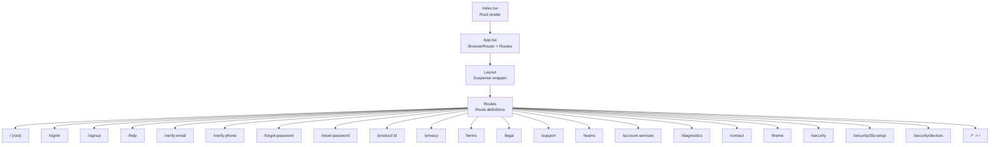
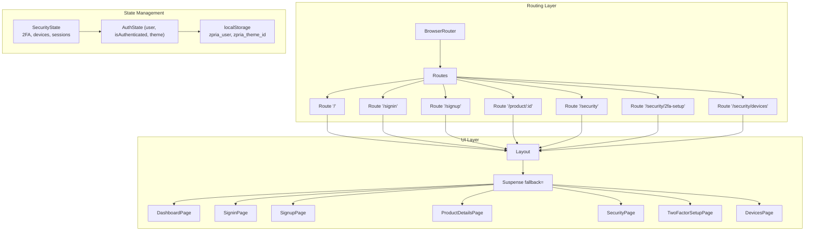
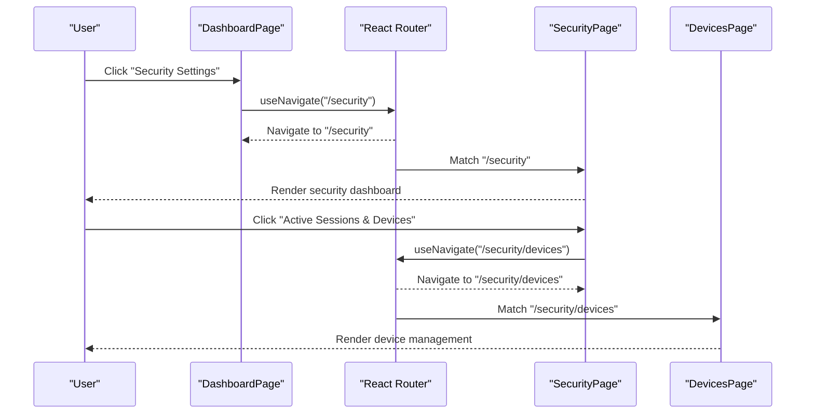
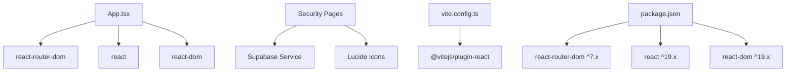

# Routing System

<cite>
**Referenced Files in This Document**
- [App.tsx](file://App.tsx)
- [index.tsx](file://index.tsx)
- [package.json](file://package.json)
- [vite.config.ts](file://vite.config.ts)
- [DashboardPage.tsx](file://pages/DashboardPage.tsx)
- [SigninPage.tsx](file://pages/SigninPage.tsx)
- [SignupPage.tsx](file://pages/SignupPage.tsx)
- [ProductDetailsPage.tsx](file://pages/ProductDetailsPage.tsx)
- [LoadingPage.tsx](file://pages/LoadingPage.tsx)
- [SecurityPage.tsx](file://pages/SecurityPage.tsx)
- [TwoFactorSetupPage.tsx](file://pages/TwoFactorSetupPage.tsx)
- [DevicesPage.tsx](file://pages/DevicesPage.tsx)
- [AccountServicesPage.tsx](file://pages/AccountServicesPage.tsx)
- [types.ts](file://types.ts)
- [constants.tsx](file://constants.tsx)
- [supabaseService.ts](file://services/supabaseService.ts)
</cite>

## Update Summary
**Changes Made**
- Added comprehensive documentation for new security-related routes (/security, /security/2fa-setup, /security/devices)
- Updated route configuration section to include security infrastructure routes
- Enhanced navigation patterns section with security route integration examples
- Added security-focused route guards and authentication patterns
- Updated architecture diagrams to reflect expanded security routing system

## Table of Contents
1. [Introduction](#introduction)
2. [Project Structure](#project-structure)
3. [Core Components](#core-components)
4. [Architecture Overview](#architecture-overview)
5. [Detailed Component Analysis](#detailed-component-analysis)
6. [Security Route Infrastructure](#security-route-infrastructure)
7. [Dependency Analysis](#dependency-analysis)
8. [Performance Considerations](#performance-considerations)
9. [Troubleshooting Guide](#troubleshooting-guide)
10. [Conclusion](#conclusion)

## Introduction
This document explains the ZPRIA routing system built with React Router DOM. It covers route configuration in App.tsx, navigation patterns, route parameters, programmatic navigation, lazy-loaded routes for performance, Suspense integration, fallback handling, and best practices for route guards and navigation state management. The system now includes comprehensive security infrastructure with dedicated routes for account security management, two-factor authentication setup, and device/session management.

## Project Structure
The routing system centers around a single-page application with a router configured at the root. Pages are organized under a pages directory, and the application uses React Router DOM for declarative routing and navigation. The routing system has been enhanced with security-focused routes that provide comprehensive account security management capabilities.

**Diagram sources**
- [index.tsx](file://index.tsx#L1-L17)
- [App.tsx](file://App.tsx#L274-L276)

**Section sources**
- [index.tsx](file://index.tsx#L1-L17)
- [App.tsx](file://App.tsx#L274-L276)

## Core Components
- App.tsx: Configures the router, defines all routes including new security routes, and manages authentication state and theme preferences.
- Layout: Wraps the routed content with Suspense to enable lazy-loading fallbacks.
- Page components: Individual pages including new security-focused components such as SecurityPage, TwoFactorSetupPage, and DevicesPage.
- Navigation utilities: useNavigate for programmatic navigation and Link for declarative navigation.

Key responsibilities:
- Route configuration and lazy loading including security routes
- Authentication state management and persistence
- Programmatic navigation using useNavigate
- Route parameters (e.g., product/:id)
- Suspense-based fallback handling
- Security route integration and navigation patterns

**Section sources**
- [App.tsx](file://App.tsx#L1-L31)
- [App.tsx](file://App.tsx#L274-L276)
- [SecurityPage.tsx](file://pages/SecurityPage.tsx#L1-L265)
- [TwoFactorSetupPage.tsx](file://pages/TwoFactorSetupPage.tsx#L1-L348)
- [DevicesPage.tsx](file://pages/DevicesPage.tsx#L1-L354)

## Architecture Overview
The routing architecture uses React Router DOM with lazy-loaded components and Suspense for improved performance. Authentication state is managed at the root level and passed down to pages. Navigation is performed via both declarative Link components and programmatic useNavigate hooks. The architecture now includes comprehensive security route infrastructure that provides centralized account security management.

**Diagram sources**
- [App.tsx](file://App.tsx#L274-L276)
- [LoadingPage.tsx](file://pages/LoadingPage.tsx#L1-L67)
- [SecurityPage.tsx](file://pages/SecurityPage.tsx#L1-L265)

## Detailed Component Analysis

### Route Configuration and Lazy Loading
- Main routes include home, sign-in, sign-up, help, verification flows, password reset, product details, legal pages, support, teams, account services, diagnostics, contact, and theme selection.
- Security routes have been added: `/security` for main security dashboard, `/security/2fa-setup` for two-factor authentication setup, and `/security/devices` for device/session management.
- Secondary pages are lazy-loaded using React.lazy to reduce initial bundle size.
- Suspense wraps the Layout to provide a loading experience while lazy components are being fetched.

Best practices demonstrated:
- Grouping lazy imports near the top of the file for clarity.
- Using Suspense at the layout level to wrap all routes.
- Providing a dedicated LoadingPage component for suspense fallback.
- Organizing security routes under a common base path for logical grouping.

**Section sources**
- [App.tsx](file://App.tsx#L10-L31)
- [App.tsx](file://App.tsx#L274-L276)
- [LoadingPage.tsx](file://pages/LoadingPage.tsx#L1-L67)

### Authentication State and Navigation Guards
- Authentication state is initialized from localStorage and includes user profile, authentication status, and theme preference.
- The root route conditionally renders either the dashboard or product hub based on authentication status.
- Programmatic navigation occurs after successful login to redirect users to the home route.
- Security routes utilize authentication guards through Supabase service integration for protected access.

Navigation patterns:
- useNavigate for programmatic navigation within components (e.g., SigninPage navigates to home after login).
- useLocation for conditional UI rendering based on current path.
- Security routes implement authentication checks using Supabase getUser() for protected access.

**Section sources**
- [App.tsx](file://App.tsx#L221-L246)
- [App.tsx](file://App.tsx#L274-L276)
- [SecurityPage.tsx](file://pages/SecurityPage.tsx#L26-L52)
- [TwoFactorSetupPage.tsx](file://pages/TwoFactorSetupPage.tsx#L26-L49)

### Route Parameters and Programmatic Navigation
- Product details route uses a parameterized path product/:id to display specific product information.
- Security routes use hierarchical paths under the /security base for logical organization.
- Programmatic navigation is used to move between pages (e.g., navigating to home after login, navigating to product details, or accessing security features).

**Diagram sources**
- [DashboardPage.tsx](file://pages/DashboardPage.tsx#L118-L138)
- [SecurityPage.tsx](file://pages/SecurityPage.tsx#L210-L228)
- [DevicesPage.tsx](file://pages/DevicesPage.tsx#L206-L258)

**Section sources**
- [App.tsx](file://App.tsx#L264)
- [SecurityPage.tsx](file://pages/SecurityPage.tsx#L210-L228)
- [DevicesPage.tsx](file://pages/DevicesPage.tsx#L206-L258)

### Navigation Patterns and UI Integration
- Declarative navigation via Link components for internal links (e.g., to privacy, terms, legal, support).
- Programmatic navigation via useNavigate for dynamic actions (e.g., navigating after form submission or button clicks).
- Conditional rendering in header/sub-header based on authentication state and current path.
- Security routes integrate seamlessly with the existing navigation structure through Account Services page.

**Section sources**
- [App.tsx](file://App.tsx#L149-L175)
- [AccountServicesPage.tsx](file://pages/AccountServicesPage.tsx#L6-L41)
- [SecurityPage.tsx](file://pages/SecurityPage.tsx#L210-L228)

### Route-Based Code Splitting and Suspense Integration
- Lazy loading is implemented for frequently accessed pages to improve initial load performance.
- Security routes benefit from the same lazy loading strategy as other pages.
- Suspense fallback is centralized in the Layout component, ensuring consistent UX during component loading.

**Diagram sources**
- [App.tsx](file://App.tsx#L10-L31)
- [App.tsx](file://App.tsx#L204-L206)
- [LoadingPage.tsx](file://pages/LoadingPage.tsx#L1-L67)

**Section sources**
- [App.tsx](file://App.tsx#L10-L31)
- [App.tsx](file://App.tsx#L204-L206)

### Route Guards Implementation
- Authentication guard is implicit through conditional rendering in the root route and header navigation.
- Security routes implement explicit authentication guards using Supabase service getUser() method.
- No explicit route guard components are defined; guards rely on authentication state and conditional UI.
- Security routes redirect unauthenticated users to sign-in page with proper error handling.

Recommended enhancements:
- Implement a dedicated route guard component that checks authentication and redirects unauthenticated users to sign-in.
- Use a higher-order component or a custom hook to encapsulate guard logic for reuse across routes.
- Add role-based access control for different security features.

**Section sources**
- [App.tsx](file://App.tsx#L241-L246)
- [SecurityPage.tsx](file://pages/SecurityPage.tsx#L26-L52)
- [TwoFactorSetupPage.tsx](file://pages/TwoFactorSetupPage.tsx#L26-L49)

### Navigation State Management Patterns
- Authentication state is persisted in localStorage and restored on app initialization.
- Theme preference is stored and applied consistently across sessions.
- Programmatic navigation is used to maintain stateless routing behavior.
- Security routes maintain navigation state through URL parameters and programmatic navigation.

**Section sources**
- [App.tsx](file://App.tsx#L221-L246)
- [constants.tsx](file://constants.tsx#L5-L25)

## Security Route Infrastructure

### Security Route Configuration
The ZPRIA routing system now includes a comprehensive security infrastructure with three main security routes:

- **Main Security Dashboard** (`/security`): Central hub for account security management with security status overview and quick access to security features.
- **Two-Factor Authentication Setup** (`/security/2fa-setup`): Multi-step wizard for enabling two-factor authentication with support for SMS, email, and authenticator app methods.
- **Device Management** (`/security/devices`): Comprehensive device and session management interface for viewing, signing out, and managing active sessions across devices.

### Security Route Integration Patterns
Security routes integrate seamlessly with the existing routing infrastructure:

- **Hierarchical Organization**: All security routes are organized under the `/security` base path for logical grouping and easy navigation.
- **Authentication Integration**: Security routes utilize the same authentication mechanisms as other protected routes.
- **Navigation Flow**: Security routes follow established navigation patterns with back navigation to parent security pages.
- **State Management**: Security routes maintain consistent state management through the global authentication state.

### Security Route Features
Each security route provides specialized functionality:

- **Security Dashboard**: Displays security status, quick access to security features, security tips, and navigation to specific security settings.
- **2FA Setup Wizard**: Multi-step process for enabling two-factor authentication with backup code generation and verification steps.
- **Device Management**: Comprehensive interface for viewing active sessions, signing out devices, and managing device trust settings.

**Section sources**
- [App.tsx](file://App.tsx#L274-L276)
- [SecurityPage.tsx](file://pages/SecurityPage.tsx#L54-L111)
- [TwoFactorSetupPage.tsx](file://pages/TwoFactorSetupPage.tsx#L51-L73)
- [DevicesPage.tsx](file://pages/DevicesPage.tsx#L8-L17)

## Dependency Analysis
External dependencies relevant to routing:
- react-router-dom: Provides BrowserRouter, Routes, Route, Link, useNavigate, useLocation, and Navigate.
- react: Enables lazy loading and Suspense integration.
- react-dom: Renders the application tree.

Build-time configuration:
- Vite plugin for React enables JSX transforms and development server features.

**Diagram sources**
- [package.json](file://package.json#L12-L26)
- [vite.config.ts](file://vite.config.ts#L1-L24)
- [SecurityPage.tsx](file://pages/SecurityPage.tsx#L1-L7)
- [TwoFactorSetupPage.tsx](file://pages/TwoFactorSetupPage.tsx#L1-L7)

**Section sources**
- [package.json](file://package.json#L12-L26)
- [vite.config.ts](file://vite.config.ts#L1-L24)

## Performance Considerations
- Lazy loading reduces initial bundle size by deferring non-critical page loads until needed.
- Security routes benefit from the same lazy loading optimization as other pages.
- Suspense ensures a consistent loading experience while lazy components are being fetched.
- Security route components are optimized for performance with efficient data fetching and caching.
- Avoid unnecessary re-renders by keeping route parameters minimal and using memoization where appropriate.
- Consider preloading critical security routes to improve perceived performance.

## Troubleshooting Guide
Common issues and resolutions:
- Blank screen on navigation: Ensure Suspense fallback is present and lazy components are correctly imported.
- Authentication state not persisting: Verify localStorage keys and initialization logic in App.tsx.
- Navigation not working: Confirm useNavigate is used within a routing context and routes are properly defined.
- Security route errors: Check Supabase authentication status and database connection for security-related routes.
- 2FA setup failures: Verify phone number format and authentication token validity for two-factor authentication setup.

**Section sources**
- [App.tsx](file://App.tsx#L204-L206)
- [App.tsx](file://App.tsx#L221-L246)
- [SecurityPage.tsx](file://pages/SecurityPage.tsx#L26-L52)

## Conclusion
The ZPRIA routing system leverages React Router DOM with lazy-loaded components and Suspense to deliver a responsive, modular user experience. The addition of comprehensive security routes significantly enhances the application's security infrastructure, providing users with centralized access to account security management, two-factor authentication setup, and device/session management. Authentication state is centrally managed and influences route rendering and navigation. The security route infrastructure demonstrates best practices for hierarchical route organization, authentication integration, and seamless navigation patterns. While the current implementation provides a solid foundation, adding explicit route guards and centralized navigation utilities would further enhance maintainability and user experience.