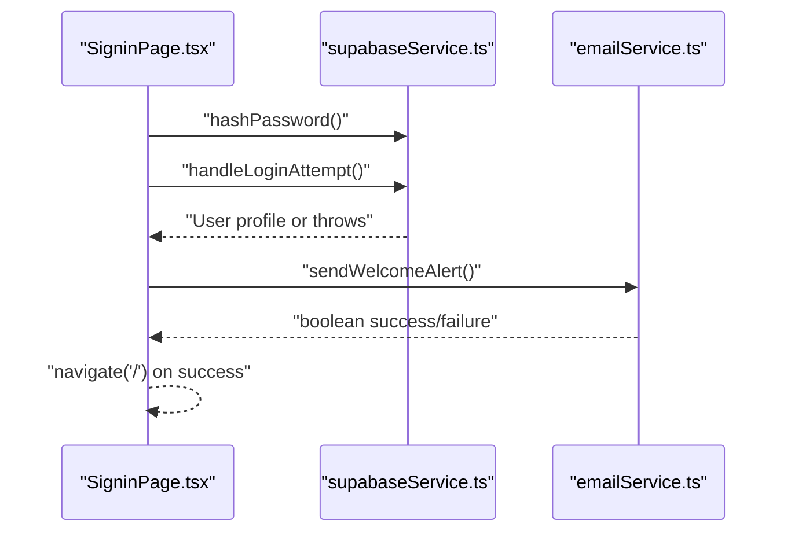
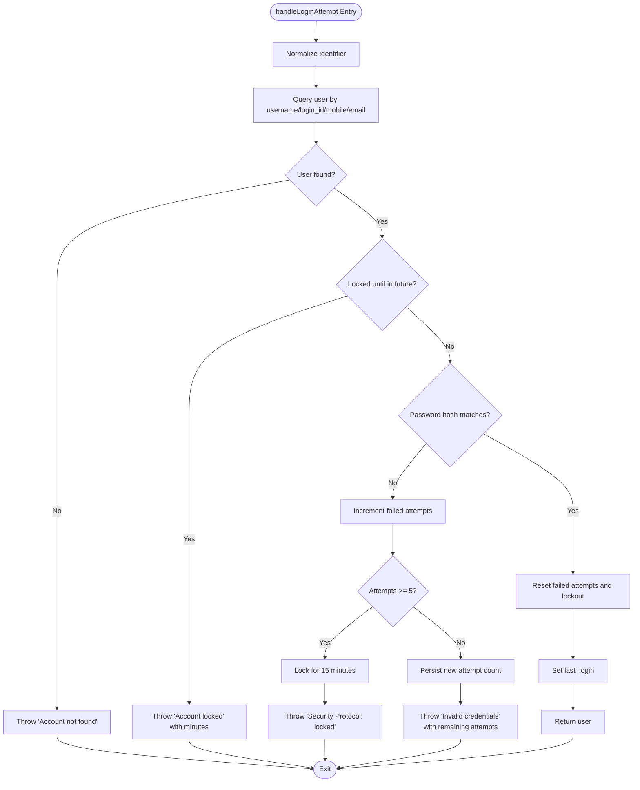
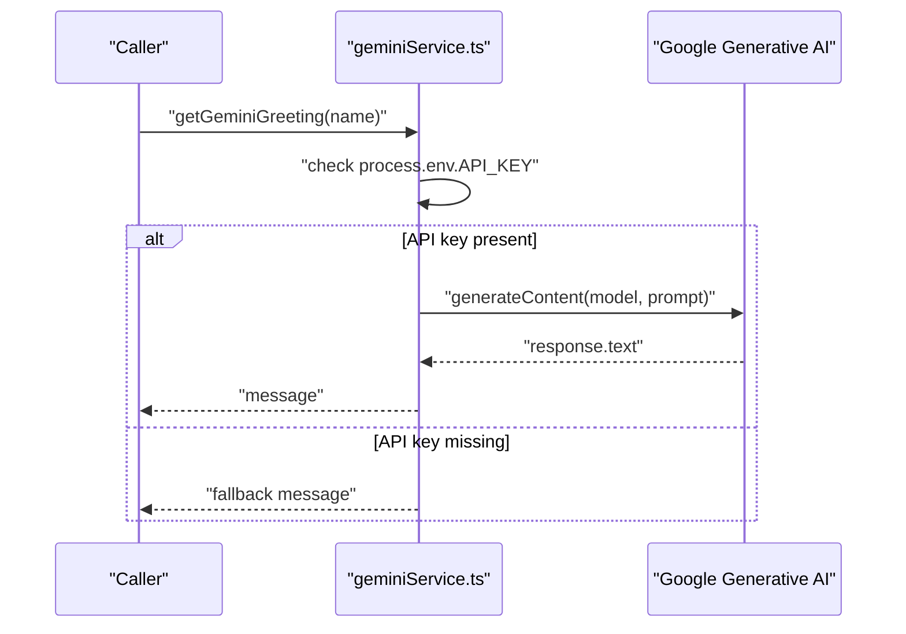
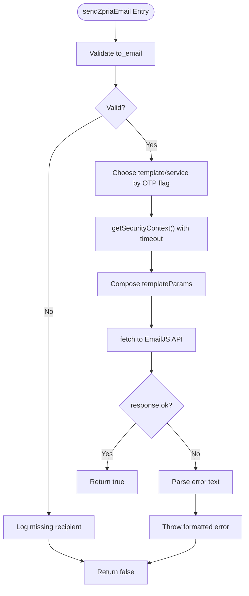
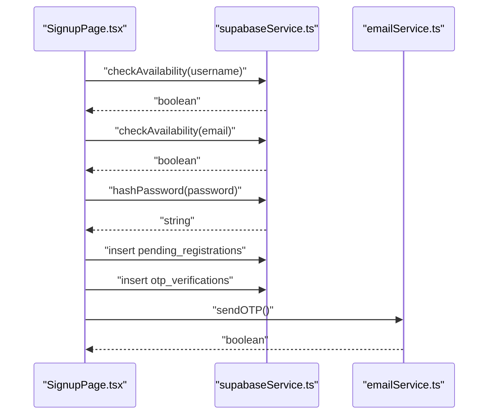
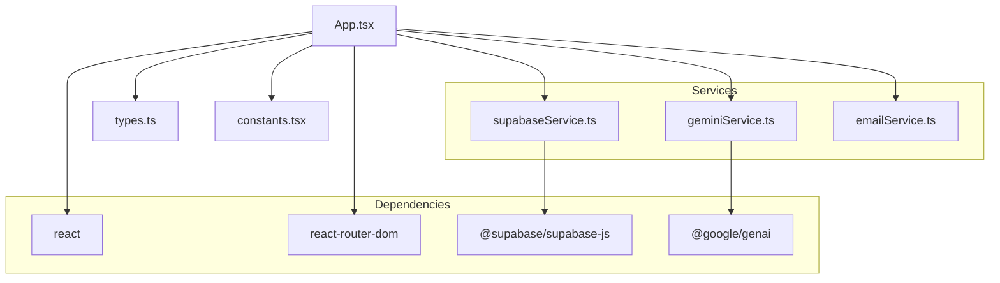

# Service Layer Pattern

<cite>
**Referenced Files in This Document**
- [App.tsx](file://App.tsx)
- [package.json](file://package.json)
- [vite.config.ts](file://vite.config.ts)
- [types.ts](file://types.ts)
- [constants.tsx](file://constants.tsx)
- [services/supabaseService.ts](file://services/supabaseService.ts)
- [services/geminiService.ts](file://services/geminiService.ts)
- [services/emailService.ts](file://services/emailService.ts)
- [pages/SigninPage.tsx](file://pages/SigninPage.tsx)
- [pages/SignupPage.tsx](file://pages/SignupPage.tsx)
</cite>

## Table of Contents
1. [Introduction](#introduction)
2. [Project Structure](#project-structure)
3. [Core Components](#core-components)
4. [Architecture Overview](#architecture-overview)
5. [Detailed Component Analysis](#detailed-component-analysis)
6. [Dependency Analysis](#dependency-analysis)
7. [Performance Considerations](#performance-considerations)
8. [Troubleshooting Guide](#troubleshooting-guide)
9. [Conclusion](#conclusion)

## Introduction
This document explains the ZPRIA service layer architecture and how the application isolates cross-cutting concerns behind dedicated service modules. It focuses on three primary service domains:
- Authentication and identity via Supabase
- AI-driven content via Gemini
- Email delivery via EmailJS

It documents the service abstraction pattern, error handling strategies, retry mechanisms, dependency injection approach, configuration management, external API integration patterns, service lifecycle management, caching strategies, performance optimization techniques, authentication token handling, rate limiting considerations, and graceful degradation when external services are unavailable.

## Project Structure
The service layer is organized under a dedicated services directory with clear separation of concerns:
- Authentication and identity: Supabase client and helpers
- AI content generation: Gemini integration
- Email delivery: EmailJS integration with security-aware dispatch

UI pages consume these services through direct imports and function calls, enabling a clean separation between presentation and domain logic.

```mermaid
graph TB
subgraph "Pages"
SignIn["SigninPage.tsx"]
SignUp["SignupPage.tsx"]
end
subgraph "Services"
Supabase["supabaseService.ts"]
Gemini["geminiService.ts"]
Email["emailService.ts"]
end
subgraph "External Systems"
SupabaseCloud["Supabase (PostgreSQL)"
GeminiAPI["Google Generative AI"]
EmailJS["EmailJS API"]
end
SignIn --> Supabase
SignIn --> Email
SignUp --> Supabase
SignUp --> Email
Gemini --> GeminiAPI
Email --> EmailJS
Supabase --> SupabaseCloud
```

**Diagram sources**
- [pages/SigninPage.tsx](file://pages/SigninPage.tsx#L1-L231)
- [pages/SignupPage.tsx](file://pages/SignupPage.tsx#L1-L293)
- [services/supabaseService.ts](file://services/supabaseService.ts#L1-L67)
- [services/geminiService.ts](file://services/geminiService.ts#L1-L39)
- [services/emailService.ts](file://services/emailService.ts#L1-L194)

**Section sources**
- [services/supabaseService.ts](file://services/supabaseService.ts#L1-L67)
- [services/geminiService.ts](file://services/geminiService.ts#L1-L39)
- [services/emailService.ts](file://services/emailService.ts#L1-L194)
- [pages/SigninPage.tsx](file://pages/SigninPage.tsx#L1-L231)
- [pages/SignupPage.tsx](file://pages/SignupPage.tsx#L1-L293)

## Core Components
- Supabase service module
  - Provides a configured Supabase client and utility functions for password hashing, availability checks, and login attempt handling with lockout and attempt tracking.
- Gemini service module
  - Wraps Google Generative AI to produce greeting messages and security recommendations, with graceful fallbacks when the API key is missing or requests fail.
- Email service module
  - Encapsulates EmailJS dispatch with robust error handling, optional security context retrieval, and template-driven composition.

These services are imported directly into pages and used synchronously, forming a straightforward service abstraction pattern.

**Section sources**
- [services/supabaseService.ts](file://services/supabaseService.ts#L1-L67)
- [services/geminiService.ts](file://services/geminiService.ts#L1-L39)
- [services/emailService.ts](file://services/emailService.ts#L1-L194)

## Architecture Overview
The service layer follows a functional abstraction pattern:
- Each service exposes pure functions or a singleton client instance.
- Pages import and call service functions directly.
- Configuration is injected via environment variables and Vite’s define mechanism.
- External integrations are isolated behind thin wrappers with explicit error handling and fallbacks.



**Diagram sources**
- [pages/SigninPage.tsx](file://pages/SigninPage.tsx#L53-L95)
- [services/supabaseService.ts](file://services/supabaseService.ts#L9-L15)
- [services/supabaseService.ts](file://services/supabaseService.ts#L26-L66)
- [services/emailService.ts](file://services/emailService.ts#L139-L172)

## Detailed Component Analysis

### Supabase Authentication Service
- Responsibilities
  - Provide a configured Supabase client instance.
  - Hash passwords using Web Crypto APIs.
  - Check username/email availability against users and pending registrations.
  - Authenticate login attempts with multi-field lookup, lockout enforcement, and attempt tracking.
- Error handling
  - Throws descriptive errors for missing accounts, lockouts, invalid credentials, and excessive attempts.
- Retry mechanisms
  - None implemented at the service level; callers can wrap calls with retry logic if desired.
- Lifecycle and caching
  - No local cache; relies on Supabase for persistence and retrieval.
- Performance
  - Uses efficient queries with maybeSingle() and or() filters.
  - SHA-256 hashing via subtleCrypto avoids synchronous heavy computations.



**Diagram sources**
- [services/supabaseService.ts](file://services/supabaseService.ts#L26-L66)

**Section sources**
- [services/supabaseService.ts](file://services/supabaseService.ts#L1-L67)

### Gemini AI Integration Service
- Responsibilities
  - Generate short, enthusiastic greeting messages for returning users.
  - Provide concise security recommendations based on user verification status.
- Configuration and authentication
  - Reads API key from environment variables via Vite define.
  - Initializes the GenAI client per function call.
- Error handling and graceful degradation
  - Returns fallback messages when API key is missing or when requests fail.
- Retry mechanisms
  - None implemented; caller can add retries around function calls if needed.
- Lifecycle and caching
  - Stateless; no persistent state or cache.
- Performance
  - Client initialized per call; consider reusing a shared client for repeated calls in production.



**Diagram sources**
- [services/geminiService.ts](file://services/geminiService.ts#L4-L20)
- [vite.config.ts](file://vite.config.ts#L13-L16)

**Section sources**
- [services/geminiService.ts](file://services/geminiService.ts#L1-L39)
- [vite.config.ts](file://vite.config.ts#L1-L24)

### Email Delivery Service
- Responsibilities
  - Send OTP and welcome/security alert emails via EmailJS.
  - Compose template parameters and attach security context (device info, IP, location, login time).
- Configuration and authentication
  - Uses public and private keys embedded in the module for EmailJS calls.
- Error handling and graceful degradation
  - Returns boolean success/failure; logs errors and returns false on failure.
  - Retrieves IP with a timeout to avoid blocking dispatch.
- Retry mechanisms
  - None implemented; callers can implement retries if needed.
- Lifecycle and caching
  - Stateless; no local cache.
- Performance
  - Uses fetch with JSON payload; minimal processing overhead.



**Diagram sources**
- [services/emailService.ts](file://services/emailService.ts#L70-L137)

**Section sources**
- [services/emailService.ts](file://services/emailService.ts#L1-L194)

### Service Usage in Pages
- SigninPage
  - Imports hashing and login helpers from the Supabase service.
  - Sends a welcome alert after successful login using the Email service.
- SignupPage
  - Uses availability checks and hashing from the Supabase service.
  - Inserts pending registration records and sends OTP via the Email service.



**Diagram sources**
- [pages/SignupPage.tsx](file://pages/SignupPage.tsx#L82-L149)
- [services/supabaseService.ts](file://services/supabaseService.ts#L17-L24)
- [services/supabaseService.ts](file://services/supabaseService.ts#L9-L15)
- [services/emailService.ts](file://services/emailService.ts#L139-L147)

**Section sources**
- [pages/SigninPage.tsx](file://pages/SigninPage.tsx#L1-L231)
- [pages/SignupPage.tsx](file://pages/SignupPage.tsx#L1-L293)

## Dependency Analysis
- Runtime dependencies
  - React, React Router, Supabase client, and Google Generative AI SDK are declared in the project dependencies.
- Build-time configuration
  - Vite injects environment variables into the app bundle using define, ensuring API keys are available at runtime.
- Service coupling
  - Services are loosely coupled to pages via direct imports and function calls.
  - External systems are encapsulated behind service wrappers, minimizing coupling in pages.



**Diagram sources**
- [App.tsx](file://App.tsx#L1-L279)
- [types.ts](file://types.ts#L1-L79)
- [constants.tsx](file://constants.tsx#L1-L361)
- [services/supabaseService.ts](file://services/supabaseService.ts#L1-L67)
- [services/geminiService.ts](file://services/geminiService.ts#L1-L39)
- [services/emailService.ts](file://services/emailService.ts#L1-L194)
- [package.json](file://package.json#L12-L25)

**Section sources**
- [package.json](file://package.json#L1-L27)
- [vite.config.ts](file://vite.config.ts#L1-L24)

## Performance Considerations
- Supabase
  - Use selective field projections and maybeSingle() to minimize payload sizes.
  - Prefer indexed lookups (username, login_id, email, mobile) to reduce query latency.
- Gemini
  - Reuse a single client instance across calls to avoid initialization overhead.
  - Limit concurrent calls to respect provider quotas and reduce latency spikes.
- EmailJS
  - Keep payloads minimal and avoid unnecessary network retries.
  - Use timeouts for auxiliary calls (e.g., IP capture) to prevent blocking the main dispatch path.

[No sources needed since this section provides general guidance]

## Troubleshooting Guide
- Supabase authentication
  - Missing or incorrect identifiers cause “Account not found” errors; verify normalization and or() filters.
  - Excessive failed attempts trigger a 15-minute lock; confirm reset logic on success.
- Gemini
  - Missing API key results in fallback messages; ensure Vite define injects the key correctly.
  - Network failures log errors and return fallback text; inspect console for details.
- EmailJS
  - Dispatch failures return false and log errors; check response status and template parameters.
  - Timeout-based IP capture prevents blocking; adjust timeout if needed for slower networks.

**Section sources**
- [services/supabaseService.ts](file://services/supabaseService.ts#L26-L66)
- [services/geminiService.ts](file://services/geminiService.ts#L4-L20)
- [services/emailService.ts](file://services/emailService.ts#L70-L137)

## Conclusion
The ZPRIA service layer demonstrates a clean, functional abstraction pattern:
- Supabase, Gemini, and EmailJS integrations are encapsulated behind focused service modules.
- Pages consume services directly, keeping UI logic simple and testable.
- Configuration is managed via environment variables and Vite’s define mechanism.
- Error handling and graceful degradation ensure resilience when external services are unavailable.
- Opportunities for improvement include shared client reuse for Gemini, optional retry policies, and lightweight caching for frequently accessed data.