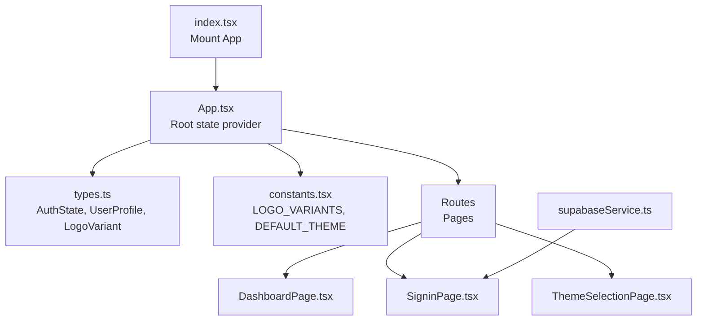
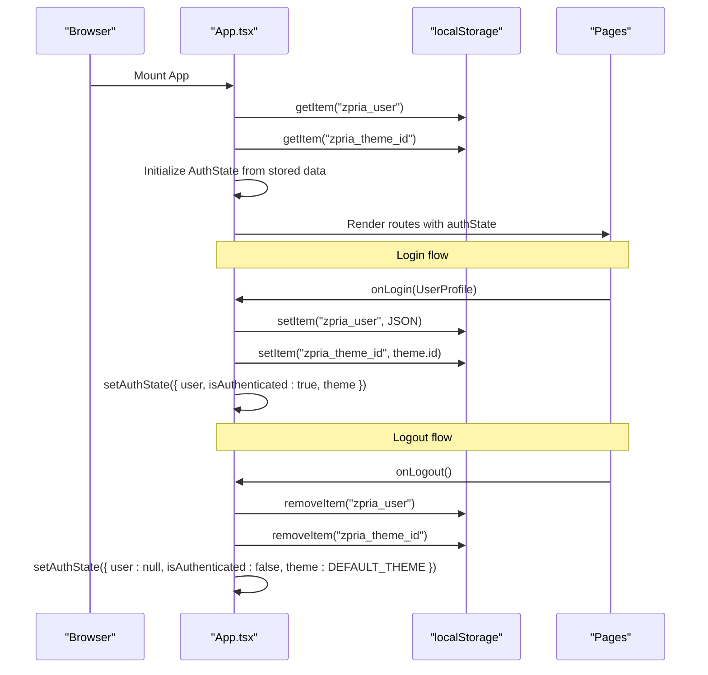
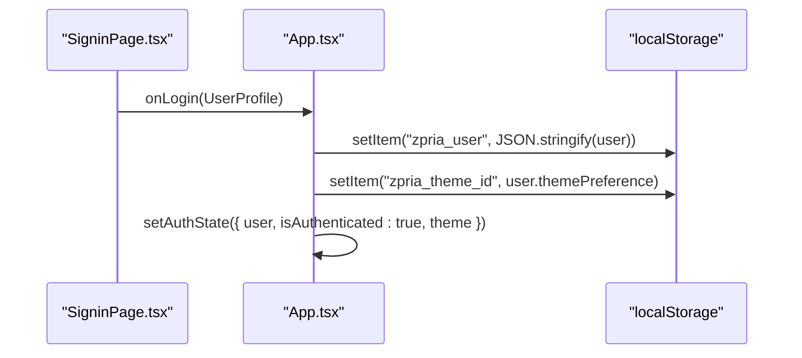
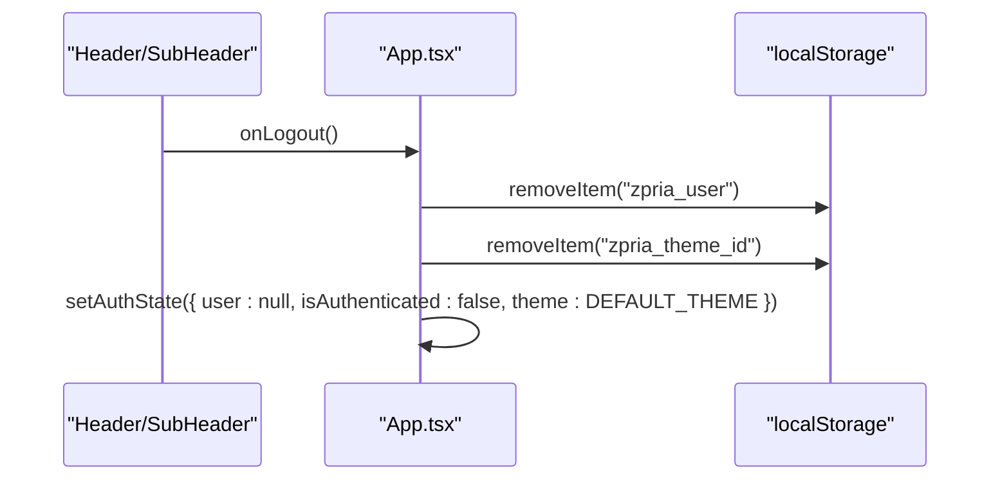
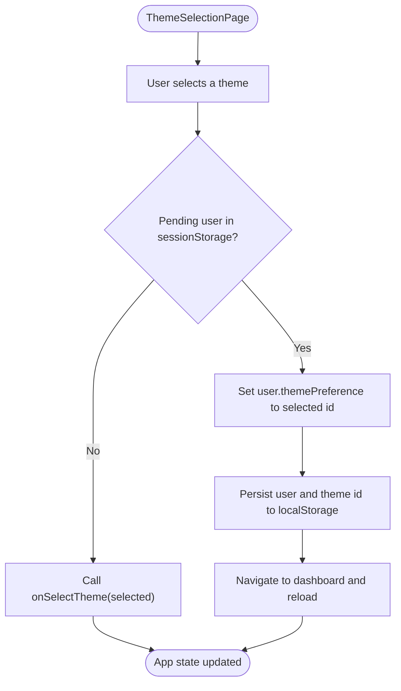
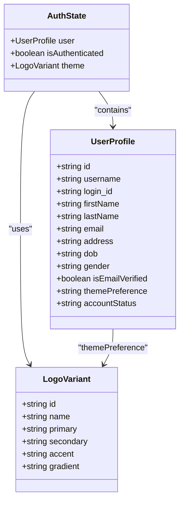
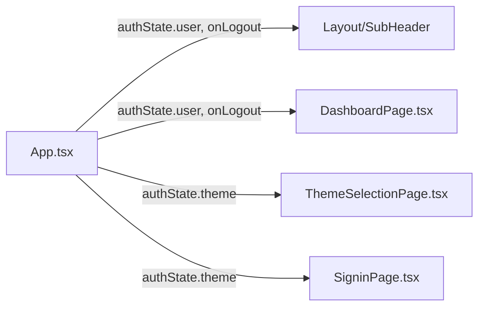
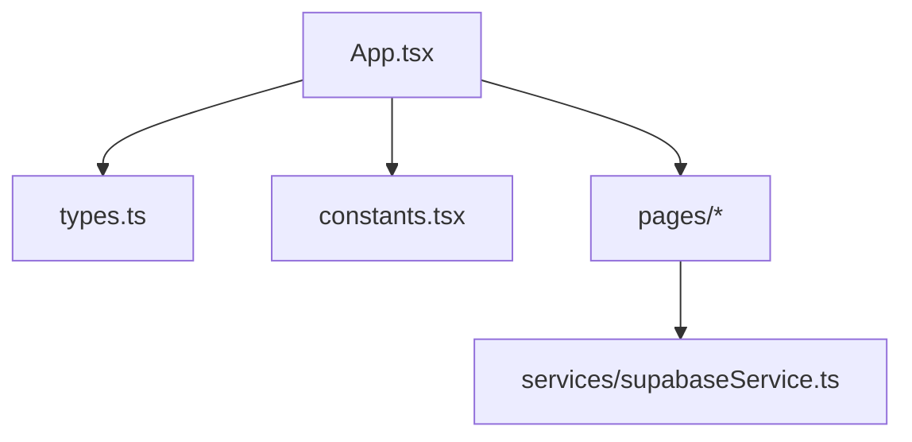

# State Management

<cite>
**Referenced Files in This Document**
- [App.tsx](file://App.tsx)
- [types.ts](file://types.ts)
- [constants.tsx](file://constants.tsx)
- [SigninPage.tsx](file://pages/SigninPage.tsx)
- [ThemeSelectionPage.tsx](file://pages/ThemeSelectionPage.tsx)
- [DashboardPage.tsx](file://pages/DashboardPage.tsx)
- [supabaseService.ts](file://services/supabaseService.ts)
- [index.tsx](file://index.tsx)
</cite>

## Table of Contents
1. [Introduction](#introduction)
2. [Project Structure](#project-structure)
3. [Core Components](#core-components)
4. [Architecture Overview](#architecture-overview)
5. [Detailed Component Analysis](#detailed-component-analysis)
6. [Dependency Analysis](#dependency-analysis)
7. [Performance Considerations](#performance-considerations)
8. [Troubleshooting Guide](#troubleshooting-guide)
9. [Conclusion](#conclusion)

## Introduction
This document explains the ZPRIA state management system centered around a single React hook that manages authentication and theme preferences. It covers the AuthState interface, the UserProfile data structure, and LogoVariant theme management. It documents state update patterns for login/logout operations, theme switching, and user preference persistence. It also details localStorage integration for session continuity across browser reloads, state initialization from stored data, and synchronization between components. Finally, it provides best practices, error handling guidance, and debugging techniques for state-related issues.

## Project Structure
The state management is implemented at the application root level and shared across routed pages. The App component initializes state from localStorage, exposes login/logout/updateTheme handlers, and passes state down to layout and pages.

**Diagram sources**
- [index.tsx](file://index.tsx#L1-L17)
- [App.tsx](file://App.tsx#L218-L278)
- [types.ts](file://types.ts#L27-L31)
- [constants.tsx](file://constants.tsx#L5-L25)
- [SigninPage.tsx](file://pages/SigninPage.tsx#L1-L231)
- [ThemeSelectionPage.tsx](file://pages/ThemeSelectionPage.tsx#L1-L78)
- [DashboardPage.tsx](file://pages/DashboardPage.tsx#L1-L217)
- [supabaseService.ts](file://services/supabaseService.ts#L1-L67)

**Section sources**
- [index.tsx](file://index.tsx#L1-L17)
- [App.tsx](file://App.tsx#L218-L278)

## Core Components
- AuthState: Central state shape containing user profile, authentication flag, and active theme.
- UserProfile: Complete user identity and preferences persisted to localStorage.
- LogoVariant: Theme descriptor with id, name, and color tokens used for branding and UI.

Key responsibilities:
- Initialize state from localStorage on app boot.
- Persist user profile and theme preference to localStorage upon login.
- Provide handlers to update theme independently of authentication state.
- Clear localStorage and reset to defaults on logout.

**Section sources**
- [types.ts](file://types.ts#L27-L31)
- [types.ts](file://types.ts#L11-L25)
- [types.ts](file://types.ts#L2-L9)
- [constants.tsx](file://constants.tsx#L5-L25)
- [App.tsx](file://App.tsx#L219-L246)

## Architecture Overview
The state lifecycle is driven by user actions and route navigation. Authentication state is hydrated from localStorage at startup, while theme preferences are derived from either stored user themePreference or a default theme.

**Diagram sources**
- [App.tsx](file://App.tsx#L219-L246)
- [constants.tsx](file://constants.tsx#L25-L25)

## Detailed Component Analysis

### AuthState and Initialization
- State shape: user, isAuthenticated, theme.
- Initialization: On mount, reads zpria_user and zpria_theme_id from localStorage. If user exists, sets isAuthenticated accordingly and resolves theme via LOGO_VARIANTS lookup; otherwise falls back to DEFAULT_THEME.

Best practices:
- Use a factory initializer to avoid re-computation on every render.
- Ensure JSON parsing is guarded; initialize with null when missing.

**Section sources**
- [App.tsx](file://App.tsx#L219-L229)
- [constants.tsx](file://constants.tsx#L25-L25)

### Login Flow
- On successful sign-in, the page invokes onLogin with a constructed UserProfile.
- Persists user to localStorage under zpria_user.
- Resolves theme from user.themePreference against LOGO_VARIANTS; persists theme id under zpria_theme_id.
- Updates state atomically to reflect authenticated state and theme.

**Diagram sources**
- [SigninPage.tsx](file://pages/SigninPage.tsx#L63-L79)
- [App.tsx](file://App.tsx#L231-L236)

**Section sources**
- [SigninPage.tsx](file://pages/SigninPage.tsx#L63-L79)
- [App.tsx](file://App.tsx#L231-L236)

### Logout Flow
- Clears zpria_user and zpria_theme_id from localStorage.
- Resets state to user=null, isAuthenticated=false, theme=DEFAULT_THEME.

**Diagram sources**
- [App.tsx](file://App.tsx#L238-L242)

**Section sources**
- [App.tsx](file://App.tsx#L238-L242)

### Theme Switching and Persistence
- Theme selection page allows choosing a LogoVariant and calls onSelectTheme.
- App.updateTheme updates state without touching localStorage (UI preference).
- During theme selection, if a pending user exists in sessionStorage, the page writes themePreference to that user, persists to localStorage, and navigates to dashboard.

**Diagram sources**
- [ThemeSelectionPage.tsx](file://pages/ThemeSelectionPage.tsx#L16-L31)
- [App.tsx](file://App.tsx#L244-L246)

**Section sources**
- [ThemeSelectionPage.tsx](file://pages/ThemeSelectionPage.tsx#L16-L31)
- [App.tsx](file://App.tsx#L244-L246)

### Theme Data Model

**Diagram sources**
- [types.ts](file://types.ts#L27-L31)
- [types.ts](file://types.ts#L11-L25)
- [types.ts](file://types.ts#L2-L9)

**Section sources**
- [types.ts](file://types.ts#L27-L31)
- [types.ts](file://types.ts#L11-L25)
- [types.ts](file://types.ts#L2-L9)

### State Synchronization Across Components
- App holds the single source of truth and passes down:
  - user and onLogout to Layout and SubHeader.
  - theme to Dashboard and ThemeSelectionPage.
- Pages trigger state updates via callbacks exposed by App.

**Diagram sources**
- [App.tsx](file://App.tsx#L251-L270)
- [DashboardPage.tsx](file://pages/DashboardPage.tsx#L7-L11)
- [ThemeSelectionPage.tsx](file://pages/ThemeSelectionPage.tsx#L7-L10)
- [SigninPage.tsx](file://pages/SigninPage.tsx#L10-L12)

**Section sources**
- [App.tsx](file://App.tsx#L251-L270)
- [DashboardPage.tsx](file://pages/DashboardPage.tsx#L7-L11)
- [ThemeSelectionPage.tsx](file://pages/ThemeSelectionPage.tsx#L7-L10)
- [SigninPage.tsx](file://pages/SigninPage.tsx#L10-L12)

## Dependency Analysis
- App depends on:
  - types.ts for AuthState, UserProfile, LogoVariant.
  - constants.tsx for LOGO_VARIANTS and DEFAULT_THEME.
  - pages/* for rendering and invoking callbacks.
  - services/supabaseService.ts for authentication logic in SigninPage.

**Diagram sources**
- [App.tsx](file://App.tsx#L4-L5)
- [types.ts](file://types.ts#L2-L9)
- [constants.tsx](file://constants.tsx#L3-L4)
- [SigninPage.tsx](file://pages/SigninPage.tsx#L7-L7)
- [supabaseService.ts](file://services/supabaseService.ts#L1-L7)

**Section sources**
- [App.tsx](file://App.tsx#L4-L5)
- [SigninPage.tsx](file://pages/SigninPage.tsx#L7-L7)
- [supabaseService.ts](file://services/supabaseService.ts#L1-L7)

## Performance Considerations
- Keep state updates minimal: updateTheme is local-only; persist only on login or explicit theme selection.
- Avoid unnecessary renders by passing memoized callbacks and using shallow equality where appropriate.
- Prefer JSON serialization only for small, stable objects like user profiles and theme ids.
- Debounce or batch UI-only theme changes to reduce re-renders.

## Troubleshooting Guide
Common issues and resolutions:
- State not restored after reload
  - Verify localStorage keys zpria_user and zpria_theme_id exist and are valid JSON.
  - Confirm App initializer runs before any page renders.
- Incorrect theme after login
  - Ensure user.themePreference matches a LogoVariant id; otherwise default theme is used.
- Logout does not clear state
  - Confirm both zpria_user and zpria_theme_id are removed and DEFAULT_THEME is applied.
- Theme selection has no effect
  - For pending users, ensure themePreference is written to the pending user and persisted to localStorage before navigating.

Debugging techniques:
- Inspect localStorage entries for zpria_user and zpria_theme_id.
- Temporarily log authState transitions in App to trace updates.
- Use browser devtools to monitor localStorage changes and network requests during login.

**Section sources**
- [App.tsx](file://App.tsx#L219-L246)
- [constants.tsx](file://constants.tsx#L25-L25)
- [ThemeSelectionPage.tsx](file://pages/ThemeSelectionPage.tsx#L18-L31)

## Conclusion
ZPRIA’s state management centers on a single React hook that hydrates from localStorage, persists user and theme preferences, and synchronizes UI across components. The design is straightforward, predictable, and easy to debug. Following the best practices and troubleshooting steps outlined here will help maintain reliability and performance as the application evolves.