# Authentication System

<cite>
**Referenced Files in This Document**
- [App.tsx](file://App.tsx)
- [SigninPage.tsx](file://pages/SigninPage.tsx)
- [SignupPage.tsx](file://pages/SignupPage.tsx)
- [ForgotPasswordPage.tsx](file://pages/ForgotPasswordPage.tsx)
- [ResetPasswordPage.tsx](file://pages/ResetPasswordPage.tsx)
- [VerifyEmailPage.tsx](file://pages/VerifyEmailPage.tsx)
- [VerifyPhonePage.tsx](file://pages/VerifyPhonePage.tsx)
- [supabaseService.ts](file://services/supabaseService.ts)
- [emailService.ts](file://services/emailService.ts)
- [types.ts](file://types.ts)
- [constants.tsx](file://constants.tsx)
- [FloatingInput.tsx](file://components/FloatingInput.tsx)
- [Captcha.tsx](file://components/Captcha.tsx)
- [package.json](file://package.json)
</cite>

## Table of Contents
1. [Introduction](#introduction)
2. [Project Structure](#project-structure)
3. [Core Components](#core-components)
4. [Architecture Overview](#architecture-overview)
5. [Detailed Component Analysis](#detailed-component-analysis)
6. [Dependency Analysis](#dependency-analysis)
7. [Performance Considerations](#performance-considerations)
8. [Troubleshooting Guide](#troubleshooting-guide)
9. [Conclusion](#conclusion)

## Introduction
This document describes the ZPRIA authentication system, covering the complete authentication lifecycle: user registration, login, password reset, email verification, and phone verification. It explains the Supabase integration for authentication services, session management with localStorage persistence, account lockout protection, and multi-factor authentication readiness. It also documents password hashing, validation rules, security measures, and the user session lifecycle. Guidance is included for common scenarios, error handling strategies, security best practices, and troubleshooting authentication issues.

## Project Structure
The authentication system spans UI pages, a service layer, and shared components:
- Pages orchestrate user flows (login, signup, forgot password, reset password, email verification, phone verification).
- Services encapsulate Supabase client initialization, password hashing, availability checks, login attempts, and email dispatch.
- Shared components provide reusable UI elements for forms and CAPTCHA.
- Types define the user profile and authentication state.
- Constants centralize branding and country lists.

**Diagram sources**
- [App.tsx](file://App.tsx#L218-L276)
- [SignupPage.tsx](file://pages/SignupPage.tsx#L1-L293)
- [SigninPage.tsx](file://pages/SigninPage.tsx#L1-L231)
- [ForgotPasswordPage.tsx](file://pages/ForgotPasswordPage.tsx#L1-L265)
- [ResetPasswordPage.tsx](file://pages/ResetPasswordPage.tsx#L1-L236)
- [VerifyEmailPage.tsx](file://pages/VerifyEmailPage.tsx#L1-L255)
- [VerifyPhonePage.tsx](file://pages/VerifyPhonePage.tsx#L1-L159)
- [supabaseService.ts](file://services/supabaseService.ts#L1-L67)
- [emailService.ts](file://services/emailService.ts#L1-L194)
- [FloatingInput.tsx](file://components/FloatingInput.tsx#L1-L85)
- [Captcha.tsx](file://components/Captcha.tsx#L1-L117)
- [types.ts](file://types.ts#L1-L79)
- [constants.tsx](file://constants.tsx#L1-L361)

**Section sources**
- [App.tsx](file://App.tsx#L218-L276)
- [package.json](file://package.json#L12-L18)

## Core Components
- Supabase client and utilities: initialize Supabase, hash passwords, check availability, and handle login attempts with lockout logic.
- Email service: dispatch OTPs and security alerts via EmailJS.
- UI pages: implement the end-to-end flows for registration, login, password reset, and verification.
- Shared components: floating inputs and CAPTCHA for form UX and bot prevention.
- Types and constants: define user profile, auth state, and shared UI assets.

**Section sources**
- [supabaseService.ts](file://services/supabaseService.ts#L1-L67)
- [emailService.ts](file://services/emailService.ts#L1-L194)
- [types.ts](file://types.ts#L11-L31)
- [constants.tsx](file://constants.tsx#L27-L271)

## Architecture Overview
The authentication system integrates React UI pages with Supabase for identity and data, and EmailJS for notifications. Session state persists in localStorage, while temporary state for password resets and verifications uses sessionStorage.

**Diagram sources**
- [App.tsx](file://App.tsx#L218-L276)
- [supabaseService.ts](file://services/supabaseService.ts#L1-L67)
- [emailService.ts](file://services/emailService.ts#L114-L137)

## Detailed Component Analysis

### Supabase Integration and Utilities
- Supabase client initialization with public keys.
- Password hashing using SHA-256 with trimming to prevent hidden-space issues.
- Availability checks for username and email across users and pending registrations.
- Login attempt handler:
  - Normalizes identifiers and queries users by username, login_id, mobile, or email.
  - Enforces lockout if locked_until exists and is in the future.
  - On success: resets failed attempts, clears lockout, updates last_login.
  - On failure: increments failed attempts; locks account after threshold.

**Diagram sources**
- [supabaseService.ts](file://services/supabaseService.ts#L26-L66)

**Section sources**
- [supabaseService.ts](file://services/supabaseService.ts#L1-L67)

### Email Service and Notifications
- EmailJS integration with service and template IDs.
- OTP dispatch with purpose and expiry.
- Welcome/alert emails with security context (device info, IP, location, login time).
- Password change alerts.

**Diagram sources**
- [emailService.ts](file://services/emailService.ts#L114-L137)

**Section sources**
- [emailService.ts](file://services/emailService.ts#L1-L194)

### User Registration Flow
- Draft persisted in localStorage to resume partially filled forms.
- Real-time password strength validation with visual feedback.
- Age validation ensuring minimum age.
- CAPTCHA verification enforced before submission.
- Availability checks for username and email.
- Insert into pending_registrations with hashed password.
- OTP generation and dispatch to recovery email.
- Redirect to email verification with session storage of email.

**Diagram sources**
- [SignupPage.tsx](file://pages/SignupPage.tsx#L82-L149)
- [supabaseService.ts](file://services/supabaseService.ts#L17-L24)
- [emailService.ts](file://services/emailService.ts#L139-L147)

**Section sources**
- [SignupPage.tsx](file://pages/SignupPage.tsx#L1-L293)
- [FloatingInput.tsx](file://components/FloatingInput.tsx#L1-L85)
- [Captcha.tsx](file://components/Captcha.tsx#L1-L117)

### Login Flow
- Two-step login: identifier lookup followed by password submission.
- Identifier normalization and flexible matching across username, login_id, mobile, and email.
- On success: construct UserProfile, persist to localStorage, send welcome alert, navigate to home.
- On failure: enforce lockout and show remaining attempts.

**Diagram sources**
- [SigninPage.tsx](file://pages/SigninPage.tsx#L23-L95)
- [supabaseService.ts](file://services/supabaseService.ts#L26-L66)
- [emailService.ts](file://services/emailService.ts#L152-L172)

**Section sources**
- [SigninPage.tsx](file://pages/SigninPage.tsx#L1-L231)
- [supabaseService.ts](file://services/supabaseService.ts#L26-L66)

### Password Reset Flow
- Search for accounts by identifier; support multiple matches with selection.
- Choose recovery method: email OTP or continue with password.
- Send OTP to recovery email with expiration and purpose.
- Persist authorized state in sessionStorage and redirect to reset-password.
- On reset: validate strength, confirm passwords, update user record, send password change alert, auto-login, and navigate to home.

**Diagram sources**
- [ForgotPasswordPage.tsx](file://pages/ForgotPasswordPage.tsx#L34-L110)
- [ResetPasswordPage.tsx](file://pages/ResetPasswordPage.tsx#L50-L125)
- [emailService.ts](file://services/emailService.ts#L177-L193)

**Section sources**
- [ForgotPasswordPage.tsx](file://pages/ForgotPasswordPage.tsx#L1-L265)
- [ResetPasswordPage.tsx](file://pages/ResetPasswordPage.tsx#L1-L236)
- [emailService.ts](file://services/emailService.ts#L177-L193)

### Email Verification Flow
- OTP entry with auto-focus between digits.
- Resend OTP with cooldown timer.
- Verification success routes to:
  - Password reset completion (sessionStorage markers).
  - Registration completion (move from pending_registrations to users, mark verified, send welcome alert, redirect to phone verification).
- Verification failure shows errors and allows resend.

**Diagram sources**
- [VerifyEmailPage.tsx](file://pages/VerifyEmailPage.tsx#L99-L162)
- [emailService.ts](file://services/emailService.ts#L152-L172)

**Section sources**
- [VerifyEmailPage.tsx](file://pages/VerifyEmailPage.tsx#L1-L255)

### Phone Verification Flow
- Simulated phone verification with OTP entry.
- In a real deployment, integrate with a phone provider.
- On success or skip, finalize registration by loading user profile from DB, persisting to localStorage, and navigating to home.

**Diagram sources**
- [VerifyPhonePage.tsx](file://pages/VerifyPhonePage.tsx#L51-L92)

**Section sources**
- [VerifyPhonePage.tsx](file://pages/VerifyPhonePage.tsx#L1-L159)

### Session Management and State Lifecycle
- Authentication state initialized from localStorage on app load.
- Login writes user profile and theme preference to localStorage; logout removes entries.
- Temporary state for password reset and verification uses sessionStorage.
- Router guards ensure unauthorized users are redirected appropriately.

**Diagram sources**
- [App.tsx](file://App.tsx#L219-L247)

**Section sources**
- [App.tsx](file://App.tsx#L219-L247)
- [types.ts](file://types.ts#L27-L31)

## Dependency Analysis
External libraries and integrations:
- @supabase/supabase-js: Supabase client for database operations.
- react-router-dom: Routing and navigation.
- lucide-react: Icons.
- @google/genai: Gemini integration (not used in authentication).
- EmailJS: Third-party email delivery for OTPs and alerts.

```mermaid
graph LR
App["App.tsx"] --> Supabase["@supabase/supabase-js"]
App --> Router["react-router-dom"]
App --> Icons["lucide-react"]
App --> Gemini["@google/genai"]
Pages["Pages"] --> Supabase
Pages --> EmailJS["EmailJS (via emailService.ts)"]
```

**Diagram sources**
- [package.json](file://package.json#L12-L18)
- [emailService.ts](file://services/emailService.ts#L114-L137)

**Section sources**
- [package.json](file://package.json#L12-L18)

## Performance Considerations
- Client-side hashing avoids server round-trips for password hashing.
- Local/session storage reduces server requests for short-lived state.
- Debounce or throttle OTP resend to reduce unnecessary network calls.
- Lazy-load pages to minimize initial bundle size.

## Troubleshooting Guide
Common issues and resolutions:
- Invalid credentials or remaining attempts:
  - Symptom: Login fails with remaining attempts count.
  - Cause: Incorrect password or threshold reached.
  - Resolution: Verify password; wait for lockout to expire (15 minutes).
- Account locked:
  - Symptom: Immediate lockout message.
  - Cause: Five consecutive failed attempts.
  - Resolution: Wait for automatic unlock; avoid brute-force attempts.
- Email verification expired or invalid:
  - Symptom: Error indicating invalid or used code.
  - Cause: Wrong code or expired OTP.
  - Resolution: Resend OTP; ensure email filters are configured.
- Password reset not authorized:
  - Symptom: Redirect to forgot-password.
  - Cause: Missing sessionStorage markers.
  - Resolution: Complete the OTP verification flow first.
- Registration availability conflicts:
  - Symptom: Username or email already taken.
  - Cause: Duplicate values.
  - Resolution: Choose alternatives and retry.
- CAPTCHA validation failing:
  - Symptom: Form prevents submission.
  - Cause: Case-sensitive input mismatch.
  - Resolution: Re-enter the exact CAPTCHA text.

Security best practices:
- Enforce strong password policies and real-time validation.
- Use OTPs with short TTLs and rate-limit resend actions.
- Sanitize and normalize identifiers to prevent injection.
- Avoid storing secrets in client-side code; keys are exposed in this repository for demonstration.
- Monitor lockout thresholds and consider adaptive security measures.

**Section sources**
- [supabaseService.ts](file://services/supabaseService.ts#L26-L66)
- [VerifyEmailPage.tsx](file://pages/VerifyEmailPage.tsx#L99-L162)
- [ForgotPasswordPage.tsx](file://pages/ForgotPasswordPage.tsx#L34-L110)
- [SignupPage.tsx](file://pages/SignupPage.tsx#L82-L149)

## Conclusion
The ZPRIA authentication system provides a robust, layered approach combining Supabase for identity and data, EmailJS for notifications, and React for a responsive UI. It implements secure password hashing, availability checks, account lockout protection, and a clear multi-step verification flow. Session management leverages localStorage for persistent sessions and sessionStorage for ephemeral flows. The modular design enables straightforward extension for advanced features like multi-factor authentication and external provider integration.