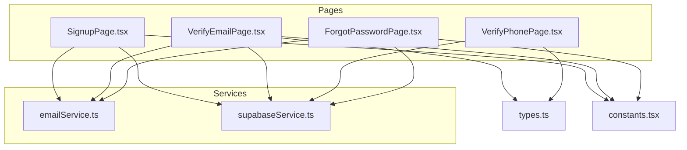
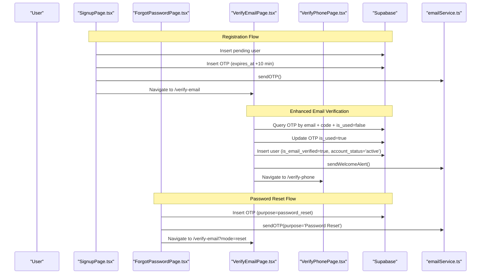
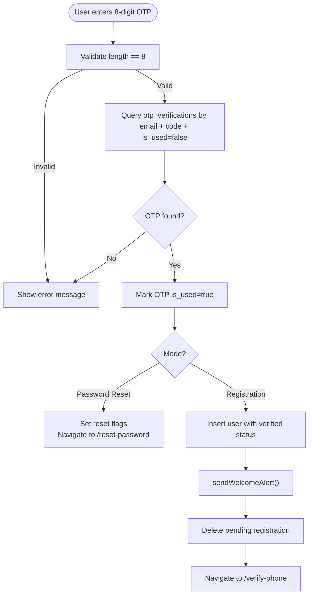
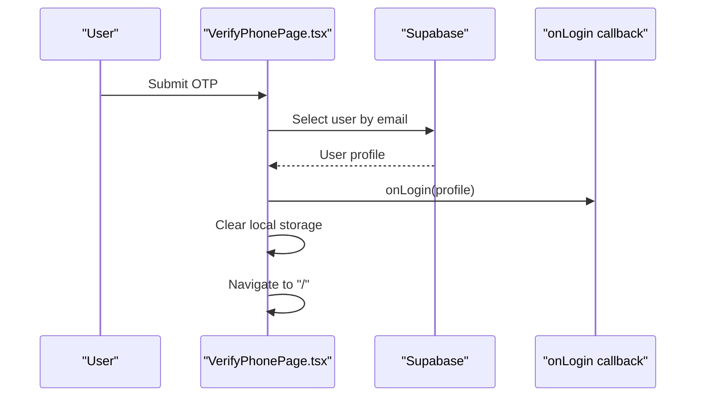
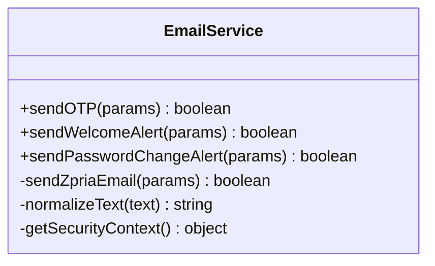
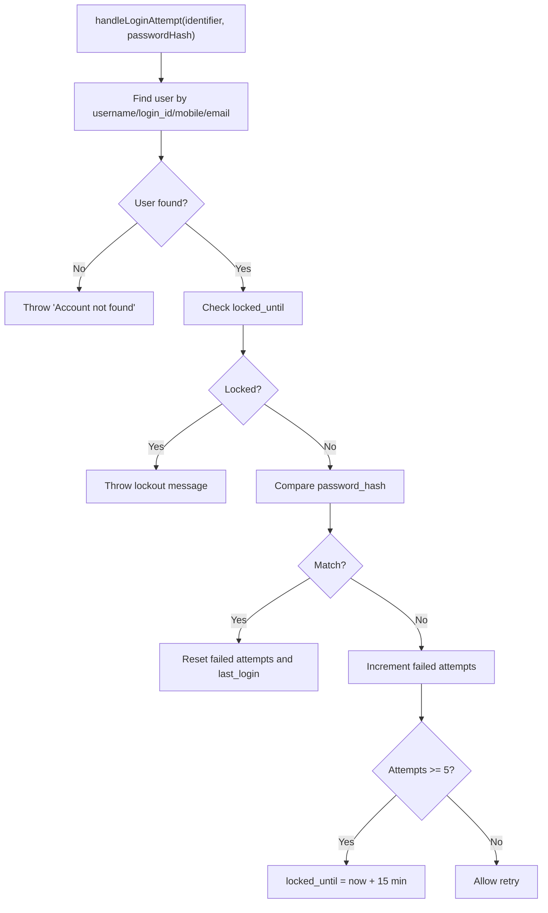
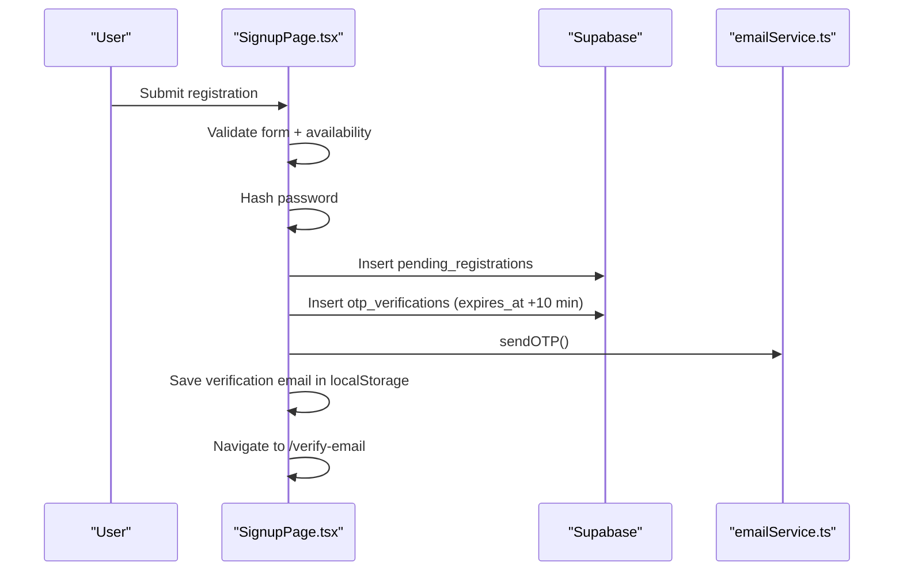
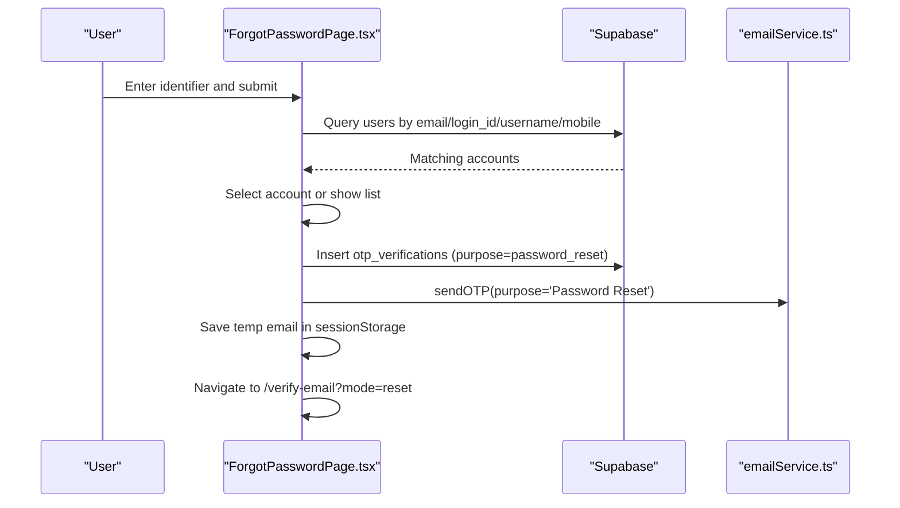
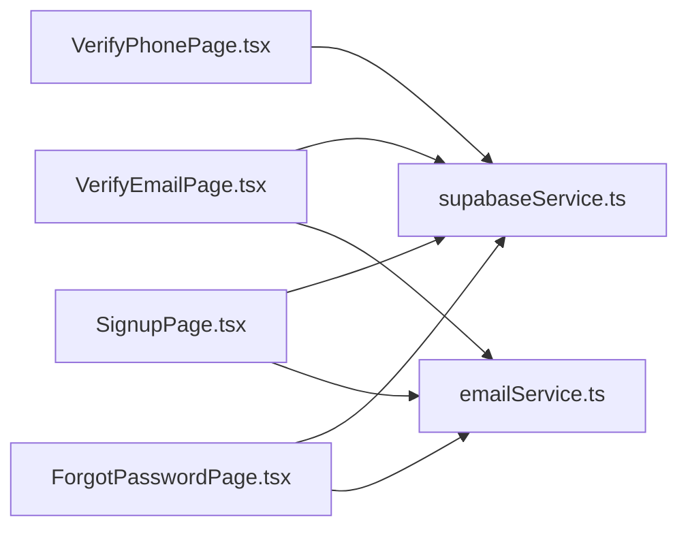

# Email and Phone Verification

<cite>
**Referenced Files in This Document**
- [VerifyEmailPage.tsx](file://pages/VerifyEmailPage.tsx)
- [VerifyPhonePage.tsx](file://pages/VerifyPhonePage.tsx)
- [emailService.ts](file://services/emailService.ts)
- [supabaseService.ts](file://services/supabaseService.ts)
- [SignupPage.tsx](file://pages/SignupPage.tsx)
- [ForgotPasswordPage.tsx](file://pages/ForgotPasswordPage.tsx)
- [types.ts](file://types.ts)
- [constants.tsx](file://constants.tsx)
</cite>

## Update Summary
**Changes Made**
- Enhanced email verification process with improved error handling mechanisms
- Streamlined countdown timer implementation with better user feedback
- Improved multi-step guidance presentation in verification workflows
- Added comprehensive error state management and user experience improvements
- Enhanced security context capture with timeout handling for better performance

## Table of Contents
1. [Introduction](#introduction)
2. [Project Structure](#project-structure)
3. [Core Components](#core-components)
4. [Architecture Overview](#architecture-overview)
5. [Detailed Component Analysis](#detailed-component-analysis)
6. [Enhanced Verification Features](#enhanced-verification-features)
7. [Dependency Analysis](#dependency-analysis)
8. [Performance Considerations](#performance-considerations)
9. [Troubleshooting Guide](#troubleshooting-guide)
10. [Conclusion](#conclusion)

## Introduction
This document explains the email and phone verification systems used during registration and password reset flows. It covers OTP generation, email delivery, phone verification, and account activation. It documents the implementation of VerifyEmailPage and VerifyPhonePage components, email service integration, and user account status updates. It also addresses common verification scenarios, delivery failures, expired verifications, and troubleshooting verification issues, along with security measures such as OTP expiration, retry limits, and verification status tracking.

**Updated** Enhanced with improved error handling, streamlined countdown timers, and better multi-step guidance presentation.

## Project Structure
The verification system spans several pages and services:
- Pages: SignupPage.tsx initiates verification; VerifyEmailPage.tsx handles email verification with enhanced UI feedback; VerifyPhonePage.tsx handles phone verification; ForgotPasswordPage.tsx handles password reset verification.
- Services: emailService.ts manages email dispatch via EmailJS with improved error handling; supabaseService.ts provides Supabase client and shared utilities.
- Types and constants define user profiles and branding assets.

**Diagram sources**
- [SignupPage.tsx](file://pages/SignupPage.tsx#L1-L310)
- [VerifyEmailPage.tsx](file://pages/VerifyEmailPage.tsx#L1-L268)
- [VerifyPhonePage.tsx](file://pages/VerifyPhonePage.tsx#L1-L159)
- [ForgotPasswordPage.tsx](file://pages/ForgotPasswordPage.tsx#L1-L278)
- [emailService.ts](file://services/emailService.ts#L1-L209)
- [supabaseService.ts](file://services/supabaseService.ts#L1-L67)
- [types.ts](file://types.ts#L1-L79)
- [constants.tsx](file://constants.tsx#L1-L361)

**Section sources**
- [VerifyEmailPage.tsx](file://pages/VerifyEmailPage.tsx#L1-L268)
- [VerifyPhonePage.tsx](file://pages/VerifyPhonePage.tsx#L1-L159)
- [emailService.ts](file://services/emailService.ts#L1-L209)
- [supabaseService.ts](file://services/supabaseService.ts#L1-L67)
- [types.ts](file://types.ts#L1-L79)
- [constants.tsx](file://constants.tsx#L1-L361)

## Core Components
- VerifyEmailPage: Handles email verification with enhanced error states, improved countdown timer, and streamlined multi-step guidance presentation.
- VerifyPhonePage: Handles phone verification UI and finalizes registration by logging in the user.
- emailService: Sends OTP and welcome/alert emails via EmailJS with enhanced error handling and security context capture.
- supabaseService: Provides Supabase client, password hashing, availability checks, and login attempt handling with lockout logic.
- SignupPage: Initiates registration, stores pending user data, generates and persists OTP, and triggers email delivery.
- ForgotPasswordPage: Initiates password reset, generates OTP, and triggers email delivery for password reset.

**Section sources**
- [VerifyEmailPage.tsx](file://pages/VerifyEmailPage.tsx#L1-L268)
- [VerifyPhonePage.tsx](file://pages/VerifyPhonePage.tsx#L1-L159)
- [emailService.ts](file://services/emailService.ts#L1-L209)
- [supabaseService.ts](file://services/supabaseService.ts#L1-L67)
- [SignupPage.tsx](file://pages/SignupPage.tsx#L1-L310)
- [ForgotPasswordPage.tsx](file://pages/ForgotPasswordPage.tsx#L1-L278)

## Architecture Overview
The verification architecture integrates UI pages with Supabase for persistence and EmailJS for email delivery. The flow varies slightly for registration and password reset, but both rely on OTP storage with expiration and usage tracking.

**Diagram sources**
- [SignupPage.tsx](file://pages/SignupPage.tsx#L102-L160)
- [VerifyEmailPage.tsx](file://pages/VerifyEmailPage.tsx#L112-L175)
- [VerifyPhonePage.tsx](file://pages/VerifyPhonePage.tsx#L51-L92)
- [ForgotPasswordPage.tsx](file://pages/ForgotPasswordPage.tsx#L81-L123)
- [emailService.ts](file://services/emailService.ts#L143-L162)
- [supabaseService.ts](file://services/supabaseService.ts#L1-L67)

## Detailed Component Analysis

### VerifyEmailPage Component
Responsibilities:
- Accepts 8-digit OTP input with auto-focus between digits.
- Enhanced resend timer with 60-second cooldown and improved user feedback.
- Verifies OTP against Supabase otp_verifications table.
- Supports two modes: registration and password reset.
- On success, activates user account and navigates accordingly.

Key behaviors:
- OTP generation: Random 8-digit code generated before insertion.
- Expiration: Stored with expires_at set to 10 minutes from now.
- Usage tracking: OTP marked as used after successful verification.
- Registration flow: Inserts user record with is_email_verified=true and account_status='active'; sends welcome alert; deletes pending registration; navigates to phone verification.
- Password reset flow: Sets session flags and navigates to reset-password.

**Updated** Enhanced with improved error handling, streamlined countdown timer, and better user feedback mechanisms.

**Diagram sources**
- [VerifyEmailPage.tsx](file://pages/VerifyEmailPage.tsx#L112-L175)
- [emailService.ts](file://services/emailService.ts#L167-L187)

**Section sources**
- [VerifyEmailPage.tsx](file://pages/VerifyEmailPage.tsx#L1-L268)

### VerifyPhonePage Component
Responsibilities:
- Presents phone verification UI with OTP input.
- Finalizes registration by retrieving user from Supabase and invoking onLogin callback.
- Provides UI affordances for resending via SMS and changing number (placeholders in this build).

Notes:
- In this demo build, phone verification is assumed successful; the component logs the user in directly after verifying the email and completing registration steps.

**Diagram sources**
- [VerifyPhonePage.tsx](file://pages/VerifyPhonePage.tsx#L51-L92)

**Section sources**
- [VerifyPhonePage.tsx](file://pages/VerifyPhonePage.tsx#L1-L159)

### Email Service Integration (emailService.ts)
Responsibilities:
- Sends OTP and welcome/alert emails via EmailJS.
- Normalizes text and adds security context (device info, IP, location, login time).
- Supports multiple templates and service IDs for OTP and welcome messages.
- Enhanced error handling with timeout protection for IP lookup.

Key functions:
- sendOTP: Sends OTP email with subject and purpose.
- sendWelcomeAlert: Sends welcome or login alert email depending on isNewRegistration flag.
- sendPasswordChangeAlert: Sends password change notification.

**Updated** Enhanced with improved timeout handling for security context capture to prevent blocking operations.

**Diagram sources**
- [emailService.ts](file://services/emailService.ts#L1-L209)

**Section sources**
- [emailService.ts](file://services/emailService.ts#L1-L209)

### Supabase Integration (supabaseService.ts)
Responsibilities:
- Provides Supabase client and password hashing utility.
- Availability checks for username and email across users and pending_registrations.
- Login attempt handling with retry limits and lockout logic.

Key functions:
- hashPassword: SHA-256 hashing with trimming.
- checkAvailability: Ensures uniqueness across users and pending registrations.
- handleLoginAttempt: Enforces retry limits and lockout timing.

**Diagram sources**
- [supabaseService.ts](file://services/supabaseService.ts#L26-L66)

**Section sources**
- [supabaseService.ts](file://services/supabaseService.ts#L1-L67)

### Registration Workflow (SignupPage.tsx)
Responsibilities:
- Validates form data and checks availability.
- Hashes password and constructs full mobile number.
- Stores pending user data and OTP with expiration.
- Sends OTP email and navigates to email verification.

**Diagram sources**
- [SignupPage.tsx](file://pages/SignupPage.tsx#L82-L166)
- [emailService.ts](file://services/emailService.ts#L143-L162)

**Section sources**
- [SignupPage.tsx](file://pages/SignupPage.tsx#L1-L310)

### Password Reset Workflow (ForgotPasswordPage.tsx)
Responsibilities:
- Searches for user by identifier across multiple fields.
- Generates OTP and inserts into otp_verifications with purpose=password_reset.
- Sends OTP email and navigates to email verification in reset mode.

**Diagram sources**
- [ForgotPasswordPage.tsx](file://pages/ForgotPasswordPage.tsx#L34-L123)
- [emailService.ts](file://services/emailService.ts#L143-L162)

**Section sources**
- [ForgotPasswordPage.tsx](file://pages/ForgotPasswordPage.tsx#L1-L278)

## Enhanced Verification Features

### Improved Countdown Timer System
The email verification page now features an enhanced countdown timer with better user experience:

- **Dynamic Timer State**: Uses `showTimer` and `countdown` states to control visibility and timing
- **Automatic Cleanup**: Proper interval cleanup prevents memory leaks
- **Visual Feedback**: Animated pulse effect during countdown period
- **User Guidance**: Clear messaging about resend timing and options

### Enhanced Error Handling
The verification system now includes comprehensive error handling:

- **State Management**: Dedicated `error` state for displaying validation and system errors
- **Loading States**: `isLoading` state prevents duplicate submissions during processing
- **Graceful Degradation**: Error states are displayed with clear, actionable messages
- **Animation Effects**: Shake animations provide visual feedback for error states

### Streamlined Multi-Step Guidance
The verification process now provides clearer step-by-step guidance:

- **Mode Detection**: Automatic detection of registration vs password reset modes
- **Contextual Messaging**: Different UI text and instructions based on verification type
- **Session Persistence**: Better handling of verification sessions across page reloads
- **Navigation Support**: Clear back navigation options and progress indication

**Section sources**
- [VerifyEmailPage.tsx](file://pages/VerifyEmailPage.tsx#L16-L45)
- [VerifyEmailPage.tsx](file://pages/VerifyEmailPage.tsx#L68-L110)
- [VerifyEmailPage.tsx](file://pages/VerifyEmailPage.tsx#L211-L242)

## Dependency Analysis
- VerifyEmailPage depends on:
  - Supabase for OTP verification and user creation.
  - emailService for OTP and welcome alerts.
  - Navigation and session storage for mode and state.
- VerifyPhonePage depends on:
  - Supabase for user retrieval and login callback.
  - Local storage for draft and verification email.
- emailService depends on:
  - EmailJS API for sending emails.
  - Security context capture for alerts with timeout protection.
- supabaseService provides:
  - Supabase client and shared utilities for hashing and availability checks.

**Diagram sources**
- [VerifyEmailPage.tsx](file://pages/VerifyEmailPage.tsx#L1-L268)
- [VerifyPhonePage.tsx](file://pages/VerifyPhonePage.tsx#L1-L159)
- [SignupPage.tsx](file://pages/SignupPage.tsx#L1-L310)
- [ForgotPasswordPage.tsx](file://pages/ForgotPasswordPage.tsx#L1-L278)
- [emailService.ts](file://services/emailService.ts#L1-L209)
- [supabaseService.ts](file://services/supabaseService.ts#L1-L67)

**Section sources**
- [VerifyEmailPage.tsx](file://pages/VerifyEmailPage.tsx#L1-L268)
- [VerifyPhonePage.tsx](file://pages/VerifyPhonePage.tsx#L1-L159)
- [SignupPage.tsx](file://pages/SignupPage.tsx#L1-L310)
- [ForgotPasswordPage.tsx](file://pages/ForgotPasswordPage.tsx#L1-L278)
- [emailService.ts](file://services/emailService.ts#L1-L209)
- [supabaseService.ts](file://services/supabaseService.ts#L1-L67)

## Performance Considerations
- OTP generation uses a cryptographically reasonable random number generator for 8-digit codes.
- Email dispatch uses a lightweight fetch call to EmailJS; timeouts are configured for IP lookup to avoid blocking.
- UI timers (resend cooldown) are managed with minimal re-renders using useEffect and refs.
- Supabase queries limit results to single records where possible to reduce overhead.
- **Updated** Enhanced timeout handling prevents blocking operations during security context capture.

## Troubleshooting Guide
Common issues and resolutions:
- Invalid OTP:
  - Cause: Wrong code or expired OTP.
  - Resolution: Trigger resend with 60-second cooldown; ensure OTP is not used already.
- Registration session expired:
  - Cause: Pending registration not found after verification.
  - Resolution: Re-initiate registration flow; ensure localStorage contains verification email.
- Email delivery failure:
  - Cause: EmailJS API errors or network issues.
  - Resolution: Retry resend; check serviceId and templateId; verify keys and rate limits.
- Password reset mode:
  - Cause: Missing mode parameter or temporary email in sessionStorage.
  - Resolution: Ensure navigation includes mode=reset and temp email is stored.
- Phone verification placeholder:
  - Cause: Demo mode assumes success without real SMS verification.
  - Resolution: Integrate SMS provider for production; implement actual OTP validation.
- **Updated** Enhanced error states:
  - Cause: Various validation and system errors during verification.
  - Resolution: Check error messages displayed; ensure proper loading states; verify network connectivity.

Security measures:
- OTP expiration: Stored with expires_at set to 10 minutes; verification rejects expired codes.
- OTP usage tracking: OTP marked as used after successful verification to prevent reuse.
- Verification status tracking: Users inserted with is_email_verified=true and account_status='active'.
- Login security: Supabase enforces retry limits and lockout timing to mitigate brute force attempts.
- **Updated** Timeout protection: Security context capture uses controlled timeouts to prevent blocking operations.

**Section sources**
- [VerifyEmailPage.tsx](file://pages/VerifyEmailPage.tsx#L68-L97)
- [VerifyEmailPage.tsx](file://pages/VerifyEmailPage.tsx#L107-L117)
- [VerifyEmailPage.tsx](file://pages/VerifyEmailPage.tsx#L126-L127)
- [emailService.ts](file://services/emailService.ts#L43-L69)
- [ForgotPasswordPage.tsx](file://pages/ForgotPasswordPage.tsx#L103-L104)
- [supabaseService.ts](file://services/supabaseService.ts#L57-L61)

## Conclusion
The verification system combines robust UI components with Supabase-backed OTP persistence and EmailJS-based email delivery. It supports both registration and password reset flows with clear separation of concerns, strong security defaults (expiration, usage tracking, lockout), and extensible pathways for future enhancements such as SMS verification.

**Updated** The enhanced email verification process now features improved error handling, streamlined countdown timers, and better multi-step guidance, providing users with a more intuitive and reliable verification experience while maintaining strong security measures and performance optimization.