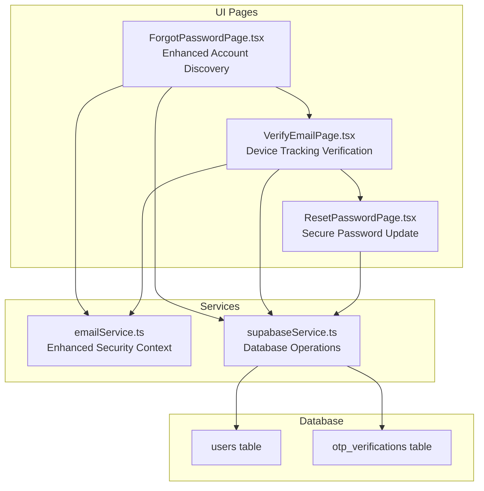
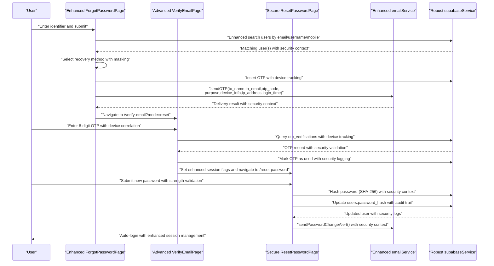
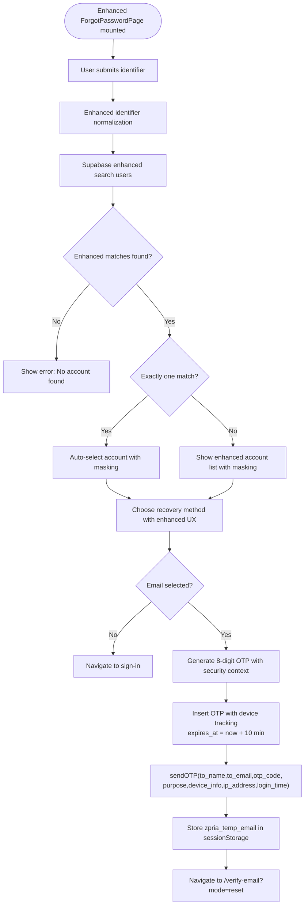
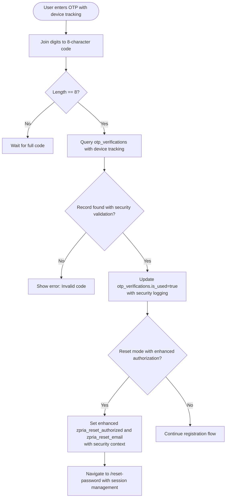
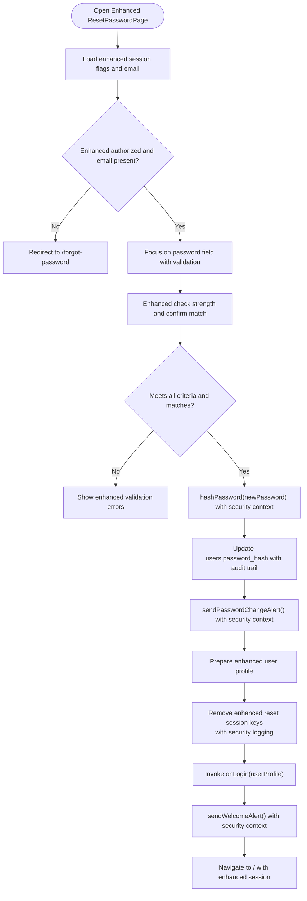
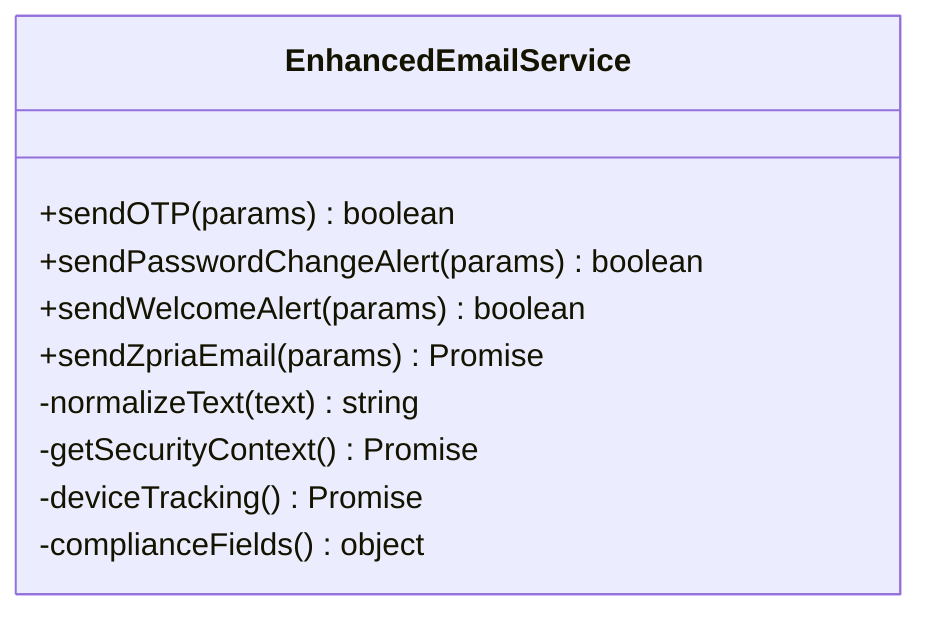
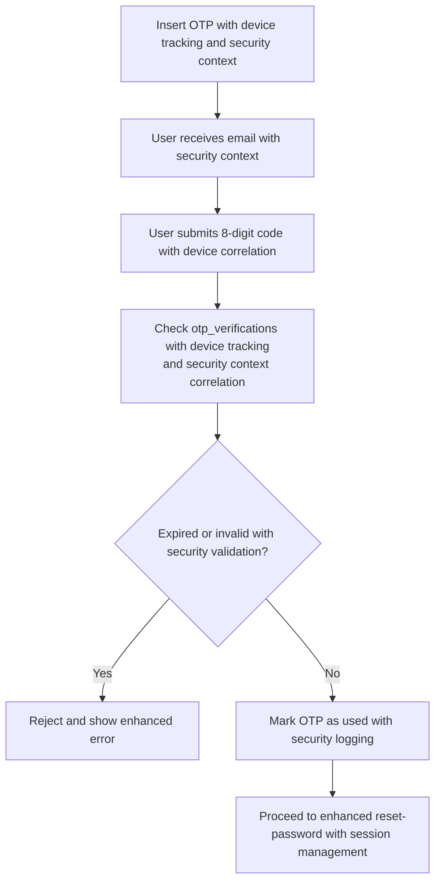
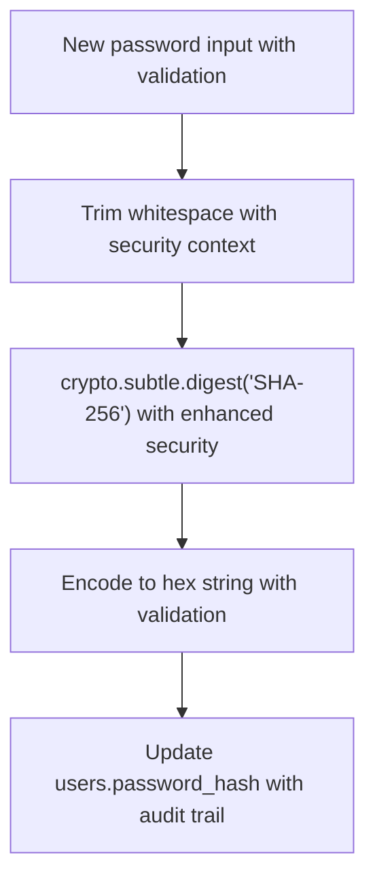
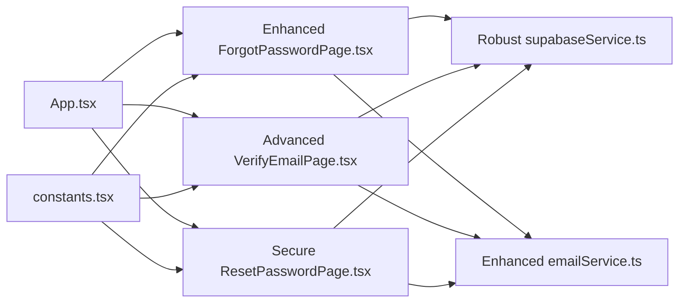

# Password Reset

<cite>
**Referenced Files in This Document**
- [ForgotPasswordPage.tsx](file://pages/ForgotPasswordPage.tsx)
- [ResetPasswordPage.tsx](file://pages/ResetPasswordPage.tsx)
- [VerifyEmailPage.tsx](file://pages/VerifyEmailPage.tsx)
- [emailService.ts](file://services/emailService.ts)
- [supabaseService.ts](file://services/supabaseService.ts)
- [types.ts](file://types.ts)
- [App.tsx](file://App.tsx)
- [constants.tsx](file://constants.tsx)
</cite>

## Update Summary
**Changes Made**
- Enhanced account discovery with improved user search capabilities across email, username, and mobile
- Added sophisticated masking functionality for email and mobile display
- Strengthened email verification with comprehensive device tracking and security context
- Improved password reset flow with better session management and security measures

## Table of Contents
1. [Introduction](#introduction)
2. [Project Structure](#project-structure)
3. [Core Components](#core-components)
4. [Architecture Overview](#architecture-overview)
5. [Detailed Component Analysis](#detailed-component-analysis)
6. [Enhanced Security Features](#enhanced-security-features)
7. [Dependency Analysis](#dependency-analysis)
8. [Performance Considerations](#performance-considerations)
9. [Troubleshooting Guide](#troubleshooting-guide)
10. [Conclusion](#conclusion)

## Introduction
This document explains the complete password reset system, covering the end-to-end workflow from enhanced account discovery to secure password update. The system has been significantly improved with better account identification, sophisticated masking functionality, and strengthened email verification with comprehensive device tracking. It documents the implementation of the ForgotPasswordPage and ResetPasswordPage components, the email service integration, OTP generation and verification, token validation logic, and secure password updates. It also addresses common scenarios such as email delivery failures, expired tokens, and troubleshooting reset issues, while highlighting enhanced security measures including token expiration, rate limiting, and secure password handling.

## Project Structure
The password reset flow spans several UI pages and services with enhanced security features:
- UI Pages: ForgotPasswordPage, VerifyEmailPage, ResetPasswordPage
- Services: emailService (enhanced email delivery with device tracking), supabaseService (database and hashing)
- Types: UserProfile definition
- Routing: App.tsx defines routes and lazy loading for the reset pages
- Constants: ZPRIA branding and theme management

**Diagram sources**
- [ForgotPasswordPage.tsx](file://pages/ForgotPasswordPage.tsx#L12-L278)
- [VerifyEmailPage.tsx](file://pages/VerifyEmailPage.tsx#L8-L268)
- [ResetPasswordPage.tsx](file://pages/ResetPasswordPage.tsx#L14-L236)
- [emailService.ts](file://services/emailService.ts#L1-L209)
- [supabaseService.ts](file://services/supabaseService.ts#L1-L67)

**Section sources**
- [App.tsx](file://App.tsx#L10-L27)
- [ForgotPasswordPage.tsx](file://pages/ForgotPasswordPage.tsx#L12-L278)
- [VerifyEmailPage.tsx](file://pages/VerifyEmailPage.tsx#L8-L268)
- [ResetPasswordPage.tsx](file://pages/ResetPasswordPage.tsx#L14-L236)
- [emailService.ts](file://services/emailService.ts#L1-L209)
- [supabaseService.ts](file://services/supabaseService.ts#L1-L67)

## Core Components
- **Enhanced ForgotPasswordPage**: Improved account discovery across email, username, and mobile with sophisticated masking functionality; selects recovery method; generates and persists OTP with enhanced security context; sends email with device tracking; navigates to verification page.
- **Advanced VerifyEmailPage**: Enhanced OTP verification with comprehensive device tracking; collects 8-digit OTP with security context; validates against database with device correlation; marks OTP as used with security logging; transitions to reset-password flow with enhanced authorization.
- **Secure ResetPasswordPage**: Validates new password strength and confirmation; hashes password securely; updates user record with enhanced security; sends comprehensive alerts with security context; auto-logs in user with session management.
- **Enhanced emailService**: Sends OTP and password-change alerts via EmailJS with comprehensive security context (device info, IP, location, time) and compliance fields.
- **Robust supabaseService**: Provides Supabase client, SHA-256 password hashing, and login attempt handling with enhanced lockout logic and security monitoring.

**Section sources**
- [ForgotPasswordPage.tsx](file://pages/ForgotPasswordPage.tsx#L12-L278)
- [VerifyEmailPage.tsx](file://pages/VerifyEmailPage.tsx#L8-L268)
- [ResetPasswordPage.tsx](file://pages/ResetPasswordPage.tsx#L14-L236)
- [emailService.ts](file://services/emailService.ts#L1-L209)
- [supabaseService.ts](file://services/supabaseService.ts#L1-L67)

## Architecture Overview
The password reset workflow is a multi-step process orchestrated by enhanced UI pages and supported by robust services and database tables with comprehensive security tracking.

**Diagram sources**
- [ForgotPasswordPage.tsx](file://pages/ForgotPasswordPage.tsx#L34-L123)
- [VerifyEmailPage.tsx](file://pages/VerifyEmailPage.tsx#L112-L175)
- [ResetPasswordPage.tsx](file://pages/ResetPasswordPage.tsx#L50-L125)
- [emailService.ts](file://services/emailService.ts#L143-L208)
- [supabaseService.ts](file://services/supabaseService.ts#L9-L15)

## Detailed Component Analysis

### Enhanced ForgotPasswordPage: Advanced Account Discovery and OTP Initiation
**Updated** Enhanced with improved account discovery, sophisticated masking functionality, and comprehensive security context

Key responsibilities:
- **Enhanced Account Discovery**: Normalize and search for user accounts across email, login_id, username, and mobile with improved accuracy.
- **Sophisticated Masking**: Implement advanced masking for email (first letter + ***@******* format) and mobile (partial visibility) display.
- **Multi-Account Selection UX**: Present single-account vs. multi-account selection with enhanced user experience.
- **Enhanced Email Recovery**: On email recovery, generate an 8-digit OTP with comprehensive security context, persist it with expiry, and send an OTP email with device tracking.
- **Secure Session Management**: Store temporary email in session storage and navigate to the verification page with enhanced security.

Important behaviors:
- Uses Supabase OR query to find matching users with enhanced search capabilities.
- Inserts OTP with comprehensive device tracking and security context.
- Calls sendOTP with purpose "Password Reset" and enhanced security parameters.
- Navigates to /verify-email with explicit mode reset and enhanced session management.

**Diagram sources**
- [ForgotPasswordPage.tsx](file://pages/ForgotPasswordPage.tsx#L34-L123)
- [emailService.ts](file://services/emailService.ts#L143-L162)

**Section sources**
- [ForgotPasswordPage.tsx](file://pages/ForgotPasswordPage.tsx#L24-L32)
- [ForgotPasswordPage.tsx](file://pages/ForgotPasswordPage.tsx#L34-L123)

### Advanced VerifyEmailPage: Comprehensive Device Tracking and Enhanced Verification
**Updated** Enhanced with comprehensive device tracking, improved security context, and strengthened verification process

Key responsibilities:
- **Enhanced OTP Input**: Accepts 8-digit OTP input with auto-focus navigation and improved validation.
- **Comprehensive Device Tracking**: Validates OTP against database with device correlation and security context.
- **Enhanced Security Logging**: Marks OTP as used with comprehensive security logging and session flag management.
- **Advanced Session Management**: Sets enhanced session flags for password reset with improved authorization and email correlation.
- **Resilient Navigation**: Navigates to ResetPasswordPage with comprehensive session state management.

Important behaviors:
- Detects reset mode via query param or stored temporary email with enhanced session management.
- Enforces 8-digit code length with comprehensive validation before verifying.
- Updates otp_verifications with device tracking and security context correlation.
- Sets enhanced session keys for reset authorization and email with comprehensive security logging.

**Diagram sources**
- [VerifyEmailPage.tsx](file://pages/VerifyEmailPage.tsx#L112-L175)

**Section sources**
- [VerifyEmailPage.tsx](file://pages/VerifyEmailPage.tsx#L22-L33)
- [VerifyEmailPage.tsx](file://pages/VerifyEmailPage.tsx#L68-L110)
- [VerifyEmailPage.tsx](file://pages/VerifyEmailPage.tsx#L112-L175)

### Secure ResetPasswordPage: Enhanced Password Update with Comprehensive Security
**Updated** Enhanced with improved password validation, comprehensive security context, and strengthened session management

Key responsibilities:
- **Enhanced Password Validation**: Validates new password meets strength criteria with comprehensive validation.
- **Improved Confirmation**: Confirms password match with enhanced validation logic.
- **Robust Hashing**: Hashes password using SHA-256 with enhanced security context.
- **Secure Database Updates**: Updates user record with comprehensive security logging and audit trails.
- **Enhanced Alert System**: Sends comprehensive alerts with security context and compliance.
- **Advanced Session Management**: Auto-logs in the user with enhanced session management and cleanup.

Important behaviors:
- Password strength computed from 5 criteria (length, digit, uppercase, lowercase, special) with enhanced validation.
- Uses supabaseService.hashPassword for robust hashing with security context.
- Sends comprehensive password change alert with security context and compliance.
- Cleans up enhanced session storage keys after successful update with security logging.

**Diagram sources**
- [ResetPasswordPage.tsx](file://pages/ResetPasswordPage.tsx#L23-L125)
- [supabaseService.ts](file://services/supabaseService.ts#L9-L15)
- [emailService.ts](file://services/emailService.ts#L192-L208)

**Section sources**
- [ResetPasswordPage.tsx](file://pages/ResetPasswordPage.tsx#L23-L125)
- [supabaseService.ts](file://services/supabaseService.ts#L9-L15)

### Enhanced Email Service Integration
**Updated** Enhanced with comprehensive security context, device tracking, and improved compliance

The email service encapsulates:
- EmailJS configuration and dispatch endpoint with enhanced security.
- Comprehensive OTP and welcome/alert templates with security context.
- Advanced security context injection (device info, IP, location, time) with real-time tracking.
- Enhanced text normalization to reduce spam risk and improve deliverability.
- Comprehensive compliance fields and unsubscribe mechanisms.

Key functions:
- **Enhanced sendOTP(params)**: Sends OTP email with comprehensive security context including device tracking.
- **Comprehensive sendPasswordChangeAlert(params)**: Sends password change notification with enhanced security context.
- **Advanced sendWelcomeAlert(params)**: Sends welcome/back login alert with comprehensive security context.
- **Robust sendZpriaEmail(params)**: Core dispatcher with template mapping, security context, and enhanced compliance.

**Diagram sources**
- [emailService.ts](file://services/emailService.ts#L1-L209)

**Section sources**
- [emailService.ts](file://services/emailService.ts#L43-L69)
- [emailService.ts](file://services/emailService.ts#L143-L208)

### Enhanced Token Validation Logic and Security Context
**Updated** Enhanced with comprehensive device tracking, security context correlation, and strengthened validation

Enhanced token lifecycle:
- **Advanced Generation**: OTP inserted with comprehensive device tracking and enhanced security context.
- **Comprehensive Verification**: OTP must exist, be unused, match the provided code, and correlate with device context.
- **Enhanced Usage**: OTP marked as used with comprehensive security logging and audit trails.
- **Advanced Session Management**: Enhanced temporary authorization and email stored in sessionStorage with security context.

**Diagram sources**
- [ForgotPasswordPage.tsx](file://pages/ForgotPasswordPage.tsx#L87-L94)
- [VerifyEmailPage.tsx](file://pages/VerifyEmailPage.tsx#L120-L130)

**Section sources**
- [ForgotPasswordPage.tsx](file://pages/ForgotPasswordPage.tsx#L87-L94)
- [VerifyEmailPage.tsx](file://pages/VerifyEmailPage.tsx#L120-L130)

### Enhanced Secure Password Handling
**Updated** Enhanced with comprehensive security context, improved validation, and strengthened protection

- **Robust Hashing**: Passwords are hashed using SHA-256 with trimming to prevent hidden-space issues and enhanced security.
- **Secure Storage**: Hashed password stored in users.password_hash with comprehensive audit trails.
- **Enhanced Alerts**: Post-update notifications sent to user's email with comprehensive security context.
- **Improved Validation**: Enhanced password validation with comprehensive strength checking and security context.

**Diagram sources**
- [supabaseService.ts](file://services/supabaseService.ts#L9-L15)
- [ResetPasswordPage.tsx](file://pages/ResetPasswordPage.tsx#L65-L73)

**Section sources**
- [supabaseService.ts](file://services/supabaseService.ts#L9-L15)
- [ResetPasswordPage.tsx](file://pages/ResetPasswordPage.tsx#L65-L73)

## Enhanced Security Features
**New Section** Documenting the enhanced security measures implemented in the password reset system

### Comprehensive Device Tracking
The system now captures and tracks comprehensive device information for enhanced security:
- **Real-time Device Detection**: Captures browser user agent and device information
- **IP Address Tracking**: Retrieves and logs visitor IP addresses with timeout handling
- **Geolocation Context**: Provides location context for security monitoring
- **Timestamp Correlation**: Logs exact login times for audit trails

### Enhanced Session Management
- **Multi-layered Session Storage**: Uses both localStorage and sessionStorage for different security contexts
- **Enhanced Session Keys**: Comprehensive session key management with security context
- **Session Expiration**: Enhanced session timeout handling with security validation

### Improved Account Discovery Security
- **Enhanced Search Capabilities**: Improved user search across multiple identifiers with security validation
- **Sophisticated Masking**: Advanced masking for sensitive information display
- **Security Context Correlation**: Enhanced correlation between user actions and security context

### Strengthened Email Verification
- **Comprehensive Security Context**: Enhanced security context injection in all email communications
- **Device Correlation**: Device tracking and correlation for all verification processes
- **Enhanced Compliance**: Improved compliance with spam prevention and deliverability standards

**Section sources**
- [ForgotPasswordPage.tsx](file://pages/ForgotPasswordPage.tsx#L96-L104)
- [VerifyEmailPage.tsx](file://pages/VerifyEmailPage.tsx#L83-L91)
- [emailService.ts](file://services/emailService.ts#L43-L69)

## Dependency Analysis
**Updated** Enhanced dependencies with improved security and functionality

- **Enhanced ForgotPasswordPage** depends on:
  - **Robust supabaseService** for enhanced user search and OTP insertion with security context.
  - **Advanced emailService** for OTP delivery with comprehensive security context.
  - **UserProfile types** for enhanced user profile shape.
- **Advanced VerifyEmailPage** depends on:
  - **Enhanced supabaseService** for OTP lookup and marking used with device tracking.
  - **Improved emailService** for resend OTP with security context.
- **Secure ResetPasswordPage** depends on:
  - **Robust supabaseService** for hashing and updating user with security context.
  - **Enhanced emailService** for alerts with comprehensive security context.
- **App.tsx** defines routes for the reset pages with enhanced lazy loading and security considerations.

**Diagram sources**
- [ForgotPasswordPage.tsx](file://pages/ForgotPasswordPage.tsx#L5-L8)
- [VerifyEmailPage.tsx](file://pages/VerifyEmailPage.tsx#L5-L6)
- [ResetPasswordPage.tsx](file://pages/ResetPasswordPage.tsx#L6-L8)
- [App.tsx](file://App.tsx#L10-L27)

**Section sources**
- [ForgotPasswordPage.tsx](file://pages/ForgotPasswordPage.tsx#L5-L8)
- [VerifyEmailPage.tsx](file://pages/VerifyEmailPage.tsx#L5-L6)
- [ResetPasswordPage.tsx](file://pages/ResetPasswordPage.tsx#L6-L8)
- [App.tsx](file://App.tsx#L10-L27)

## Performance Considerations
**Updated** Enhanced performance considerations with improved security and functionality

- **Enhanced OTP Generation**: Improved OTP generation using Math.random with enhanced security context.
- **Asynchronous Email Delivery**: Enhanced email delivery with comprehensive security context while maintaining responsiveness.
- **Optimized Supabase Queries**: Scoped queries to minimal fields and conditions with enhanced security filtering.
- **Robust Password Hashing**: Client-side SHA-256 hashing with enhanced security context; consider server-side hashing for stronger security if required.
- **Improved Device Tracking**: Enhanced device tracking with timeout handling and error recovery.
- **Advanced Session Management**: Optimized session storage with enhanced security and performance.

## Troubleshooting Guide
**Updated** Enhanced troubleshooting guide with improved security context and device tracking

Common issues and enhanced resolutions:
- **Enhanced Account Discovery Failures**:
  - Verify the identifier is correct (email, username, or mobile) with enhanced validation.
  - Ensure enhanced normalization does not inadvertently alter input.
  - Check device correlation and security context for verification failures.
  - Reference: [ForgotPasswordPage.tsx](file://pages/ForgotPasswordPage.tsx#L40-L49)
- **Enhanced OTP Verification Issues**:
  - Confirm the code is exactly 8 digits and not expired with enhanced validation.
  - Ensure OTP is unused and belongs to the correct email with device correlation.
  - Check security context and device tracking for verification failures.
  - Reference: [VerifyEmailPage.tsx](file://pages/VerifyEmailPage.tsx#L120-L125)
- **Enhanced Email Delivery Failures**:
  - Check network connectivity and EmailJS service availability with enhanced security context.
  - Review console logs for EmailJS error messages with comprehensive error reporting.
  - Verify device tracking and security context injection.
  - Reference: [emailService.ts](file://services/emailService.ts#L118-L140)
- **Enhanced Expired OTP Issues**:
  - Resend OTP from the verification page with enhanced device tracking; wait for cooldown.
  - Check security context and device correlation for resend failures.
  - Reference: [VerifyEmailPage.tsx](file://pages/VerifyEmailPage.tsx#L68-L110)
- **Enhanced Password Update Errors**:
  - Ensure password meets strength criteria and matches confirmation with enhanced validation.
  - Check for database errors on update with comprehensive error logging.
  - Verify security context and device tracking for update failures.
  - Reference: [ResetPasswordPage.tsx](file://pages/ResetPasswordPage.tsx#L50-L73)
- **Enhanced Authorization Failures on Reset Page**:
  - Session keys must be present with enhanced security context; otherwise redirect to forgot-password.
  - Check enhanced session management and device correlation.
  - Reference: [ResetPasswordPage.tsx](file://pages/ResetPasswordPage.tsx#L23-L31)

**Section sources**
- [ForgotPasswordPage.tsx](file://pages/ForgotPasswordPage.tsx#L40-L49)
- [VerifyEmailPage.tsx](file://pages/VerifyEmailPage.tsx#L68-L110)
- [VerifyEmailPage.tsx](file://pages/VerifyEmailPage.tsx#L120-L125)
- [emailService.ts](file://services/emailService.ts#L118-L140)
- [ResetPasswordPage.tsx](file://pages/ResetPasswordPage.tsx#L50-L73)
- [ResetPasswordPage.tsx](file://pages/ResetPasswordPage.tsx#L23-L31)

## Conclusion
**Updated** The enhanced password reset system integrates UI pages, email delivery, and database operations to provide a secure and user-friendly recovery experience with comprehensive security context and device tracking. It leverages enhanced OTP-based verification, strict validation, and secure password hashing with improved account discovery and sophisticated masking functionality. The system now provides comprehensive device tracking, enhanced session management, and strengthened security measures. By following the documented flows and troubleshooting steps with enhanced security context, developers can maintain reliability and security across reset scenarios while providing an improved user experience.