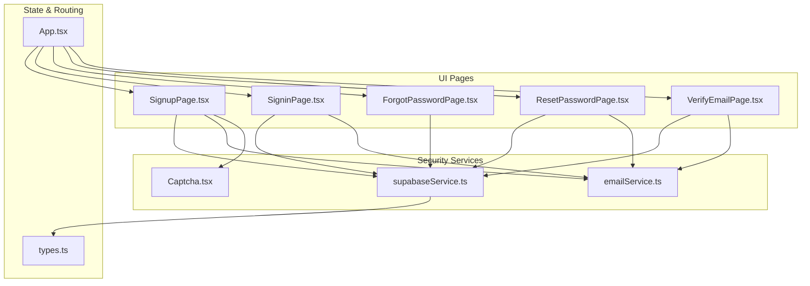
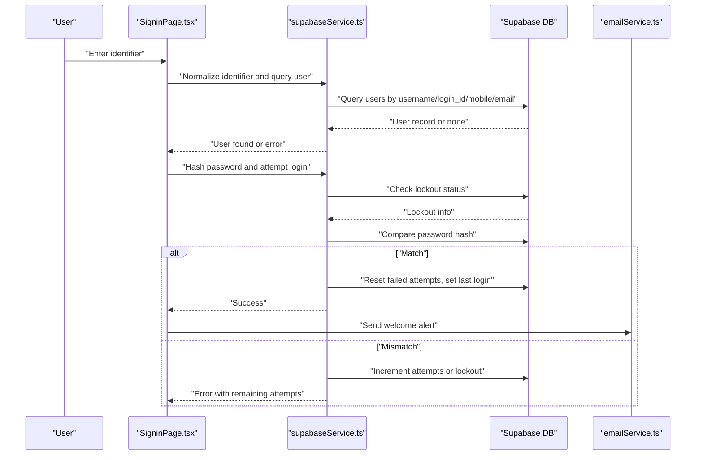
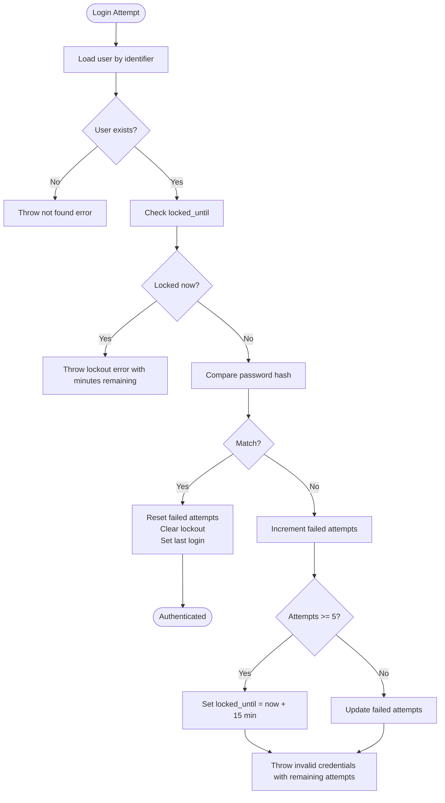
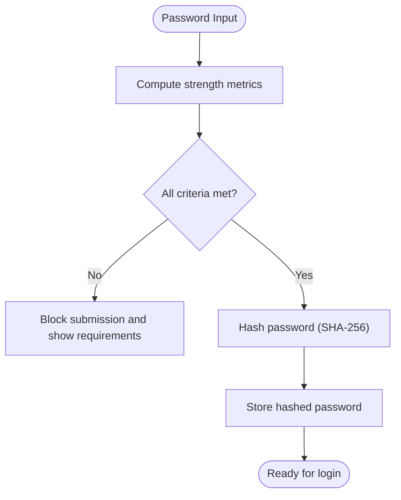
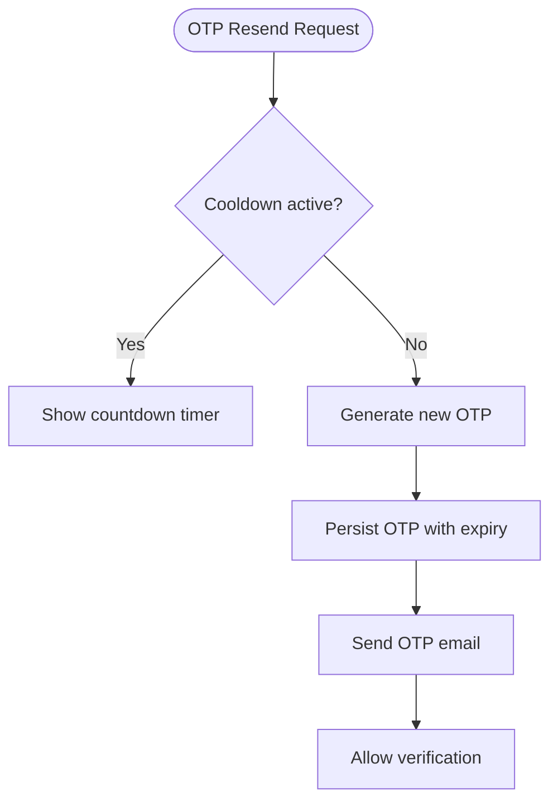
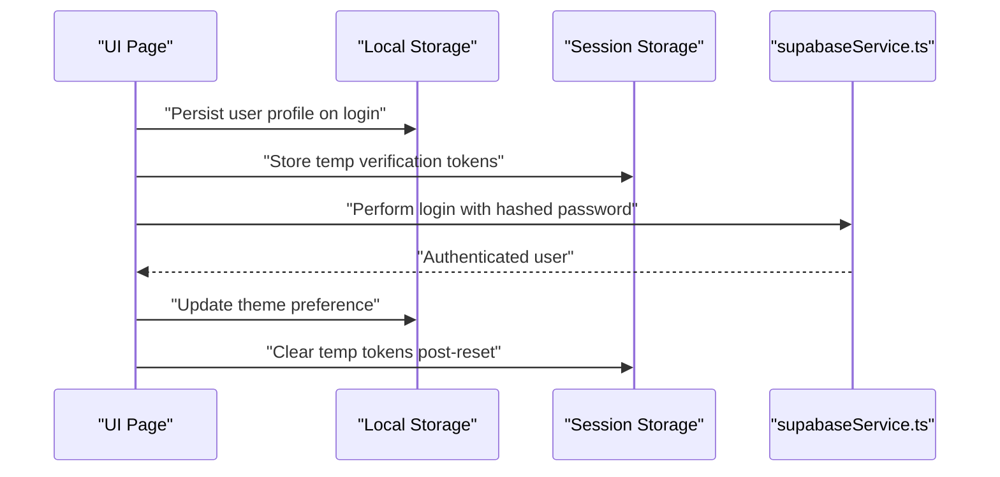
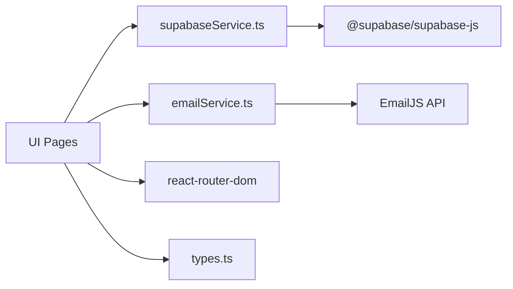

# Security Measures

<cite>
**Referenced Files in This Document**
- [supabaseService.ts](file://services/supabaseService.ts)
- [SigninPage.tsx](file://pages/SigninPage.tsx)
- [SignupPage.tsx](file://pages/SignupPage.tsx)
- [ForgotPasswordPage.tsx](file://pages/ForgotPasswordPage.tsx)
- [ResetPasswordPage.tsx](file://pages/ResetPasswordPage.tsx)
- [VerifyEmailPage.tsx](file://pages/VerifyEmailPage.tsx)
- [emailService.ts](file://services/emailService.ts)
- [App.tsx](file://App.tsx)
- [Captcha.tsx](file://components/Captcha.tsx)
- [types.ts](file://types.ts)
- [package.json](file://package.json)
</cite>

## Table of Contents
1. [Introduction](#introduction)
2. [Project Structure](#project-structure)
3. [Core Components](#core-components)
4. [Architecture Overview](#architecture-overview)
5. [Detailed Component Analysis](#detailed-component-analysis)
6. [Dependency Analysis](#dependency-analysis)
7. [Performance Considerations](#performance-considerations)
8. [Troubleshooting Guide](#troubleshooting-guide)
9. [Conclusion](#conclusion)
10. [Appendices](#appendices)

## Introduction
This document details the authentication security measures implemented in the application. It covers account lockout protection, password security requirements, rate limiting, and session security features. It explains how failed login attempts are tracked, lockout thresholds are enforced, password hashing is performed, and secure credential handling is achieved. It also outlines best practices, threat mitigation strategies, and troubleshooting steps for security-related issues. Finally, it documents integrations with Supabase security features and alignment with authentication security standards.

## Project Structure
The authentication flow spans UI pages, a Supabase service module, and an email service. Key files include:
- Authentication UI pages: Signin, Signup, Forgot Password, Reset Password, Verify Email
- Security service: Supabase client initialization, password hashing, login attempt handling, availability checks
- Email service: OTP delivery and security alerts
- Session management: Local/session storage for user state and verification sessions
- Captcha component: Human verification during signup

**Diagram sources**
- [supabaseService.ts](file://services/supabaseService.ts#L1-L67)
- [SigninPage.tsx](file://pages/SigninPage.tsx#L1-L231)
- [SignupPage.tsx](file://pages/SignupPage.tsx#L1-L293)
- [ForgotPasswordPage.tsx](file://pages/ForgotPasswordPage.tsx#L1-L265)
- [ResetPasswordPage.tsx](file://pages/ResetPasswordPage.tsx#L1-L236)
- [VerifyEmailPage.tsx](file://pages/VerifyEmailPage.tsx#L1-L255)
- [emailService.ts](file://services/emailService.ts#L1-L194)
- [App.tsx](file://App.tsx#L218-L279)
- [Captcha.tsx](file://components/Captcha.tsx#L1-L117)
- [types.ts](file://types.ts#L11-L31)

**Section sources**
- [supabaseService.ts](file://services/supabaseService.ts#L1-L67)
- [SigninPage.tsx](file://pages/SigninPage.tsx#L1-L231)
- [SignupPage.tsx](file://pages/SignupPage.tsx#L1-L293)
- [ForgotPasswordPage.tsx](file://pages/ForgotPasswordPage.tsx#L1-L265)
- [ResetPasswordPage.tsx](file://pages/ResetPasswordPage.tsx#L1-L236)
- [VerifyEmailPage.tsx](file://pages/VerifyEmailPage.tsx#L1-L255)
- [emailService.ts](file://services/emailService.ts#L1-L194)
- [App.tsx](file://App.tsx#L218-L279)
- [Captcha.tsx](file://components/Captcha.tsx#L1-L117)
- [types.ts](file://types.ts#L11-L31)

## Core Components
- Supabase service: Initializes Supabase client, provides password hashing, availability checks, and login attempt handling with lockout enforcement.
- Authentication pages: Implement user-facing flows for sign-in, sign-up, forgot password, reset password, and email verification.
- Email service: Sends OTPs and security alerts with contextual metadata.
- Session management: Uses local/session storage for user profile persistence and temporary verification states.
- Captcha: Adds human verification to reduce automated abuse during registration.

**Section sources**
- [supabaseService.ts](file://services/supabaseService.ts#L1-L67)
- [SigninPage.tsx](file://pages/SigninPage.tsx#L1-L231)
- [SignupPage.tsx](file://pages/SignupPage.tsx#L1-L293)
- [ForgotPasswordPage.tsx](file://pages/ForgotPasswordPage.tsx#L1-L265)
- [ResetPasswordPage.tsx](file://pages/ResetPasswordPage.tsx#L1-L236)
- [VerifyEmailPage.tsx](file://pages/VerifyEmailPage.tsx#L1-L255)
- [emailService.ts](file://services/emailService.ts#L1-L194)
- [App.tsx](file://App.tsx#L218-L279)
- [Captcha.tsx](file://components/Captcha.tsx#L1-L117)

## Architecture Overview
The authentication architecture integrates UI pages with Supabase for identity and verification, and with an email service for OTP delivery and alerts. Supabase handles database operations, including storing hashed passwords, tracking failed attempts, enforcing lockouts, and managing pending registrations.

**Diagram sources**
- [SigninPage.tsx](file://pages/SigninPage.tsx#L23-L95)
- [supabaseService.ts](file://services/supabaseService.ts#L26-L66)
- [emailService.ts](file://services/emailService.ts#L152-L172)

## Detailed Component Analysis

### Account Lockout Protection Mechanisms
- Tracking failed login attempts: The service increments a counter per failed attempt and stores it in the user record.
- Lockout threshold: After five consecutive failures, the account is locked for 15 minutes, indicated by a locked_until timestamp.
- Lockout enforcement: Before validating credentials, the system checks locked_until; if present and in the future, login is blocked with a countdown message.
- Reset on success: On successful authentication, failed attempts are reset, lockout cleared, and last_login updated.

**Diagram sources**
- [supabaseService.ts](file://services/supabaseService.ts#L26-L66)

**Section sources**
- [supabaseService.ts](file://services/supabaseService.ts#L26-L66)

### Password Security Requirements
- Client-side strength feedback: The signup and reset password pages compute and display password strength metrics, ensuring at least eight characters, one number, one uppercase, one lowercase, and one special character.
- Server-side hashing: Passwords are hashed using SHA-256 before being stored. The hashing trims whitespace to prevent hidden-space issues.
- Password reset flow: Enforces the same strength criteria before allowing updates.

**Diagram sources**
- [SignupPage.tsx](file://pages/SignupPage.tsx#L51-L62)
- [ResetPasswordPage.tsx](file://pages/ResetPasswordPage.tsx#L33-L48)
- [supabaseService.ts](file://services/supabaseService.ts#L9-L15)

**Section sources**
- [SignupPage.tsx](file://pages/SignupPage.tsx#L51-L62)
- [ResetPasswordPage.tsx](file://pages/ResetPasswordPage.tsx#L33-L48)
- [supabaseService.ts](file://services/supabaseService.ts#L9-L15)

### Rate Limiting
- Database-level throttling: Supabase enforces row-level constraints and queries for availability checks and OTP verification. While explicit HTTP rate limits are not implemented in the frontend, database constraints and query patterns naturally limit brute-force attempts.
- OTP resend cooldown: The verification page implements a 60-second resend timer to mitigate OTP flooding.
- Human verification: The Captcha component requires human interaction during registration to reduce automated bot submissions.

**Diagram sources**
- [VerifyEmailPage.tsx](file://pages/VerifyEmailPage.tsx#L63-L97)
- [emailService.ts](file://services/emailService.ts#L139-L147)

**Section sources**
- [VerifyEmailPage.tsx](file://pages/VerifyEmailPage.tsx#L63-L97)
- [Captcha.tsx](file://components/Captcha.tsx#L14-L27)

### Session Security Features
- Local/session storage: The app persists user profile in local storage and uses session storage for temporary verification states (e.g., reset authorization and email).
- Secure credential handling: Passwords are hashed client-side before transmission and stored server-side as hashes. The UI avoids logging sensitive data and masks identifiers in certain views.
- Email security context: Security alerts include device info, IP, location, and login time to aid user awareness and fraud detection.

**Diagram sources**
- [App.tsx](file://App.tsx#L219-L242)
- [ResetPasswordPage.tsx](file://pages/ResetPasswordPage.tsx#L102-L105)
- [VerifyEmailPage.tsx](file://pages/VerifyEmailPage.tsx#L119-L123)
- [emailService.ts](file://services/emailService.ts#L39-L65)

**Section sources**
- [App.tsx](file://App.tsx#L219-L242)
- [ResetPasswordPage.tsx](file://pages/ResetPasswordPage.tsx#L102-L105)
- [VerifyEmailPage.tsx](file://pages/VerifyEmailPage.tsx#L119-L123)
- [emailService.ts](file://services/emailService.ts#L39-L65)

### Implementation of Security Controls
- Availability checks: Ensures usernames and emails are unique across users and pending registrations.
- Identifier normalization: Lowercases and trims identifiers to reduce ambiguity and improve matching.
- Multi-field login: Supports login by username, login_id, mobile, or email to improve usability while maintaining security.
- OTP lifecycle: OTPs are inserted with expiration timestamps, marked used upon verification, and scoped to specific purposes (registration/password reset).

**Diagram sources**
- [supabaseService.ts](file://services/supabaseService.ts#L17-L24)
- [SignupPage.tsx](file://pages/SignupPage.tsx#L100-L142)
- [VerifyEmailPage.tsx](file://pages/VerifyEmailPage.tsx#L119-L156)

**Section sources**
- [supabaseService.ts](file://services/supabaseService.ts#L17-L24)
- [SignupPage.tsx](file://pages/SignupPage.tsx#L100-L142)
- [VerifyEmailPage.tsx](file://pages/VerifyEmailPage.tsx#L119-L156)

### Security Validation Logic Examples
- Failed login attempts tracking and lockout enforcement: See [supabaseService.ts](file://services/supabaseService.ts#L26-L66).
- Password strength requirements: See [SignupPage.tsx](file://pages/SignupPage.tsx#L51-L62) and [ResetPasswordPage.tsx](file://pages/ResetPasswordPage.tsx#L33-L48).
- Secure credential handling: See [supabaseService.ts](file://services/supabaseService.ts#L9-L15) and [SigninPage.tsx](file://pages/SigninPage.tsx#L60-L61).

**Section sources**
- [supabaseService.ts](file://services/supabaseService.ts#L9-L15)
- [supabaseService.ts](file://services/supabaseService.ts#L26-L66)
- [SigninPage.tsx](file://pages/SigninPage.tsx#L60-L61)
- [SignupPage.tsx](file://pages/SignupPage.tsx#L51-L62)
- [ResetPasswordPage.tsx](file://pages/ResetPasswordPage.tsx#L33-L48)

### Threat Mitigation Strategies
- Brute-force resistance: Lockout after five failed attempts with a 15-minute enforced cooldown.
- Credential stuffing prevention: Multi-field login with normalized identifiers and strict lockout enforcement.
- Replay attack prevention: OTPs are single-use, timestamped, and scoped to specific purposes.
- Bot mitigation: Human verification via Captcha during registration.
- Elevation of privilege: No client-side token persistence; authentication relies on server-side validation and secure email channels.

**Section sources**
- [supabaseService.ts](file://services/supabaseService.ts#L26-L66)
- [VerifyEmailPage.tsx](file://pages/VerifyEmailPage.tsx#L107-L117)
- [Captcha.tsx](file://components/Captcha.tsx#L14-L27)

### Compliance and Standards Alignment
- Password hashing: SHA-256 hashing aligns with cryptographic best practices for server-side hashing.
- Multi-factor-like controls: OTP-based verification and lockout policies enhance authentication assurance.
- Privacy-aware alerts: Security context in alerts supports transparency and user monitoring.
- Access control: Lockout and OTP lifecycle restrict unauthorized access attempts.

**Section sources**
- [supabaseService.ts](file://services/supabaseService.ts#L9-L15)
- [emailService.ts](file://services/emailService.ts#L39-L65)

## Dependency Analysis
The authentication stack depends on Supabase for identity and verification, EmailJS for OTP delivery, and React Router for navigation. The Supabase client is configured with a public URL and anonymous key.

**Diagram sources**
- [package.json](file://package.json#L12-L18)
- [supabaseService.ts](file://services/supabaseService.ts#L2-L7)
- [emailService.ts](file://services/emailService.ts#L114-L137)
- [App.tsx](file://App.tsx#L1-L279)

**Section sources**
- [package.json](file://package.json#L12-L18)
- [supabaseService.ts](file://services/supabaseService.ts#L2-L7)
- [emailService.ts](file://services/emailService.ts#L114-L137)
- [App.tsx](file://App.tsx#L1-L279)

## Performance Considerations
- Database queries: Queries use selective fields and normalized identifiers to minimize payload and improve response times.
- Client-side hashing: SHA-256 hashing is lightweight and fast; consider PBKDF2 or bcrypt for stronger server-side hashing if scalability and defense-in-depth are priorities.
- OTP caching: Reusing OTPs reduces redundant network calls; ensure proper cleanup and expiration.
- UI responsiveness: Debounce and throttle input events for OTP and password fields to reduce unnecessary computations.

[No sources needed since this section provides general guidance]

## Troubleshooting Guide
- Account locked errors: If a lockout message appears, wait for the countdown period before retrying. The service calculates remaining minutes and displays a message accordingly.
- Invalid credentials: On mismatch, the system increments attempts and informs the user of remaining attempts. After five failures, the account locks for 15 minutes.
- OTP issues: If OTP verification fails, confirm the code length and expiration. Use the resend button after the cooldown completes.
- Session persistence: If logged out unexpectedly, verify local/session storage entries for user profile and temporary tokens.
- Email delivery: If OTP emails fail, check EmailJS configuration and network connectivity.

**Section sources**
- [supabaseService.ts](file://services/supabaseService.ts#L39-L42)
- [supabaseService.ts](file://services/supabaseService.ts#L54-L65)
- [VerifyEmailPage.tsx](file://pages/VerifyEmailPage.tsx#L107-L117)
- [VerifyEmailPage.tsx](file://pages/VerifyEmailPage.tsx#L63-L97)
- [emailService.ts](file://services/emailService.ts#L114-L137)

## Conclusion
The application implements robust authentication security through Supabase-managed lockouts, client-side password hashing, OTP-based verification, and human verification. The UI enforces strong password requirements and provides clear feedback. Session management leverages local/session storage for safe, ephemeral state handling. Integrations with EmailJS and Supabase ensure secure, auditable operations aligned with authentication security standards.

[No sources needed since this section summarizes without analyzing specific files]

## Appendices
- Security alert templates include device info, IP, location, and login time to enhance user awareness.
- Captcha generation and verification occur client-side to deter bots during registration.

**Section sources**
- [emailService.ts](file://services/emailService.ts#L39-L65)
- [Captcha.tsx](file://components/Captcha.tsx#L14-L27)