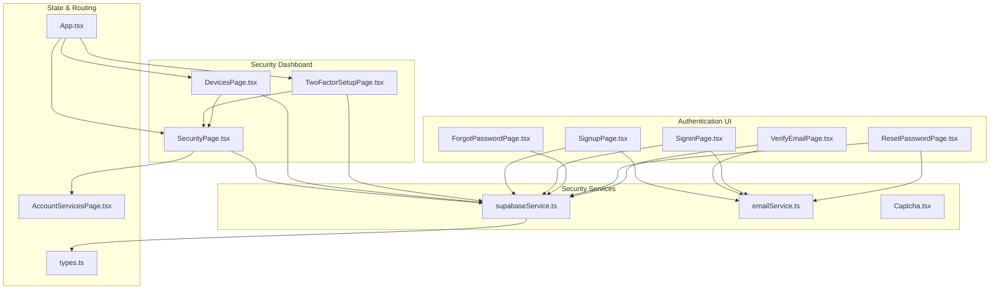
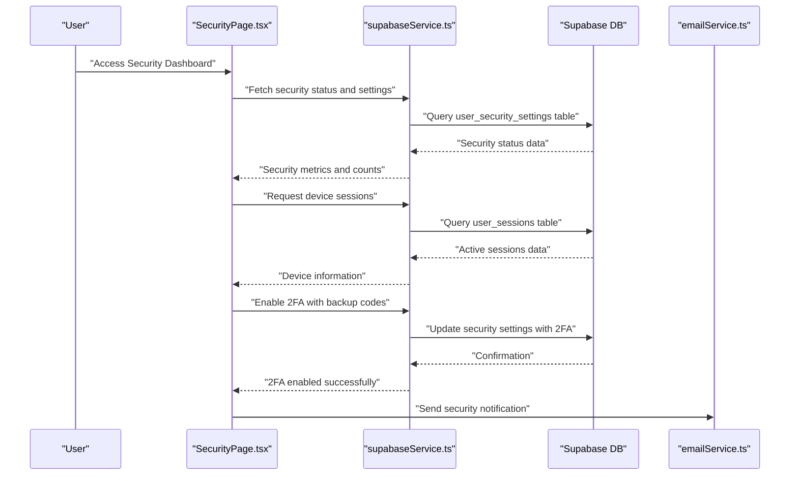
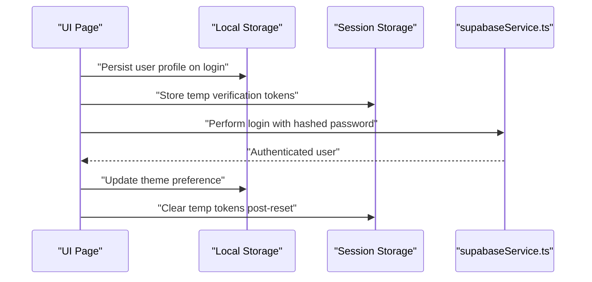
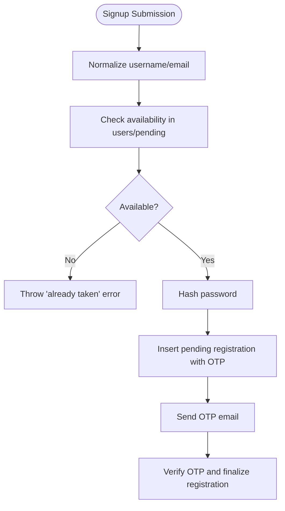
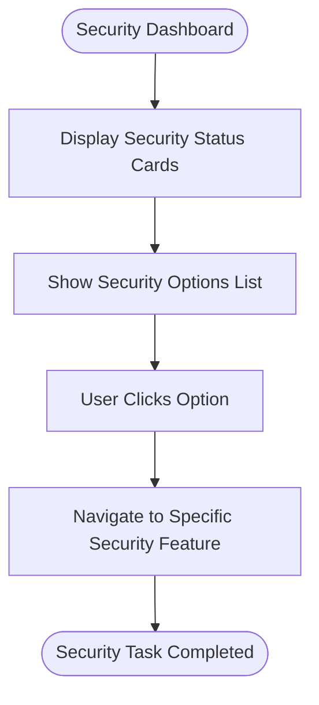
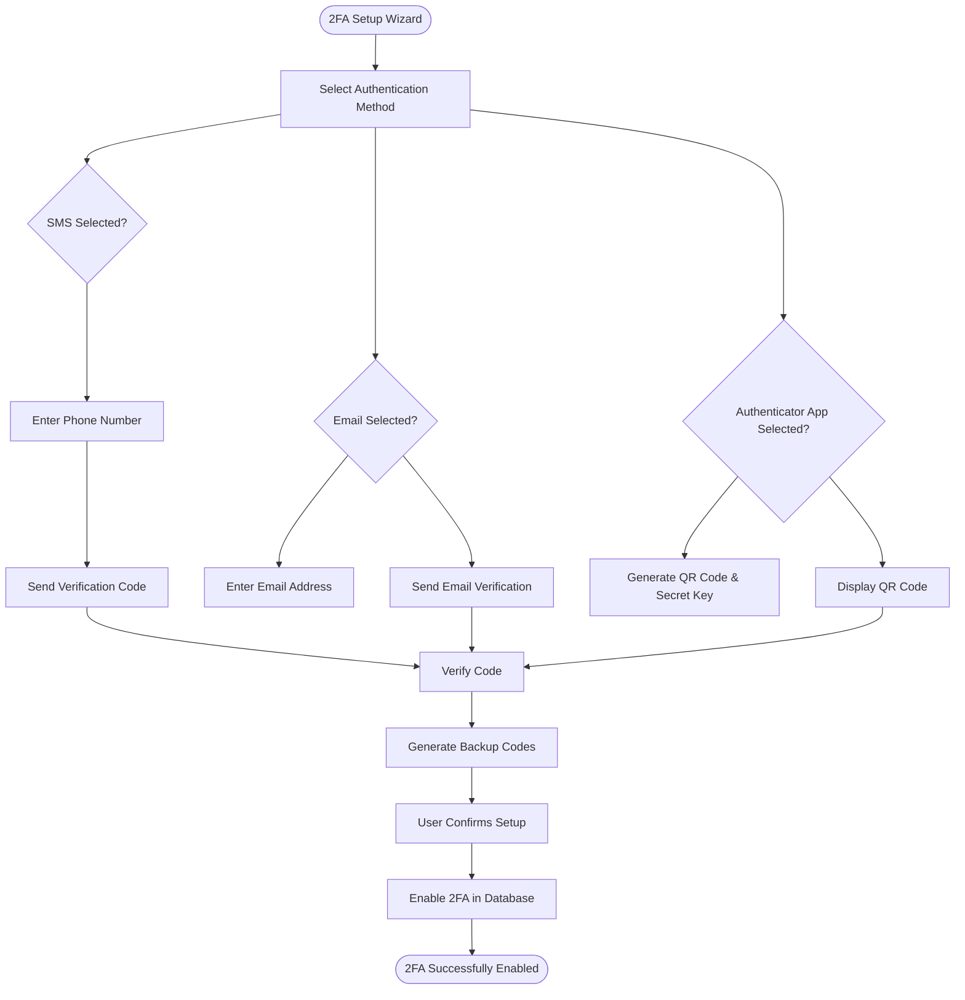
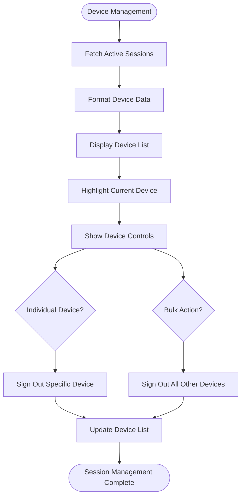
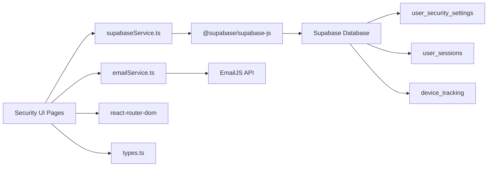

# Security Measures

<cite>
**Referenced Files in This Document**
- [supabaseService.ts](file://services/supabaseService.ts)
- [SigninPage.tsx](file://pages/SigninPage.tsx)
- [SignupPage.tsx](file://pages/SignupPage.tsx)
- [ForgotPasswordPage.tsx](file://pages/ForgotPasswordPage.tsx)
- [ResetPasswordPage.tsx](file://pages/ResetPasswordPage.tsx)
- [VerifyEmailPage.tsx](file://pages/VerifyEmailPage.tsx)
- [SecurityPage.tsx](file://pages/SecurityPage.tsx)
- [TwoFactorSetupPage.tsx](file://pages/TwoFactorSetupPage.tsx)
- [DevicesPage.tsx](file://pages/DevicesPage.tsx)
- [AccountServicesPage.tsx](file://pages/AccountServicesPage.tsx)
- [emailService.ts](file://services/emailService.ts)
- [App.tsx](file://App.tsx)
- [Captcha.tsx](file://components/Captcha.tsx)
- [types.ts](file://types.ts)
- [package.json](file://package.json)
</cite>

## Update Summary
**Changes Made**
- Added comprehensive security dashboard with real-time monitoring capabilities
- Implemented two-factor authentication setup wizard with multiple authentication methods
- Enhanced device session management with real-time tracking and trusted device management
- Integrated advanced security monitoring features including login history and security tips
- Updated authentication architecture to support enhanced security workflows

## Table of Contents
1. [Introduction](#introduction)
2. [Project Structure](#project-structure)
3. [Core Components](#core-components)
4. [Architecture Overview](#architecture-overview)
5. [Detailed Component Analysis](#detailed-component-analysis)
6. [Enhanced Security Features](#enhanced-security-features)
7. [Dependency Analysis](#dependency-analysis)
8. [Performance Considerations](#performance-considerations)
9. [Troubleshooting Guide](#troubleshooting-guide)
10. [Conclusion](#conclusion)
11. [Appendices](#appendices)

## Introduction
This document details the comprehensive authentication security measures implemented in the application. The system now features a complete security dashboard, two-factor authentication setup wizard, device session management, and enhanced security monitoring capabilities. It covers account lockout protection, password security requirements, rate limiting, session security features, real-time device tracking, trusted device management, and advanced security monitoring. The implementation includes failed login attempts tracking, lockout thresholds, password hashing, secure session handling, and comprehensive security validation logic.

## Project Structure
The authentication and security infrastructure spans UI pages, a Supabase service module, and an email service. The new security features include dedicated pages for security management, two-factor authentication setup, and device session monitoring. Key files include:
- Security dashboard: Comprehensive security overview with real-time monitoring
- Two-factor authentication: Multi-method setup wizard with SMS, email, and authenticator apps
- Device management: Real-time session tracking and device control
- Authentication UI pages: Signin, Signup, Forgot Password, Reset Password, Verify Email
- Security service: Supabase client initialization, password hashing, login attempt handling, availability checks
- Email service: OTP delivery and security alerts
- Session management: Local/session storage for user state and verification sessions
- Captcha component: Human verification during signup

**Diagram sources**
- [SecurityPage.tsx](file://pages/SecurityPage.tsx#L1-L265)
- [TwoFactorSetupPage.tsx](file://pages/TwoFactorSetupPage.tsx#L1-L348)
- [DevicesPage.tsx](file://pages/DevicesPage.tsx#L1-L354)
- [supabaseService.ts](file://services/supabaseService.ts#L1-L73)
- [SigninPage.tsx](file://pages/SigninPage.tsx#L1-L234)
- [AccountServicesPage.tsx](file://pages/AccountServicesPage.tsx#L1-L104)

**Section sources**
- [SecurityPage.tsx](file://pages/SecurityPage.tsx#L1-L265)
- [TwoFactorSetupPage.tsx](file://pages/TwoFactorSetupPage.tsx#L1-L348)
- [DevicesPage.tsx](file://pages/DevicesPage.tsx#L1-L354)
- [supabaseService.ts](file://services/supabaseService.ts#L1-L73)
- [SigninPage.tsx](file://pages/SigninPage.tsx#L1-L234)
- [AccountServicesPage.tsx](file://pages/AccountServicesPage.tsx#L1-L104)

## Core Components
- **Security dashboard**: Comprehensive security overview with real-time monitoring, security status indicators, and quick access to security features
- **Two-factor authentication setup**: Multi-method wizard supporting SMS, email, and authenticator applications with backup code generation
- **Device session management**: Real-time tracking of active sessions, device identification, location tracking, and session termination controls
- **Enhanced security monitoring**: Login history tracking, security tips, and threat detection capabilities
- **Supabase service**: Initializes Supabase client, provides password hashing, availability checks, and login attempt handling with lockout enforcement
- **Authentication pages**: Implement user-facing flows for sign-in, sign-up, forgot password, reset password, and email verification
- **Email service**: Sends OTPs and security alerts with contextual metadata
- **Session management**: Uses local/session storage for user profile persistence and temporary verification states
- **Captcha**: Adds human verification to reduce automated abuse during registration

**Section sources**
- [SecurityPage.tsx](file://pages/SecurityPage.tsx#L1-L265)
- [TwoFactorSetupPage.tsx](file://pages/TwoFactorSetupPage.tsx#L1-L348)
- [DevicesPage.tsx](file://pages/DevicesPage.tsx#L1-L354)
- [supabaseService.ts](file://services/supabaseService.ts#L1-L73)
- [SigninPage.tsx](file://pages/SigninPage.tsx#L1-L234)

## Architecture Overview
The enhanced authentication architecture integrates UI pages with Supabase for identity and verification, and with an email service for OTP delivery and alerts. The new security features include dedicated database tables for security settings, user sessions, and device tracking. Supabase handles database operations, including storing hashed passwords, tracking failed attempts, enforcing lockouts, managing pending registrations, and maintaining security audit trails.

**Diagram sources**
- [SecurityPage.tsx](file://pages/SecurityPage.tsx#L26-L52)
- [TwoFactorSetupPage.tsx](file://pages/TwoFactorSetupPage.tsx#L95-L122)
- [DevicesPage.tsx](file://pages/DevicesPage.tsx#L31-L80)

## Detailed Component Analysis

### Account Lockout Protection Mechanisms
- **Tracking failed login attempts**: The service increments a counter per failed attempt and stores it in the user record
- **Lockout threshold**: After five consecutive failures, the account is locked for 15 minutes, indicated by a locked_until timestamp
- **Lockout enforcement**: Before validating credentials, the system checks locked_until; if present and in the future, login is blocked with a countdown message
- **Reset on success**: On successful authentication, failed attempts are reset, lockout cleared, and last_login updated

**Diagram sources**
- [supabaseService.ts](file://services/supabaseService.ts#L32-L72)

**Section sources**
- [supabaseService.ts](file://services/supabaseService.ts#L32-L72)

### Password Security Requirements
- **Client-side strength feedback**: The signup and reset password pages compute and display password strength metrics, ensuring at least eight characters, one number, one uppercase, one lowercase, and one special character
- **Server-side hashing**: Passwords are hashed using SHA-256 before being stored. The hashing trims whitespace to prevent hidden-space issues
- **Password reset flow**: Enforces the same strength criteria before allowing updates

**Diagram sources**
- [SignupPage.tsx](file://pages/SignupPage.tsx#L51-L62)
- [ResetPasswordPage.tsx](file://pages/ResetPasswordPage.tsx#L33-L48)
- [supabaseService.ts](file://services/supabaseService.ts#L9-L15)

**Section sources**
- [SignupPage.tsx](file://pages/SignupPage.tsx#L51-L62)
- [ResetPasswordPage.tsx](file://pages/ResetPasswordPage.tsx#L33-L48)
- [supabaseService.ts](file://services/supabaseService.ts#L9-L15)

### Rate Limiting
- **Database-level throttling**: Supabase enforces row-level constraints and queries for availability checks and OTP verification. While explicit HTTP rate limits are not implemented in the frontend, database constraints and query patterns naturally limit brute-force attempts
- **OTP resend cooldown**: The verification page implements a 60-second resend timer to mitigate OTP flooding
- **Human verification**: The Captcha component requires human interaction during registration to reduce automated bot submissions

**Diagram sources**
- [VerifyEmailPage.tsx](file://pages/VerifyEmailPage.tsx#L63-L97)
- [emailService.ts](file://services/emailService.ts#L139-L147)

**Section sources**
- [VerifyEmailPage.tsx](file://pages/VerifyEmailPage.tsx#L63-L97)
- [Captcha.tsx](file://components/Captcha.tsx#L14-L27)

### Session Security Features
- **Local/session storage**: The app persists user profile in local storage and uses session storage for temporary verification states (e.g., reset authorization and email)
- **Secure credential handling**: Passwords are hashed client-side before transmission and stored server-side as hashes. The UI avoids logging sensitive data and masks identifiers in certain views
- **Email security context**: Security alerts include device info, IP, location, and login time to aid user awareness and fraud detection

**Diagram sources**
- [App.tsx](file://App.tsx#L234-L245)
- [ResetPasswordPage.tsx](file://pages/ResetPasswordPage.tsx#L102-L105)
- [VerifyEmailPage.tsx](file://pages/VerifyEmailPage.tsx#L119-L123)
- [emailService.ts](file://services/emailService.ts#L39-L65)

**Section sources**
- [App.tsx](file://App.tsx#L234-L245)
- [ResetPasswordPage.tsx](file://pages/ResetPasswordPage.tsx#L102-L105)
- [VerifyEmailPage.tsx](file://pages/VerifyEmailPage.tsx#L119-L123)
- [emailService.ts](file://services/emailService.ts#L39-L65)

### Implementation of Security Controls
- **Availability checks**: Ensures usernames and emails are unique across users and pending registrations
- **Identifier normalization**: Lowercases and trims identifiers to reduce ambiguity and improve matching
- **Multi-field login**: Supports login by username, login_id, mobile, or email to improve usability while maintaining security
- **OTP lifecycle**: OTPs are inserted with expiration timestamps, marked used upon verification, and scoped to specific purposes

**Diagram sources**
- [supabaseService.ts](file://services/supabaseService.ts#L17-L30)
- [SignupPage.tsx](file://pages/SignupPage.tsx#L100-L142)
- [VerifyEmailPage.tsx](file://pages/VerifyEmailPage.tsx#L119-L156)

**Section sources**
- [supabaseService.ts](file://services/supabaseService.ts#L17-L30)
- [SignupPage.tsx](file://pages/SignupPage.tsx#L100-L142)
- [VerifyEmailPage.tsx](file://pages/VerifyEmailPage.tsx#L119-L156)

### Security Validation Logic Examples
- **Failed login attempts tracking and lockout enforcement**: See [supabaseService.ts](file://services/supabaseService.ts#L32-L72)
- **Password strength requirements**: See [SignupPage.tsx](file://pages/SignupPage.tsx#L51-L62) and [ResetPasswordPage.tsx](file://pages/ResetPasswordPage.tsx#L33-L48)
- **Secure credential handling**: See [supabaseService.ts](file://services/supabaseService.ts#L9-L15) and [SigninPage.tsx](file://pages/SigninPage.tsx#L60-L61)

**Section sources**
- [supabaseService.ts](file://services/supabaseService.ts#L9-L15)
- [supabaseService.ts](file://services/supabaseService.ts#L32-L72)
- [SigninPage.tsx](file://pages/SigninPage.tsx#L60-L61)
- [SignupPage.tsx](file://pages/SignupPage.tsx#L51-L62)
- [ResetPasswordPage.tsx](file://pages/ResetPasswordPage.tsx#L33-L48)

### Threat Mitigation Strategies
- **Brute-force resistance**: Lockout after five failed attempts with a 15-minute enforced cooldown
- **Credential stuffing prevention**: Multi-field login with normalized identifiers and strict lockout enforcement
- **Replay attack prevention**: OTPs are single-use, timestamped, and scoped to specific purposes
- **Bot mitigation**: Human verification via Captcha during registration
- **Elevation of privilege**: No client-side token persistence; authentication relies on server-side validation and secure email channels

**Section sources**
- [supabaseService.ts](file://services/supabaseService.ts#L32-L72)
- [VerifyEmailPage.tsx](file://pages/VerifyEmailPage.tsx#L107-L117)
- [Captcha.tsx](file://components/Captcha.tsx#L14-L27)

### Compliance and Standards Alignment
- **Password hashing**: SHA-256 hashing aligns with cryptographic best practices for server-side hashing
- **Multi-factor-like controls**: OTP-based verification and lockout policies enhance authentication assurance
- **Privacy-aware alerts**: Security context in alerts supports transparency and user monitoring
- **Access control**: Lockout and OTP lifecycle restrict unauthorized access attempts

**Section sources**
- [supabaseService.ts](file://services/supabaseService.ts#L9-L15)
- [emailService.ts](file://services/emailService.ts#L39-L65)

## Enhanced Security Features

### Security Dashboard Implementation
The comprehensive security dashboard provides users with a centralized view of their account security status and allows them to manage various security aspects.

**Key Features:**
- **Real-time security status**: Displays 2FA status, trusted devices count, active sessions, and security recommendations
- **Quick access to security features**: Direct navigation to password management, device sessions, trusted devices, and recovery options
- **Security tips integration**: Provides actionable security recommendations based on user's current security posture
- **Visual security indicators**: Color-coded status indicators showing account protection level

**Diagram sources**
- [SecurityPage.tsx](file://pages/SecurityPage.tsx#L166-L230)

**Section sources**
- [SecurityPage.tsx](file://pages/SecurityPage.tsx#L1-L265)

### Two-Factor Authentication Setup Wizard
The comprehensive 2FA setup wizard supports multiple authentication methods and provides a guided setup experience with backup code generation.

**Supported Methods:**
- **SMS Authentication**: Phone number verification with SMS codes
- **Email Authentication**: Email-based verification codes
- **Authenticator Apps**: Time-based one-time passwords (TOTP) compatible with Google Authenticator and similar apps

**Setup Process:**
1. **Method Selection**: Users choose their preferred 2FA method
2. **Verification**: Phone number or email verification
3. **Backup Generation**: Creation of 10 unique backup codes
4. **Confirmation**: Finalization and activation of 2FA

**Diagram sources**
- [TwoFactorSetupPage.tsx](file://pages/TwoFactorSetupPage.tsx#L75-L122)

**Section sources**
- [TwoFactorSetupPage.tsx](file://pages/TwoFactorSetupPage.tsx#L1-L348)

### Device Session Management
The device management system provides real-time tracking of active sessions, device identification, and granular session control capabilities.

**Device Tracking Features:**
- **Real-time Session Monitoring**: Live tracking of all active sessions across devices
- **Device Identification**: Browser detection, operating system identification, and device type classification
- **Location Tracking**: Geolocation data for each session (where available)
- **Activity Timestamps**: Last active timestamps with human-readable relative time formatting
- **Session Control**: Individual device sign-out and bulk sign-out capabilities

**Security Features:**
- **Current Device Detection**: Clear indication of the user's current device
- **Trusted Device Management**: Ability to mark devices as trusted for reduced authentication prompts
- **Security Alerts**: Prominent warnings for unrecognized devices
- **Bulk Session Management**: One-click sign-out of all devices except the current one

**Diagram sources**
- [DevicesPage.tsx](file://pages/DevicesPage.tsx#L31-L123)

**Section sources**
- [DevicesPage.tsx](file://pages/DevicesPage.tsx#L1-L354)

### Enhanced Security Monitoring
The system includes comprehensive security monitoring capabilities with login history tracking, security tips, and threat detection features.

**Monitoring Features:**
- **Login History**: Detailed audit trail of all login activities with timestamps and device information
- **Security Recommendations**: Contextual security tips based on user's current security posture
- **Threat Detection**: Identification of suspicious login patterns and unauthorized access attempts
- **Security Status Dashboard**: Real-time visualization of account security health

**Section sources**
- [SecurityPage.tsx](file://pages/SecurityPage.tsx#L232-L255)
- [DevicesPage.tsx](file://pages/DevicesPage.tsx#L271-L282)

## Dependency Analysis
The enhanced authentication and security stack depends on Supabase for identity and verification, EmailJS for OTP delivery, and React Router for navigation. The Supabase client is configured with a public URL and anonymous key. The new security features introduce additional database dependencies for security settings, user sessions, and device tracking.

**Diagram sources**
- [package.json](file://package.json#L12-L18)
- [supabaseService.ts](file://services/supabaseService.ts#L2-L7)
- [emailService.ts](file://services/emailService.ts#L114-L137)
- [App.tsx](file://App.tsx#L28-L30)

**Section sources**
- [package.json](file://package.json#L12-L18)
- [supabaseService.ts](file://services/supabaseService.ts#L2-L7)
- [emailService.ts](file://services/emailService.ts#L114-L137)
- [App.tsx](file://App.tsx#L28-L30)

## Performance Considerations
- **Database queries**: Queries use selective fields and normalized identifiers to minimize payload and improve response times
- **Client-side hashing**: SHA-256 hashing is lightweight and fast; consider PBKDF2 or bcrypt for stronger server-side hashing if scalability and defense-in-depth are priorities
- **OTP caching**: Reusing OTPs reduces redundant network calls; ensure proper cleanup and expiration
- **UI responsiveness**: Debounce and throttle input events for OTP and password fields to reduce unnecessary computations
- **Real-time updates**: Security dashboard uses efficient polling strategies to minimize database load while maintaining real-time appearance
- **Lazy loading**: Security pages are lazy-loaded to improve initial application performance

## Troubleshooting Guide
- **Account locked errors**: If a lockout message appears, wait for the countdown period before retrying. The service calculates remaining minutes and displays a message accordingly
- **Invalid credentials**: On mismatch, the system increments attempts and informs the user of remaining attempts. After five failures, the account locks for 15 minutes
- **OTP issues**: If OTP verification fails, confirm the code length and expiration. Use the resend button after the cooldown completes
- **Session persistence**: If logged out unexpectedly, verify local/session storage entries for user profile and temporary tokens
- **Email delivery**: If OTP emails fail, check EmailJS configuration and network connectivity
- **2FA setup failures**: If 2FA setup fails, verify the selected authentication method is supported and backup codes are properly generated
- **Device session issues**: If device sessions don't appear, check database connectivity and ensure user_sessions table has proper indexing
- **Security dashboard errors**: If the security dashboard fails to load, verify user_security_settings table access and security permissions

**Section sources**
- [supabaseService.ts](file://services/supabaseService.ts#L44-L48)
- [supabaseService.ts](file://services/supabaseService.ts#L69-L71)
- [VerifyEmailPage.tsx](file://pages/VerifyEmailPage.tsx#L107-L117)
- [VerifyEmailPage.tsx](file://pages/VerifyEmailPage.tsx#L63-L97)
- [emailService.ts](file://services/emailService.ts#L114-L137)
- [TwoFactorSetupPage.tsx](file://pages/TwoFactorSetupPage.tsx#L117-L122)
- [DevicesPage.tsx](file://pages/DevicesPage.tsx#L75-L80)

## Conclusion
The application implements comprehensive authentication security through Supabase-managed lockouts, client-side password hashing, OTP-based verification, and human verification. The new security dashboard, two-factor authentication setup wizard, and device session management provide users with powerful tools for protecting their accounts. Enhanced security monitoring capabilities offer real-time visibility into account security status and potential threats. The UI enforces strong password requirements and provides clear feedback. Session management leverages local/session storage for safe, ephemeral state handling. Integrations with EmailJS and Supabase ensure secure, auditable operations aligned with authentication security standards.

## Appendices
- **Security alert templates**: Include device info, IP, location, and login time to enhance user awareness
- **Captcha generation and verification**: Occur client-side to deter bots during registration
- **Backup code generation**: 10 unique codes generated per 2FA setup for emergency access
- **Device session cleanup**: Automatic cleanup of inactive sessions to maintain database performance

**Section sources**
- [emailService.ts](file://services/emailService.ts#L39-L65)
- [Captcha.tsx](file://components/Captcha.tsx#L14-L27)
- [TwoFactorSetupPage.tsx](file://pages/TwoFactorSetupPage.tsx#L80-L87)
- [DevicesPage.tsx](file://pages/DevicesPage.tsx#L82-L123)