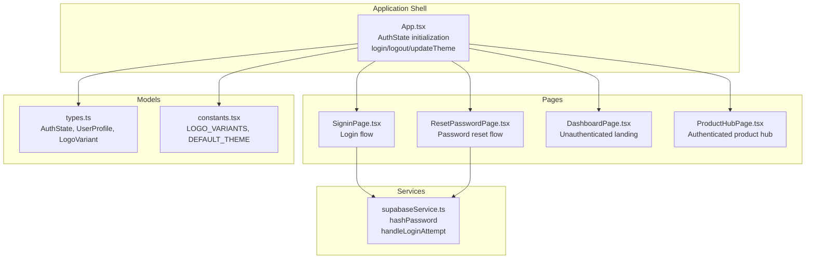
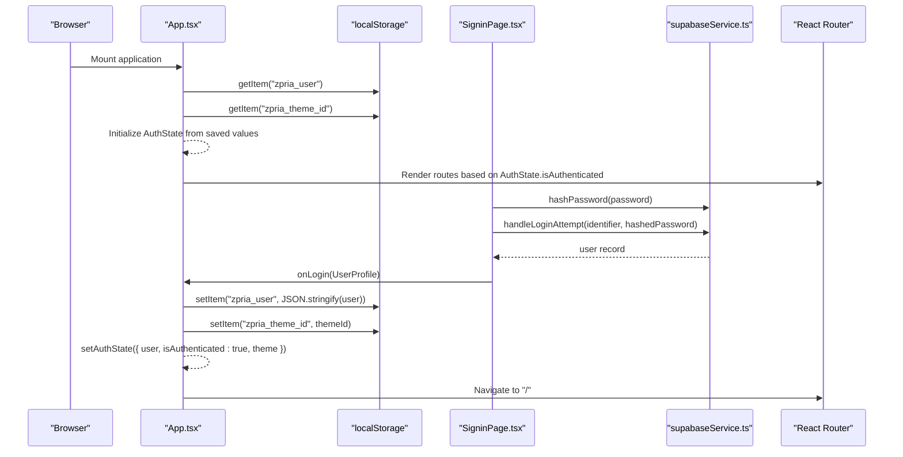
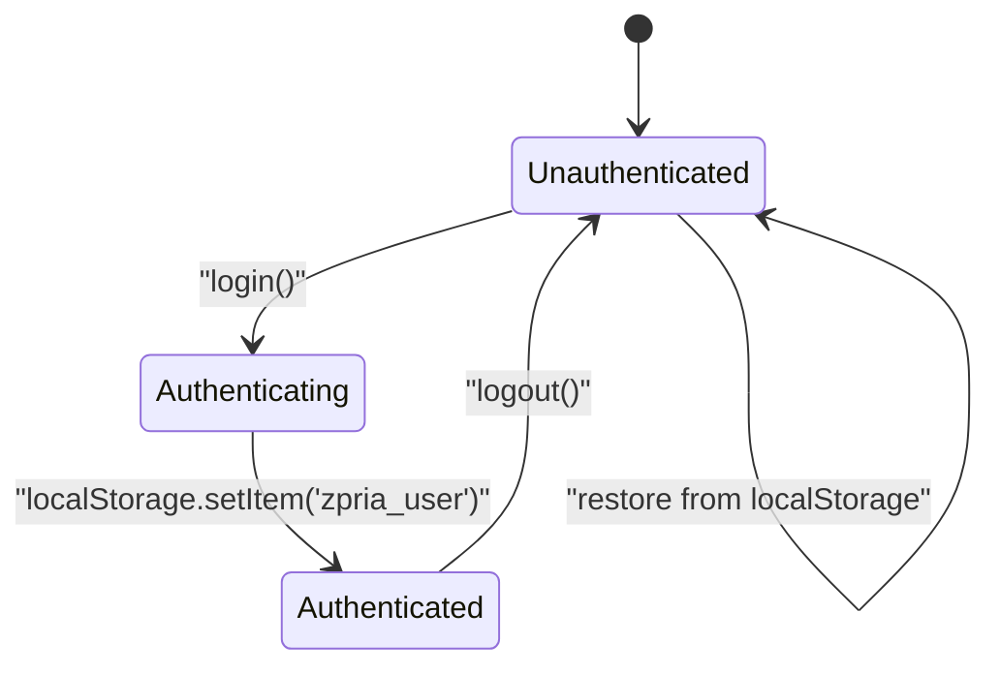
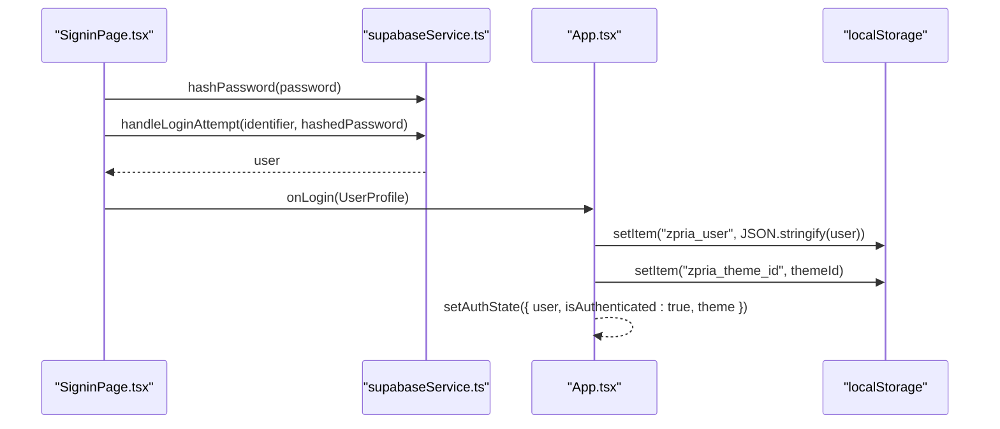
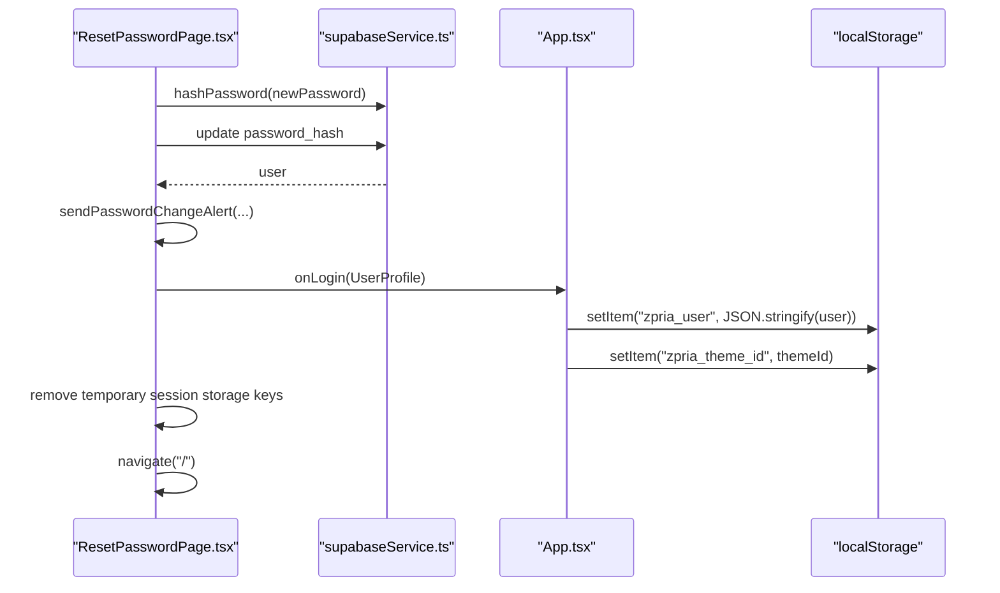
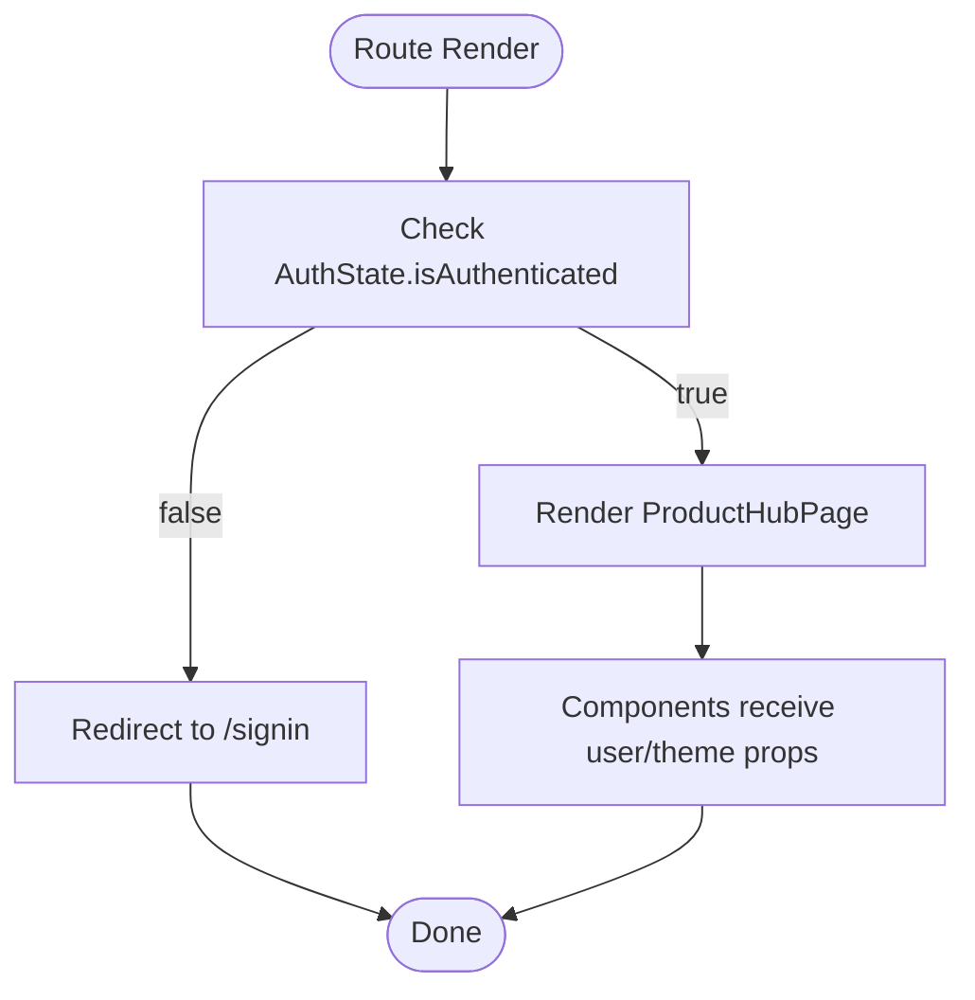
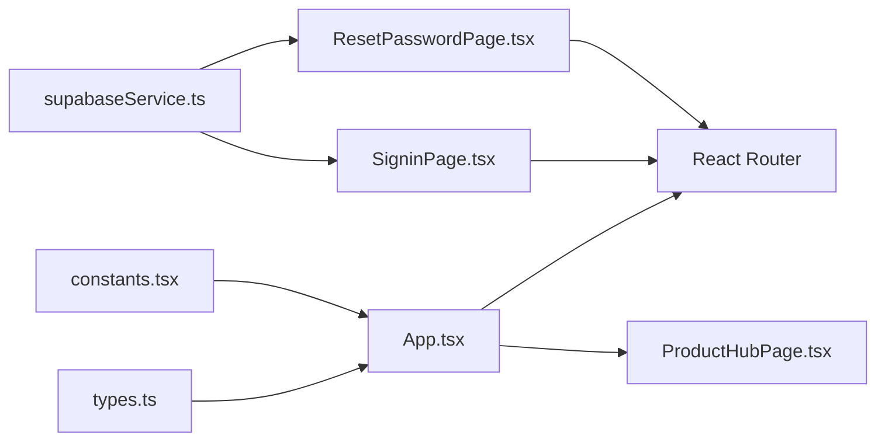

# Session Management

<cite>
**Referenced Files in This Document**
- [App.tsx](file://App.tsx)
- [types.ts](file://types.ts)
- [constants.tsx](file://constants.tsx)
- [SigninPage.tsx](file://pages/SigninPage.tsx)
- [ResetPasswordPage.tsx](file://pages/ResetPasswordPage.tsx)
- [supabaseService.ts](file://services/supabaseService.ts)
- [DashboardPage.tsx](file://pages/DashboardPage.tsx)
- [ProductHubPage.tsx](file://pages/ProductHubPage.tsx)
</cite>

## Table of Contents
1. [Introduction](#introduction)
2. [Project Structure](#project-structure)
3. [Core Components](#core-components)
4. [Architecture Overview](#architecture-overview)
5. [Detailed Component Analysis](#detailed-component-analysis)
6. [Dependency Analysis](#dependency-analysis)
7. [Performance Considerations](#performance-considerations)
8. [Troubleshooting Guide](#troubleshooting-guide)
9. [Conclusion](#conclusion)

## Introduction
This document explains the session management system that governs authentication state, user session persistence, localStorage integration, automatic login detection, and session cleanup. It covers the AuthState interface, authentication state transitions, user profile management, and theme preference persistence. It also documents localStorage operations, authentication state updates, user session restoration, logout procedures, session lifecycle management, cross-tab synchronization, and troubleshooting session-related issues. Finally, it describes how authentication state drives component re-rendering, protected route access, and user interface updates.

## Project Structure
The session management system centers around a single application shell that initializes authentication state from localStorage, exposes login/logout/updateTheme functions, and routes users to authenticated or unauthenticated views. Pages implement authentication flows and leverage Supabase for backend verification and password hashing.

**Diagram sources**
- [App.tsx](file://App.tsx#L218-L276)
- [SigninPage.tsx](file://pages/SigninPage.tsx#L1-L231)
- [ResetPasswordPage.tsx](file://pages/ResetPasswordPage.tsx#L1-L236)
- [DashboardPage.tsx](file://pages/DashboardPage.tsx#L1-L217)
- [ProductHubPage.tsx](file://pages/ProductHubPage.tsx#L1-L243)
- [supabaseService.ts](file://services/supabaseService.ts#L1-L67)
- [types.ts](file://types.ts#L27-L31)
- [constants.tsx](file://constants.tsx#L5-L25)

**Section sources**
- [App.tsx](file://App.tsx#L218-L276)
- [types.ts](file://types.ts#L27-L31)
- [constants.tsx](file://constants.tsx#L5-L25)

## Core Components
- AuthState: Holds user profile, authentication status, and theme selection.
- UserProfile: Defines the shape of persisted user data.
- LogoVariant: Defines theme variants and defaults.
- App.tsx: Initializes AuthState from localStorage, exposes login/logout/updateTheme, and renders routes.
- SigninPage.tsx: Implements login flow, password hashing, and Supabase verification.
- ResetPasswordPage.tsx: Implements password reset flow and auto-login post-reset.
- DashboardPage.tsx: Unauthenticated landing page with session-scoped intro animation.
- ProductHubPage.tsx: Protected route requiring authenticated user.

**Section sources**
- [types.ts](file://types.ts#L11-L31)
- [constants.tsx](file://constants.tsx#L5-L25)
- [App.tsx](file://App.tsx#L218-L276)
- [SigninPage.tsx](file://pages/SigninPage.tsx#L1-L231)
- [ResetPasswordPage.tsx](file://pages/ResetPasswordPage.tsx#L1-L236)
- [DashboardPage.tsx](file://pages/DashboardPage.tsx#L1-L217)
- [ProductHubPage.tsx](file://pages/ProductHubPage.tsx#L13-L46)

## Architecture Overview
The session management architecture integrates frontend state with localStorage for persistence and Supabase for authentication verification. On startup, the app restores user and theme preferences from localStorage. During login, the app persists user data and theme preference to localStorage and updates the in-memory AuthState. Logout clears localStorage and resets AuthState. Password reset flows clean up temporary session storage and auto-login the user.

**Diagram sources**
- [App.tsx](file://App.tsx#L218-L246)
- [SigninPage.tsx](file://pages/SigninPage.tsx#L53-L95)
- [supabaseService.ts](file://services/supabaseService.ts#L9-L66)

## Detailed Component Analysis

### AuthState and Authentication State Transitions
AuthState encapsulates:
- user: UserProfile or null
- isAuthenticated: boolean derived from presence of saved user
- theme: LogoVariant selected by user or default

Transitions:
- Initial load: AuthState initialized from localStorage.
- Login: Persist user and theme to localStorage; set isAuthenticated true.
- Logout: Remove user and theme from localStorage; set isAuthenticated false.

**Diagram sources**
- [App.tsx](file://App.tsx#L218-L246)
- [types.ts](file://types.ts#L27-L31)

**Section sources**
- [types.ts](file://types.ts#L27-L31)
- [App.tsx](file://App.tsx#L218-L246)

### User Profile Management and Theme Preference Persistence
UserProfile includes fields such as identifiers, contact info, verification status, themePreference, and accountStatus. Theme preference is persisted alongside user data and restored on initialization. The theme selection UI updates the in-memory theme without persisting until the user confirms a change.

Key behaviors:
- On login, themePreference is used to select the appropriate LogoVariant.
- Theme selection updates in-memory theme immediately.
- Persistent theme selection occurs via theme pages and updateTheme handler.

**Section sources**
- [types.ts](file://types.ts#L11-L25)
- [constants.tsx](file://constants.tsx#L5-L25)
- [App.tsx](file://App.tsx#L231-L246)

### Authentication State Initialization and Restoration
On mount, App.tsx reads:
- "zpria_user" from localStorage to restore user profile
- "zpria_theme_id" from localStorage to restore theme selection

It then constructs AuthState with:
- user: parsed user or null
- isAuthenticated: true if user present
- theme: LogoVariant matching saved theme id or default

This enables automatic login detection and seamless UI updates.

**Section sources**
- [App.tsx](file://App.tsx#L218-L229)
- [constants.tsx](file://constants.tsx#L5-L25)

### Login Flow and localStorage Operations
The login flow performs:
- Password hashing via Web Crypto SHA-256
- Supabase verification using normalized identifier
- UserProfile construction from database response
- Persisting user and theme preference to localStorage
- Updating AuthState to authenticated

**Diagram sources**
- [SigninPage.tsx](file://pages/SigninPage.tsx#L53-L95)
- [supabaseService.ts](file://services/supabaseService.ts#L9-L66)
- [App.tsx](file://App.tsx#L231-L236)

**Section sources**
- [SigninPage.tsx](file://pages/SigninPage.tsx#L53-L95)
- [supabaseService.ts](file://services/supabaseService.ts#L9-L66)
- [App.tsx](file://App.tsx#L231-L236)

### Logout Procedure and Cleanup
Logout removes:
- "zpria_user" from localStorage
- "zpria_theme_id" from localStorage

Then sets AuthState to:
- user: null
- isAuthenticated: false
- theme: DEFAULT_THEME

This ensures a clean slate across tabs and browser sessions.

**Section sources**
- [App.tsx](file://App.tsx#L238-L242)
- [constants.tsx](file://constants.tsx#L25)

### Password Reset Flow and Auto-login
Password reset flow:
- Validates new password strength and confirmation
- Hashes new password
- Updates user password in Supabase
- Sends password change alert
- Constructs UserProfile from database response
- Cleans up temporary session storage keys
- Calls onLogin to auto-login the user
- Navigates to home route

**Diagram sources**
- [ResetPasswordPage.tsx](file://pages/ResetPasswordPage.tsx#L50-L125)
- [supabaseService.ts](file://services/supabaseService.ts#L9-L15)
- [App.tsx](file://App.tsx#L231-L236)

**Section sources**
- [ResetPasswordPage.tsx](file://pages/ResetPasswordPage.tsx#L50-L125)
- [supabaseService.ts](file://services/supabaseService.ts#L9-L15)
- [App.tsx](file://App.tsx#L231-L236)

### Protected Route Access and Component Re-rendering
Protected routes enforce authentication:
- ProductHubPage redirects unauthenticated users to SigninPage
- Authenticated routes render based on AuthState.isAuthenticated

UI updates occur automatically when AuthState changes, causing components to re-render with updated user and theme props.

**Diagram sources**
- [ProductHubPage.tsx](file://pages/ProductHubPage.tsx#L46)
- [App.tsx](file://App.tsx#L253-L254)

**Section sources**
- [ProductHubPage.tsx](file://pages/ProductHubPage.tsx#L46)
- [App.tsx](file://App.tsx#L253-L254)

### Session Lifecycle Management and Cross-tab Synchronization
Current behavior:
- localStorage persists user and theme across tabs
- sessionStorage is used for temporary reset state during password reset
- No explicit cross-tab event synchronization is implemented

Implications:
- Changes made in one tab (login/logout/theme) are reflected in others via localStorage
- Temporary reset state is isolated to the originating tab/session

Recommendations:
- Add localStorage event listeners to synchronize state across tabs
- Debounce frequent writes to reduce contention
- Consider adding a heartbeat mechanism to detect stale sessions

**Section sources**
- [App.tsx](file://App.tsx#L220-L241)
- [ResetPasswordPage.tsx](file://pages/ResetPasswordPage.tsx#L23-L31)

### Automatic Logout on Inactivity
There is no client-side automatic logout on inactivity implemented. Consider adding:
- An idle timer that triggers logout after a configurable timeout
- Periodic token refresh or session validation against backend
- Graceful warning UI before forced logout

[No sources needed since this section provides general guidance]

### Troubleshooting Guide
Common issues and resolutions:
- User appears logged out after reload
  - Verify "zpria_user" exists in localStorage
  - Confirm AuthState initialization logic runs on mount
  - Check for localStorage quota exceeded errors

- Theme not persisting
  - Ensure "zpria_theme_id" is written on login
  - Verify theme id matches a known LogoVariant

- Login fails with invalid credentials
  - Confirm password hashing and Supabase verification
  - Check lockout logic and failed attempts

- Password reset does not auto-login
  - Ensure temporary session storage keys are cleaned up
  - Confirm onLogin is invoked with constructed UserProfile

- Protected route still shows unauthenticated
  - Verify AuthState.isAuthenticated is true
  - Check redirect logic in ProductHubPage

**Section sources**
- [App.tsx](file://App.tsx#L218-L246)
- [SigninPage.tsx](file://pages/SigninPage.tsx#L53-L95)
- [supabaseService.ts](file://services/supabaseService.ts#L26-L66)
- [ResetPasswordPage.tsx](file://pages/ResetPasswordPage.tsx#L50-L125)
- [ProductHubPage.tsx](file://pages/ProductHubPage.tsx#L46)

## Dependency Analysis
The session management system depends on:
- types.ts for AuthState and UserProfile shapes
- constants.tsx for theme variants and defaults
- supabaseService.ts for password hashing and login verification
- React Router for protected routing and navigation

**Diagram sources**
- [types.ts](file://types.ts#L27-L31)
- [constants.tsx](file://constants.tsx#L5-L25)
- [supabaseService.ts](file://services/supabaseService.ts#L1-L67)
- [App.tsx](file://App.tsx#L218-L276)
- [ProductHubPage.tsx](file://pages/ProductHubPage.tsx#L13-L46)

**Section sources**
- [types.ts](file://types.ts#L27-L31)
- [constants.tsx](file://constants.tsx#L5-L25)
- [supabaseService.ts](file://services/supabaseService.ts#L1-L67)
- [App.tsx](file://App.tsx#L218-L276)
- [ProductHubPage.tsx](file://pages/ProductHubPage.tsx#L13-L46)

## Performance Considerations
- Minimize localStorage writes: batch theme updates until confirmed
- Debounce frequent UI updates to reduce re-renders
- Avoid synchronous localStorage operations on hot paths
- Consider caching frequently accessed user data in memory

[No sources needed since this section provides general guidance]

## Conclusion
The session management system provides robust authentication state management with localStorage-backed persistence, automatic login detection, and straightforward logout procedures. It integrates tightly with Supabase for secure authentication and supports theme preference persistence. While cross-tab synchronization and automatic inactivity logout are not yet implemented, the existing architecture offers a solid foundation for extending these capabilities.