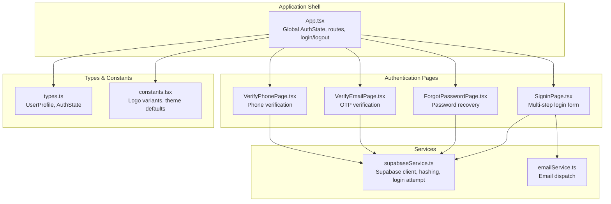
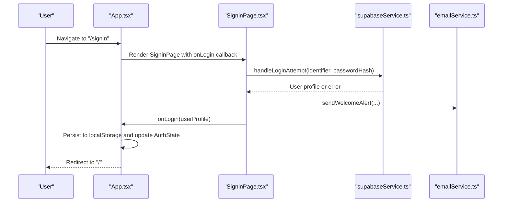
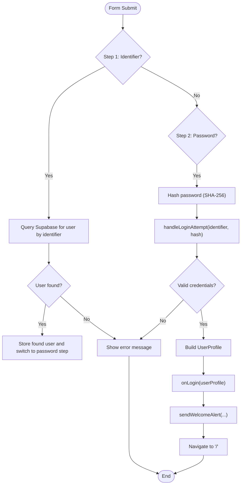
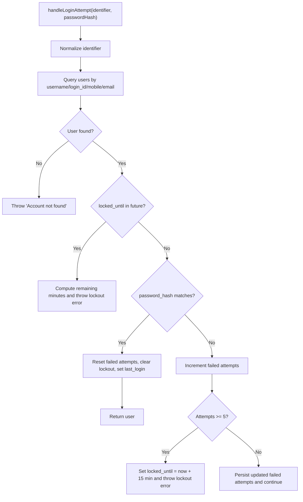
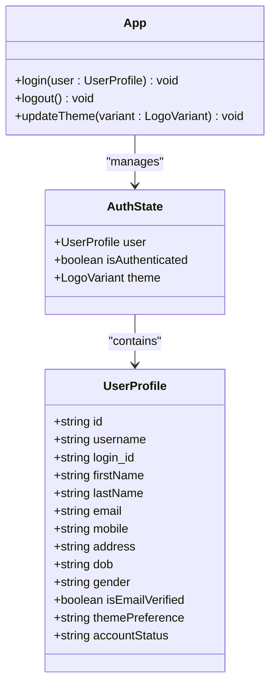
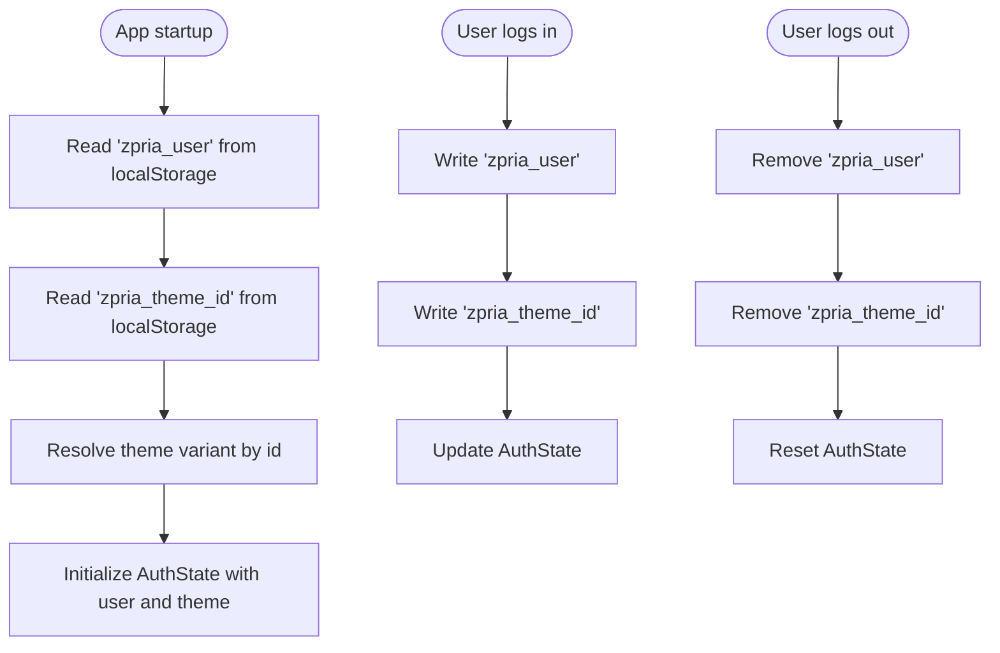
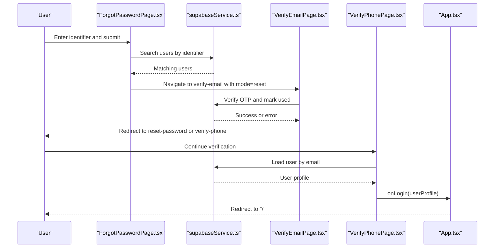
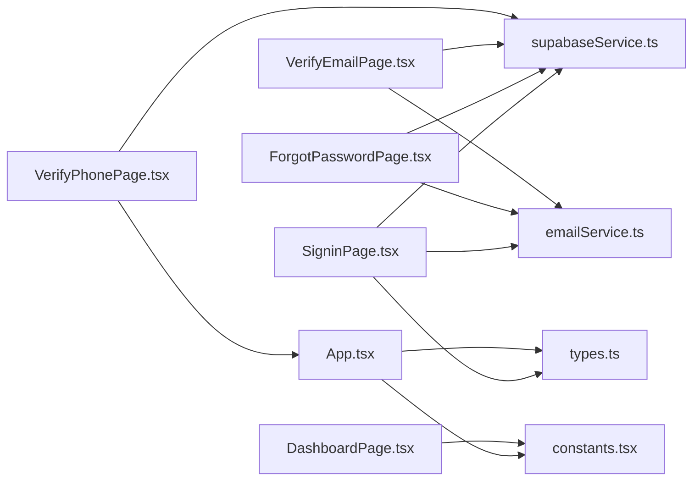

# User Login

<cite>
**Referenced Files in This Document**
- [App.tsx](file://App.tsx)
- [SigninPage.tsx](file://pages/SigninPage.tsx)
- [supabaseService.ts](file://services/supabaseService.ts)
- [types.ts](file://types.ts)
- [emailService.ts](file://services/emailService.ts)
- [ForgotPasswordPage.tsx](file://pages/ForgotPasswordPage.tsx)
- [VerifyEmailPage.tsx](file://pages/VerifyEmailPage.tsx)
- [VerifyPhonePage.tsx](file://pages/VerifyPhonePage.tsx)
- [DashboardPage.tsx](file://pages/DashboardPage.tsx)
- [constants.tsx](file://constants.tsx)
</cite>

## Table of Contents
1. [Introduction](#introduction)
2. [Project Structure](#project-structure)
3. [Core Components](#core-components)
4. [Architecture Overview](#architecture-overview)
5. [Detailed Component Analysis](#detailed-component-analysis)
6. [Dependency Analysis](#dependency-analysis)
7. [Performance Considerations](#performance-considerations)
8. [Troubleshooting Guide](#troubleshooting-guide)
9. [Conclusion](#conclusion)

## Introduction
This document explains the user login system, focusing on the authentication flow, credential validation, session establishment, and user state management. It documents the SigninPage component, form handling, error processing, and integration with Supabase authentication. It also covers the localStorage persistence mechanism that maintains user sessions across browser reloads, and details the relationship between the login process and the global authentication state managed by the application shell.

## Project Structure
The login system spans several files:
- Application shell and global state: App.tsx
- Login page and form handling: pages/SigninPage.tsx
- Authentication backend and Supabase integration: services/supabaseService.ts
- Types and interfaces: types.ts
- Email notifications: services/emailService.ts
- Password recovery and verification flows: pages/ForgotPasswordPage.tsx, pages/VerifyEmailPage.tsx, pages/VerifyPhonePage.tsx
- Dashboard and theme preferences: pages/DashboardPage.tsx, constants.tsx

**Diagram sources**
- [App.tsx](file://App.tsx#L218-L276)
- [SigninPage.tsx](file://pages/SigninPage.tsx#L1-L231)
- [supabaseService.ts](file://services/supabaseService.ts#L1-L67)
- [emailService.ts](file://services/emailService.ts#L1-L194)
- [ForgotPasswordPage.tsx](file://pages/ForgotPasswordPage.tsx#L1-L265)
- [VerifyEmailPage.tsx](file://pages/VerifyEmailPage.tsx#L1-L255)
- [VerifyPhonePage.tsx](file://pages/VerifyPhonePage.tsx#L1-L159)
- [types.ts](file://types.ts#L1-L79)
- [constants.tsx](file://constants.tsx#L1-L361)

**Section sources**
- [App.tsx](file://App.tsx#L218-L276)
- [SigninPage.tsx](file://pages/SigninPage.tsx#L1-L231)
- [supabaseService.ts](file://services/supabaseService.ts#L1-L67)
- [emailService.ts](file://services/emailService.ts#L1-L194)
- [ForgotPasswordPage.tsx](file://pages/ForgotPasswordPage.tsx#L1-L265)
- [VerifyEmailPage.tsx](file://pages/VerifyEmailPage.tsx#L1-L255)
- [VerifyPhonePage.tsx](file://pages/VerifyPhonePage.tsx#L1-L159)
- [types.ts](file://types.ts#L1-L79)
- [constants.tsx](file://constants.tsx#L1-L361)

## Core Components
- Global authentication state and session persistence:
  - App.tsx initializes AuthState from localStorage and exposes login/logout/updateTheme functions.
  - On login, user profile and theme preference are persisted to localStorage and the global state is updated.
- SigninPage:
  - Implements a two-step login flow: identifier lookup, then password submission.
  - Validates inputs, handles errors, and triggers Supabase authentication.
- Supabase integration:
  - Provides a Supabase client instance and a login attempt handler that validates credentials, enforces lockout policies, and updates user counters.
  - Includes a SHA-256 password hashing utility.
- Email notifications:
  - Sends welcome alerts and OTP emails during login and registration flows.
- Password recovery:
  - ForgotPasswordPage searches for accounts by identifier, selects among multiple matches, and sends OTP via email.
  - VerifyEmailPage verifies OTP and transitions to phone verification or reset completion.
  - VerifyPhonePage finalizes registration or auto-login after verification.

**Section sources**
- [App.tsx](file://App.tsx#L218-L247)
- [SigninPage.tsx](file://pages/SigninPage.tsx#L14-L95)
- [supabaseService.ts](file://services/supabaseService.ts#L26-L66)
- [emailService.ts](file://services/emailService.ts#L139-L172)
- [ForgotPasswordPage.tsx](file://pages/ForgotPasswordPage.tsx#L34-L110)
- [VerifyEmailPage.tsx](file://pages/VerifyEmailPage.tsx#L99-L162)
- [VerifyPhonePage.tsx](file://pages/VerifyPhonePage.tsx#L51-L97)

## Architecture Overview
The login architecture integrates UI components, Supabase authentication, and localStorage-based session persistence. The flow begins at the application shell, routes to the SigninPage, validates credentials against Supabase, persists the session, and redirects to the dashboard.

**Diagram sources**
- [App.tsx](file://App.tsx#L231-L236)
- [SigninPage.tsx](file://pages/SigninPage.tsx#L53-L95)
- [supabaseService.ts](file://services/supabaseService.ts#L26-L66)
- [emailService.ts](file://services/emailService.ts#L152-L172)

## Detailed Component Analysis

### SigninPage Component
SigninPage implements a two-step login:
- Step 1: Identifier lookup
  - Accepts username, login_id, mobile, or email.
  - Queries Supabase for a matching user record.
  - On success, stores the found user and transitions to the password step.
- Step 2: Password submission
  - Hashes the password using SHA-256.
  - Calls handleLoginAttempt to validate credentials and enforce lockout policies.
  - On success:
    - Builds a UserProfile object.
    - Invokes onLogin to persist and update global state.
    - Sends a welcome alert email.
    - Navigates to the home route.

Key behaviors:
- Form validation prevents empty submissions.
- Loading states and error messages guide the user.
- The "Remember me" checkbox is present in the UI but does not persist across reloads in this component’s state.

**Diagram sources**
- [SigninPage.tsx](file://pages/SigninPage.tsx#L23-L95)
- [supabaseService.ts](file://services/supabaseService.ts#L26-L66)
- [emailService.ts](file://services/emailService.ts#L152-L172)

**Section sources**
- [SigninPage.tsx](file://pages/SigninPage.tsx#L14-L95)

### Supabase Authentication and Lockout Logic
The handleLoginAttempt function:
- Normalizes the identifier and queries users by username, login_id, mobile, or email.
- Enforces lockout if locked_until is in the future.
- Compares the provided password hash with stored hash.
- On success:
  - Resets failed attempts, clears lockout, and records last_login.
- On failure:
  - Increments failed attempts; locks the account after 5 consecutive failures for 15 minutes.

Password hashing:
- Uses Web Crypto SHA-256 on the trimmed password string.

**Diagram sources**
- [supabaseService.ts](file://services/supabaseService.ts#L26-L66)

**Section sources**
- [supabaseService.ts](file://services/supabaseService.ts#L9-L15)
- [supabaseService.ts](file://services/supabaseService.ts#L26-L66)

### Global Authentication State Management
App.tsx manages the global AuthState:
- Initializes from localStorage on startup.
- Exposes login, logout, and theme update functions.
- Persists user profile and theme preference to localStorage on login.
- Clears localStorage and resets state on logout.

**Diagram sources**
- [App.tsx](file://App.tsx#L219-L247)
- [types.ts](file://types.ts#L11-L31)

**Section sources**
- [App.tsx](file://App.tsx#L219-L247)
- [types.ts](file://types.ts#L11-L31)

### localStorage Persistence Mechanism
- On login, the application writes:
  - "zpria_user": JSON stringified UserProfile
  - "zpria_theme_id": theme identifier derived from user’s themePreference
- On logout, both keys are removed.
- On startup, the application reads these keys to restore user session and theme.

**Diagram sources**
- [App.tsx](file://App.tsx#L219-L242)

**Section sources**
- [App.tsx](file://App.tsx#L219-L242)

### Password Recovery and Verification Flows
- ForgotPasswordPage:
  - Searches users by identifier across email, login_id, username, or mobile.
  - Presents multiple matches for selection or proceeds directly if one match.
  - Sends OTP via email and navigates to VerifyEmailPage with reset mode.
- VerifyEmailPage:
  - Verifies OTP and either finalizes password reset (redirect to reset-password) or registration (insert user into users, mark verified, delete pending registration, redirect to verify-phone).
- VerifyPhonePage:
  - Finalizes registration by loading the user from Supabase and invoking onLogin to complete the session.

**Diagram sources**
- [ForgotPasswordPage.tsx](file://pages/ForgotPasswordPage.tsx#L34-L110)
- [VerifyEmailPage.tsx](file://pages/VerifyEmailPage.tsx#L99-L162)
- [VerifyPhonePage.tsx](file://pages/VerifyPhonePage.tsx#L51-L97)
- [App.tsx](file://App.tsx#L231-L236)

**Section sources**
- [ForgotPasswordPage.tsx](file://pages/ForgotPasswordPage.tsx#L34-L110)
- [VerifyEmailPage.tsx](file://pages/VerifyEmailPage.tsx#L99-L162)
- [VerifyPhonePage.tsx](file://pages/VerifyPhonePage.tsx#L51-L97)

## Dependency Analysis
- SigninPage depends on:
  - supabaseService.ts for identifier lookup and login attempt.
  - emailService.ts for welcome alerts.
  - types.ts for UserProfile and AuthState.
- App.tsx depends on:
  - types.ts for type definitions.
  - constants.tsx for theme defaults and logo variants.
  - routes to render SigninPage and other pages.
- ForgotPasswordPage depends on:
  - supabaseService.ts for user search and OTP insertion.
  - emailService.ts for OTP delivery.
- VerifyEmailPage depends on:
  - supabaseService.ts for OTP verification and database updates.
  - emailService.ts for welcome alerts.
- VerifyPhonePage depends on:
  - supabaseService.ts for final user retrieval.
  - App.tsx onLogin callback to finalize session.

**Diagram sources**
- [SigninPage.tsx](file://pages/SigninPage.tsx#L1-L12)
- [supabaseService.ts](file://services/supabaseService.ts#L1-L7)
- [emailService.ts](file://services/emailService.ts#L1-L10)
- [types.ts](file://types.ts#L1-L31)
- [App.tsx](file://App.tsx#L1-L28)
- [ForgotPasswordPage.tsx](file://pages/ForgotPasswordPage.tsx#L1-L8)
- [VerifyEmailPage.tsx](file://pages/VerifyEmailPage.tsx#L1-L6)
- [VerifyPhonePage.tsx](file://pages/VerifyPhonePage.tsx#L1-L6)
- [DashboardPage.tsx](file://pages/DashboardPage.tsx#L1-L5)
- [constants.tsx](file://constants.tsx#L1-L25)

**Section sources**
- [SigninPage.tsx](file://pages/SigninPage.tsx#L1-L12)
- [supabaseService.ts](file://services/supabaseService.ts#L1-L7)
- [emailService.ts](file://services/emailService.ts#L1-L10)
- [types.ts](file://types.ts#L1-L31)
- [App.tsx](file://App.tsx#L1-L28)
- [ForgotPasswordPage.tsx](file://pages/ForgotPasswordPage.tsx#L1-L8)
- [VerifyEmailPage.tsx](file://pages/VerifyEmailPage.tsx#L1-L6)
- [VerifyPhonePage.tsx](file://pages/VerifyPhonePage.tsx#L1-L6)
- [DashboardPage.tsx](file://pages/DashboardPage.tsx#L1-L5)
- [constants.tsx](file://constants.tsx#L1-L25)

## Performance Considerations
- Password hashing uses Web Crypto SHA-256; ensure minimal overhead by trimming passwords before hashing.
- Supabase queries use or conditions; keep identifiers normalized to reduce ambiguity and improve performance.
- Email dispatch is asynchronous; consider caching or retry strategies for reliability.
- localStorage operations are synchronous; batch writes where possible to minimize reflows.

## Troubleshooting Guide
Common login scenarios and resolutions:
- Account not found:
  - Ensure the identifier matches username, login_id, email, or mobile.
  - Check for typos or extra spaces; the system trims inputs.
- Invalid credentials:
  - Verify password correctness; the system compares SHA-256 hashes.
  - After 5 failed attempts, the account is locked for 15 minutes.
- Account locked:
  - Wait until locked_until passes; the system calculates remaining minutes and displays a message.
- Email verification issues:
  - Confirm OTP validity and expiration; resend if needed.
  - Ensure the email session is still valid; some flows rely on temporary storage.
- Session persistence:
  - If logged out unexpectedly, confirm "zpria_user" and "zpria_theme_id" exist in localStorage.
  - Clear browser storage if corrupted and re-authenticate.

**Section sources**
- [supabaseService.ts](file://services/supabaseService.ts#L38-L65)
- [VerifyEmailPage.tsx](file://pages/VerifyEmailPage.tsx#L99-L162)
- [App.tsx](file://App.tsx#L219-L242)

## Conclusion
The login system combines a user-friendly two-step SigninPage with robust Supabase authentication, enforced lockout policies, and localStorage-based session persistence. The global AuthState ensures consistent user state across the application, while email notifications provide timely security updates. The password recovery and verification flows complement the login process, enabling secure account management and seamless user experiences.