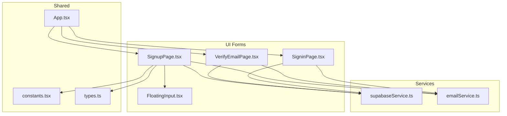
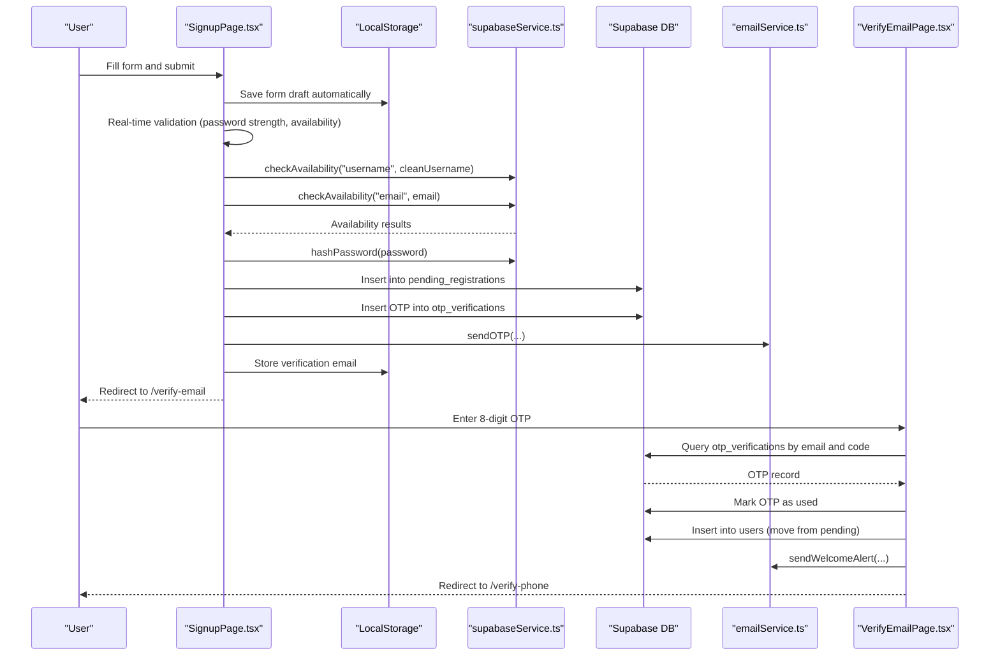
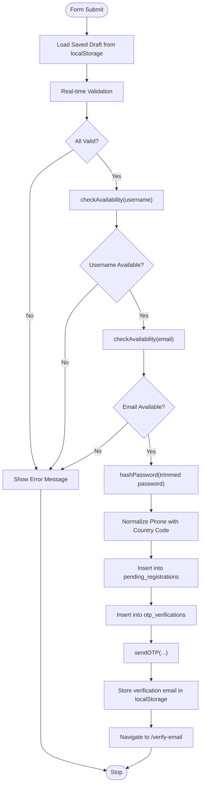
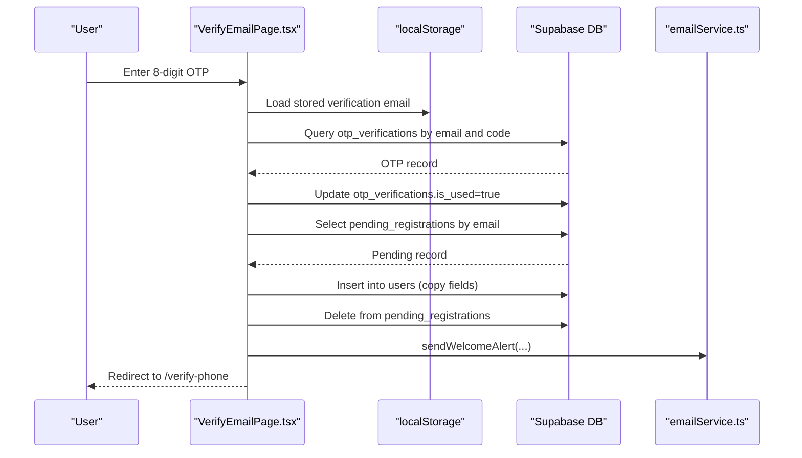
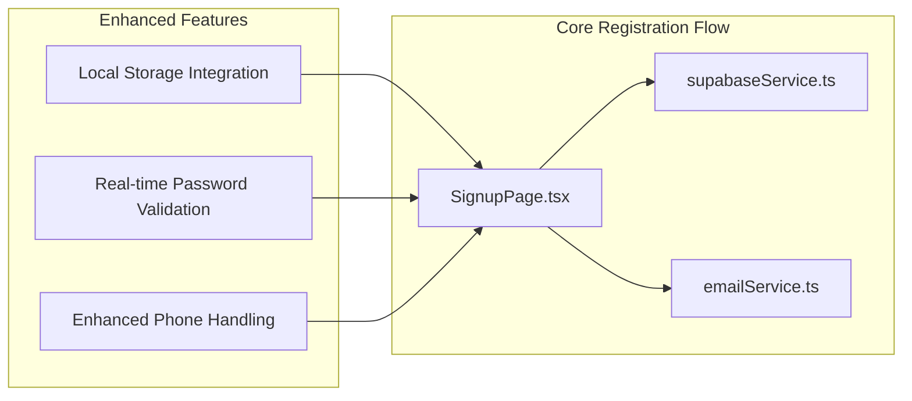
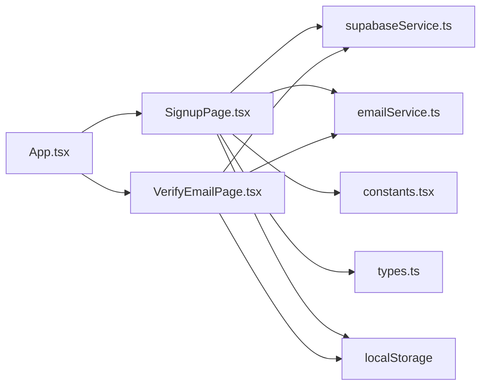

# User Registration

<cite>
**Referenced Files in This Document**
- [SignupPage.tsx](file://pages/SignupPage.tsx)
- [VerifyEmailPage.tsx](file://pages/VerifyEmailPage.tsx)
- [FloatingInput.tsx](file://components/FloatingInput.tsx)
- [supabaseService.ts](file://services/supabaseService.ts)
- [emailService.ts](file://services/emailService.ts)
- [constants.tsx](file://constants.tsx)
- [types.ts](file://types.ts)
- [App.tsx](file://App.tsx)
</cite>

## Update Summary
**Changes Made**
- Enhanced local storage integration for form draft persistence
- Implemented real-time password validation with dynamic strength feedback
- Improved mobile phone input handling with better normalization
- Added comprehensive form state management with automatic saving

## Table of Contents
1. [Introduction](#introduction)
2. [Project Structure](#project-structure)
3. [Core Components](#core-components)
4. [Architecture Overview](#architecture-overview)
5. [Detailed Component Analysis](#detailed-component-analysis)
6. [Enhanced Registration Experience](#enhanced-registration-experience)
7. [Dependency Analysis](#dependency-analysis)
8. [Performance Considerations](#performance-considerations)
9. [Troubleshooting Guide](#troubleshooting-guide)
10. [Conclusion](#conclusion)

## Introduction
This document explains the complete user registration system, covering form validation, password requirements, email verification, and user profile creation. It details the implementation of the SignupPage component, input validation rules, error handling, and integration with Supabase authentication services. The system now features enhanced user experience improvements including local storage integration, real-time password validation, and improved mobile phone input handling.

## Project Structure
The registration flow spans several UI components and services:
- UI forms: SignupPage (registration form), VerifyEmailPage (verification), SigninPage (login)
- Shared UI: FloatingInput (reusable input component)
- Services: supabaseService (Supabase client, hashing, availability checks), emailService (OTP and welcome emails)
- Constants and types: constants.tsx (country list), types.ts (user profile model)
- Routing: App.tsx (route definitions)

**Diagram sources**
- [SignupPage.tsx](file://pages/SignupPage.tsx#L1-L310)
- [VerifyEmailPage.tsx](file://pages/VerifyEmailPage.tsx#L1-L268)
- [FloatingInput.tsx](file://components/FloatingInput.tsx#L1-L85)
- [supabaseService.ts](file://services/supabaseService.ts#L1-L67)
- [emailService.ts](file://services/emailService.ts#L1-L209)
- [constants.tsx](file://constants.tsx#L1-L361)
- [types.ts](file://types.ts#L1-L79)
- [App.tsx](file://App.tsx#L252-L279)

**Section sources**
- [App.tsx](file://App.tsx#L252-L272)

## Core Components
- **SignupPage**: Enhanced with local storage integration, real-time password validation, and improved mobile phone input handling. Collects user data, validates locally, checks availability, hashes password, persists pending registration, and triggers OTP delivery.
- **VerifyEmailPage**: Handles OTP entry, verifies code against database, moves from pending registrations to active users, and sends welcome email.
- **FloatingInput**: Reusable input/select component with floating label behavior and enhanced mobile phone input support.
- **supabaseService**: Provides Supabase client, password hashing, availability checks, and login attempt handling.
- **emailService**: Sends OTP and welcome emails via EmailJS with enhanced security context capture.
- **constants.tsx**: Country list used for phone number normalization and international dialing codes.
- **types.ts**: Defines the UserProfile interface used across the app.

**Section sources**
- [SignupPage.tsx](file://pages/SignupPage.tsx#L12-L310)
- [VerifyEmailPage.tsx](file://pages/VerifyEmailPage.tsx#L8-L268)
- [FloatingInput.tsx](file://components/FloatingInput.tsx#L11-L85)
- [supabaseService.ts](file://services/supabaseService.ts#L9-L67)
- [emailService.ts](file://services/emailService.ts#L11-L209)
- [constants.tsx](file://constants.tsx#L27-L271)
- [types.ts](file://types.ts#L11-L25)

## Architecture Overview
The registration flow is split into two steps with enhanced user experience:
1. Registration form submission and pre-validation with real-time feedback
2. Email verification and account activation

**Diagram sources**
- [SignupPage.tsx](file://pages/SignupPage.tsx#L82-L166)
- [supabaseService.ts](file://services/supabaseService.ts#L17-L24)
- [emailService.ts](file://services/emailService.ts#L143-L162)
- [VerifyEmailPage.tsx](file://pages/VerifyEmailPage.tsx#L112-L175)

## Detailed Component Analysis

### Enhanced SignupPage Component
**Updated** Enhanced with local storage integration, real-time password validation, and improved mobile phone input handling.

- **Purpose**: Capture user registration data with enhanced user experience features
- **Key behaviors**:
  - **Local Storage Integration**: Automatically saves form drafts to localStorage with `zpria_signup_draft` key
  - **Real-time Password Validation**: Dynamic strength feedback with percentage and checklist items
  - **Enhanced Mobile Phone Handling**: Improved phone number normalization with country code support
  - **Automatic Form Persistence**: Form state automatically saved on every change
  - **Local validation rules**: required fields, age validation, password strength, password confirmation, CAPTCHA verification, and consent
  - **Availability checks**: username and email uniqueness across users and pending registrations
  - **Password hashing**: SHA-256 of trimmed password
  - **Phone normalization**: country code prefixing and leading zero removal
  - **Persistence**: inserts into pending_registrations and otp_verifications; stores verification email in local storage
  - **Navigation**: redirects to /verify-email on success

**Diagram sources**
- [SignupPage.tsx](file://pages/SignupPage.tsx#L82-L166)
- [supabaseService.ts](file://services/supabaseService.ts#L17-L24)
- [emailService.ts](file://services/emailService.ts#L143-L162)

**Section sources**
- [SignupPage.tsx](file://pages/SignupPage.tsx#L20-L166)
- [supabaseService.ts](file://services/supabaseService.ts#L9-L24)
- [constants.tsx](file://constants.tsx#L27-L271)

### Real-time Password Validation
**Updated** Enhanced with dynamic strength feedback and visual indicators.

- **Real-time feedback**: strength percentage and checklist items (length, number, uppercase, lowercase, special character)
- **Validation criteria**: minimum 8 characters, at least one digit, one uppercase letter, one lowercase letter, one special character
- **Triggered when the password field is focused**: Shows a tooltip with strength analysis
- **Visual indicators**: Percentage display and checklist with color-coded status

**Section sources**
- [SignupPage.tsx](file://pages/SignupPage.tsx#L51-L62)
- [SignupPage.tsx](file://pages/SignupPage.tsx#L247-L271)

### Enhanced Mobile Phone Input Handling
**Updated** Improved phone number normalization and validation.

- **Country code integration**: Dropdown selection with international dialing codes
- **Phone normalization**: Automatic leading zero removal and country code prefixing
- **Input validation**: Ensures proper numeric format and country code inclusion
- **Mobile-friendly design**: Optimized input fields for mobile devices

**Section sources**
- [SignupPage.tsx](file://pages/SignupPage.tsx#L274-L284)
- [constants.tsx](file://constants.tsx#L27-L271)

### Form Draft Persistence
**New** Automatic form state saving to localStorage.

- **Storage Key**: `zpria_signup_draft`
- **Automatic Saving**: Form state saved on every change via useEffect
- **Draft Loading**: Form loads previous drafts on component mount
- **Error Handling**: Graceful fallback if draft parsing fails
- **Data Persistence**: Maintains form state across browser sessions

**Section sources**
- [SignupPage.tsx](file://pages/SignupPage.tsx#L10-L49)

### VerifyEmailPage Component
- **Purpose**: Verify the 8-digit OTP, mark OTP as used, move from pending registrations to active users, and send a welcome email.
- **Key behaviors**:
  - OTP entry with auto-focus between digits.
  - Resend OTP with cooldown timer.
  - Verification logic: validates OTP, marks as used, inserts into users, and clears pending registration.
  - Navigation: redirects to /verify-phone after successful verification.

**Diagram sources**
- [VerifyEmailPage.tsx](file://pages/VerifyEmailPage.tsx#L112-L175)

**Section sources**
- [VerifyEmailPage.tsx](file://pages/VerifyEmailPage.tsx#L8-L268)

### FloatingInput Component
- **Purpose**: Reusable input/select with floating label behavior and invalid-state styling.
- **Features**: focus/blur transitions, placeholder replacement, select dropdown indicator, disabled state styling.

**Section sources**
- [FloatingInput.tsx](file://components/FloatingInput.tsx#L11-L85)

### Supabase Integration Details
- **Supabase client initialization and password hashing** are centralized in supabaseService.
- **Availability checks** combine users and pending_registrations to prevent duplicates.
- **Login attempt handling** includes lockout logic and failed attempt tracking.

**Section sources**
- [supabaseService.ts](file://services/supabaseService.ts#L2-L15)
- [supabaseService.ts](file://services/supabaseService.ts#L17-L24)
- [supabaseService.ts](file://services/supabaseService.ts#L26-L67)

### Enhanced Email Delivery
- **OTP emails and welcome alerts** are sent via EmailJS using predefined templates and service IDs.
- **Security context** (IP, device info, location, time) is captured for alert emails with improved error handling.

**Section sources**
- [emailService.ts](file://services/emailService.ts#L143-L162)
- [emailService.ts](file://services/emailService.ts#L167-L187)
- [emailService.ts](file://services/emailService.ts#L43-L69)

## Enhanced Registration Experience

### Local Storage Integration
The registration system now provides seamless form persistence through automatic localStorage integration:

- **Automatic Draft Saving**: Form state is automatically saved to `localStorage.zpria_signup_draft` on every change
- **Session Continuity**: Users can close the browser and return to complete their registration
- **Error Recovery**: Graceful handling of corrupted or malformed draft data
- **Cross-tab Persistence**: Form state maintained across browser tabs and windows

### Real-time Password Validation
Enhanced password validation provides immediate feedback to users:

- **Dynamic Strength Calculation**: Real-time percentage-based strength assessment
- **Visual Feedback**: Tooltip showing specific requirements met and unmet
- **Interactive Checklist**: Color-coded requirements with visual indicators
- **Focus-triggered Display**: Validation feedback appears only when password field is active

### Improved Mobile Phone Input Handling
Enhanced phone number processing ensures proper international formatting:

- **Country Code Selection**: Dropdown with comprehensive international dialing codes
- **Automatic Normalization**: Leading zeros removed and country codes prefixed
- **Format Validation**: Ensures proper numeric format for international numbers
- **Mobile Optimization**: Touch-friendly interface for mobile device input

**Diagram sources**
- [SignupPage.tsx](file://pages/SignupPage.tsx#L10-L49)
- [SignupPage.tsx](file://pages/SignupPage.tsx#L51-L62)
- [SignupPage.tsx](file://pages/SignupPage.tsx#L274-L284)

**Section sources**
- [SignupPage.tsx](file://pages/SignupPage.tsx#L10-L49)
- [SignupPage.tsx](file://pages/SignupPage.tsx#L51-L62)
- [SignupPage.tsx](file://pages/SignupPage.tsx#L274-L284)

## Dependency Analysis
- **SignupPage** depends on:
  - supabaseService for availability checks and password hashing
  - emailService for OTP delivery
  - constants.tsx for country list and phone normalization
  - types.ts for user profile typing
  - localStorage for form draft persistence
- **VerifyEmailPage** depends on:
  - supabaseService for OTP verification and user creation
  - emailService for welcome alerts
  - localStorage for verification email storage
- **App.tsx** defines routing for the registration flow.

**Diagram sources**
- [SignupPage.tsx](file://pages/SignupPage.tsx#L7-L8)
- [VerifyEmailPage.tsx](file://pages/VerifyEmailPage.tsx#L5-L6)
- [App.tsx](file://App.tsx#L252-L272)

**Section sources**
- [App.tsx](file://App.tsx#L252-L272)

## Performance Considerations
- **Local validation** reduces unnecessary network requests.
- **Password hashing** occurs in the browser using Web Crypto APIs.
- **OTP expiration** is enforced server-side; the frontend sets a 10-minute expiry.
- **Lazy loading** of secondary pages improves initial load performance.
- **Automatic form saving** uses efficient localStorage operations with debouncing.
- **Real-time validation** uses useMemo for performance optimization.

## Troubleshooting Guide
Common registration scenarios and resolutions with enhanced features:

### Local Storage Issues
- **Form draft not loading**
  - **Cause**: localStorage corruption or browser restrictions
  - **Resolution**: Clear browser cache, check localStorage quota, or manually re-enter form data
  - **Reference**: [SignupPage.tsx](file://pages/SignupPage.tsx#L20-L49)

### Enhanced Password Validation Issues
- **Password strength tooltip not appearing**
  - **Cause**: Password field focus issues or browser compatibility
  - **Resolution**: Ensure password field is focused, check browser JavaScript support
  - **Reference**: [SignupPage.tsx](file://pages/SignupPage.tsx#L247-L271)

### Mobile Phone Input Problems
- **Country code not applying**
  - **Cause**: Invalid country selection or phone number format
  - **Resolution**: Select valid country from dropdown, ensure numeric input
  - **Reference**: [SignupPage.tsx](file://pages/SignupPage.tsx#L274-L284), [constants.tsx](file://constants.tsx#L27-L271)

### Common Registration Scenarios
- **Username already taken**
  - **Cause**: checkAvailability returned false for username.
  - **Resolution**: Choose a different username; the system prevents duplicates across users and pending registrations.
  - **Reference**: [SignupPage.tsx](file://pages/SignupPage.tsx#L104-L108), [supabaseService.ts](file://services/supabaseService.ts#L17-L24)
- **Recovery email already registered**
  - **Cause**: checkAvailability returned false for email.
  - **Resolution**: Use another email or recover existing account.
  - **Reference**: [SignupPage.tsx](file://pages/SignupPage.tsx#L104-L108), [supabaseService.ts](file://services/supabaseService.ts#L17-L24)
- **Password does not meet requirements**
  - **Cause**: strength less than 100% or mismatch with confirm password.
  - **Resolution**: Meet all strength criteria and ensure passwords match.
  - **Reference**: [SignupPage.tsx](file://pages/SignupPage.tsx#L93-L94), [SignupPage.tsx](file://pages/SignupPage.tsx#L247-L271)
- **Age under 16**
  - **Cause**: DOB calculation yields under 16.
  - **Resolution**: Provide a valid date of birth.
  - **Reference**: [SignupPage.tsx](file://pages/SignupPage.tsx#L64-L72)
- **CAPTCHA not solved**
  - **Cause**: isCaptchaVerified remains false.
  - **Resolution**: Complete the visual CAPTCHA challenge.
  - **Reference**: [SignupPage.tsx](file://pages/SignupPage.tsx#L95-L96), [SignupPage.tsx](file://pages/SignupPage.tsx#L288-L288)
- **Verification code invalid/expired**
  - **Cause**: OTP not found or already used.
  - **Resolution**: Request a new OTP; ensure it is entered within 10 minutes.
  - **Reference**: [VerifyEmailPage.tsx](file://pages/VerifyEmailPage.tsx#L120-L125), [VerifyEmailPage.tsx](file://pages/VerifyEmailPage.tsx#L68-L97)
- **Registration session expired**
  - **Cause**: No pending registration found for the verified email.
  - **Resolution**: Restart the registration process.
  - **Reference**: [VerifyEmailPage.tsx](file://pages/VerifyEmailPage.tsx#L139-L140)

## Conclusion
The registration system combines robust client-side validation, secure password hashing, and a two-stage verification process to ensure account integrity and user safety. The enhanced user experience features include seamless form persistence through local storage, real-time password validation with visual feedback, and improved mobile phone input handling with country code support. The flow integrates tightly with Supabase for data persistence and EmailJS for reliable email delivery. Users benefit from immediate feedback, strong password requirements, and a seamless transition from registration to account activation with enhanced continuity and usability features.