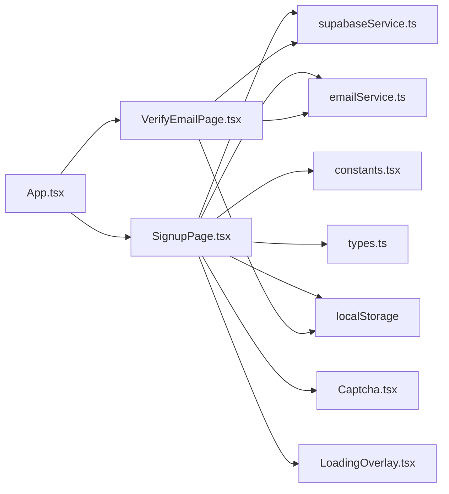

# User Registration

<cite>
**Referenced Files in This Document**
- [SignupPage.tsx](file://pages/SignupPage.tsx)
- [VerifyEmailPage.tsx](file://pages/VerifyEmailPage.tsx)
- [FloatingInput.tsx](file://components/FloatingInput.tsx)
- [Captcha.tsx](file://components/Captcha.tsx)
- [LoadingOverlay.tsx](file://components/LoadingOverlay.tsx)
- [supabaseService.ts](file://services/supabaseService.ts)
- [emailService.ts](file://services/emailService.ts)
- [constants.tsx](file://constants.tsx)
- [types.ts](file://types.ts)
- [App.tsx](file://App.tsx)
</cite>

## Update Summary
**Changes Made**
- Enhanced real-time password validation with dynamic strength feedback and visual indicators
- Improved form validation with comprehensive error handling and user feedback mechanisms
- Added password strength tooltip with requirement checklist and percentage display
- Enhanced mobile phone input handling with country code integration
- Implemented automatic form draft persistence with localStorage integration
- Added comprehensive availability checking for usernames and emails
- Integrated visual CAPTCHA verification for human verification
- **NEW**: Added LoadingOverlay component for enhanced loading state visualization
- **NEW**: Implemented live database availability checking for usernames, emails, and mobile numbers
- **NEW**: Enhanced error handling with specific error messages for each input type

## Table of Contents
1. [Introduction](#introduction)
2. [Project Structure](#project-structure)
3. [Core Components](#core-components)
4. [Architecture Overview](#architecture-overview)
5. [Detailed Component Analysis](#detailed-component-analysis)
6. [Enhanced Registration Experience](#enhanced-registration-experience)
7. [Dependency Analysis](#dependency-analysis)
8. [Performance Considerations](#performance-considerations)
9. [Troubleshooting Guide](#troubleshooting-guide)
10. [Conclusion](#conclusion)

## Introduction
This document explains the complete user registration system, covering form validation, password requirements, email verification, and user profile creation. It details the implementation of the SignupPage component, input validation rules, error handling, and integration with Supabase authentication services. The system now features enhanced user experience improvements including real-time password validation with dynamic strength feedback, comprehensive form state management with automatic saving, improved mobile phone input handling, and live database availability checking for instant feedback.

## Project Structure
The registration flow spans several UI components and services:
- UI forms: SignupPage (registration form), VerifyEmailPage (verification), SigninPage (login)
- Shared UI: FloatingInput (reusable input component), Captcha (visual verification), LoadingOverlay (loading state visualization)
- Services: supabaseService (Supabase client, hashing, availability checks), emailService (OTP and welcome emails)
- Constants and types: constants.tsx (country list), types.ts (user profile model)
- Routing: App.tsx (route definitions)

**Diagram sources**
- [SignupPage.tsx](file://pages/SignupPage.tsx#L1-L432)
- [VerifyEmailPage.tsx](file://pages/VerifyEmailPage.tsx#L1-L286)
- [FloatingInput.tsx](file://components/FloatingInput.tsx#L1-L90)
- [Captcha.tsx](file://components/Captcha.tsx#L1-L117)
- [LoadingOverlay.tsx](file://components/LoadingOverlay.tsx#L1-L78)
- [supabaseService.ts](file://services/supabaseService.ts#L1-L64)
- [emailService.ts](file://services/emailService.ts#L1-L209)
- [constants.tsx](file://constants.tsx#L1-L361)
- [types.ts](file://types.ts#L1-L79)
- [App.tsx](file://App.tsx#L252-L279)

**Section sources**
- [App.tsx](file://App.tsx#L252-L272)

## Core Components
- **SignupPage**: Enhanced with comprehensive form validation, real-time password strength feedback, automatic form persistence, improved mobile phone input handling, and live database availability checking. Collects user data, validates locally with detailed error messages, checks availability in real-time, hashes password, persists pending registration, and triggers OTP delivery.
- **VerifyEmailPage**: Handles OTP entry, verifies code against database, moves from pending registrations to active users, and sends welcome email.
- **FloatingInput**: Reusable input/select component with floating label behavior and enhanced mobile phone input support.
- **Captcha**: Visual CAPTCHA component for human verification with dynamic canvas generation.
- **LoadingOverlay**: New component providing enhanced visual feedback during loading states with animated geometric blocks and progress indicators.
- **supabaseService**: Provides Supabase client, password hashing, availability checks, and login attempt handling.
- **emailService**: Sends OTP and welcome emails via EmailJS with enhanced security context capture.
- **constants.tsx**: Country list used for phone number normalization and international dialing codes.
- **types.ts**: Defines the UserProfile interface used across the app.

**Section sources**
- [SignupPage.tsx](file://pages/SignupPage.tsx#L12-L432)
- [VerifyEmailPage.tsx](file://pages/VerifyEmailPage.tsx#L8-L286)
- [FloatingInput.tsx](file://components/FloatingInput.tsx#L12-L90)
- [Captcha.tsx](file://components/Captcha.tsx#L9-L117)
- [LoadingOverlay.tsx](file://components/LoadingOverlay.tsx#L8-L78)
- [supabaseService.ts](file://services/supabaseService.ts#L9-L64)
- [emailService.ts](file://services/emailService.ts#L74-L209)
- [constants.tsx](file://constants.tsx#L27-L271)
- [types.ts](file://types.ts#L11-L25)

## Architecture Overview
The registration flow is split into two steps with enhanced user experience and real-time validation:
1. Registration form submission and pre-validation with real-time feedback and live database checking
2. Email verification and account activation

**Diagram sources**
- [SignupPage.tsx](file://pages/SignupPage.tsx#L196-L286)
- [LoadingOverlay.tsx](file://components/LoadingOverlay.tsx#L14-L21)
- [supabaseService.ts](file://services/supabaseService.ts#L17-L21)
- [emailService.ts](file://services/emailService.ts#L143-L162)
- [VerifyEmailPage.tsx](file://pages/VerifyEmailPage.tsx#L117-L193)

## Detailed Component Analysis

### Enhanced SignupPage Component
**Updated** Enhanced with comprehensive form validation, real-time password strength feedback, automatic form persistence, improved mobile phone input handling, and live database availability checking.

- **Purpose**: Capture user registration data with enhanced user experience features including real-time validation and immediate feedback
- **Key behaviors**:
  - **Automatic Form Persistence**: Form state automatically saved to localStorage with `zpria_signup_draft` key on every change
  - **Real-time Password Validation**: Dynamic strength feedback with percentage and comprehensive checklist items
  - **Live Database Availability Checking**: Real-time validation of usernames, emails, and mobile numbers against database
  - **Enhanced Mobile Phone Handling**: Improved phone number normalization with country code support
  - **Comprehensive Form Validation**: Detailed error messages for all validation failures
  - **Local validation rules**: required fields, age validation, password strength, password confirmation, CAPTCHA verification, and consent
  - **Availability checks**: username and email uniqueness across users and pending registrations
  - **Password hashing**: SHA-256 of trimmed password
  - **Phone normalization**: country code prefixing and leading zero removal
  - **Persistence**: inserts into pending_registrations and otp_verifications; stores verification email in local storage
  - **Navigation**: redirects to /verify-email on success
  - **Loading State**: Integrates with LoadingOverlay component for enhanced user feedback

**Diagram sources**
- [SignupPage.tsx](file://pages/SignupPage.tsx#L196-L286)
- [LoadingOverlay.tsx](file://components/LoadingOverlay.tsx#L14-L21)
- [supabaseService.ts](file://services/supabaseService.ts#L17-L21)
- [emailService.ts](file://services/emailService.ts#L143-L162)

**Section sources**
- [SignupPage.tsx](file://pages/SignupPage.tsx#L12-L286)
- [LoadingOverlay.tsx](file://components/LoadingOverlay.tsx#L8-L78)
- [supabaseService.ts](file://services/supabaseService.ts#L9-L21)
- [constants.tsx](file://constants.tsx#L27-L271)

### Live Database Availability Checking
**New** Comprehensive real-time validation system that checks database availability for usernames, emails, and mobile numbers.

- **Real-time Monitoring**: Automated checking triggered when fields reach minimum length thresholds
- **Database Integration**: Direct queries to Supabase for username, email, and mobile availability
- **Immediate Feedback**: Visual error messages appear instantly when conflicts are detected
- **Smart Normalization**: Proper handling of mobile numbers with country codes and leading zeros
- **Debounced Processing**: 500ms delay to prevent excessive database queries
- **Visual Indicators**: Loading states and error messages for each field being validated
- **Field-Specific Errors**: Different error messages for username conflicts, email conflicts, and mobile conflicts

**Section sources**
- [SignupPage.tsx](file://pages/SignupPage.tsx#L56-L103)
- [supabaseService.ts](file://services/supabaseService.ts#L17-L21)

### Enhanced LoadingOverlay Component
**New** Visual feedback system that provides enhanced loading state visualization during registration processing.

- **Delayed Appearance**: 50ms delay before showing overlay to prevent flicker on fast operations
- **Animated Elements**: Geometric blocks with synchronized animations and color transitions
- **Progress Indicators**: Animated progress bar with smooth loading animation
- **Smooth Transitions**: CSS transitions for fade-in/fade-out effects with scaling
- **Backdrop Effects**: Frosted glass effect with blur and opacity controls
- **Message Customization**: Configurable loading messages with uppercase typography
- **Performance Optimized**: Efficient animation using CSS transforms and minimal DOM manipulation

**Section sources**
- [LoadingOverlay.tsx](file://components/LoadingOverlay.tsx#L8-L78)

### Real-time Password Validation
**Updated** Enhanced with dynamic strength feedback, comprehensive requirement checking, and visual indicators.

- **Real-time feedback**: strength percentage and checklist items (length, number, uppercase, lowercase, special character)
- **Validation criteria**: minimum 8 characters, at least one digit, one uppercase letter, one lowercase letter, one special character
- **Triggered when the password field is focused**: Shows a comprehensive tooltip with strength analysis
- **Visual indicators**: Percentage display and checklist with color-coded status
- **Requirement tracking**: Shows which requirements are met and which are not
- **Immediate feedback**: Updates in real-time as user types

**Section sources**
- [SignupPage.tsx](file://pages/SignupPage.tsx#L105-L116)
- [SignupPage.tsx](file://pages/SignupPage.tsx#L368-L391)

### Enhanced Mobile Phone Input Handling
**Updated** Improved phone number normalization and validation with country code integration.

- **Country code integration**: Dropdown selection with comprehensive international dialing codes
- **Phone normalization**: Automatic leading zero removal and country code prefixing
- **Input validation**: Ensures proper numeric format and country code inclusion
- **Mobile-friendly design**: Optimized input fields for mobile devices
- **Country list integration**: Uses constants.tsx for comprehensive country code support

**Section sources**
- [SignupPage.tsx](file://pages/SignupPage.tsx#L397-L404)
- [constants.tsx](file://constants.tsx#L27-L271)

### Comprehensive Form Validation
**Updated** Enhanced with detailed error handling and user feedback mechanisms including live availability checking.

- **Field validation**: Comprehensive validation for all required fields with real-time feedback
- **Age validation**: Calculates age from date of birth with minimum age requirement
- **Password validation**: Real-time strength checking with detailed feedback
- **Consistency checks**: Password confirmation matching
- **CAPTCHA verification**: Visual CAPTCHA challenge completion
- **Live availability checking**: Real-time database validation for usernames, emails, and mobile numbers
- **Detailed error messages**: Specific error messages for each validation failure
- **Form state management**: Automatic saving and loading of form drafts
- **Visual error states**: Color-coded feedback for requirements and validation states

**Section sources**
- [SignupPage.tsx](file://pages/SignupPage.tsx#L128-L171)
- [SignupPage.tsx](file://pages/SignupPage.tsx#L189-L194)

### Automatic Form Draft Persistence
**New** Seamless form state saving to localStorage with comprehensive error handling.

- **Storage Key**: `zpria_signup_draft`
- **Automatic Saving**: Form state saved on every change via useEffect
- **Draft Loading**: Form loads previous drafts on component mount with error recovery
- **Error Handling**: Graceful fallback if draft parsing fails
- **Data Persistence**: Maintains form state across browser sessions and page reloads

**Section sources**
- [SignupPage.tsx](file://pages/SignupPage.tsx#L25-L54)

### VerifyEmailPage Component
- **Purpose**: Verify the 8-digit OTP, mark OTP as used, move from pending registrations to active users, and send a welcome email.
- **Key behaviors**:
  - OTP entry with auto-focus between digits.
  - Resend OTP with cooldown timer.
  - Verification logic: validates OTP, marks as used, inserts into users, and clears pending registration.
  - Navigation: redirects to /verify-phone after successful verification.

**Diagram sources**
- [VerifyEmailPage.tsx](file://pages/VerifyEmailPage.tsx#L117-L193)

**Section sources**
- [VerifyEmailPage.tsx](file://pages/VerifyEmailPage.tsx#L8-L193)

### FloatingInput Component
- **Purpose**: Reusable input/select with floating label behavior and invalid-state styling.
- **Features**: focus/blur transitions, placeholder replacement, select dropdown indicator, disabled state styling.

**Section sources**
- [FloatingInput.tsx](file://components/FloatingInput.tsx#L12-L90)

### Captcha Component
- **Purpose**: Visual CAPTCHA verification for human verification with dynamic canvas generation.
- **Features**: random character generation, canvas rendering with noise and distortion, user input validation, refresh capability.

**Section sources**
- [Captcha.tsx](file://components/Captcha.tsx#L9-L117)

### Supabase Integration Details
- **Supabase client initialization and password hashing** are centralized in supabaseService.
- **Availability checks** combine users and pending_registrations to prevent duplicates.
- **Login attempt handling** includes lockout logic and failed attempt tracking.

**Section sources**
- [supabaseService.ts](file://services/supabaseService.ts#L2-L15)
- [supabaseService.ts](file://services/supabaseService.ts#L17-L21)
- [supabaseService.ts](file://services/supabaseService.ts#L23-L64)

### Enhanced Email Delivery
- **OTP emails and welcome alerts** are sent via EmailJS using predefined templates and service IDs.
- **Security context** (IP, device info, location, time) is captured for alert emails with improved error handling.

**Section sources**
- [emailService.ts](file://services/emailService.ts#L143-L162)
- [emailService.ts](file://services/emailService.ts#L167-L187)
- [emailService.ts](file://services/emailService.ts#L43-L69)

## Enhanced Registration Experience

### Comprehensive Form Validation System
The registration system now provides detailed validation with immediate feedback and real-time database checking:

- **Real-time validation**: Field-specific validation as users interact with the form
- **Live database checking**: Instant availability verification for usernames, emails, and mobile numbers
- **Age calculation**: Automatic age validation based on date of birth input
- **Password strength analysis**: Comprehensive strength checking with requirement tracking
- **Detailed error messages**: Specific feedback for each validation failure
- **Visual indicators**: Color-coded feedback for requirements and validation states
- **Loading feedback**: Enhanced user experience with LoadingOverlay component

### Live Database Availability Checking
**New** Real-time validation system that provides instant feedback on data availability:

- **Real-time Monitoring**: Automated database queries triggered when fields reach minimum length
- **Multi-field Validation**: Simultaneous checking for usernames, emails, and mobile numbers
- **Smart Normalization**: Proper handling of mobile numbers with country codes and formatting
- **Immediate Feedback**: Visual error messages appear instantly when conflicts are detected
- **Debounced Processing**: 500ms delay to prevent excessive database queries
- **Field-specific Messages**: Different error messages for each type of conflict
- **Visual Loading States**: Loading indicators show when database checks are in progress

### Enhanced Loading State Visualization
**New** Improved user feedback during registration processing:

- **Delayed Appearance**: 50ms delay prevents flicker on fast operations
- **Animated Elements**: Geometric blocks with synchronized animations and color transitions
- **Progress Indicators**: Animated progress bar with smooth loading animation
- **Smooth Transitions**: CSS transitions for fade-in/fade-out effects with scaling
- **Backdrop Effects**: Frosted glass effect with blur and opacity controls
- **Message Customization**: Configurable loading messages with uppercase typography

### Real-time Password Validation
Enhanced password validation provides immediate and comprehensive feedback to users:

- **Dynamic Strength Calculation**: Real-time percentage-based strength assessment
- **Comprehensive Requirement Tracking**: Shows which requirements are met and unmet
- **Visual Feedback**: Tooltip with detailed analysis and requirement checklist
- **Interactive Checklist**: Color-coded requirements with visual indicators
- **Focus-triggered Display**: Validation feedback appears only when password field is active

### Enhanced Mobile Phone Input Handling
Improved phone number processing ensures proper international formatting:

- **Country Code Selection**: Dropdown with comprehensive international dialing codes
- **Automatic Normalization**: Leading zeros removed and country codes prefixed
- **Format Validation**: Ensures proper numeric format for international numbers
- **Mobile Optimization**: Touch-friendly interface for mobile device input

### Seamless Form Persistence
Automatic form state saving provides continuity across browser sessions:

- **Automatic Draft Saving**: Form state is automatically saved to `localStorage.zpria_signup_draft` on every change
- **Session Continuity**: Users can close the browser and return to complete their registration
- **Error Recovery**: Graceful handling of corrupted or malformed draft data
- **Cross-tab Persistence**: Form state maintained across browser tabs and windows

### Human Verification Enhancement
Added robust CAPTCHA verification to prevent automated registrations:

- **Visual CAPTCHA Generation**: Dynamic canvas rendering with distortion and noise
- **Random Character Selection**: Secure random character generation excluding ambiguous characters
- **Real-time Validation**: Immediate feedback on CAPTCHA completion
- **Refresh Capability**: Easy regeneration of CAPTCHA challenges

**Diagram sources**
- [SignupPage.tsx](file://pages/SignupPage.tsx#L25-L54)
- [SignupPage.tsx](file://pages/SignupPage.tsx#L105-L116)
- [SignupPage.tsx](file://pages/SignupPage.tsx#L56-L103)
- [LoadingOverlay.tsx](file://components/LoadingOverlay.tsx#L14-L21)
- [SignupPage.tsx](file://pages/SignupPage.tsx#L397-L404)
- [SignupPage.tsx](file://pages/SignupPage.tsx#L128-L171)
- [Captcha.tsx](file://components/Captcha.tsx#L14-L27)

**Section sources**
- [SignupPage.tsx](file://pages/SignupPage.tsx#L25-L54)
- [SignupPage.tsx](file://pages/SignupPage.tsx#L105-L116)
- [SignupPage.tsx](file://pages/SignupPage.tsx#L56-L103)
- [LoadingOverlay.tsx](file://components/LoadingOverlay.tsx#L14-L21)
- [SignupPage.tsx](file://pages/SignupPage.tsx#L397-L404)
- [SignupPage.tsx](file://pages/SignupPage.tsx#L128-L171)
- [Captcha.tsx](file://components/Captcha.tsx#L14-L27)

## Dependency Analysis
- **SignupPage** depends on:
  - supabaseService for availability checks and password hashing
  - emailService for OTP delivery
  - constants.tsx for country list and phone normalization
  - types.ts for user profile typing
  - localStorage for form draft persistence
  - Captcha component for human verification
  - LoadingOverlay component for enhanced loading feedback
- **VerifyEmailPage** depends on:
  - supabaseService for OTP verification and user creation
  - emailService for welcome alerts
  - localStorage for verification email storage
- **App.tsx** defines routing for the registration flow.

**Diagram sources**
- [SignupPage.tsx](file://pages/SignupPage.tsx#L7-L8)
- [VerifyEmailPage.tsx](file://pages/VerifyEmailPage.tsx#L5-L6)
- [App.tsx](file://App.tsx#L252-L272)

**Section sources**
- [App.tsx](file://App.tsx#L252-L272)

## Performance Considerations
- **Local validation** reduces unnecessary network requests with comprehensive client-side validation.
- **Password hashing** occurs in the browser using Web Crypto APIs with proper error handling.
- **OTP expiration** is enforced server-side; the frontend sets a 10-minute expiry.
- **Lazy loading** of secondary pages improves initial load performance.
- **Automatic form saving** uses efficient localStorage operations with debouncing.
- **Real-time validation** uses useMemo for performance optimization with requirement tracking.
- **Form persistence** uses JSON serialization with error handling for draft recovery.
- **CAPTCHA generation** uses canvas rendering with optimized drawing operations.
- **Country list caching** prevents repeated array operations during phone normalization.
- **Live database checking** uses debounced queries with 500ms delay to prevent excessive database calls.
- **LoadingOverlay** uses CSS transitions for smooth animations with minimal performance impact.
- **Availability checking** processes multiple fields concurrently with individual field state management.

## Troubleshooting Guide
Common registration scenarios and resolutions with enhanced features:

### Form Persistence Issues
- **Form draft not loading**
  - **Cause**: localStorage corruption or browser restrictions
  - **Resolution**: Clear browser cache, check localStorage quota, or manually re-enter form data
  - **Reference**: [SignupPage.tsx](file://pages/SignupPage.tsx#L25-L34)

### Enhanced Password Validation Issues
- **Password strength tooltip not appearing**
  - **Cause**: Password field focus issues or browser compatibility
  - **Resolution**: Ensure password field is focused, check browser JavaScript support
  - **Reference**: [SignupPage.tsx](file://pages/SignupPage.tsx#L368-L391)

### Live Database Availability Checking Issues
- **Live validation not working**
  - **Cause**: Network connectivity issues or database query timeouts
  - **Resolution**: Check internet connection, verify database accessibility, or wait for network recovery
  - **Reference**: [SignupPage.tsx](file://pages/SignupPage.tsx#L56-L103)

### LoadingOverlay Component Issues
- **Loading overlay not appearing**
  - **Cause**: isLoading state not properly managed or component mounting issues
  - **Resolution**: Ensure isLoading state is set to true during operations, check component mounting
  - **Reference**: [LoadingOverlay.tsx](file://components/LoadingOverlay.tsx#L14-L21)

### Mobile Phone Input Problems
- **Country code not applying**
  - **Cause**: Invalid country selection or phone number format
  - **Resolution**: Select valid country from dropdown, ensure numeric input
  - **Reference**: [SignupPage.tsx](file://pages/SignupPage.tsx#L397-L404), [constants.tsx](file://constants.tsx#L27-L271)

### Comprehensive Validation Errors
- **Username already taken**
  - **Cause**: checkAvailability returned false for username.
  - **Resolution**: Choose a different username; the system prevents duplicates across users and pending registrations.
  - **Reference**: [SignupPage.tsx](file://pages/SignupPage.tsx#L223-L229), [supabaseService.ts](file://services/supabaseService.ts#L17-L21)
- **Recovery email already registered**
  - **Cause**: checkAvailability returned false for email.
  - **Resolution**: Use another email or recover existing account.
  - **Reference**: [SignupPage.tsx](file://pages/SignupPage.tsx#L224-L229), [supabaseService.ts](file://services/supabaseService.ts#L17-L21)
- **Phone number already registered**
  - **Cause**: checkAvailability returned false for mobile number.
  - **Resolution**: Use another phone number or recover existing account.
  - **Reference**: [SignupPage.tsx](file://pages/SignupPage.tsx#L225-L229), [supabaseService.ts](file://services/supabaseService.ts#L17-L21)
- **Password does not meet requirements**
  - **Cause**: strength less than 100% or mismatch with confirm password.
  - **Resolution**: Meet all strength criteria and ensure passwords match.
  - **Reference**: [SignupPage.tsx](file://pages/SignupPage.tsx#L150-L161), [SignupPage.tsx](file://pages/SignupPage.tsx#L105-L116)
- **Age under 16**
  - **Cause**: DOB calculation yields under 16.
  - **Resolution**: Provide a valid date of birth.
  - **Reference**: [SignupPage.tsx](file://pages/SignupPage.tsx#L118-L126)
- **CAPTCHA not solved**
  - **Cause**: isCaptchaVerified remains false.
  - **Resolution**: Complete the visual CAPTCHA challenge.
  - **Reference**: [SignupPage.tsx](file://pages/SignupPage.tsx#L17-L18), [Captcha.tsx](file://components/Captcha.tsx#L83-L87)
- **Verification code invalid/expired**
  - **Cause**: OTP not found or already used.
  - **Resolution**: Request a new OTP; ensure it is entered within 10 minutes.
  - **Reference**: [VerifyEmailPage.tsx](file://pages/VerifyEmailPage.tsx#L125-L132), [VerifyEmailPage.tsx](file://pages/VerifyEmailPage.tsx#L66-L115)
- **Registration session expired**
  - **Cause**: No pending registration found for the verified email.
  - **Resolution**: Restart the registration process.
  - **Reference**: [VerifyEmailPage.tsx](file://pages/VerifyEmailPage.tsx#L144-L145)

## Conclusion
The registration system combines robust client-side validation, secure password hashing, and a two-stage verification process to ensure account integrity and user safety. The enhanced user experience features include comprehensive form validation with detailed error messages, real-time password validation with visual feedback and requirement tracking, automatic form persistence through local storage, improved mobile phone input handling with country code support, live database availability checking for instant feedback, and enhanced loading state visualization through the LoadingOverlay component. The addition of visual CAPTCHA verification enhances security against automated registrations. The flow integrates tightly with Supabase for data persistence and EmailJS for reliable email delivery. Users benefit from immediate feedback, strong password requirements, comprehensive validation, real-time availability checking, and a seamless transition from registration to account activation with enhanced continuity, usability, and visual feedback features.