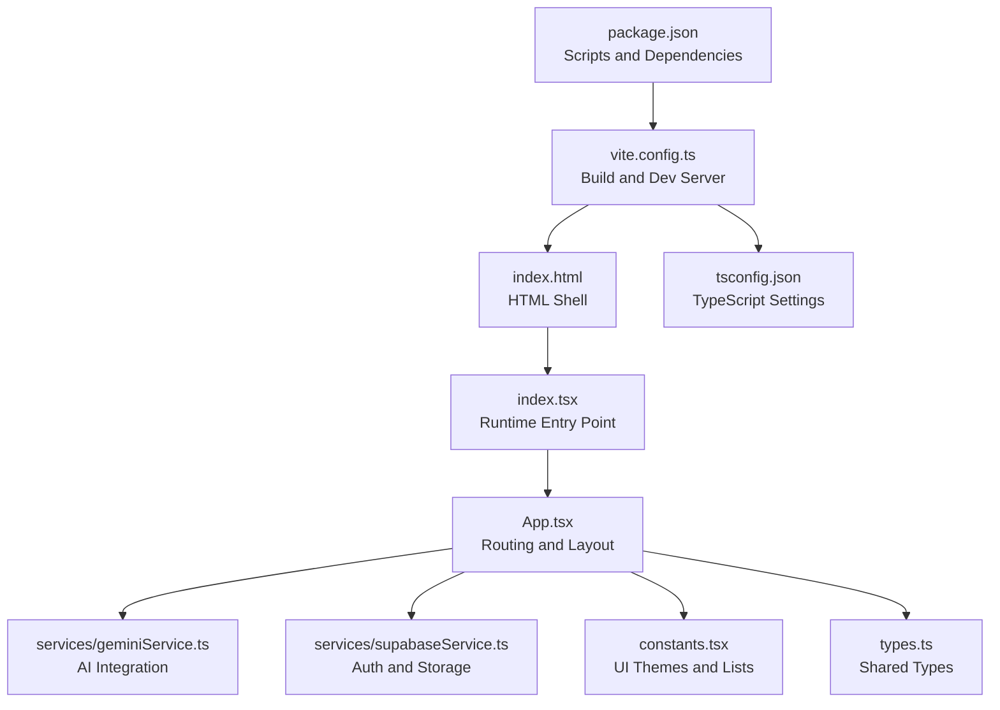
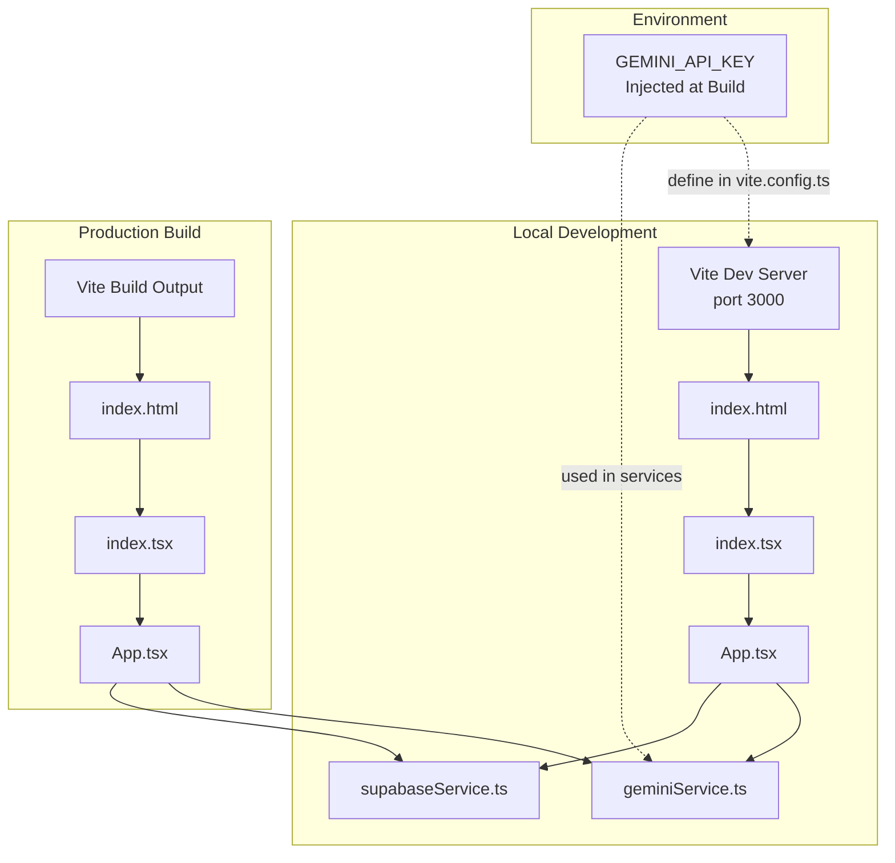
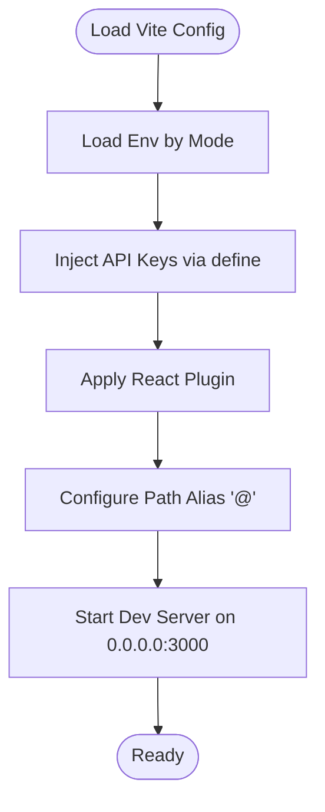
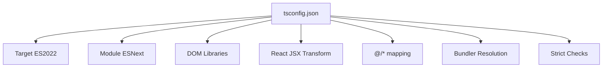
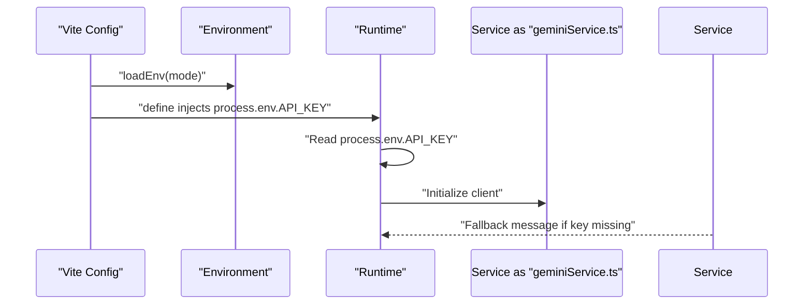
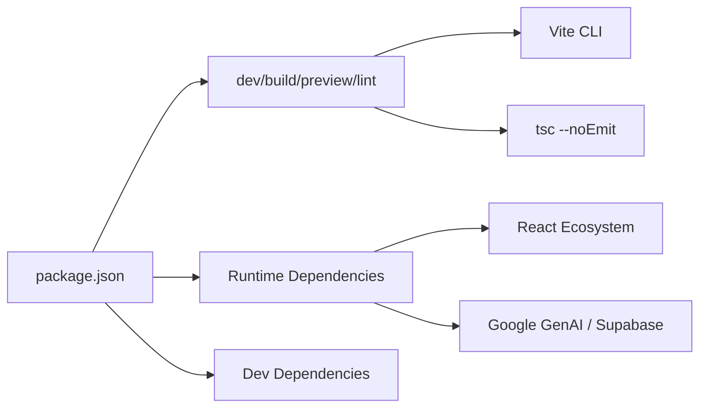
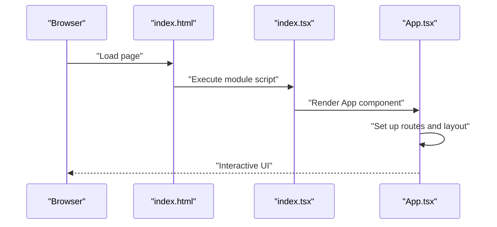
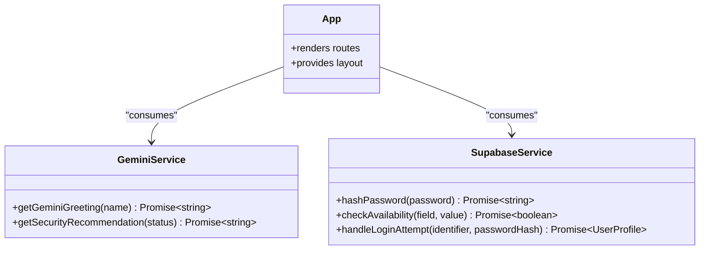
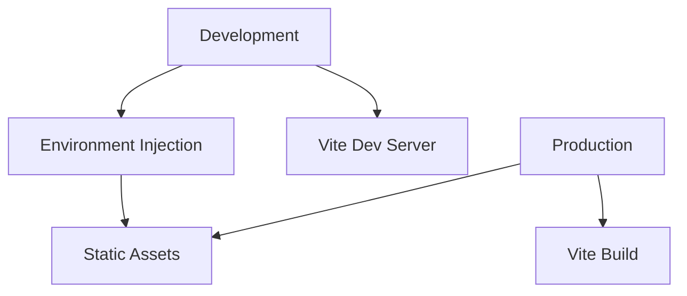
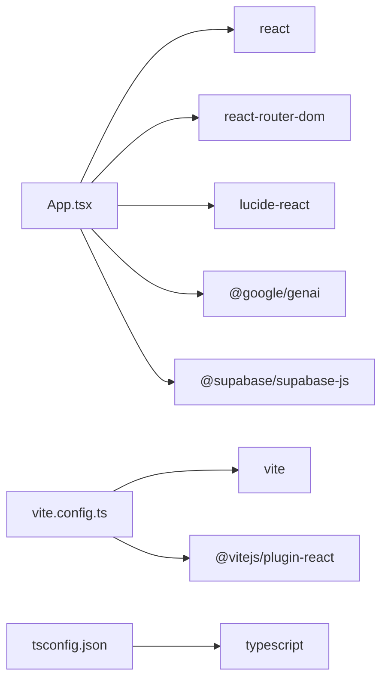

# Configuration and Deployment

<cite>
**Referenced Files in This Document**
- [package.json](file://package.json)
- [vite.config.ts](file://vite.config.ts)
- [tsconfig.json](file://tsconfig.json)
- [README.md](file://README.md)
- [index.html](file://index.html)
- [index.tsx](file://index.tsx)
- [App.tsx](file://App.tsx)
- [services/geminiService.ts](file://services/geminiService.ts)
- [services/supabaseService.ts](file://services/supabaseService.ts)
- [constants.tsx](file://constants.tsx)
- [types.ts](file://types.ts)
</cite>

## Table of Contents
1. [Introduction](#introduction)
2. [Project Structure](#project-structure)
3. [Core Components](#core-components)
4. [Architecture Overview](#architecture-overview)
5. [Detailed Component Analysis](#detailed-component-analysis)
6. [Dependency Analysis](#dependency-analysis)
7. [Performance Considerations](#performance-considerations)
8. [Troubleshooting Guide](#troubleshooting-guide)
9. [Conclusion](#conclusion)
10. [Appendices](#appendices)

## Introduction
This document explains how to configure and deploy the ZPRIA application. It covers the Vite build configuration, TypeScript compilation settings, environment variable management (including GEMINI_API_KEY), development versus production differences, optimization strategies, and deployment preparation. It also documents the package.json scripts, dependency management, build pipeline, environment-specific settings, security considerations for API keys, deployment topology options, CI/CD pipeline setup, automated testing integration, release management processes, performance optimization techniques, bundle analysis, deployment troubleshooting, scaling considerations, monitoring setup, and maintenance procedures for production environments.

## Project Structure
The project is a React application using Vite for bundling and TypeScript for type safety. Key configuration files and runtime entry points are located at the repository root, while application code is organized under components, pages, services, and shared assets.

**Diagram sources**
- [package.json](file://package.json#L1-L27)
- [vite.config.ts](file://vite.config.ts#L1-L24)
- [index.html](file://index.html#L1-L108)
- [index.tsx](file://index.tsx#L1-L17)
- [App.tsx](file://App.tsx#L1-L279)
- [services/geminiService.ts](file://services/geminiService.ts#L1-L39)
- [services/supabaseService.ts](file://services/supabaseService.ts#L1-L67)
- [tsconfig.json](file://tsconfig.json#L1-L29)
- [constants.tsx](file://constants.tsx#L1-L361)
- [types.ts](file://types.ts#L1-L79)

**Section sources**
- [package.json](file://package.json#L1-L27)
- [vite.config.ts](file://vite.config.ts#L1-L24)
- [tsconfig.json](file://tsconfig.json#L1-L29)
- [README.md](file://README.md#L1-L21)
- [index.html](file://index.html#L1-L108)
- [index.tsx](file://index.tsx#L1-L17)
- [App.tsx](file://App.tsx#L1-L279)

## Core Components
- Build and Dev Server: Vite configuration defines the dev server port, plugin stack, environment variable injection, and path aliases.
- TypeScript Compilation: Strict compiler options enable modern JS features, module resolution, and JSX generation.
- Environment Variables: GEMINI_API_KEY is loaded via Vite’s environment loading and injected into the app at build time.
- Runtime Entry: index.tsx mounts the React root and renders App.tsx.
- Services: Gemini integration for AI-generated content and Supabase integration for authentication and storage.
- UI and Types: Shared constants and types support routing, theming, and data modeling.

**Section sources**
- [vite.config.ts](file://vite.config.ts#L5-L23)
- [tsconfig.json](file://tsconfig.json#L2-L28)
- [index.tsx](file://index.tsx#L1-L17)
- [App.tsx](file://App.tsx#L1-L279)
- [services/geminiService.ts](file://services/geminiService.ts#L1-L39)
- [services/supabaseService.ts](file://services/supabaseService.ts#L1-L67)
- [constants.tsx](file://constants.tsx#L1-L361)
- [types.ts](file://types.ts#L1-L79)

## Architecture Overview
The application uses a client-side React architecture with Vite for development and production builds. Environment variables are injected at build time, and the HTML shell loads ES modules via import maps for efficient delivery.

**Diagram sources**
- [vite.config.ts](file://vite.config.ts#L5-L23)
- [index.html](file://index.html#L88-L100)
- [index.tsx](file://index.tsx#L1-L17)
- [App.tsx](file://App.tsx#L1-L279)
- [services/geminiService.ts](file://services/geminiService.ts#L1-L39)

## Detailed Component Analysis

### Vite Build Configuration
- Dev Server: Configured to bind to 0.0.0.0 on port 3000 for containerized/local access.
- Plugins: React plugin included for JSX transformations and Fast Refresh.
- Environment Injection: GEMINI_API_KEY is read from the environment and injected into the app via define to expose process.env.API_KEY and process.env.GEMINI_API_KEY.
- Path Aliasing: Alias '@' resolves to the project root for clean imports.

**Diagram sources**
- [vite.config.ts](file://vite.config.ts#L5-L23)

**Section sources**
- [vite.config.ts](file://vite.config.ts#L5-L23)

### TypeScript Compilation Settings
- Target and Modules: ES2022 target with ESNext modules and DOM libraries.
- JSX and Paths: React JSX transform and path mapping for '@/*'.
- Module Resolution: Bundler resolution with module detection and allowImportingTsExtensions.
- Strictness: No emit, isolated modules, skipLibCheck for faster builds.

**Diagram sources**
- [tsconfig.json](file://tsconfig.json#L2-L28)

**Section sources**
- [tsconfig.json](file://tsconfig.json#L1-L29)

### Environment Variable Management (GEMINI_API_KEY)
- Loading: Vite loads environment variables by mode and exposes them to the config.
- Injection: The API key is injected into the app via define so it is available at runtime as process.env.API_KEY and process.env.GEMINI_API_KEY.
- Usage: Services consume process.env.API_KEY to initialize AI clients and provide fallbacks when the key is missing.

**Diagram sources**
- [vite.config.ts](file://vite.config.ts#L5-L16)
- [services/geminiService.ts](file://services/geminiService.ts#L4-L20)

**Section sources**
- [vite.config.ts](file://vite.config.ts#L5-L16)
- [services/geminiService.ts](file://services/geminiService.ts#L1-L39)

### Package Scripts and Dependency Management
- Scripts:
  - dev: Starts the Vite dev server.
  - build: Produces the production build.
  - preview: Serves the built assets locally for preview.
  - lint: Runs TypeScript type checking without emitting.
- Dependencies:
  - React, React DOM, React Router DOM, Google GenAI SDK, Supabase JS SDK, Lucide React.
- Dev Dependencies:
  - @types/node, @vitejs/plugin-react, TypeScript, Vite.

**Diagram sources**
- [package.json](file://package.json#L6-L25)

**Section sources**
- [package.json](file://package.json#L1-L27)

### Application Entry and Routing
- Entry Point: index.tsx creates the root and renders App.tsx.
- App: Defines global layout, lazy-loaded routes, and theme persistence using localStorage.
- Routing: Uses React Router DOM for navigation and nested layouts.

**Diagram sources**
- [index.html](file://index.html#L103-L107)
- [index.tsx](file://index.tsx#L1-L17)
- [App.tsx](file://App.tsx#L218-L276)

**Section sources**
- [index.html](file://index.html#L1-L108)
- [index.tsx](file://index.tsx#L1-L17)
- [App.tsx](file://App.tsx#L1-L279)

### AI and Authentication Services
- Gemini Service:
  - Initializes Google GenAI with process.env.API_KEY.
  - Provides greeting and security recommendation functions with graceful fallbacks.
- Supabase Service:
  - Creates a client with a public URL and anonymous key.
  - Implements password hashing, availability checks, and login attempt handling with lockouts.

**Diagram sources**
- [services/geminiService.ts](file://services/geminiService.ts#L1-L39)
- [services/supabaseService.ts](file://services/supabaseService.ts#L1-L67)
- [App.tsx](file://App.tsx#L1-L279)

**Section sources**
- [services/geminiService.ts](file://services/geminiService.ts#L1-L39)
- [services/supabaseService.ts](file://services/supabaseService.ts#L1-L67)

### Development vs Production Build Differences
- Development:
  - Vite dev server runs on port 3000, host bound to 0.0.0.0 for external access.
  - Environment variables are loaded via Vite and injected at build time.
- Production:
  - Vite build generates optimized static assets.
  - Environment variables are embedded at build time; runtime relies on injected values.
  - HTML uses import maps for ES module delivery.

**Diagram sources**
- [vite.config.ts](file://vite.config.ts#L8-L16)
- [index.html](file://index.html#L88-L100)

**Section sources**
- [vite.config.ts](file://vite.config.ts#L5-L23)
- [index.html](file://index.html#L1-L108)

### Optimization Strategies
- Code Splitting and Lazy Loading:
  - Secondary pages are dynamically imported to reduce initial bundle size.
- Tree Shaking and Module Resolution:
  - Bundler module resolution and isolated modules improve build performance.
- Asset Delivery:
  - ES modules via import maps reduce reliance on heavy polyfills.
- Environment Injection:
  - Injecting API keys at build time avoids runtime fetching overhead.

**Section sources**
- [App.tsx](file://App.tsx#L10-L27)
- [tsconfig.json](file://tsconfig.json#L16-L18)
- [index.html](file://index.html#L88-L100)

### Deployment Preparation
- Local Preview:
  - Use the preview script to serve built assets locally before deployment.
- Static Hosting:
  - Serve the dist folder generated by the build script from any static host.
- Environment:
  - Ensure GEMINI_API_KEY is present during build for production deployments.

**Section sources**
- [package.json](file://package.json#L6-L10)
- [README.md](file://README.md#L16-L20)

### Environment-Specific Settings and Security Considerations
- Environment Variables:
  - GEMINI_API_KEY is loaded via Vite and injected into the app.
  - Services read process.env.API_KEY to initialize clients.
- Security:
  - API keys are embedded at build time; protect source repositories and CI secrets.
  - Fallback messages are returned when the key is missing to avoid exposing sensitive errors.
  - Supabase anonymous key is embedded; restrict database permissions and use Row Level Security.

**Section sources**
- [vite.config.ts](file://vite.config.ts#L13-L16)
- [services/geminiService.ts](file://services/geminiService.ts#L4-L20)
- [services/supabaseService.ts](file://services/supabaseService.ts#L4-L7)

### CI/CD Pipeline Setup, Automated Testing, and Release Management
- CI/CD:
  - Configure a pipeline to install dependencies, build, and publish artifacts.
  - Store GEMINI_API_KEY in CI secrets and export it during the build phase.
- Automated Testing:
  - Integrate unit tests with a framework compatible with Vite and React.
  - Run linting (tsc --noEmit) as part of pre-commit and CI checks.
- Release Management:
  - Tag releases and automate artifact publishing to a CDN or static hosting provider.

[No sources needed since this section provides general guidance]

### Bundle Analysis and Performance Monitoring
- Bundle Analysis:
  - Use Vite plugins or external tools to inspect bundle composition and identify large dependencies.
- Performance Monitoring:
  - Track Core Web Vitals and runtime metrics in production.
  - Optimize images and fonts; leverage caching strategies.

[No sources needed since this section provides general guidance]

### Deployment Topology Options
- Static Hosting:
  - Deploy dist to platforms supporting static sites.
- Edge/CDN:
  - Use edge networks for low-latency delivery.
- Containerization:
  - Package the app in a minimal container image and run behind a reverse proxy.

[No sources needed since this section provides general guidance]

## Dependency Analysis
The application depends on React, routing, UI icons, AI SDK, and Supabase. Vite and TypeScript manage the build and type system.

**Diagram sources**
- [App.tsx](file://App.tsx#L1-L279)
- [package.json](file://package.json#L12-L25)
- [vite.config.ts](file://vite.config.ts#L1-L3)
- [tsconfig.json](file://tsconfig.json#L21-L24)

**Section sources**
- [package.json](file://package.json#L12-L25)
- [vite.config.ts](file://vite.config.ts#L1-L3)
- [tsconfig.json](file://tsconfig.json#L21-L24)

## Performance Considerations
- Prefer lazy loading for non-critical routes.
- Minimize third-party dependencies and audit bundle size regularly.
- Use ES modules and import maps for efficient loading.
- Keep TypeScript strict settings to catch performance-related issues early.

[No sources needed since this section provides general guidance]

## Troubleshooting Guide
- Missing GEMINI_API_KEY:
  - Symptoms: AI features fall back to generic messages.
  - Action: Set GEMINI_API_KEY in the environment and rebuild.
- Supabase Access Issues:
  - Symptoms: Login or registration failures.
  - Action: Verify database permissions, RLS policies, and network connectivity.
- Build Failures:
  - Symptoms: Type errors or plugin conflicts.
  - Action: Run lint script and ensure dependencies are installed.

**Section sources**
- [services/geminiService.ts](file://services/geminiService.ts#L4-L20)
- [services/supabaseService.ts](file://services/supabaseService.ts#L36-L66)
- [package.json](file://package.json#L10-L10)

## Conclusion
ZPRIA’s configuration leverages Vite for a fast developer experience and optimized production builds, TypeScript for safety, and environment injection for secure API key handling. By following the outlined deployment and optimization practices, teams can reliably deliver and maintain the application across environments.

[No sources needed since this section summarizes without analyzing specific files]

## Appendices

### Appendix A: Environment Variable Reference
- GEMINI_API_KEY: Required for AI features; injected at build time.

**Section sources**
- [vite.config.ts](file://vite.config.ts#L13-L16)
- [services/geminiService.ts](file://services/geminiService.ts#L4-L20)

### Appendix B: Build and Preview Commands
- npm run dev: Start the Vite dev server.
- npm run build: Produce the production build.
- npm run preview: Serve built assets locally.
- npm run lint: Run TypeScript type checks.

**Section sources**
- [package.json](file://package.json#L6-L10)
- [README.md](file://README.md#L16-L20)