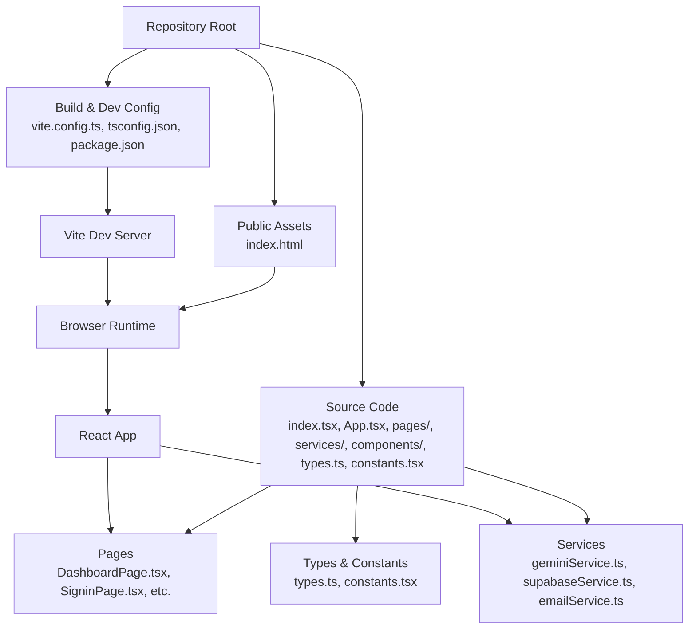
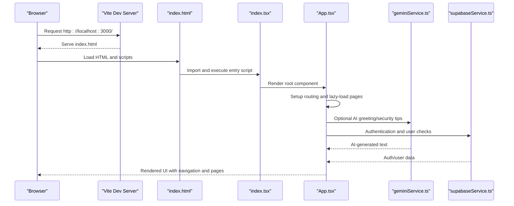
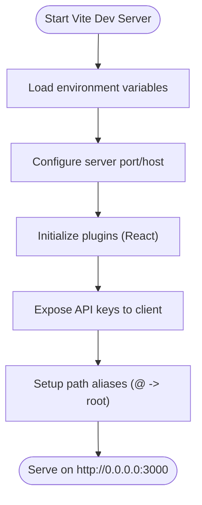
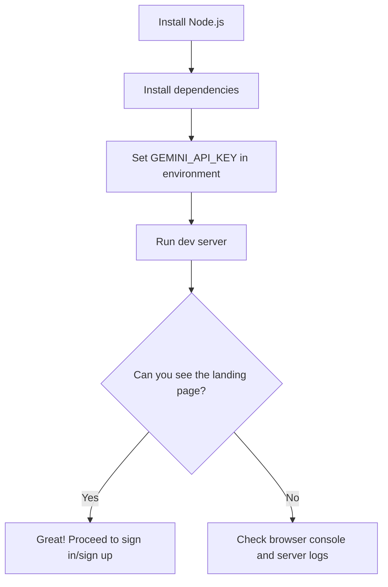
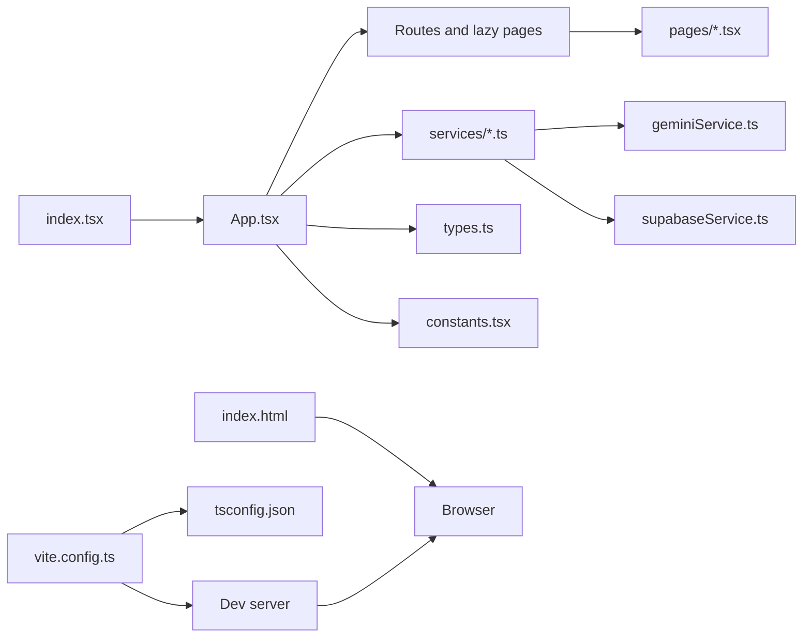
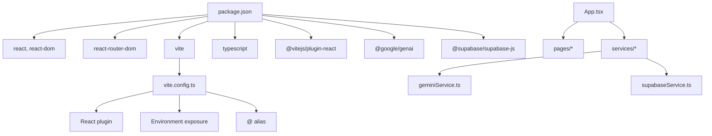

# Getting Started

<cite>
**Referenced Files in This Document**
- [README.md](file://README.md)
- [package.json](file://package.json)
- [vite.config.ts](file://vite.config.ts)
- [index.html](file://index.html)
- [index.tsx](file://index.tsx)
- [App.tsx](file://App.tsx)
- [constants.tsx](file://constants.tsx)
- [tsconfig.json](file://tsconfig.json)
- [types.ts](file://types.ts)
- [services/geminiService.ts](file://services/geminiService.ts)
- [services/supabaseService.ts](file://services/supabaseService.ts)
- [pages/DashboardPage.tsx](file://pages/DashboardPage.tsx)
</cite>

## Table of Contents
1. [Introduction](#introduction)
2. [Project Structure](#project-structure)
3. [Core Components](#core-components)
4. [Architecture Overview](#architecture-overview)
5. [Detailed Component Analysis](#detailed-component-analysis)
6. [Dependency Analysis](#dependency-analysis)
7. [Performance Considerations](#performance-considerations)
8. [Troubleshooting Guide](#troubleshooting-guide)
9. [Conclusion](#conclusion)
10. [Appendices](#appendices)

## Introduction
This guide helps you install, configure, and run the ZPRIA Account Management System locally. It covers prerequisites, environment setup, local development server startup, project structure overview, key configuration files, and initial verification steps. Practical examples show how to access pages after starting the server.

## Project Structure
The application is a React-based single-page application built with Vite and TypeScript. It uses routing for multiple pages, integrates with Supabase for authentication and user data, and uses the Gemini AI SDK for dynamic content generation.

**Diagram sources**
- [index.tsx](file://index.tsx#L1-L17)
- [App.tsx](file://App.tsx#L1-L279)
- [vite.config.ts](file://vite.config.ts#L1-L24)
- [tsconfig.json](file://tsconfig.json#L1-L29)
- [package.json](file://package.json#L1-L27)
- [index.html](file://index.html#L1-L108)

**Section sources**
- [README.md](file://README.md#L1-L21)
- [package.json](file://package.json#L1-L27)
- [vite.config.ts](file://vite.config.ts#L1-L24)
- [tsconfig.json](file://tsconfig.json#L1-L29)
- [index.html](file://index.html#L1-L108)
- [index.tsx](file://index.tsx#L1-L17)
- [App.tsx](file://App.tsx#L1-L279)

## Core Components
- Entry point and rendering: mounts the React app and renders the root component.
- Routing and layout: defines routes for all pages and wraps them in a shared layout with header, footer, and lazy-loaded pages.
- Configuration: Vite config sets up the dev server, plugin chain, environment variable exposure, and path aliases.
- Type system: shared types for user profiles, authentication state, and products.
- Constants: theme variants, country list, and logos used across the UI.
- Services: Gemini AI integration for dynamic messages and Supabase integration for authentication and user checks.

**Section sources**
- [index.tsx](file://index.tsx#L1-L17)
- [App.tsx](file://App.tsx#L1-L279)
- [vite.config.ts](file://vite.config.ts#L1-L24)
- [types.ts](file://types.ts#L1-L79)
- [constants.tsx](file://constants.tsx#L1-L361)
- [services/geminiService.ts](file://services/geminiService.ts#L1-L39)
- [services/supabaseService.ts](file://services/supabaseService.ts#L1-L67)

## Architecture Overview
The runtime architecture ties together the browser, Vite dev server, React app, routing, and service integrations.

**Diagram sources**
- [index.html](file://index.html#L1-L108)
- [index.tsx](file://index.tsx#L1-L17)
- [App.tsx](file://App.tsx#L1-L279)
- [services/geminiService.ts](file://services/geminiService.ts#L1-L39)
- [services/supabaseService.ts](file://services/supabaseService.ts#L1-L67)

## Detailed Component Analysis

### Local Development Server
- Port and host: configured to listen on port 3000 and bind to 0.0.0.0.
- Plugins: React Fast Refresh via the official Vite plugin.
- Environment exposure: exposes the Gemini API key to client code during development.
- Path aliases: resolves imports prefixed with "@" to the repository root.

**Diagram sources**
- [vite.config.ts](file://vite.config.ts#L1-L24)

**Section sources**
- [vite.config.ts](file://vite.config.ts#L1-L24)

### Environment Setup and Verification
- Prerequisites: Node.js is required.
- Install dependencies: run the standard install command.
- Configure Gemini API key: set the key in the environment so the app can call the AI service.
- Start the dev server: run the dev script to launch the local server.
- Verify: open the browser to the configured URL and confirm the landing page loads.

**Section sources**
- [README.md](file://README.md#L11-L21)
- [package.json](file://package.json#L6-L11)
- [vite.config.ts](file://vite.config.ts#L13-L16)

### Project Structure Overview
- Entry point: initializes React and renders the root App component.
- App shell: sets up routing, lazy-loading, and layout wrappers.
- Pages: individual route components under pages/.
- Services: integrations for Gemini AI and Supabase.
- Types and constants: shared type definitions and UI constants.
- Build config: Vite and TypeScript configurations.

**Diagram sources**
- [index.tsx](file://index.tsx#L1-L17)
- [App.tsx](file://App.tsx#L1-L279)
- [services/geminiService.ts](file://services/geminiService.ts#L1-L39)
- [services/supabaseService.ts](file://services/supabaseService.ts#L1-L67)
- [types.ts](file://types.ts#L1-L79)
- [constants.tsx](file://constants.tsx#L1-L361)
- [vite.config.ts](file://vite.config.ts#L1-L24)
- [tsconfig.json](file://tsconfig.json#L1-L29)
- [index.html](file://index.html#L1-L108)

**Section sources**
- [index.tsx](file://index.tsx#L1-L17)
- [App.tsx](file://App.tsx#L1-L279)
- [services/geminiService.ts](file://services/geminiService.ts#L1-L39)
- [services/supabaseService.ts](file://services/supabaseService.ts#L1-L67)
- [types.ts](file://types.ts#L1-L79)
- [constants.tsx](file://constants.tsx#L1-L361)
- [vite.config.ts](file://vite.config.ts#L1-L24)
- [tsconfig.json](file://tsconfig.json#L1-L29)
- [index.html](file://index.html#L1-L108)

### Key Configuration Files
- vite.config.ts: defines dev server, plugins, environment variable exposure, and path aliases.
- tsconfig.json: compiler options, module resolution, JSX, and path mapping.
- package.json: scripts, dependencies, and devDependencies.
- index.html: HTML shell, Tailwind CDN, Inter font, import map for ES modules, and root div.
- index.tsx: React root mounting logic.

**Section sources**
- [vite.config.ts](file://vite.config.ts#L1-L24)
- [tsconfig.json](file://tsconfig.json#L1-L29)
- [package.json](file://package.json#L1-L27)
- [index.html](file://index.html#L1-L108)
- [index.tsx](file://index.tsx#L1-L17)

### Initial Setup Verification
- Confirm the dev server starts on port 3000 and serves index.html.
- Open the browser and navigate to the root route to verify the landing page renders.
- Test navigation to common pages such as sign in and sign up to ensure routing works.

**Section sources**
- [README.md](file://README.md#L11-L21)
- [App.tsx](file://App.tsx#L252-L272)
- [pages/DashboardPage.tsx](file://pages/DashboardPage.tsx#L1-L200)

## Dependency Analysis
The application relies on React, React Router, Vite, TypeScript, and external services for AI and authentication.

**Diagram sources**
- [package.json](file://package.json#L1-L27)
- [vite.config.ts](file://vite.config.ts#L1-L24)
- [App.tsx](file://App.tsx#L1-L279)
- [services/geminiService.ts](file://services/geminiService.ts#L1-L39)
- [services/supabaseService.ts](file://services/supabaseService.ts#L1-L67)

**Section sources**
- [package.json](file://package.json#L1-L27)
- [vite.config.ts](file://vite.config.ts#L1-L24)

## Performance Considerations
- Lazy loading: pages are dynamically imported to reduce initial bundle size.
- Dev server: Vite provides fast refresh and optimized builds.
- Environment exposure: ensure sensitive keys are not exposed in production builds; this configuration is intended for local development.

[No sources needed since this section provides general guidance]

## Troubleshooting Guide
- Missing or invalid Gemini API key:
  - Symptom: AI features may fall back to default messages.
  - Action: Set the key in your environment so it is picked up by the dev server.
- Dev server does not start:
  - Symptom: Port binding errors or missing dependencies.
  - Action: Ensure Node.js is installed, run the install command, and verify the port is free.
- Page not found or blank screen:
  - Symptom: Incorrect routing or missing root element.
  - Action: Confirm index.html contains the root div and index.tsx mounts correctly.
- Authentication or user checks failing:
  - Symptom: Login attempts fail or availability checks do not work.
  - Action: Verify Supabase connectivity and that the environment is properly configured for development.

**Section sources**
- [README.md](file://README.md#L11-L21)
- [index.html](file://index.html#L103-L106)
- [index.tsx](file://index.tsx#L6-L16)
- [services/geminiService.ts](file://services/geminiService.ts#L4-L20)
- [services/supabaseService.ts](file://services/supabaseService.ts#L1-L67)

## Conclusion
You now have the essentials to install, configure, and run the ZPRIA Account Management System locally. Use the provided steps to set up the environment, start the dev server, and verify basic functionality. Explore the pages and services to become familiar with the application’s structure and capabilities.

[No sources needed since this section summarizes without analyzing specific files]

## Appendices

### Practical Examples
- Start the local server and open the browser to the root URL.
- Navigate to the sign-in page and attempt a login using the Supabase integration.
- Visit the dashboard and theme selection pages to test routing and UI behavior.

**Section sources**
- [README.md](file://README.md#L11-L21)
- [App.tsx](file://App.tsx#L252-L272)
- [pages/DashboardPage.tsx](file://pages/DashboardPage.tsx#L1-L200)