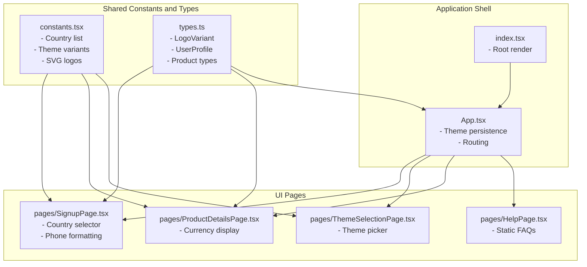
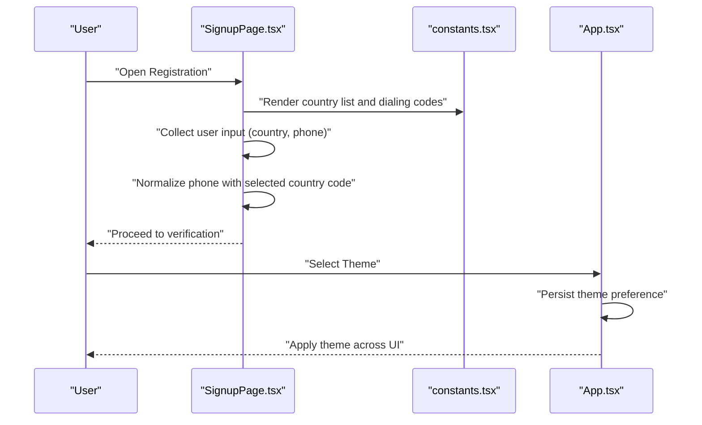
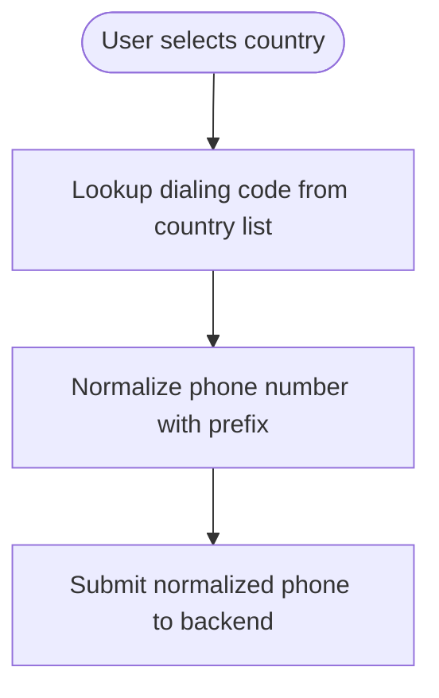
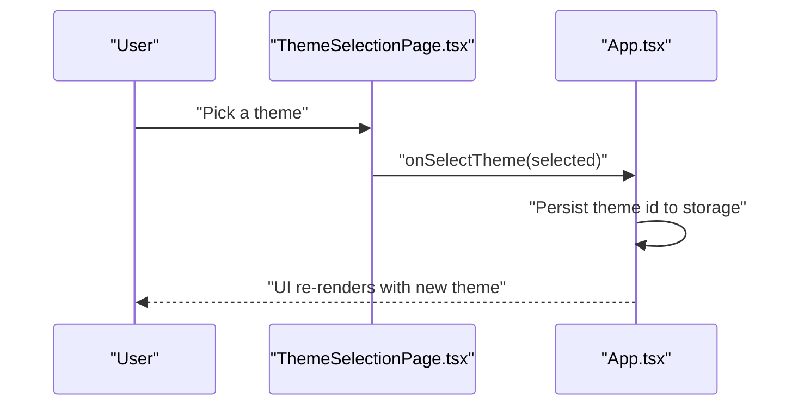
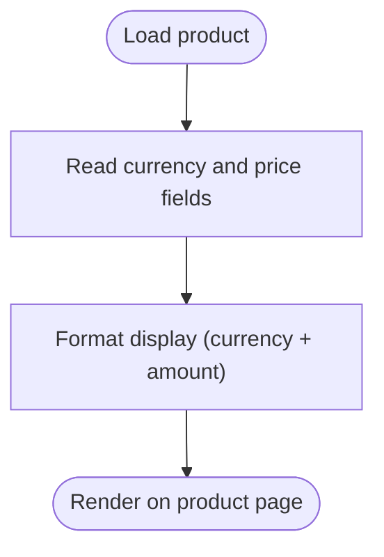
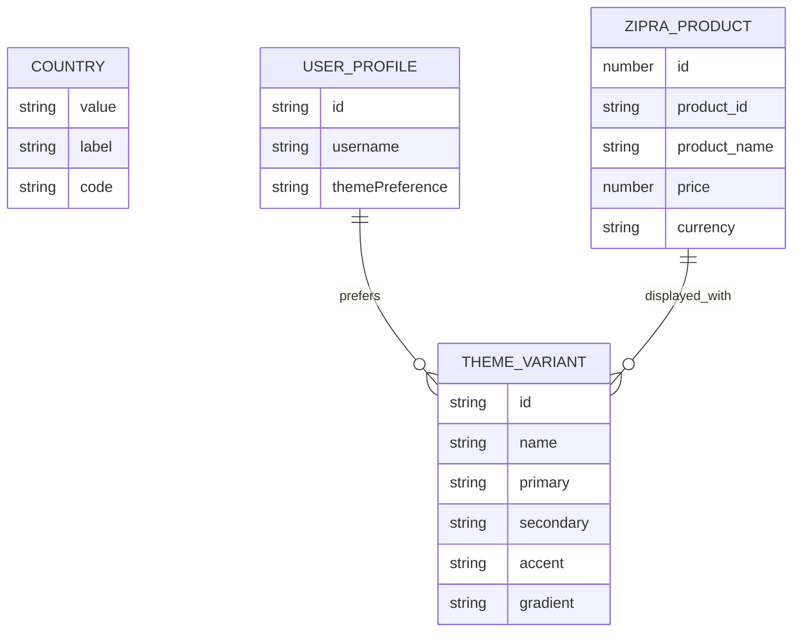
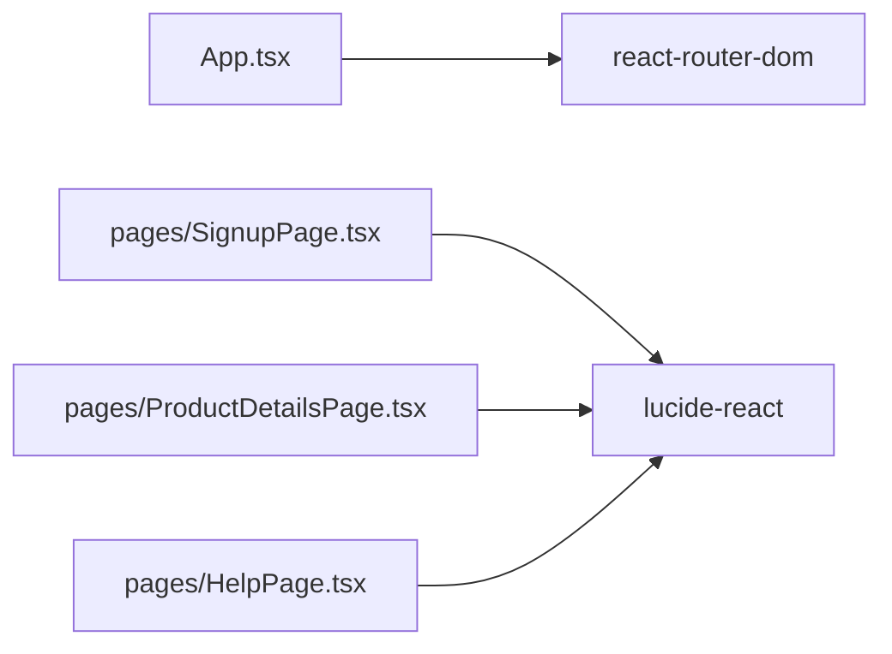

# Internationalization and Localization

<cite>
**Referenced Files in This Document**
- [constants.tsx](file://constants.tsx)
- [types.ts](file://types.ts)
- [App.tsx](file://App.tsx)
- [pages/SignupPage.tsx](file://pages/SignupPage.tsx)
- [pages/ThemeSelectionPage.tsx](file://pages/ThemeSelectionPage.tsx)
- [pages/ProductDetailsPage.tsx](file://pages/ProductDetailsPage.tsx)
- [pages/HelpPage.tsx](file://pages/HelpPage.tsx)
- [index.tsx](file://index.tsx)
- [package.json](file://package.json)
</cite>

## Table of Contents
1. [Introduction](#introduction)
2. [Project Structure](#project-structure)
3. [Core Components](#core-components)
4. [Architecture Overview](#architecture-overview)
5. [Detailed Component Analysis](#detailed-component-analysis)
6. [Dependency Analysis](#dependency-analysis)
7. [Performance Considerations](#performance-considerations)
8. [Troubleshooting Guide](#troubleshooting-guide)
9. [Conclusion](#conclusion)

## Introduction
This document explains the ZPRIA internationalization and localization system. The project supports 271+ countries via a curated country list, integrates currency-aware product pricing, and provides a flexible theme system that influences UI appearance and branding. While the current implementation focuses on static text and theme selection, the architecture is designed to accommodate future enhancements for locale-aware date/time formatting, number/currency display, and multi-language content.

## Project Structure
The internationalization-related logic is primarily concentrated in shared constants and types, with UI components consuming these values to render region-aware content and theme variants.

**Diagram sources**
- [constants.tsx](file://constants.tsx#L27-L271)
- [types.ts](file://types.ts#L2-L31)
- [App.tsx](file://App.tsx#L218-L276)
- [pages/SignupPage.tsx](file://pages/SignupPage.tsx#L12-L149)
- [pages/ThemeSelectionPage.tsx](file://pages/ThemeSelectionPage.tsx#L12-L77)
- [pages/ProductDetailsPage.tsx](file://pages/ProductDetailsPage.tsx#L22-L170)
- [pages/HelpPage.tsx](file://pages/HelpPage.tsx#L6-L161)
- [index.tsx](file://index.tsx#L1-L17)

**Section sources**
- [constants.tsx](file://constants.tsx#L1-L361)
- [types.ts](file://types.ts#L1-L79)
- [App.tsx](file://App.tsx#L218-L276)
- [pages/SignupPage.tsx](file://pages/SignupPage.tsx#L12-L149)
- [pages/ThemeSelectionPage.tsx](file://pages/ThemeSelectionPage.tsx#L12-L77)
- [pages/ProductDetailsPage.tsx](file://pages/ProductDetailsPage.tsx#L22-L170)
- [pages/HelpPage.tsx](file://pages/HelpPage.tsx#L6-L161)
- [index.tsx](file://index.tsx#L1-L17)

## Core Components
- Country list and dialing codes: Provides 271+ countries with ISO alpha-2 codes and international dialing prefixes used for phone number normalization during registration.
- Theme variants: Defines brandable color schemes and gradients consumed by the theme selection page and persisted in user preferences.
- Product model: Includes currency and price fields enabling per-product pricing display.
- Authentication state: Stores user theme preference and persists it across sessions.

Key implementation references:
- Country list and dialing codes: [constants.tsx](file://constants.tsx#L27-L271)
- Theme variants and defaults: [constants.tsx](file://constants.tsx#L5-L25)
- Theme persistence and routing: [App.tsx](file://App.tsx#L218-L246)
- Currency display in product details: [pages/ProductDetailsPage.tsx](file://pages/ProductDetailsPage.tsx#L168-L170)
- Country selection in signup: [pages/SignupPage.tsx](file://pages/SignupPage.tsx#L211-L214)

**Section sources**
- [constants.tsx](file://constants.tsx#L5-L25)
- [constants.tsx](file://constants.tsx#L27-L271)
- [App.tsx](file://App.tsx#L218-L246)
- [pages/ProductDetailsPage.tsx](file://pages/ProductDetailsPage.tsx#L168-L170)
- [pages/SignupPage.tsx](file://pages/SignupPage.tsx#L211-L214)

## Architecture Overview
The internationalization architecture centers on three pillars:
- Regional identifiers: Country list and dialing codes enable consistent phone number formatting and region-aware UI elements.
- Currency awareness: Product pricing includes currency codes, enabling localized display.
- Theme-driven UI: Theme variants influence branding and visual identity across pages.

**Diagram sources**
- [pages/SignupPage.tsx](file://pages/SignupPage.tsx#L112-L115)
- [constants.tsx](file://constants.tsx#L27-L271)
- [App.tsx](file://App.tsx#L231-L246)

## Detailed Component Analysis

### Country List and Dialing Codes
- Purpose: Centralized list of 271+ countries with ISO codes and dialing prefixes.
- Usage: Selected in the signup form to normalize phone numbers prior to storage.
- Extensibility: Adding a new country requires appending an entry to the list with appropriate values.

**Diagram sources**
- [constants.tsx](file://constants.tsx#L27-L271)
- [pages/SignupPage.tsx](file://pages/SignupPage.tsx#L112-L115)

**Section sources**
- [constants.tsx](file://constants.tsx#L27-L271)
- [pages/SignupPage.tsx](file://pages/SignupPage.tsx#L112-L115)

### Theme Variants and Persistence
- Purpose: Define brandable themes and persist user preference across sessions.
- Usage: Theme selection page renders variants; App.tsx reads saved theme and applies it to the layout.
- Extensibility: Adding a new theme requires updating the theme array and ensuring consistent rendering across pages.

**Diagram sources**
- [pages/ThemeSelectionPage.tsx](file://pages/ThemeSelectionPage.tsx#L12-L31)
- [App.tsx](file://App.tsx#L244-L246)

**Section sources**
- [constants.tsx](file://constants.tsx#L5-L25)
- [pages/ThemeSelectionPage.tsx](file://pages/ThemeSelectionPage.tsx#L12-L31)
- [App.tsx](file://App.tsx#L218-L246)

### Currency-Aware Product Pricing
- Purpose: Display product prices with associated currency codes.
- Usage: Product details page reads currency and price fields to present localized pricing.
- Extensibility: Future enhancements can include locale-aware number formatting and currency conversion.

**Diagram sources**
- [pages/ProductDetailsPage.tsx](file://pages/ProductDetailsPage.tsx#L168-L170)
- [types.ts](file://types.ts#L68-L78)

**Section sources**
- [pages/ProductDetailsPage.tsx](file://pages/ProductDetailsPage.tsx#L168-L170)
- [types.ts](file://types.ts#L68-L78)

### Locale Configuration and Regional Settings Management
- Current state: The application does not implement locale-specific date/time or number formatting. Regional settings are limited to country selection and dialing codes.
- Recommended approach: Introduce locale-aware formatting libraries and store user locale preferences alongside theme preferences. This enables consistent formatting across dates, numbers, and currencies.

[No sources needed since this section provides general guidance]

### Multi-Language Architecture
- Current state: Static English text is embedded in UI components. There is no centralized translation layer.
- Recommended approach: Adopt a translation framework with locale files and dynamic content loading. This allows gradual rollout of localized content while preserving existing English strings.

[No sources needed since this section provides general guidance]

### Data Models for Internationalization
- Country list: ISO code, label, dialing code.
- Theme variants: Id, name, primary/secondary/accent colors, gradient.
- Product model: Includes currency and price fields for pricing display.
- Authentication state: Stores user theme preference for persistence.

**Diagram sources**
- [constants.tsx](file://constants.tsx#L27-L271)
- [constants.tsx](file://constants.tsx#L5-L25)
- [types.ts](file://types.ts#L11-L25)
- [types.ts](file://types.ts#L43-L78)

**Section sources**
- [constants.tsx](file://constants.tsx#L27-L271)
- [constants.tsx](file://constants.tsx#L5-L25)
- [types.ts](file://types.ts#L11-L25)
- [types.ts](file://types.ts#L43-L78)

### Implementation Examples from constants.tsx and types.ts
- Country list and dialing codes: Used in the signup page to normalize phone numbers.
- Theme variants: Consumed by the theme selection page and persisted by the App shell.
- Product model: Supplies currency and price for display in product details.

References:
- Country list usage: [pages/SignupPage.tsx](file://pages/SignupPage.tsx#L112-L115)
- Theme selection: [pages/ThemeSelectionPage.tsx](file://pages/ThemeSelectionPage.tsx#L40-L51)
- Theme persistence: [App.tsx](file://App.tsx#L231-L246)
- Currency display: [pages/ProductDetailsPage.tsx](file://pages/ProductDetailsPage.tsx#L168-L170)

**Section sources**
- [pages/SignupPage.tsx](file://pages/SignupPage.tsx#L112-L115)
- [pages/ThemeSelectionPage.tsx](file://pages/ThemeSelectionPage.tsx#L40-L51)
- [App.tsx](file://App.tsx#L231-L246)
- [pages/ProductDetailsPage.tsx](file://pages/ProductDetailsPage.tsx#L168-L170)

## Dependency Analysis
External dependencies relevant to internationalization:
- react-router-dom: Enables navigation and route-based UI composition.
- lucide-react: Iconography used across pages.

**Diagram sources**
- [package.json](file://package.json#L12-L26)
- [App.tsx](file://App.tsx#L1-L276)
- [pages/SignupPage.tsx](file://pages/SignupPage.tsx#L1-L293)
- [pages/ProductDetailsPage.tsx](file://pages/ProductDetailsPage.tsx#L1-L391)
- [pages/HelpPage.tsx](file://pages/HelpPage.tsx#L1-L162)

**Section sources**
- [package.json](file://package.json#L12-L26)

## Performance Considerations
- Theme switching: Persisting and applying theme preferences is lightweight; ensure minimal re-renders by leveraging memoization and avoiding unnecessary state updates.
- Country list rendering: The 271-country dropdown is efficient for typical use cases; consider virtualization if the list grows significantly.
- Currency display: Formatting is straightforward; defer heavy computations until data is loaded.

[No sources needed since this section provides general guidance]

## Troubleshooting Guide
Common issues and resolutions:
- Phone number normalization errors: Verify that the selected country code exists in the country list and that the phone number is properly formatted before submission.
- Theme not persisting: Confirm that theme id is stored in local storage and that the App shell reads it on initialization.
- Currency display anomalies: Ensure product records include valid currency and numeric price values.

**Section sources**
- [pages/SignupPage.tsx](file://pages/SignupPage.tsx#L112-L115)
- [App.tsx](file://App.tsx#L218-L246)
- [pages/ProductDetailsPage.tsx](file://pages/ProductDetailsPage.tsx#L168-L170)

## Conclusion
ZPRIA’s current internationalization system provides a solid foundation with a comprehensive country list, dialing code normalization, theme variants, and currency-aware product pricing. To achieve full multi-language and locale-aware functionality, introduce a translation framework and locale-aware formatting for dates, numbers, and currencies. The existing architecture supports incremental enhancements while maintaining UI consistency and user preference persistence.