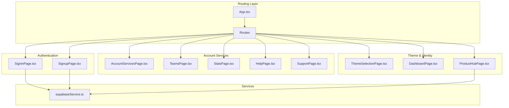
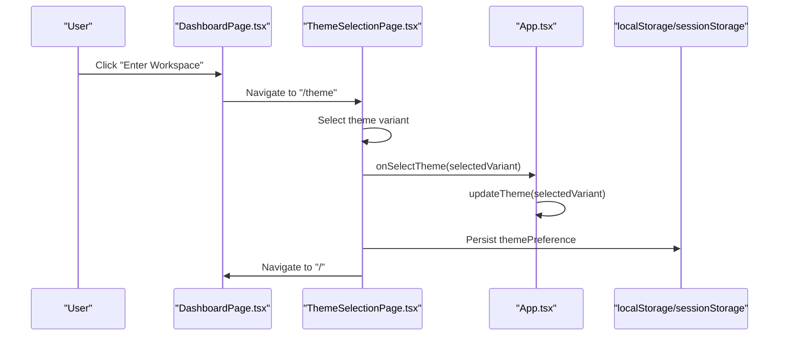
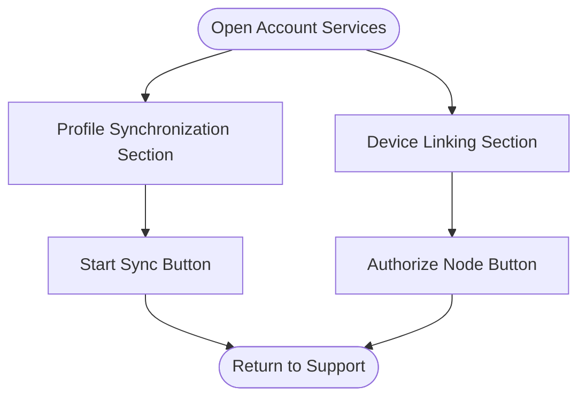
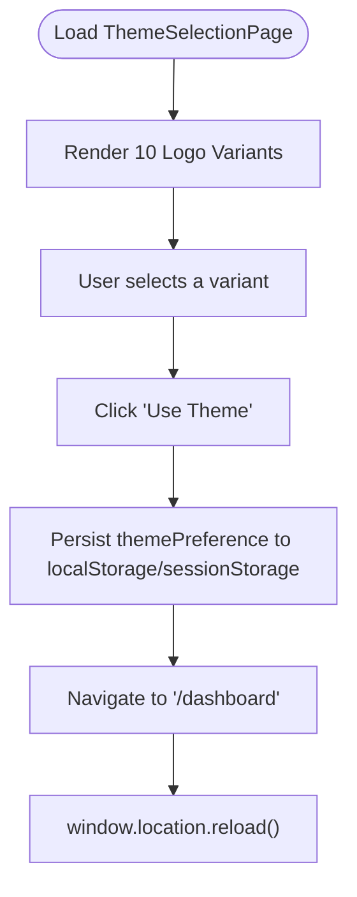
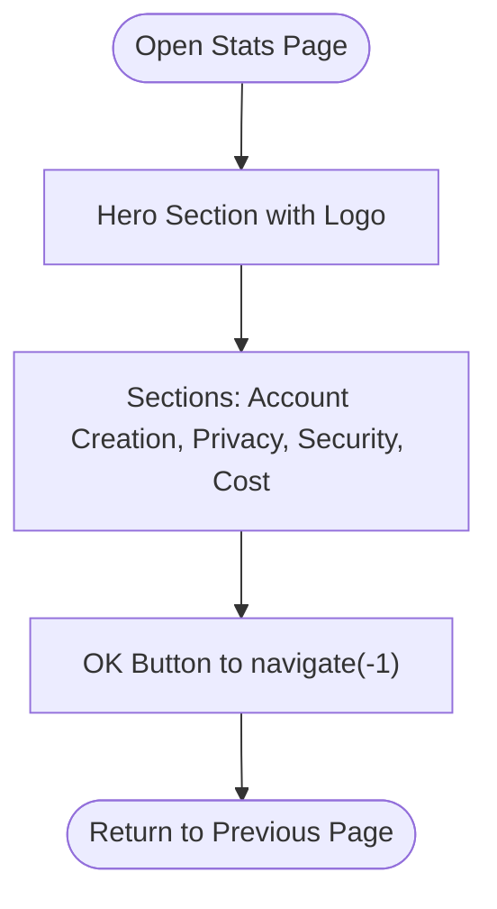
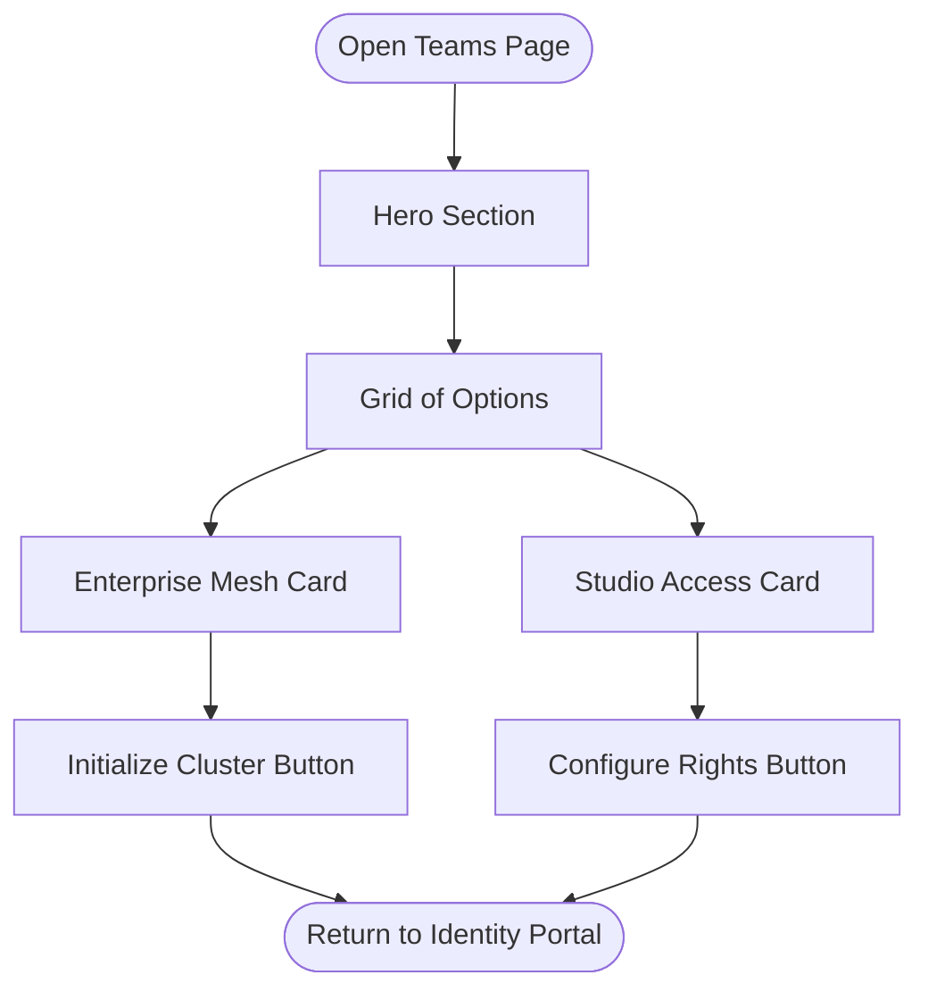
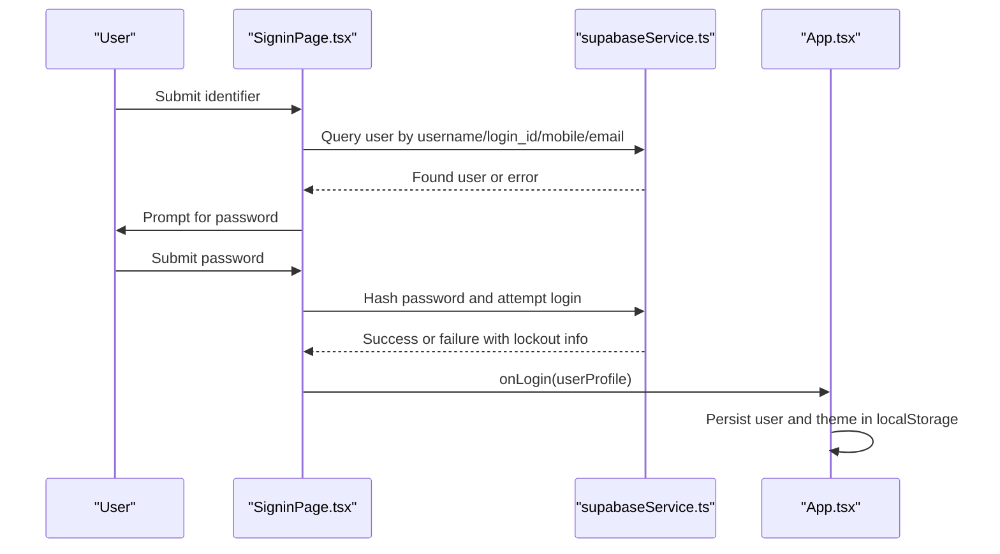
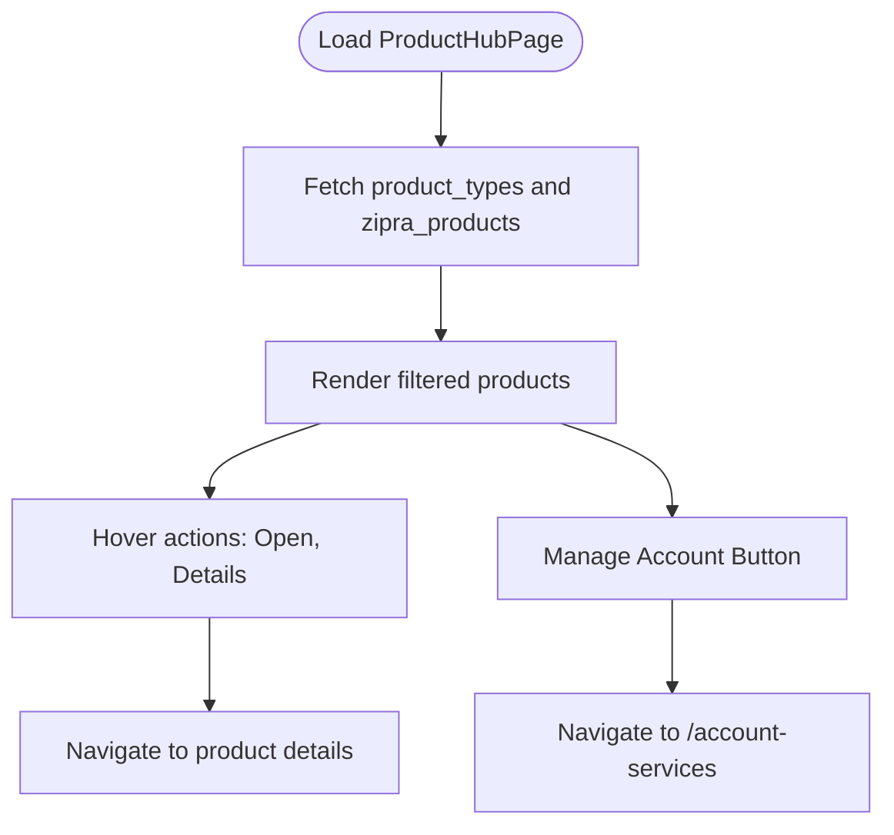
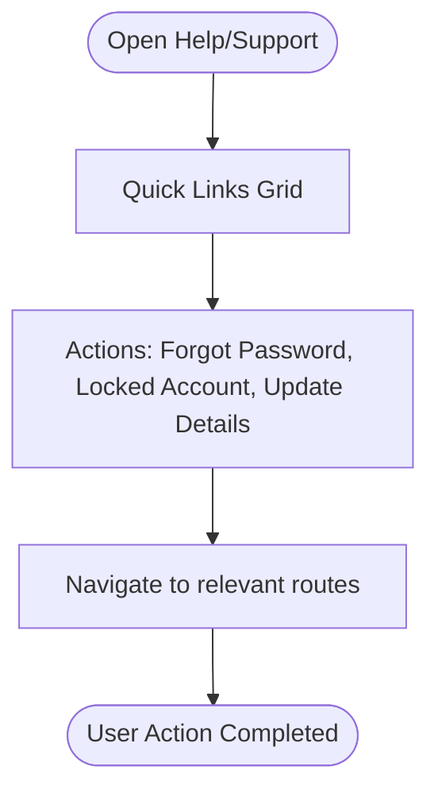
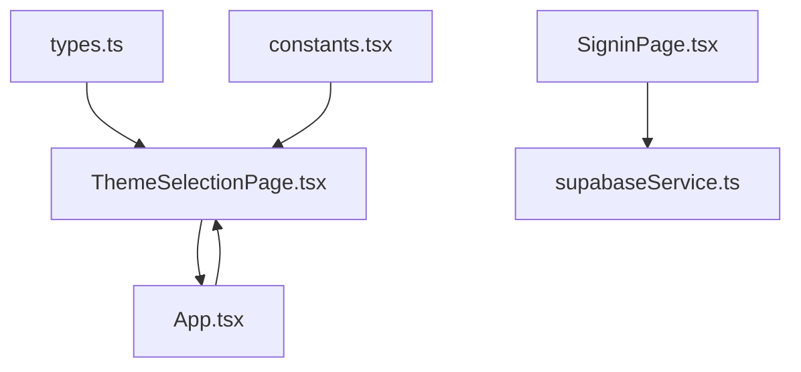

# Account Services Pages

<cite>
**Referenced Files in This Document**
- [App.tsx](file://App.tsx)
- [AccountServicesPage.tsx](file://pages/AccountServicesPage.tsx)
- [ThemeSelectionPage.tsx](file://pages/ThemeSelectionPage.tsx)
- [StatsPage.tsx](file://pages/StatsPage.tsx)
- [TeamsPage.tsx](file://pages/TeamsPage.tsx)
- [DashboardPage.tsx](file://pages/DashboardPage.tsx)
- [ProductHubPage.tsx](file://pages/ProductHubPage.tsx)
- [HelpPage.tsx](file://pages/HelpPage.tsx)
- [SupportPage.tsx](file://pages/SupportPage.tsx)
- [SigninPage.tsx](file://pages/SigninPage.tsx)
- [SignupPage.tsx](file://pages/SignupPage.tsx)
- [constants.tsx](file://constants.tsx)
- [types.ts](file://types.ts)
- [supabaseService.ts](file://services/supabaseService.ts)
</cite>

## Table of Contents
1. [Introduction](#introduction)
2. [Project Structure](#project-structure)
3. [Core Components](#core-components)
4. [Architecture Overview](#architecture-overview)
5. [Detailed Component Analysis](#detailed-component-analysis)
6. [Dependency Analysis](#dependency-analysis)
7. [Performance Considerations](#performance-considerations)
8. [Troubleshooting Guide](#troubleshooting-guide)
9. [Conclusion](#conclusion)

## Introduction
This document provides comprehensive documentation for the account services pages within the ZPRIA ecosystem, focusing on the Account Services, Theme Selection, Statistics, and Teams pages. It explains the account management interface, theme customization system with 10 logo variants, analytics dashboard implementation, team collaboration features, user profile management, and settings configuration. The documentation covers the theme switching mechanism, color scheme application, persistent user preference storage, and integration with authentication state and service layer APIs.

## Project Structure
The application follows a React-based architecture with route-driven page components. Authentication state is managed globally, and theme preferences are persisted across sessions. The pages are organized by feature areas: account services, theme selection, statistics, and teams, with supporting pages for help, support, and product hub.

**Diagram sources**
- [App.tsx](file://App.tsx#L252-L272)
- [AccountServicesPage.tsx](file://pages/AccountServicesPage.tsx#L1-L40)
- [ThemeSelectionPage.tsx](file://pages/ThemeSelectionPage.tsx#L1-L78)
- [StatsPage.tsx](file://pages/StatsPage.tsx#L1-L68)
- [TeamsPage.tsx](file://pages/TeamsPage.tsx#L1-L42)
- [DashboardPage.tsx](file://pages/DashboardPage.tsx#L1-L217)
- [ProductHubPage.tsx](file://pages/ProductHubPage.tsx#L1-L243)
- [HelpPage.tsx](file://pages/HelpPage.tsx#L1-L162)
- [SupportPage.tsx](file://pages/SupportPage.tsx#L1-L215)
- [SigninPage.tsx](file://pages/SigninPage.tsx#L1-L231)
- [SignupPage.tsx](file://pages/SignupPage.tsx#L1-L293)
- [supabaseService.ts](file://services/supabaseService.ts#L1-L67)

**Section sources**
- [App.tsx](file://App.tsx#L252-L272)
- [constants.tsx](file://constants.tsx#L1-L361)
- [types.ts](file://types.ts#L1-L79)

## Core Components
- Account Services Page: Provides profile synchronization and device linking capabilities for ZPRIA ecosystem identity management.
- Theme Selection Page: Allows users to choose from 10 logo variants with gradient-based color schemes and persist preferences.
- Statistics Page: Presents architectural protocol and FAQ content for ZPRIA help and support.
- Teams Page: Offers enterprise mesh and studio access options for collaborative creativity.
- Authentication Pages: Signin and Signup manage user credentials, availability checks, and OTP verification.
- Product Hub: Displays ecosystem products and integrates with Supabase for data fetching and filtering.
- Theme System: Centralized theme variants and default theme configuration with persistent storage.

**Section sources**
- [AccountServicesPage.tsx](file://pages/AccountServicesPage.tsx#L1-L40)
- [ThemeSelectionPage.tsx](file://pages/ThemeSelectionPage.tsx#L1-L78)
- [StatsPage.tsx](file://pages/StatsPage.tsx#L1-L68)
- [TeamsPage.tsx](file://pages/TeamsPage.tsx#L1-L42)
- [SigninPage.tsx](file://pages/SigninPage.tsx#L1-L231)
- [SignupPage.tsx](file://pages/SignupPage.tsx#L1-L293)
- [ProductHubPage.tsx](file://pages/ProductHubPage.tsx#L1-L243)
- [constants.tsx](file://constants.tsx#L5-L25)
- [types.ts](file://types.ts#L2-L9)

## Architecture Overview
The application uses React Router for navigation and manages authentication state centrally in App.tsx. Theme preferences are stored in localStorage and sessionStorage for persistence across sessions and during onboarding. The theme selection page updates the global theme and persists user preferences upon completion.

**Diagram sources**
- [DashboardPage.tsx](file://pages/DashboardPage.tsx#L134-L138)
- [ThemeSelectionPage.tsx](file://pages/ThemeSelectionPage.tsx#L12-L31)
- [App.tsx](file://App.tsx#L244-L246)

## Detailed Component Analysis

### Account Services Page
The Account Services page presents two primary management areas:
- Profile Synchronization: Updates legal name, professional credentials, and avatar metadata across the @progod.com domain.
- Device Linking: Manages authorized hardware nodes and biometric security keys associated with the universal ID.

**Diagram sources**
- [AccountServicesPage.tsx](file://pages/AccountServicesPage.tsx#L18-L29)

**Section sources**
- [AccountServicesPage.tsx](file://pages/AccountServicesPage.tsx#L1-L40)

### Theme Selection Page
The Theme Selection page enables users to personalize their ZPRIA ID with one of 10 logo variants. Each variant defines primary, secondary, accent colors, and a gradient. Users can preview themes and apply them immediately. On continue, the selected theme is persisted to localStorage and sessionStorage, and the user is navigated to the dashboard.

**Diagram sources**
- [ThemeSelectionPage.tsx](file://pages/ThemeSelectionPage.tsx#L39-L52)
- [ThemeSelectionPage.tsx](file://pages/ThemeSelectionPage.tsx#L16-L31)
- [App.tsx](file://App.tsx#L220-L229)

**Section sources**
- [ThemeSelectionPage.tsx](file://pages/ThemeSelectionPage.tsx#L1-L78)
- [constants.tsx](file://constants.tsx#L5-L25)
- [types.ts](file://types.ts#L2-L9)

### Statistics Page
The Statistics page displays architectural protocol and FAQ content for ZPRIA, emphasizing privacy and security. It includes sections covering account creation workflow, privacy architecture, security and sovereignty protocol, and ecosystem cost.

**Diagram sources**
- [StatsPage.tsx](file://pages/StatsPage.tsx#L10-L64)

**Section sources**
- [StatsPage.tsx](file://pages/StatsPage.tsx#L1-L68)

### Teams Page
The Teams page focuses on collaborative sovereignty for industrial creative units, offering:
- Enterprise Mesh: Synchronize up to 500 ZPRIA IDs under a single structural creative node.
- Studio Access: Shared vault permissions for real-time collaborative IP production.

**Diagram sources**
- [TeamsPage.tsx](file://pages/TeamsPage.tsx#L19-L31)

**Section sources**
- [TeamsPage.tsx](file://pages/TeamsPage.tsx#L1-L42)

### Authentication Integration
Authentication is handled through centralized state management and service layer integration:
- Login: Validates credentials against Supabase, resets failed attempts on success, increments on failure, and locks accounts after multiple failures.
- Registration: Checks availability of username and email, hashes passwords, creates pending registrations, and sends OTP verification.
- Theme Persistence: Persists theme preferences in localStorage and sessionStorage during theme selection.

**Diagram sources**
- [SigninPage.tsx](file://pages/SigninPage.tsx#L32-L79)
- [supabaseService.ts](file://services/supabaseService.ts#L26-L66)
- [App.tsx](file://App.tsx#L231-L242)

**Section sources**
- [SigninPage.tsx](file://pages/SigninPage.tsx#L1-L231)
- [supabaseService.ts](file://services/supabaseService.ts#L1-L67)
- [App.tsx](file://App.tsx#L219-L242)

### Product Hub Integration
The Product Hub page integrates with Supabase to fetch product types and zipra products, filters by selected type, and renders product cards with hover actions. It also provides navigation to account services and identity management.

**Diagram sources**
- [ProductHubPage.tsx](file://pages/ProductHubPage.tsx#L20-L44)
- [ProductHubPage.tsx](file://pages/ProductHubPage.tsx#L184-L187)

**Section sources**
- [ProductHubPage.tsx](file://pages/ProductHubPage.tsx#L1-L243)
- [supabaseService.ts](file://services/supabaseService.ts#L1-L7)

### Help and Support Pages
Help and Support pages provide quick access to account-related actions, FAQs, and contact options. They integrate with routing to guide users to relevant sections such as forgot password, account settings, privacy, and verification flows.

**Diagram sources**
- [HelpPage.tsx](file://pages/HelpPage.tsx#L62-L110)
- [SupportPage.tsx](file://pages/SupportPage.tsx#L111-L147)

**Section sources**
- [HelpPage.tsx](file://pages/HelpPage.tsx#L1-L162)
- [SupportPage.tsx](file://pages/SupportPage.tsx#L1-L215)

## Dependency Analysis
The theme system and authentication state are tightly coupled with persistent storage and routing. The theme selection page depends on the LogoVariant type and constants for rendering gradients and color schemes. Authentication pages depend on Supabase service functions for availability checks, password hashing, and login attempts.

**Diagram sources**
- [types.ts](file://types.ts#L2-L9)
- [constants.tsx](file://constants.tsx#L5-L25)
- [App.tsx](file://App.tsx#L244-L246)
- [ThemeSelectionPage.tsx](file://pages/ThemeSelectionPage.tsx#L1-L10)
- [SigninPage.tsx](file://pages/SigninPage.tsx#L7)
- [supabaseService.ts](file://services/supabaseService.ts#L1-L7)

**Section sources**
- [types.ts](file://types.ts#L1-L79)
- [constants.tsx](file://constants.tsx#L1-L361)
- [App.tsx](file://App.tsx#L219-L246)
- [ThemeSelectionPage.tsx](file://pages/ThemeSelectionPage.tsx#L1-L78)
- [SigninPage.tsx](file://pages/SigninPage.tsx#L1-L231)
- [supabaseService.ts](file://services/supabaseService.ts#L1-L67)

## Performance Considerations
- Theme Rendering: Gradient backgrounds and SVG logos are rendered efficiently; ensure minimal reflows by avoiding frequent DOM mutations.
- Data Fetching: ProductHubPage uses Supabase for product and type data; consider caching strategies and pagination for large datasets.
- Authentication: Password hashing and login attempts are handled client-side; ensure robust error handling and rate limiting on the server.
- Storage: Persistent theme preferences reduce redundant computations; consider lazy initialization of theme state.

## Troubleshooting Guide
Common issues and resolutions:
- Theme Selection Not Persisting: Verify localStorage and sessionStorage keys for themePreference and ensure handleContinue executes correctly.
- Login Failures: Check failed_login_attempts and locked_until fields; ensure password hashing aligns with server expectations.
- Registration Availability: Confirm checkAvailability logic for username and email uniqueness; handle database errors gracefully.
- Product Hub Loading: Monitor isLoading state and handle empty filteredProducts scenarios; implement fallback UI for missing images.

**Section sources**
- [ThemeSelectionPage.tsx](file://pages/ThemeSelectionPage.tsx#L16-L31)
- [supabaseService.ts](file://services/supabaseService.ts#L38-L66)
- [ProductHubPage.tsx](file://pages/ProductHubPage.tsx#L168-L195)

## Conclusion
The account services pages provide a cohesive interface for managing ZPRIA identities, customizing themes, accessing help resources, and collaborating through teams. The centralized authentication and theme systems ensure consistent user experiences across the ecosystem. Integration with Supabase enables scalable data management and user lifecycle operations. Future enhancements could include advanced analytics dashboards, expanded team collaboration features, and enhanced administrative controls for enterprise environments.