# Authentication Pages

<cite>
**Referenced Files in This Document**
- [App.tsx](file://App.tsx)
- [SigninPage.tsx](file://pages/SigninPage.tsx)
- [SignupPage.tsx](file://pages/SignupPage.tsx)
- [ForgotPasswordPage.tsx](file://pages/ForgotPasswordPage.tsx)
- [ResetPasswordPage.tsx](file://pages/ResetPasswordPage.tsx)
- [VerifyEmailPage.tsx](file://pages/VerifyEmailPage.tsx)
- [VerifyPhonePage.tsx](file://pages/VerifyPhonePage.tsx)
- [FloatingInput.tsx](file://components/FloatingInput.tsx)
- [Captcha.tsx](file://components/Captcha.tsx)
- [supabaseService.ts](file://services/supabaseService.ts)
- [emailService.ts](file://services/emailService.ts)
- [types.ts](file://types.ts)
- [constants.tsx](file://constants.tsx)
</cite>

## Table of Contents
1. [Introduction](#introduction)
2. [Project Structure](#project-structure)
3. [Core Components](#core-components)
4. [Architecture Overview](#architecture-overview)
5. [Detailed Component Analysis](#detailed-component-analysis)
6. [Dependency Analysis](#dependency-analysis)
7. [Performance Considerations](#performance-considerations)
8. [Troubleshooting Guide](#troubleshooting-guide)
9. [Conclusion](#conclusion)

## Introduction
This document provides comprehensive documentation for the authentication pages in the ZPRIA application. It covers the Sign In, Sign Up, Forgot Password, Reset Password, Email Verification, and Phone Verification pages. The documentation explains form validation systems, password strength indicators, multi-step verification processes, authentication flow orchestration, error handling patterns, user feedback mechanisms, email and SMS verification workflows, token validation processes, session management, responsive design adaptations, and accessibility features. It also includes examples of form state management, real-time validation, and integration with Supabase authentication services.

## Project Structure
The authentication system is organized around dedicated pages under the pages directory, shared UI components in the components directory, and service integrations in the services directory. The main application orchestrates routing and user session state.

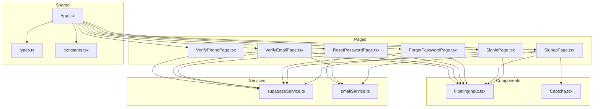

**Diagram sources**
- [App.tsx](file://App.tsx#L252-L272)
- [SigninPage.tsx](file://pages/SigninPage.tsx#L1-L231)
- [SignupPage.tsx](file://pages/SignupPage.tsx#L1-L293)
- [ForgotPasswordPage.tsx](file://pages/ForgotPasswordPage.tsx#L1-L265)
- [ResetPasswordPage.tsx](file://pages/ResetPasswordPage.tsx#L1-L236)
- [VerifyEmailPage.tsx](file://pages/VerifyEmailPage.tsx#L1-L255)
- [VerifyPhonePage.tsx](file://pages/VerifyPhonePage.tsx#L1-L159)
- [FloatingInput.tsx](file://components/FloatingInput.tsx#L1-L85)
- [Captcha.tsx](file://components/Captcha.tsx#L1-L117)
- [supabaseService.ts](file://services/supabaseService.ts#L1-L67)
- [emailService.ts](file://services/emailService.ts#L1-L194)
- [types.ts](file://types.ts#L1-L79)
- [constants.tsx](file://constants.tsx#L1-L361)

**Section sources**
- [App.tsx](file://App.tsx#L252-L272)
- [constants.tsx](file://constants.tsx#L1-L361)

## Core Components
- Form Inputs: FloatingInput provides floating label behavior and validation styling for all forms.
- Human Verification: Captcha generates and validates visual challenges during registration.
- Authentication Services: Supabase integration handles user lookup, password hashing, availability checks, and login attempts with lockout logic.
- Email Delivery: EmailJS integration sends OTPs and security alerts with contextual information.

**Section sources**
- [FloatingInput.tsx](file://components/FloatingInput.tsx#L1-L85)
- [Captcha.tsx](file://components/Captcha.tsx#L1-L117)
- [supabaseService.ts](file://services/supabaseService.ts#L1-L67)
- [emailService.ts](file://services/emailService.ts#L1-L194)

## Architecture Overview
The authentication flow is orchestrated by the main App component, which manages user session state and routes. Each page implements specific steps in the authentication lifecycle, interacting with Supabase for data operations and EmailJS for notifications.

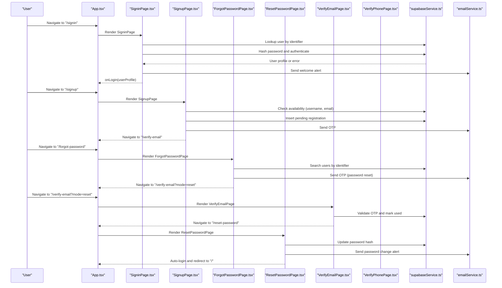

**Diagram sources**
- [App.tsx](file://App.tsx#L252-L272)
- [SigninPage.tsx](file://pages/SigninPage.tsx#L53-L95)
- [SignupPage.tsx](file://pages/SignupPage.tsx#L117-L142)
- [ForgotPasswordPage.tsx](file://pages/ForgotPasswordPage.tsx#L81-L110)
- [VerifyEmailPage.tsx](file://pages/VerifyEmailPage.tsx#L107-L162)
- [ResetPasswordPage.tsx](file://pages/ResetPasswordPage.tsx#L68-L125)
- [supabaseService.ts](file://services/supabaseService.ts#L26-L66)
- [emailService.ts](file://services/emailService.ts#L139-L193)

## Detailed Component Analysis

### Sign In Page
The Sign In page implements a two-step authentication flow:
- Step 1: Identifier lookup to locate the user account.
- Step 2: Password submission and authentication against Supabase.

Key behaviors:
- Multi-field search across username, login_id, email, and mobile.
- Real-time error messaging and loading states.
- Welcome email alert on successful login.
- Session persistence via onLogin callback.

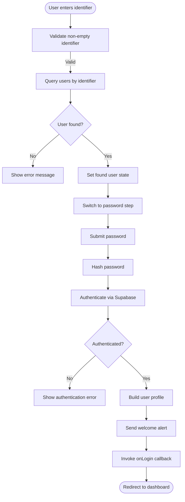

**Diagram sources**
- [SigninPage.tsx](file://pages/SigninPage.tsx#L23-L95)
- [supabaseService.ts](file://services/supabaseService.ts#L26-L66)
- [emailService.ts](file://services/emailService.ts#L152-L172)

**Section sources**
- [SigninPage.tsx](file://pages/SigninPage.tsx#L14-L95)
- [supabaseService.ts](file://services/supabaseService.ts#L26-L66)
- [emailService.ts](file://services/emailService.ts#L152-L172)

### Sign Up Page
The Sign Up page implements a comprehensive registration flow with:
- Multi-step form state persisted in localStorage.
- Real-time password strength validation with visual indicator.
- Age validation and country/currency selection.
- CAPTCHA verification for human validation.
- OTP-based email verification workflow.

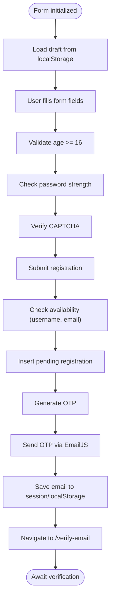

**Diagram sources**
- [SignupPage.tsx](file://pages/SignupPage.tsx#L20-L149)
- [Captcha.tsx](file://components/Captcha.tsx#L14-L87)
- [emailService.ts](file://services/emailService.ts#L139-L147)

**Section sources**
- [SignupPage.tsx](file://pages/SignupPage.tsx#L12-L149)
- [Captcha.tsx](file://components/Captcha.tsx#L9-L87)
- [emailService.ts](file://services/emailService.ts#L139-L147)

### Forgot Password Page
The Forgot Password page enables account recovery via:
- Identifier-based search across multiple fields.
- Multi-account selection when multiple matches are found.
- Recovery method selection (email/SMS/password).
- OTP delivery and redirection to verification.

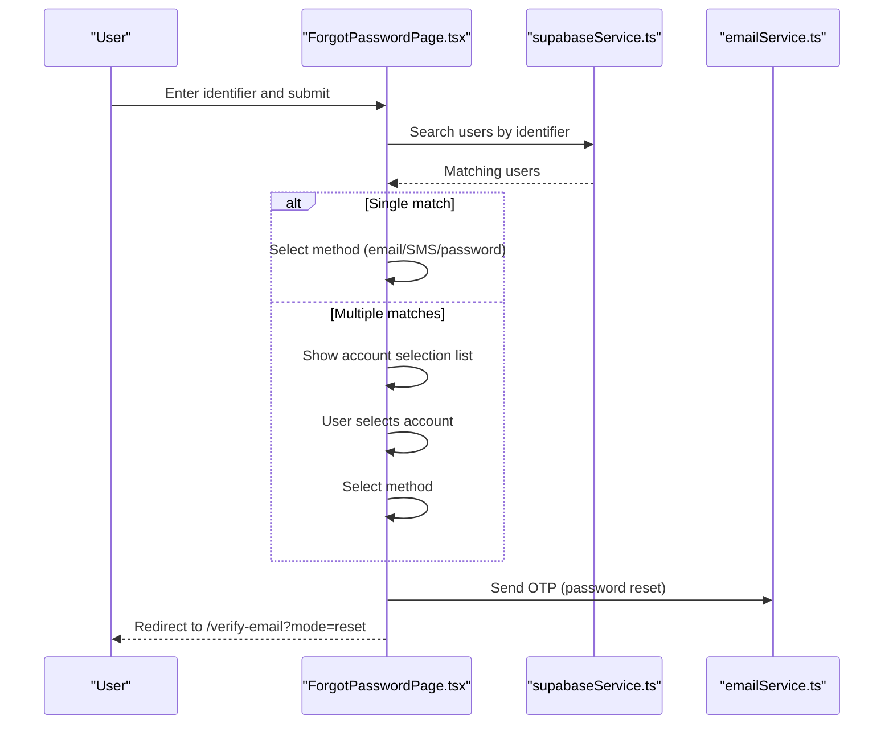

**Diagram sources**
- [ForgotPasswordPage.tsx](file://pages/ForgotPasswordPage.tsx#L34-L110)
- [emailService.ts](file://services/emailService.ts#L139-L147)

**Section sources**
- [ForgotPasswordPage.tsx](file://pages/ForgotPasswordPage.tsx#L12-L110)
- [emailService.ts](file://services/emailService.ts#L139-L147)

### Reset Password Page
The Reset Password page enforces strong password requirements and:
- Validates password strength in real-time.
- Confirms password match.
- Updates the user’s password hash in Supabase.
- Sends password change alerts and auto-logs the user in.

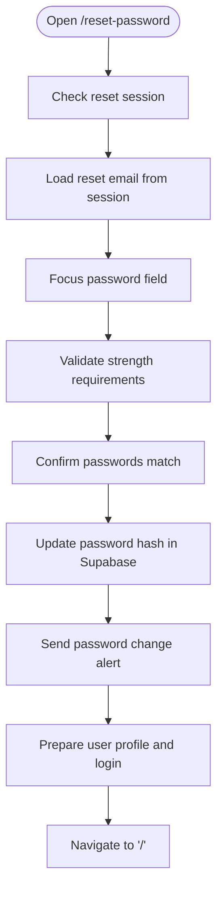

**Diagram sources**
- [ResetPasswordPage.tsx](file://pages/ResetPasswordPage.tsx#L23-L125)
- [supabaseService.ts](file://services/supabaseService.ts#L9-L15)
- [emailService.ts](file://services/emailService.ts#L177-L193)

**Section sources**
- [ResetPasswordPage.tsx](file://pages/ResetPasswordPage.tsx#L14-L125)
- [supabaseService.ts](file://services/supabaseService.ts#L9-L15)
- [emailService.ts](file://services/emailService.ts#L177-L193)

### Email Verification Page
The Email Verification page implements:
- 8-digit OTP input with auto-focus navigation.
- Resend timer with countdown UI.
- Mode detection for registration vs password reset.
- OTP validation and subsequent actions.

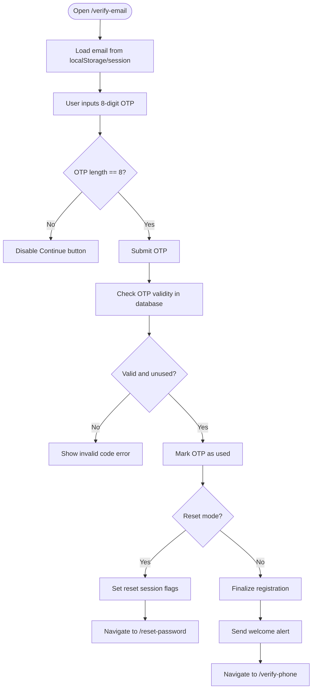

**Diagram sources**
- [VerifyEmailPage.tsx](file://pages/VerifyEmailPage.tsx#L26-L162)
- [emailService.ts](file://services/emailService.ts#L152-L172)

**Section sources**
- [VerifyEmailPage.tsx](file://pages/VerifyEmailPage.tsx#L8-L162)
- [emailService.ts](file://services/emailService.ts#L152-L172)

### Phone Verification Page
The Phone Verification page:
- Loads draft and saved email for context.
- Implements OTP input with navigation.
- Provides options for resend and change number.
- Finalizes registration and logs the user in.

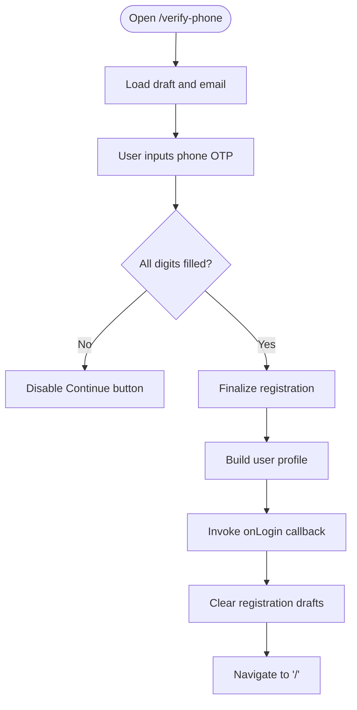

**Diagram sources**
- [VerifyPhonePage.tsx](file://pages/VerifyPhonePage.tsx#L21-L97)

**Section sources**
- [VerifyPhonePage.tsx](file://pages/VerifyPhonePage.tsx#L12-L97)

### Shared Components and Services

#### FloatingInput Component
FloatingInput provides:
- Floating label behavior that responds to focus and value state.
- Consistent styling for inputs and select elements.
- Validation state styling with invalid state support.

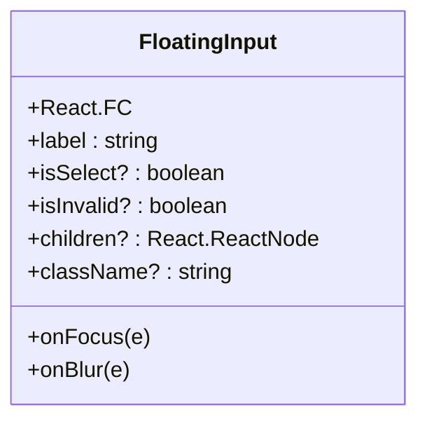

**Diagram sources**
- [FloatingInput.tsx](file://components/FloatingInput.tsx#L11-L82)

**Section sources**
- [FloatingInput.tsx](file://components/FloatingInput.tsx#L1-L85)

#### Captcha Component
Captcha generates a random 5-character code, renders it on a canvas with noise and distortion, and validates user input against the generated text.

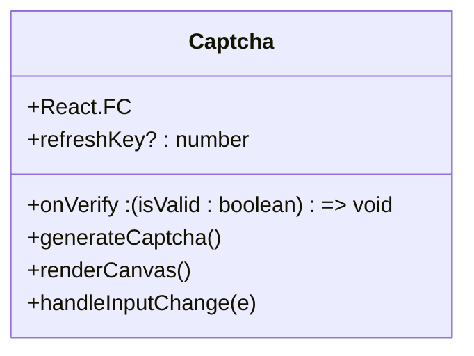

**Diagram sources**
- [Captcha.tsx](file://components/Captcha.tsx#L9-L87)

**Section sources**
- [Captcha.tsx](file://components/Captcha.tsx#L1-L117)

#### Supabase Service
Supabase service provides:
- SHA-256 password hashing.
- Availability checks for username and email.
- Login attempt handling with lockout logic and failed attempt tracking.

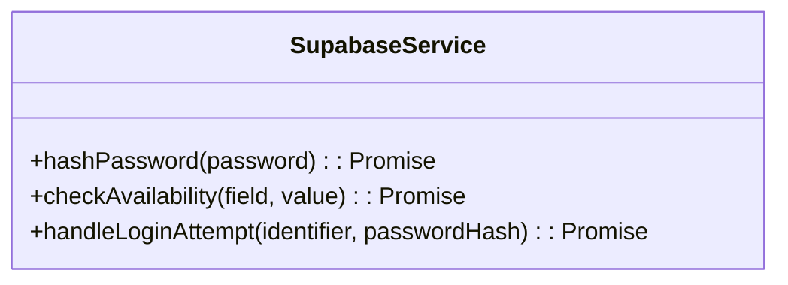

**Diagram sources**
- [supabaseService.ts](file://services/supabaseService.ts#L9-L66)

**Section sources**
- [supabaseService.ts](file://services/supabaseService.ts#L1-L67)

#### Email Service
Email service integrates with EmailJS to:
- Send OTP emails with security context.
- Send welcome and password change alerts.
- Normalize text and include unsubscribe links and physical address.

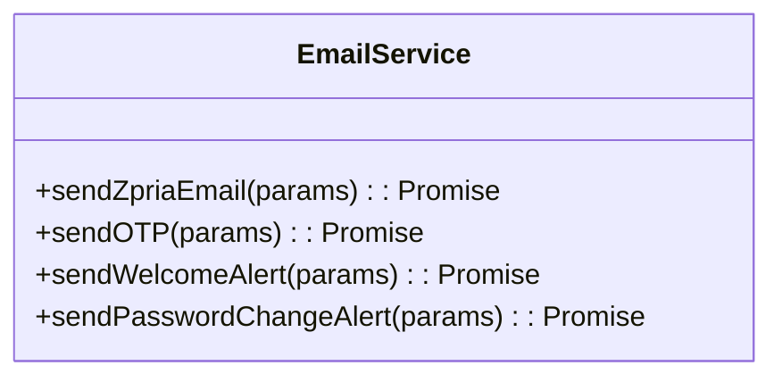

**Diagram sources**
- [emailService.ts](file://services/emailService.ts#L70-L193)

**Section sources**
- [emailService.ts](file://services/emailService.ts#L1-L194)

## Dependency Analysis
Authentication pages depend on shared components and services for consistent UX and reliable backend operations.

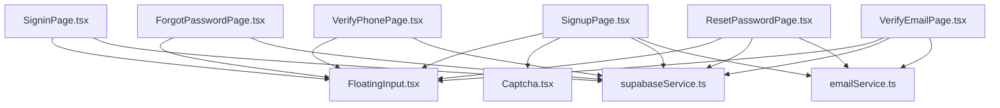

**Diagram sources**
- [SigninPage.tsx](file://pages/SigninPage.tsx#L6-L8)
- [SignupPage.tsx](file://pages/SignupPage.tsx#L5-L8)
- [ForgotPasswordPage.tsx](file://pages/ForgotPasswordPage.tsx#L7-L8)
- [ResetPasswordPage.tsx](file://pages/ResetPasswordPage.tsx#L5-L7)
- [VerifyEmailPage.tsx](file://pages/VerifyEmailPage.tsx#L5-L6)
- [VerifyPhonePage.tsx](file://pages/VerifyPhonePage.tsx#L5-L6)
- [FloatingInput.tsx](file://components/FloatingInput.tsx#L1-L85)
- [Captcha.tsx](file://components/Captcha.tsx#L1-L117)
- [supabaseService.ts](file://services/supabaseService.ts#L1-L67)
- [emailService.ts](file://services/emailService.ts#L1-L194)

**Section sources**
- [App.tsx](file://App.tsx#L252-L272)
- [types.ts](file://types.ts#L11-L25)
- [constants.tsx](file://constants.tsx#L27-L271)

## Performance Considerations
- Debounce or throttle real-time validations to reduce unnecessary computations.
- Use lazy loading for heavy components to improve initial render performance.
- Cache frequently accessed constants and lists (e.g., country list) to minimize re-renders.
- Optimize OTP input handling to prevent excessive DOM updates.
- Minimize network requests by batching operations where possible.

## Troubleshooting Guide
Common issues and resolutions:
- Invalid credentials: The login attempt handler increments failed attempts and locks the account after five consecutive failures. Users receive a lockout message indicating remaining minutes.
- Session expiration: Email verification relies on stored email in localStorage or temporary session storage. If missing, the page displays an error prompting re-registration.
- OTP validation errors: The verification page throws errors for invalid or expired codes and marks OTPs as used after successful validation.
- CAPTCHA failures: The CAPTCHA component resets verification state and refreshes the challenge on failure.
- Email delivery failures: The email service logs errors and returns false for failed dispatches.

**Section sources**
- [supabaseService.ts](file://services/supabaseService.ts#L38-L65)
- [VerifyEmailPage.tsx](file://pages/VerifyEmailPage.tsx#L114-L118)
- [Captcha.tsx](file://components/Captcha.tsx#L83-L87)
- [emailService.ts](file://services/emailService.ts#L114-L137)

## Conclusion
The authentication system provides a robust, multi-step user journey with strong validation, real-time feedback, and secure backend integration. The modular design ensures maintainability and scalability, while consistent UI components deliver a cohesive user experience across devices. The combination of Supabase and EmailJS enables secure identity management and timely notifications, supporting both registration and recovery workflows.