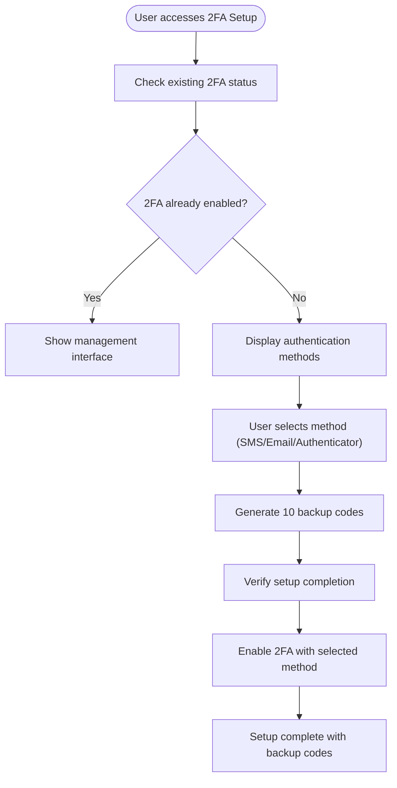

# Authentication Pages

<cite>
**Referenced Files in This Document**
- [App.tsx](file://App.tsx)
- [SigninPage.tsx](file://pages/SigninPage.tsx)
- [SignupPage.tsx](file://pages/SignupPage.tsx)
- [ForgotPasswordPage.tsx](file://pages/ForgotPasswordPage.tsx)
- [ResetPasswordPage.tsx](file://pages/ResetPasswordPage.tsx)
- [VerifyEmailPage.tsx](file://pages/VerifyEmailPage.tsx)
- [VerifyPhonePage.tsx](file://pages/VerifyPhonePage.tsx)
- [TwoFactorSetupPage.tsx](file://pages/TwoFactorSetupPage.tsx)
- [DevicesPage.tsx](file://pages/DevicesPage.tsx)
- [SecurityPage.tsx](file://pages/SecurityPage.tsx)
- [FloatingInput.tsx](file://components/FloatingInput.tsx)
- [Captcha.tsx](file://components/Captcha.tsx)
- [supabaseService.ts](file://services/supabaseService.ts)
- [emailService.ts](file://services/emailService.ts)
- [types.ts](file://types.ts)
- [constants.tsx](file://constants.tsx)
</cite>

## Update Summary
**Changes Made**
- Added comprehensive documentation for new two-factor authentication setup workflow
- Documented device management and active sessions monitoring capabilities
- Enhanced security page with integrated security status and management options
- Updated authentication flow architecture to include security features
- Added new security-related components and their integration patterns

## Table of Contents
1. [Introduction](#introduction)
2. [Project Structure](#project-structure)
3. [Core Components](#core-components)
4. [Architecture Overview](#architecture-overview)
5. [Enhanced Security Features](#enhanced-security-features)
6. [Detailed Component Analysis](#detailed-component-analysis)
7. [Dependency Analysis](#dependency-analysis)
8. [Performance Considerations](#performance-considerations)
9. [Troubleshooting Guide](#troubleshooting-guide)
10. [Conclusion](#conclusion)

## Introduction
This document provides comprehensive documentation for the enhanced authentication pages in the ZPRIA application. The system now includes advanced security features including two-factor authentication setup, device management, and comprehensive security workflows. It covers the Sign In, Sign Up, Forgot Password, Reset Password, Email Verification, Phone Verification, Two-Factor Authentication Setup, Security Management, and Device Monitoring pages. The documentation explains form validation systems, password strength indicators, multi-step verification processes, authentication flow orchestration, error handling patterns, user feedback mechanisms, email and SMS verification workflows, token validation processes, session management, responsive design adaptations, accessibility features, and the integration of advanced security measures.

## Project Structure
The authentication system is organized around dedicated pages under the pages directory, shared UI components in the components directory, and service integrations in the services directory. The main application orchestrates routing and user session state with enhanced security features.

**Diagram sources**
- [App.tsx](file://App.tsx#L274-L276)
- [TwoFactorSetupPage.tsx](file://pages/TwoFactorSetupPage.tsx#L1-L348)
- [SecurityPage.tsx](file://pages/SecurityPage.tsx#L1-L265)
- [DevicesPage.tsx](file://pages/DevicesPage.tsx#L1-L354)

**Section sources**
- [App.tsx](file://App.tsx#L252-L285)
- [constants.tsx](file://constants.tsx#L1-L361)

## Core Components
- Form Inputs: FloatingInput provides floating label behavior and validation styling for all forms.
- Human Verification: Captcha generates and validates visual challenges during registration.
- Authentication Services: Supabase integration handles user lookup, password hashing, availability checks, login attempts with lockout logic, and security settings management.
- Email Delivery: EmailJS integration sends OTPs and security alerts with contextual information.
- Security Management: Enhanced security features including two-factor authentication setup, device monitoring, and security status tracking.

**Section sources**
- [FloatingInput.tsx](file://components/FloatingInput.tsx#L1-L85)
- [Captcha.tsx](file://components/Captcha.tsx#L1-L117)
- [supabaseService.ts](file://services/supabaseService.ts#L1-L73)
- [emailService.ts](file://services/emailService.ts#L1-L194)

## Architecture Overview
The authentication flow is orchestrated by the main App component, which manages user session state and routes. Each page implements specific steps in the authentication lifecycle, interacting with Supabase for data operations and EmailJS for notifications. The enhanced system now includes comprehensive security management with two-factor authentication setup, device monitoring, and security status tracking.

**Diagram sources**
- [App.tsx](file://App.tsx#L274-L276)
- [TwoFactorSetupPage.tsx](file://pages/TwoFactorSetupPage.tsx#L26-L122)
- [SecurityPage.tsx](file://pages/SecurityPage.tsx#L26-L52)
- [DevicesPage.tsx](file://pages/DevicesPage.tsx#L31-L80)

## Enhanced Security Features

### Two-Factor Authentication Setup
The TwoFactorSetupPage provides a comprehensive workflow for enabling two-factor authentication with multiple methods:

- **Multiple Authentication Methods**: SMS, Email, and Authenticator App options
- **Backup Code Generation**: 10 unique backup codes with copy functionality
- **Verification Workflow**: Multi-step setup with OTP verification
- **Security Status Tracking**: Real-time status updates and management options

**Diagram sources**
- [TwoFactorSetupPage.tsx](file://pages/TwoFactorSetupPage.tsx#L26-L122)

### Device Management and Monitoring
The DevicesPage provides comprehensive device management capabilities:

- **Active Session Tracking**: Real-time monitoring of all active sessions
- **Device Identification**: Browser, location, and device type detection
- **Security Controls**: Individual device sign-out and bulk sign-out functionality
- **Trust Management**: Trusted device designation and management

**Diagram sources**
- [DevicesPage.tsx](file://pages/DevicesPage.tsx#L31-L123)

### Security Management Interface
The SecurityPage provides centralized security management:

- **Security Status Dashboard**: Real-time security status visualization
- **Integrated Management**: Direct access to all security features
- **Security Recommendations**: Actionable security tips and recommendations
- **Quick Access**: One-click access to security settings and management tools

**Section sources**
- [TwoFactorSetupPage.tsx](file://pages/TwoFactorSetupPage.tsx#L1-L348)
- [DevicesPage.tsx](file://pages/DevicesPage.tsx#L1-L354)
- [SecurityPage.tsx](file://pages/SecurityPage.tsx#L1-L265)

## Detailed Component Analysis

### Enhanced Sign In Page
The Sign In page now integrates with the enhanced security system:

- **Multi-step authentication flow** with enhanced security considerations
- **Security status awareness** for users with 2FA enabled
- **Improved error handling** with security protocol messages
- **Seamless integration** with security management features

**Section sources**
- [SigninPage.tsx](file://pages/SigninPage.tsx#L1-L234)

### Two-Factor Authentication Setup Page
The TwoFactorSetupPage implements a comprehensive 2FA configuration workflow:

- **Method Selection Interface**: Three authentication methods with detailed descriptions
- **Backup Code Management**: Secure generation and storage of backup codes
- **Verification Process**: Multi-step verification with error handling
- **Security Status Updates**: Real-time status updates and completion tracking

**Diagram sources**
- [TwoFactorSetupPage.tsx](file://pages/TwoFactorSetupPage.tsx#L51-L122)

**Section sources**
- [TwoFactorSetupPage.tsx](file://pages/TwoFactorSetupPage.tsx#L1-L348)

### Device Management Page
The DevicesPage provides comprehensive device monitoring and control:

- **Real-time Device Tracking**: Live monitoring of active sessions
- **Device Information Display**: Comprehensive device identification and status
- **Security Controls**: Granular control over individual devices
- **Bulk Operations**: Efficient management of multiple devices

**Diagram sources**
- [DevicesPage.tsx](file://pages/DevicesPage.tsx#L31-L123)

**Section sources**
- [DevicesPage.tsx](file://pages/DevicesPage.tsx#L1-L354)

### Security Management Page
The SecurityPage serves as the central hub for all security-related activities:

- **Security Status Dashboard**: Comprehensive security overview
- **Quick Access Interface**: Direct links to all security features
- **Security Recommendations**: Actionable security advice and tips
- **Integration Points**: Seamless integration with all security features

**Diagram sources**
- [SecurityPage.tsx](file://pages/SecurityPage.tsx#L26-L52)

**Section sources**
- [SecurityPage.tsx](file://pages/SecurityPage.tsx#L1-L265)

### Enhanced Shared Components and Services

#### Supabase Service Enhancements
The Supabase service now includes enhanced security features:

- **Security Settings Management**: Integration with user_security_settings table
- **Session Management**: Enhanced session tracking and device management
- **Security Status Queries**: Comprehensive security status reporting
- **Backup Code Storage**: Secure storage and management of backup codes

**Diagram sources**
- [supabaseService.ts](file://services/supabaseService.ts#L9-L73)

**Section sources**
- [supabaseService.ts](file://services/supabaseService.ts#L1-L73)

#### Enhanced Email Service
The Email service maintains its role in security-related communications:

- **Security Alert Integration**: Enhanced integration with security events
- **Backup Code Delivery**: Secure delivery of backup codes
- **Security Notification Templates**: Specialized templates for security events
- **Multi-channel Communication**: Support for various security notification channels

**Section sources**
- [emailService.ts](file://services/emailService.ts#L1-L194)

## Dependency Analysis
The enhanced authentication system maintains the same dependency structure while adding new security-related dependencies.

**Diagram sources**
- [TwoFactorSetupPage.tsx](file://pages/TwoFactorSetupPage.tsx#L6)
- [SecurityPage.tsx](file://pages/SecurityPage.tsx#L6)
- [DevicesPage.tsx](file://pages/DevicesPage.tsx#L6)

**Section sources**
- [App.tsx](file://App.tsx#L274-L276)
- [types.ts](file://types.ts#L11-L25)
- [constants.tsx](file://constants.tsx#L27-L271)

## Performance Considerations
- **Security Feature Optimization**: Implement caching for security status queries
- **Device List Pagination**: Consider pagination for large device lists
- **2FA Setup Optimization**: Optimize backup code generation and storage
- **Session Monitoring**: Implement efficient polling for active session updates
- **Security Status Updates**: Use debounced updates for security status changes

## Troubleshooting Guide
Common issues and resolutions for the enhanced security features:

- **2FA Setup Failures**: Verify backup code generation and storage in database
- **Device Management Issues**: Check session table permissions and device detection logic
- **Security Status Errors**: Validate security settings table structure and access permissions
- **Backup Code Validation**: Ensure backup codes are properly stored and marked as used
- **Session Expiration**: Implement proper session cleanup and device sign-out procedures

**Section sources**
- [TwoFactorSetupPage.tsx](file://pages/TwoFactorSetupPage.tsx#L95-L122)
- [DevicesPage.tsx](file://pages/DevicesPage.tsx#L82-L123)
- [SecurityPage.tsx](file://pages/SecurityPage.tsx#L26-L52)

## Conclusion
The enhanced authentication system provides a comprehensive, multi-layered security approach with robust two-factor authentication setup, device management capabilities, and centralized security management. The modular design ensures maintainability and scalability while delivering a seamless user experience across all security features. The integration of advanced security measures with the existing authentication infrastructure creates a unified, secure platform that protects user identities while maintaining ease of use and accessibility.