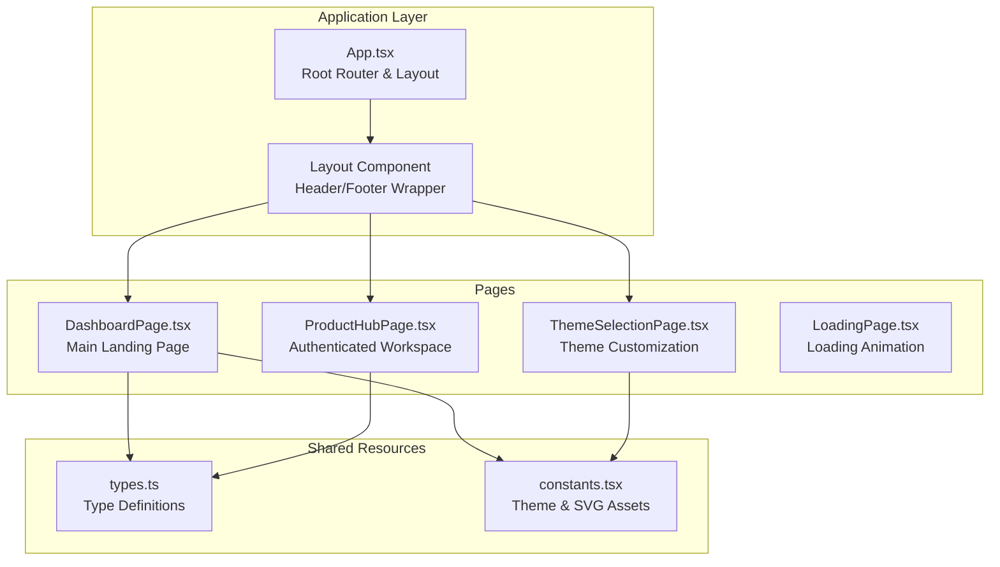
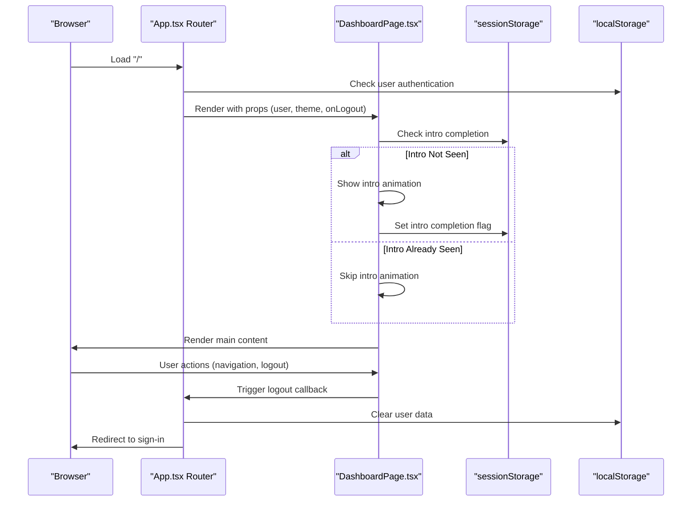
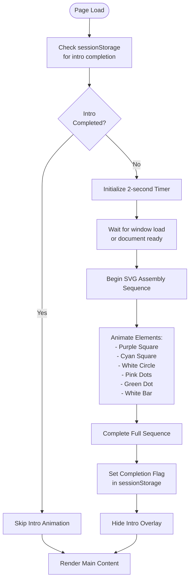
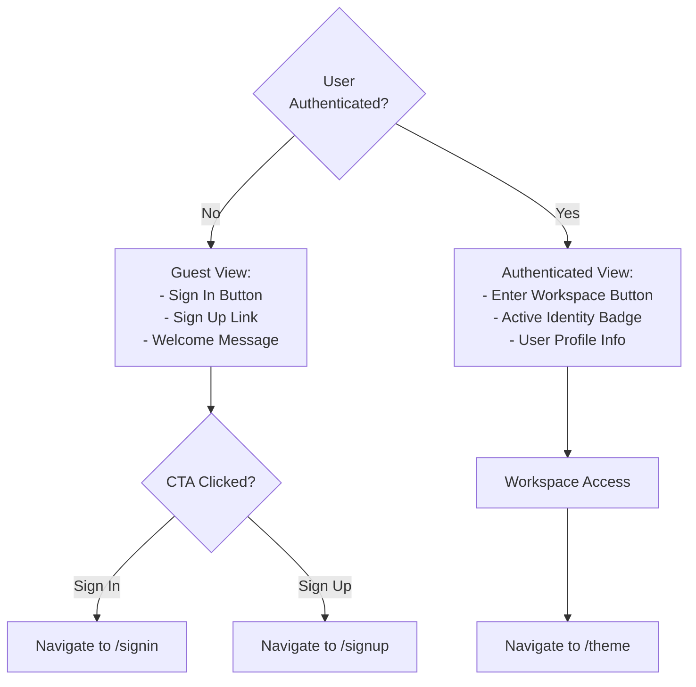
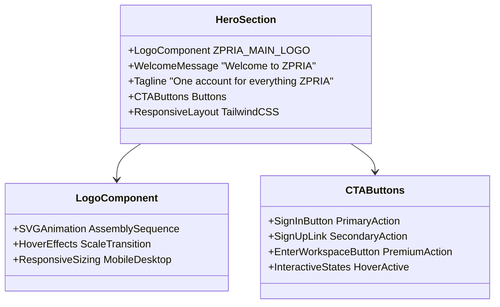
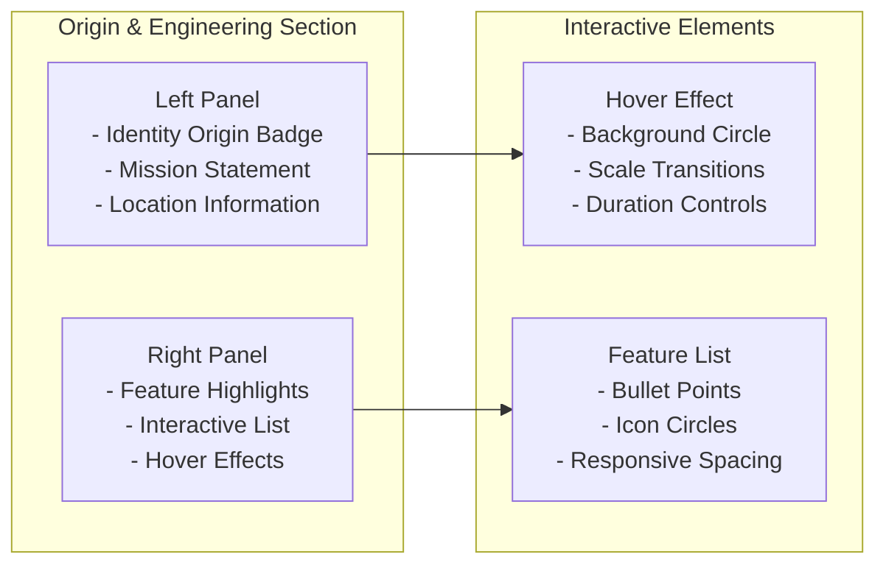
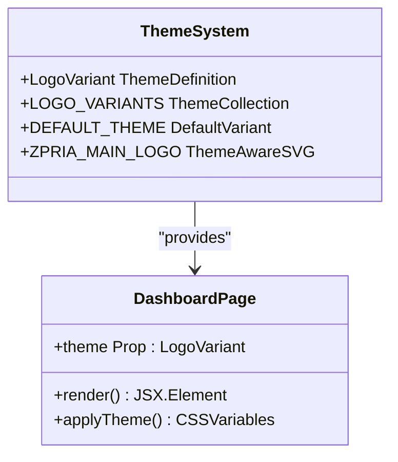
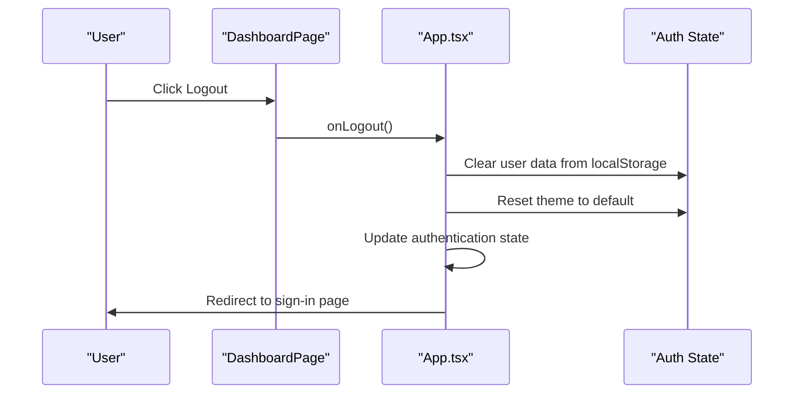
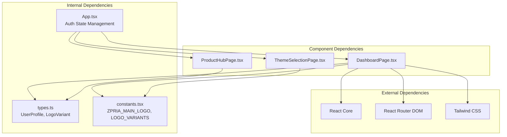

# Dashboard Page

<cite>
**Referenced Files in This Document**
- [DashboardPage.tsx](file://pages/DashboardPage.tsx)
- [App.tsx](file://App.tsx)
- [types.ts](file://types.ts)
- [constants.tsx](file://constants.tsx)
- [LoadingPage.tsx](file://pages/LoadingPage.tsx)
- [ProductHubPage.tsx](file://pages/ProductHubPage.tsx)
- [ThemeSelectionPage.tsx](file://pages/ThemeSelectionPage.tsx)
</cite>

## Table of Contents
1. [Introduction](#introduction)
2. [Project Structure](#project-structure)
3. [Core Components](#core-components)
4. [Architecture Overview](#architecture-overview)
5. [Detailed Component Analysis](#detailed-component-analysis)
6. [Dependency Analysis](#dependency-analysis)
7. [Performance Considerations](#performance-considerations)
8. [Troubleshooting Guide](#troubleshooting-guide)
9. [Conclusion](#conclusion)

## Introduction
This document provides comprehensive documentation for the Dashboard Page component, focusing on the main landing page implementation. It covers the intro animation sequence, user authentication state handling, responsive design patterns, SVG animation system with timing controls, session storage integration, conditional rendering based on authentication status, hero section layout, call-to-action buttons, navigation patterns, origin and engineering section with feature highlights, responsive grid layout implementation, interactive hover effects, theme integration, prop handling for user profiles, and logout functionality integration.

## Project Structure
The Dashboard Page is part of a React-based application with TypeScript and Tailwind CSS for styling. The component is organized within the pages directory and integrates with the global application layout and authentication state management.

**Diagram sources**
- [App.tsx](file://App.tsx#L218-L276)
- [DashboardPage.tsx](file://pages/DashboardPage.tsx#L1-L217)
- [ProductHubPage.tsx](file://pages/ProductHubPage.tsx#L1-L200)
- [ThemeSelectionPage.tsx](file://pages/ThemeSelectionPage.tsx#L1-L78)
- [types.ts](file://types.ts#L1-L79)
- [constants.tsx](file://constants.tsx#L1-L361)

**Section sources**
- [App.tsx](file://App.tsx#L218-L276)
- [DashboardPage.tsx](file://pages/DashboardPage.tsx#L1-L217)

## Core Components
The Dashboard Page component consists of several key parts:

### Authentication State Management
The component receives user authentication state through props and handles logout functionality integration. It conditionally renders different content based on whether the user is authenticated or not.

### Intro Animation Sequence
A sophisticated SVG animation sequence runs during initial page load to establish brand identity and create a memorable first impression.

### Responsive Design Implementation
The component implements responsive design patterns using Tailwind CSS utility classes for different screen sizes.

### Feature Highlights Section
The origin and engineering section presents ZPRIA's core mission and capabilities through a structured layout with interactive elements.

**Section sources**
- [DashboardPage.tsx](file://pages/DashboardPage.tsx#L7-L11)
- [DashboardPage.tsx](file://pages/DashboardPage.tsx#L18-L53)
- [DashboardPage.tsx](file://pages/DashboardPage.tsx#L147-L213)

## Architecture Overview
The Dashboard Page integrates with the broader application architecture through the routing system and authentication state management.

**Diagram sources**
- [App.tsx](file://App.tsx#L218-L276)
- [DashboardPage.tsx](file://pages/DashboardPage.tsx#L18-L53)

## Detailed Component Analysis

### Intro Animation Sequence
The intro animation system uses SVG animations with precise timing controls to create a cohesive brand experience.

**Diagram sources**
- [DashboardPage.tsx](file://pages/DashboardPage.tsx#L18-L53)
- [constants.tsx](file://constants.tsx#L312-L360)

#### Animation Timing Controls
The animation system implements precise timing controls with:
- Fixed duration of 2000ms for the complete sequence
- Individual element animations with staggered delays
- Completion detection using elapsed time calculations
- Network-aware loading behavior

#### Session Storage Integration
The intro sequence prevents repeated animations during the same browser session using sessionStorage with the key `zpria_intro_seen`.

**Section sources**
- [DashboardPage.tsx](file://pages/DashboardPage.tsx#L18-L53)
- [constants.tsx](file://constants.tsx#L312-L360)

### Authentication State Handling
The component conditionally renders different content based on user authentication status.

**Diagram sources**
- [DashboardPage.tsx](file://pages/DashboardPage.tsx#L115-L144)
- [App.tsx](file://App.tsx#L253-L254)

#### Conditional Rendering Patterns
The component uses conditional rendering to present appropriate content for different user states:
- Unauthenticated users see call-to-action buttons and registration links
- Authenticated users see workspace access and identity verification information

**Section sources**
- [DashboardPage.tsx](file://pages/DashboardPage.tsx#L115-L144)
- [App.tsx](file://App.tsx#L253-L254)

### Hero Section Layout
The hero section establishes brand identity through a centered logo and compelling messaging.

**Diagram sources**
- [DashboardPage.tsx](file://pages/DashboardPage.tsx#L101-L144)
- [constants.tsx](file://constants.tsx#L312-L360)

#### Responsive Typography
The hero section implements responsive typography with:
- Large heading sizes for desktop (88px) and mobile (42px)
- Adjusted line heights and letter spacing for optimal readability
- Flexible container widths with max-width constraints

**Section sources**
- [DashboardPage.tsx](file://pages/DashboardPage.tsx#L101-L144)

### Origin and Engineering Section
The origin and engineering section presents ZPRIA's core mission and capabilities through a structured layout.

**Diagram sources**
- [DashboardPage.tsx](file://pages/DashboardPage.tsx#L147-L190)

#### Responsive Grid Implementation
The section uses a responsive grid layout:
- Single column on mobile devices
- Two-column layout on larger screens
- Flexible spacing with gap utilities
- Content alignment and text direction adjustments

#### Interactive Hover Effects
The engineering panel implements sophisticated hover effects:
- Background circle that scales on hover
- Smooth transitions with duration controls
- Layered positioning with z-index management
- Gradient backgrounds and subtle shadows

**Section sources**
- [DashboardPage.tsx](file://pages/DashboardPage.tsx#L147-L190)

### Theme Integration
The component integrates with the application's theme system through the theme prop.

**Diagram sources**
- [DashboardPage.tsx](file://pages/DashboardPage.tsx#L7-L11)
- [types.ts](file://types.ts#L2-L9)
- [constants.tsx](file://constants.tsx#L5-L25)

#### Theme Prop Handling
The component accepts a theme prop of type LogoVariant, which contains:
- Color definitions for primary, secondary, and accent colors
- Gradient configurations for visual consistency
- Theme identification for persistence

**Section sources**
- [DashboardPage.tsx](file://pages/DashboardPage.tsx#L7-L11)
- [types.ts](file://types.ts#L2-L9)
- [constants.tsx](file://constants.tsx#L5-L25)

### Logout Functionality Integration
The component receives an onLogout callback through props for seamless authentication flow integration.

**Diagram sources**
- [DashboardPage.tsx](file://pages/DashboardPage.tsx#L10-L11)
- [App.tsx](file://App.tsx#L238-L242)

## Dependency Analysis
The Dashboard Page component has well-defined dependencies and relationships with other system components.

**Diagram sources**
- [DashboardPage.tsx](file://pages/DashboardPage.tsx#L2-L5)
- [App.tsx](file://App.tsx#L218-L276)
- [types.ts](file://types.ts#L1-L79)
- [constants.tsx](file://constants.tsx#L1-L361)

### Component Coupling Analysis
The Dashboard Page maintains loose coupling with other components:
- Uses props for all external data (user, theme, callbacks)
- Imports only necessary shared resources (types, constants)
- No direct dependencies on other page components
- Integrates through the App.tsx routing system

**Section sources**
- [DashboardPage.tsx](file://pages/DashboardPage.tsx#L2-L5)
- [App.tsx](file://App.tsx#L218-L276)

## Performance Considerations
The Dashboard Page implements several performance optimizations:

### Animation Performance
- SVG animations are hardware-accelerated through transform and opacity properties
- Fixed timing ensures predictable performance across devices
- Session storage prevents redundant animations during sessions

### Memory Management
- Cleanup functions remove event listeners in useEffect return statements
- Proper cleanup prevents memory leaks from lingering event handlers

### Rendering Optimization
- Conditional rendering prevents unnecessary component tree construction
- Responsive design uses CSS media queries instead of JavaScript calculations
- SVG assets are embedded directly for reduced HTTP requests

## Troubleshooting Guide

### Intro Animation Issues
Common issues and solutions:
- **Animation not completing**: Check sessionStorage key `zpria_intro_seen` for persistence
- **Timing inconsistencies**: Verify document.readyState handling and load event listeners
- **Animation repeats**: Ensure proper cleanup of event listeners in useEffect return

### Authentication State Problems
- **User appears authenticated when not**: Verify localStorage keys and parsing logic
- **Navigation issues**: Check route definitions in App.tsx for proper authentication guards
- **Theme not applying**: Confirm theme prop is passed correctly from App.tsx

### Responsive Design Issues
- **Layout breaks on mobile**: Review Tailwind utility class combinations
- **Typography scaling problems**: Check responsive breakpoint usage
- **Grid layout issues**: Verify grid classes and gap utilities

**Section sources**
- [DashboardPage.tsx](file://pages/DashboardPage.tsx#L18-L53)
- [App.tsx](file://App.tsx#L218-L276)

## Conclusion
The Dashboard Page component demonstrates a comprehensive approach to modern web application development, combining sophisticated animation systems, robust authentication handling, and responsive design patterns. The component's architecture emphasizes separation of concerns, performance optimization, and user experience excellence. Through careful implementation of SVG animations, session storage integration, and theme management, the component provides a solid foundation for the ZPRIA application's user interface while maintaining flexibility for future enhancements.

The component successfully balances visual appeal with functional requirements, providing clear pathways for user progression from initial engagement to authenticated workspace access. The modular design and well-defined interfaces facilitate maintainability and extensibility, making it an excellent example of contemporary React component development.