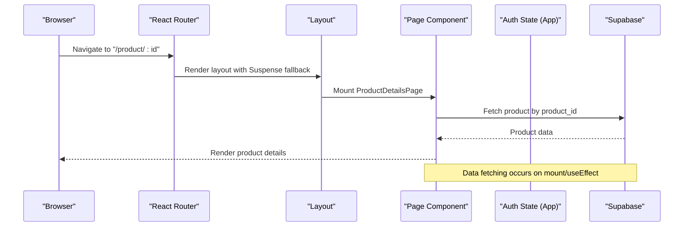
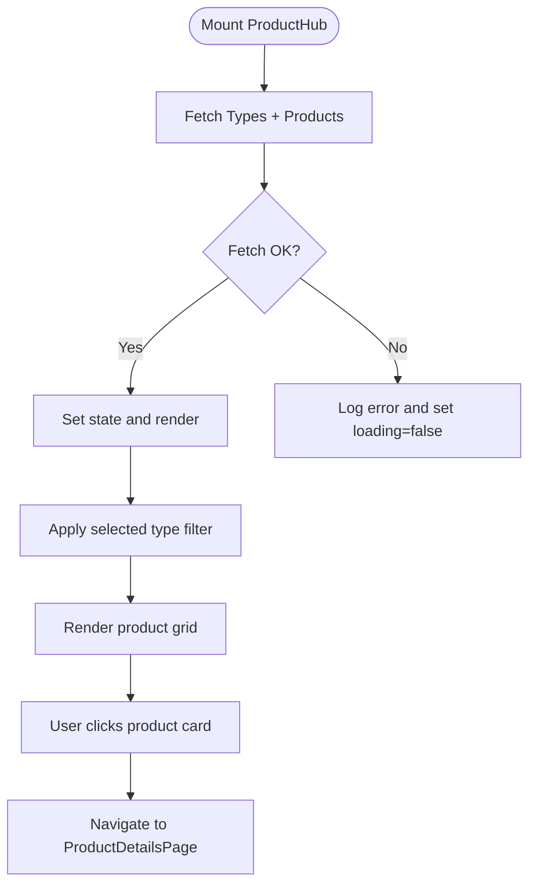
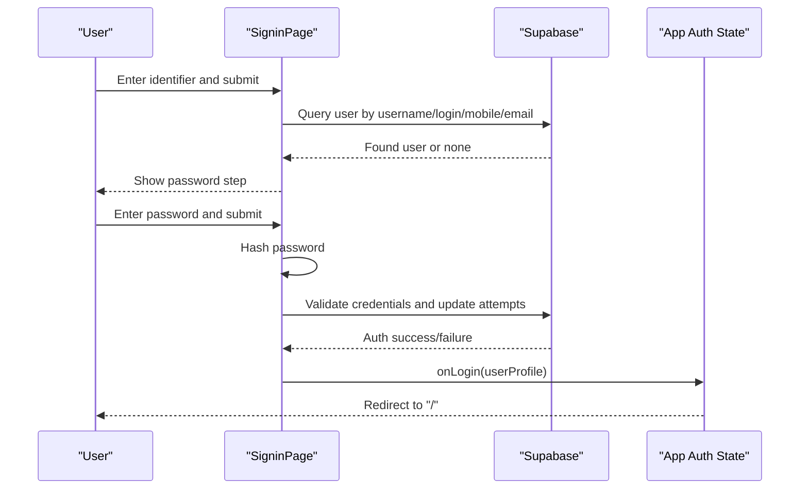
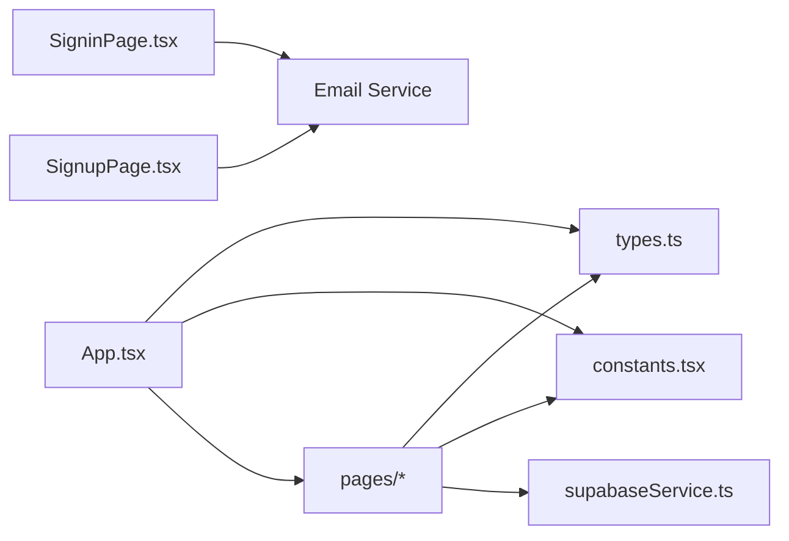

# Page Components

<cite>
**Referenced Files in This Document**
- [App.tsx](file://App.tsx)
- [DashboardPage.tsx](file://pages/DashboardPage.tsx)
- [ProductHubPage.tsx](file://pages/ProductHubPage.tsx)
- [ProductDetailsPage.tsx](file://pages/ProductDetailsPage.tsx)
- [AccountServicesPage.tsx](file://pages/AccountServicesPage.tsx)
- [HelpPage.tsx](file://pages/HelpPage.tsx)
- [SupportPage.tsx](file://pages/SupportPage.tsx)
- [StatsPage.tsx](file://pages/StatsPage.tsx)
- [TeamsPage.tsx](file://pages/TeamsPage.tsx)
- [ThemeSelectionPage.tsx](file://pages/ThemeSelectionPage.tsx)
- [SigninPage.tsx](file://pages/SigninPage.tsx)
- [SignupPage.tsx](file://pages/SignupPage.tsx)
- [types.ts](file://types.ts)
- [constants.tsx](file://constants.tsx)
- [supabaseService.ts](file://services/supabaseService.ts)
</cite>

## Table of Contents
1. [Introduction](#introduction)
2. [Project Structure](#project-structure)
3. [Core Components](#core-components)
4. [Architecture Overview](#architecture-overview)
5. [Detailed Component Analysis](#detailed-component-analysis)
6. [Dependency Analysis](#dependency-analysis)
7. [Performance Considerations](#performance-considerations)
8. [Troubleshooting Guide](#troubleshooting-guide)
9. [Conclusion](#conclusion)

## Introduction
This document describes the ZPRIA page components system. It covers the routing structure, page lifecycle management, authentication integration, and the implementation patterns for each page type. It also documents data fetching strategies, user interaction handling, responsive design, navigation patterns, transitions, theme integration, shared component relationships, state management across navigation, and performance optimization techniques. Examples of page-specific functionality and external service integrations are included.

## Project Structure
The application is a React SPA structured around a central router that mounts page components. Pages are grouped under the pages directory and organized by function (authentication, product hub, account services, support, statistics, teams, and theme selection). Shared UI and assets live under components and constants. Data access is handled via Supabase client utilities.

```mermaid
graph TB
subgraph "Routing Layer"
Router["React Router<br/>BrowserRouter/Routes"]
end
subgraph "Layout"
Layout["Layout wrapper<br/>Header/SubHeader/Footer"]
end
subgraph "Pages"
Dash["DashboardPage"]
Hub["ProductHubPage"]
Details["ProductDetailsPage"]
AccSvc["AccountServicesPage"]
Help["HelpPage"]
Support["SupportPage"]
Stats["StatsPage"]
Teams["TeamsPage"]
ThemeSel["ThemeSelectionPage"]
Signin["SigninPage"]
Signup["SignupPage"]
end
subgraph "Services"
Supabase["Supabase Client"]
Email["Email Service"]
end
Router --> Layout
Layout --> Dash
Layout --> Hub
Layout --> Details
Layout --> AccSvc
Layout --> Help
Layout --> Support
Layout --> Stats
Layout --> Teams
Layout --> ThemeSel
Layout --> Signin
Layout --> Signup
Hub --> Supabase
Details --> Supabase
Signin --> Supabase
Signin --> Email
Signup --> Supabase
Signup --> Email
```

**Diagram sources**
- [App.tsx](file://App.tsx#L218-L276)
- [ProductHubPage.tsx](file://pages/ProductHubPage.tsx#L1-L243)
- [ProductDetailsPage.tsx](file://pages/ProductDetailsPage.tsx#L1-L391)
- [SigninPage.tsx](file://pages/SigninPage.tsx#L1-L231)
- [SignupPage.tsx](file://pages/SignupPage.tsx#L1-L293)
- [supabaseService.ts](file://services/supabaseService.ts#L1-L67)

**Section sources**
- [App.tsx](file://App.tsx#L218-L276)

## Core Components
- Routing and Layout
  - Central router defines routes for all pages and lazy-loads heavy pages.
  - Layout composes global header, sub-header, main content area, and footer.
  - ScrollToTop ensures vertical position resets on route change.
- Authentication State
  - App maintains local auth state with user, isAuthenticated, and theme.
  - Persists user and theme preference in localStorage/sessionStorage.
  - Provides login/logout/updateTheme handlers.
- Theme System
  - Theme variants are defined centrally and applied via constants.
  - ThemeSelectionPage allows users to pick a theme before entering the workspace.

**Section sources**
- [App.tsx](file://App.tsx#L218-L276)
- [constants.tsx](file://constants.tsx#L5-L25)
- [ThemeSelectionPage.tsx](file://pages/ThemeSelectionPage.tsx#L1-L78)

## Architecture Overview
The routing layer mounts page components inside a layout that provides consistent navigation and branding. Pages integrate with Supabase for data and authentication flows, and with external services for notifications. The theme system is decoupled from page logic and controlled centrally.



**Diagram sources**
- [App.tsx](file://App.tsx#L252-L272)
- [ProductDetailsPage.tsx](file://pages/ProductDetailsPage.tsx#L22-L57)
- [supabaseService.ts](file://services/supabaseService.ts#L1-L7)

## Detailed Component Analysis

### Dashboard Page
- Purpose: Entry landing for unauthenticated users; branded hero and onboarding; authenticated users see theme selection entry.
- Lifecycle:
  - Renders an intro animation sequence once per session using sessionStorage.
  - After intro, renders hero, identity CTA, and origin/engineering sections.
- Data and Integration:
  - No backend fetch; uses constants for logos.
- Interaction:
  - Navigates to sign-in/sign-up or theme selection based on auth state.
- Responsive Design:
  - Uses grid and flex utilities with breakpoints for spacing and typography.

**Section sources**
- [DashboardPage.tsx](file://pages/DashboardPage.tsx#L1-L217)
- [constants.tsx](file://constants.tsx#L312-L360)

### Product Hub Page
- Purpose: Central dashboard for authenticated users to browse and manage ZPRIA products.
- Lifecycle:
  - On mount, fetches product types and products from Supabase.
  - Filters products by selected type; displays loading skeletons while fetching.
- Data Fetching:
  - Queries product_types and zipra_products with ordering and active filters.
- Interaction:
  - Hover overlays on product cards show open/details actions.
  - Clicking a product navigates to ProductDetailsPage.
  - Navigates to AccountServicesPage for identity management.
- Responsive Design:
  - Responsive grid adapts to screen sizes; filter chips scale with viewport.



**Diagram sources**
- [ProductHubPage.tsx](file://pages/ProductHubPage.tsx#L20-L44)

**Section sources**
- [ProductHubPage.tsx](file://pages/ProductHubPage.tsx#L1-L243)
- [supabaseService.ts](file://services/supabaseService.ts#L1-L7)

### Product Details Page
- Purpose: Deep-dive page for a single product with metadata, features, screenshots, and related products.
- Lifecycle:
  - On mount and id param change, fetches product by product_id and related products.
  - Handles loading state and “not found” state.
- Data Fetching:
  - Single product fetch plus related products fetch excluding current id.
- Interaction:
  - Back to hub button; links to support; opens product URL in new tab.
  - Related products grid with click-to-navigate and scroll-to-top behavior.
- Responsive Design:
  - Two-column hero layout; stacked on small screens; gallery with horizontal scrolling.

**Section sources**
- [ProductDetailsPage.tsx](file://pages/ProductDetailsPage.tsx#L1-L391)
- [supabaseService.ts](file://services/supabaseService.ts#L1-L7)

### Account Services Page
- Purpose: Structural identity management overview for the ecosystem.
- Implementation:
  - Minimal layout with logo and two service cards.
  - Links back to support.

**Section sources**
- [AccountServicesPage.tsx](file://pages/AccountServicesPage.tsx#L1-L40)

### Help Page
- Purpose: FAQ and quick actions for Zipra Account support.
- Implementation:
  - Displays FAQs and quick action cards with navigation to relevant flows.
  - Includes footer with links to policies.

**Section sources**
- [HelpPage.tsx](file://pages/HelpPage.tsx#L1-L162)

### Support Page
- Purpose: Central support hub with search, quick links, popular topics, and contact banner.
- Implementation:
  - Form-based search handler; reusable SupportCard and TopicLink components.
  - Links to help, contact, policy, and verification flows.

**Section sources**
- [SupportPage.tsx](file://pages/SupportPage.tsx#L1-L215)

### Stats Page
- Purpose: Architectural protocol and FAQ content for ZPRIA.
- Implementation:
  - Sections for creation workflow, privacy architecture, security protocol, and cost model.
  - Back button navigates to previous location.

**Section sources**
- [StatsPage.tsx](file://pages/StatsPage.tsx#L1-L68)

### Teams Page
- Purpose: Enterprise and studio access options for collaborative sovereignty.
- Implementation:
  - Two highlighted cards with call-to-action buttons.
  - Link back to identity portal.

**Section sources**
- [TeamsPage.tsx](file://pages/TeamsPage.tsx#L1-L42)

### Theme Selection Page
- Purpose: Allows users to choose a theme before entering the workspace.
- Implementation:
  - Renders theme variants with gradient swatches.
  - Persists theme preference to localStorage and redirects to dashboard.

**Section sources**
- [ThemeSelectionPage.tsx](file://pages/ThemeSelectionPage.tsx#L1-L78)
- [constants.tsx](file://constants.tsx#L5-L25)

### Signin Page
- Purpose: Multi-step sign-in with identifier lookup and password verification.
- Lifecycle:
  - Step 1: Identifier lookup against users table.
  - Step 2: Password hashing and validation via service, then login and optional welcome alert.
- Data and Integration:
  - Uses Supabase client and custom hashing/validation.
  - Sends welcome alert via email service.



**Diagram sources**
- [SigninPage.tsx](file://pages/SigninPage.tsx#L23-L95)
- [supabaseService.ts](file://services/supabaseService.ts#L26-L66)

**Section sources**
- [SigninPage.tsx](file://pages/SigninPage.tsx#L1-L231)
- [supabaseService.ts](file://services/supabaseService.ts#L1-L67)

### Signup Page
- Purpose: End-to-end registration with validation, CAPTCHA, and OTP delivery.
- Lifecycle:
  - Drafts form state to localStorage.
  - Validates fields, availability, and CAPTCHA.
  - Inserts pending registration, creates OTP, sends email, and navigates to verification.
- Data and Integration:
  - Uses Supabase for availability checks and inserts.
  - Sends OTP via email service.

**Section sources**
- [SignupPage.tsx](file://pages/SignupPage.tsx#L1-L293)
- [supabaseService.ts](file://services/supabaseService.ts#L17-L24)

## Dependency Analysis
- Routing Dependencies
  - App.tsx defines all routes and lazy-loads heavy pages.
  - Uses React Router hooks for navigation and location.
- Authentication Dependencies
  - App manages auth state and persists to storage.
  - Pages depend on auth state for rendering and navigation.
- Data Dependencies
  - ProductHub and ProductDetails fetch from Supabase.
  - Signin/Signup use Supabase for queries and inserts.
- External Integrations
  - Email service invoked after sign-in and during OTP flow.
- Theme Dependencies
  - Theme variants defined centrally; ThemeSelectionPage updates app theme.



**Diagram sources**
- [App.tsx](file://App.tsx#L1-L279)
- [types.ts](file://types.ts#L1-L79)
- [constants.tsx](file://constants.tsx#L1-L361)
- [supabaseService.ts](file://services/supabaseService.ts#L1-L67)

**Section sources**
- [App.tsx](file://App.tsx#L1-L279)
- [types.ts](file://types.ts#L1-L79)
- [constants.tsx](file://constants.tsx#L1-L361)
- [supabaseService.ts](file://services/supabaseService.ts#L1-L67)

## Performance Considerations
- Lazy Loading
  - Secondary pages are dynamically imported to reduce initial bundle size.
- Rendering
  - Suspense fallback wraps main content to improve perceived performance during navigation.
- Data Fetching
  - ProductHub uses minimal queries with ordering and active filters; loading skeletons improve UX.
  - ProductDetails fetches related items separately to avoid large payloads.
- Local Storage
  - Auth state and theme preference persisted to localStorage/sessionStorage to avoid re-authentication and preserve user choice.
- Images
  - Placeholder fallbacks and cross-origin/referrer policies mitigate render-blocking and privacy issues.

[No sources needed since this section provides general guidance]

## Troubleshooting Guide
- Authentication Failures
  - Login attempts are rate-limited; repeated failures lock the account temporarily. The service returns explicit messages indicating remaining attempts and lock duration.
- Data Fetch Failures
  - ProductHub and ProductDetails catch and log errors during fetch; loading flags ensure graceful states.
- Navigation Issues
  - ScrollToTop resets scroll position on route change; ensure anchor links and smooth scrolling are considered when extending pages.
- Theme Persistence
  - Theme selection updates both in-memory state and localStorage; verify themePreference is correctly propagated to user profiles.

**Section sources**
- [supabaseService.ts](file://services/supabaseService.ts#L38-L65)
- [ProductHubPage.tsx](file://pages/ProductHubPage.tsx#L37-L42)
- [ProductDetailsPage.tsx](file://pages/ProductDetailsPage.tsx#L50-L55)
- [ThemeSelectionPage.tsx](file://pages/ThemeSelectionPage.tsx#L16-L31)

## Conclusion
The ZPRIA page components system is a cohesive React SPA with a clear routing and layout structure, robust authentication integration, and efficient data fetching patterns. Pages leverage Supabase for product and user data, incorporate theme customization, and provide responsive, accessible experiences. The architecture supports scalability through lazy loading, centralized state management, and modular page components.