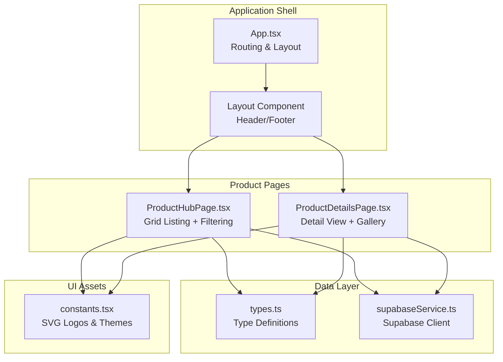
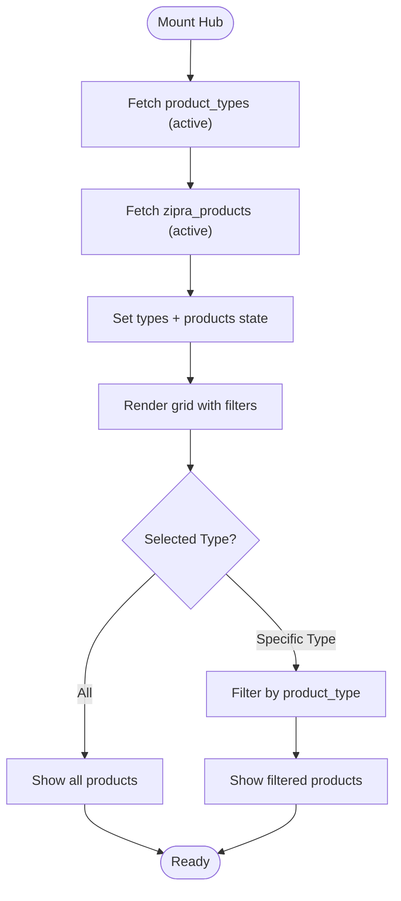
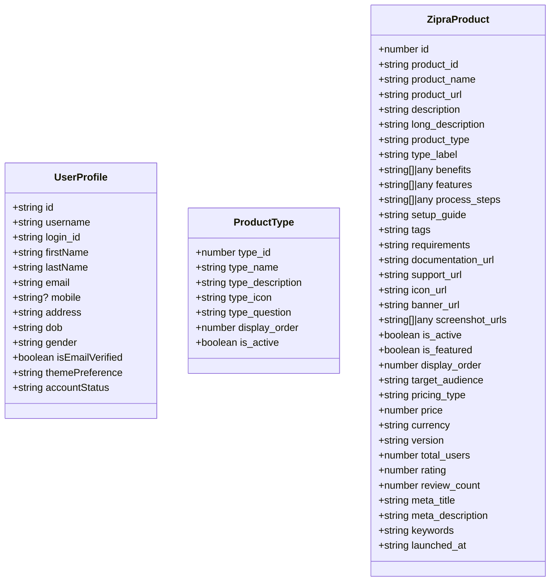
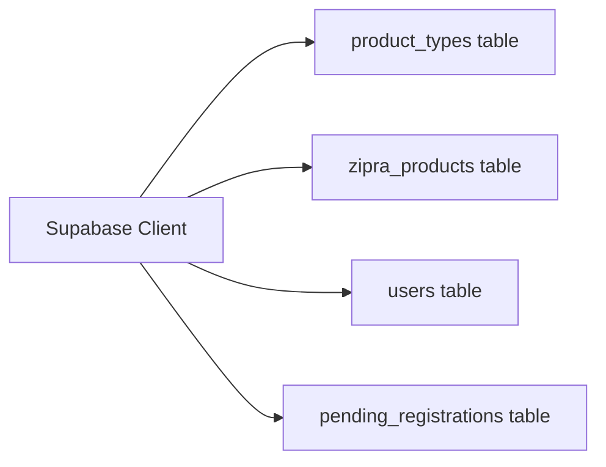
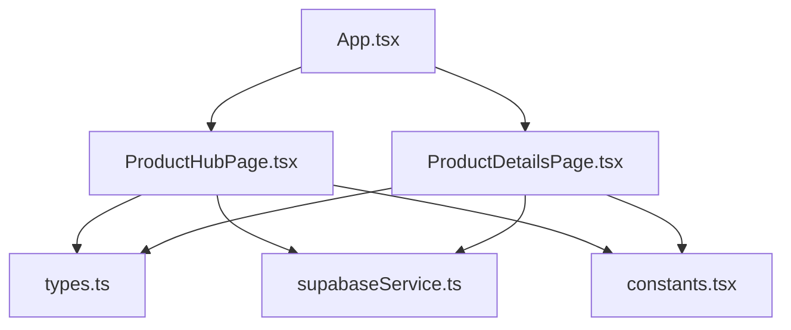

# Product Management Pages

<cite>
**Referenced Files in This Document**
- [App.tsx](file://App.tsx)
- [ProductHubPage.tsx](file://pages/ProductHubPage.tsx)
- [ProductDetailsPage.tsx](file://pages/ProductDetailsPage.tsx)
- [types.ts](file://types.ts)
- [supabaseService.ts](file://services/supabaseService.ts)
- [constants.tsx](file://constants.tsx)
- [package.json](file://package.json)
</cite>

## Table of Contents
1. [Introduction](#introduction)
2. [Project Structure](#project-structure)
3. [Core Components](#core-components)
4. [Architecture Overview](#architecture-overview)
5. [Detailed Component Analysis](#detailed-component-analysis)
6. [Dependency Analysis](#dependency-analysis)
7. [Performance Considerations](#performance-considerations)
8. [Troubleshooting Guide](#troubleshooting-guide)
9. [Conclusion](#conclusion)

## Introduction
This document provides comprehensive technical documentation for the product management pages, focusing on the Product Hub and Product Details experiences. It covers product listing functionality, filtering mechanisms, grid layout implementation, product detail views with image galleries and specification tables, data fetching patterns, product categorization systems, search functionality, state management, cart integration patterns, user interaction patterns, responsive design adaptations, and marketplace service layer integration.

## Project Structure
The product management pages are implemented as React functional components with TypeScript type safety. They integrate with Supabase for data persistence and use Tailwind CSS for responsive styling. Routing is handled by React Router DOM, and the application maintains user authentication state in local storage.



**Diagram sources**
- [App.tsx](file://App.tsx#L248-L278)
- [ProductHubPage.tsx](file://pages/ProductHubPage.tsx#L1-L243)
- [ProductDetailsPage.tsx](file://pages/ProductDetailsPage.tsx#L1-L391)
- [types.ts](file://types.ts#L1-L79)
- [supabaseService.ts](file://services/supabaseService.ts#L1-L67)
- [constants.tsx](file://constants.tsx#L1-L361)

**Section sources**
- [App.tsx](file://App.tsx#L248-L278)
- [package.json](file://package.json#L12-L25)

## Core Components
- ProductHubPage: Displays a categorized grid of products with filtering by product type and navigation to product details.
- ProductDetailsPage: Renders detailed product information, including hero section, specifications, image gallery, and related products.
- Type System: Defines product and user data structures for type-safe development.
- Supabase Service: Provides database client and utility functions for authentication-related operations.
- Constants: Supplies SVG logos and theme variants used across components.

**Section sources**
- [ProductHubPage.tsx](file://pages/ProductHubPage.tsx#L13-L243)
- [ProductDetailsPage.tsx](file://pages/ProductDetailsPage.tsx#L22-L391)
- [types.ts](file://types.ts#L11-L78)
- [supabaseService.ts](file://services/supabaseService.ts#L1-L67)
- [constants.tsx](file://constants.tsx#L273-L361)

## Architecture Overview
The product management architecture follows a layered approach:
- Presentation Layer: React components render UI and manage local state.
- Data Layer: Supabase client handles CRUD operations against the backend.
- Type System: Shared TypeScript interfaces ensure consistency across components.
- Routing Layer: React Router manages navigation between hub and detail views.

```mermaid
sequenceDiagram
participant User as "User"
participant Hub as "ProductHubPage"
participant Router as "React Router"
participant Details as "ProductDetailsPage"
participant Supabase as "Supabase Client"
User->>Hub : Load Product Hub
Hub->>Supabase : Fetch product_types + zipra_products
Supabase-->>Hub : Product data
Hub->>Hub : Filter by selected type
User->>Hub : Click "Details" on product card
Hub->>Router : Navigate to "/product/ : id"
Router->>Details : Render ProductDetailsPage
Details->>Supabase : Fetch product by product_id
Supabase-->>Details : Product details
Details->>Details : Render gallery + specs
```

**Diagram sources**
- [ProductHubPage.tsx](file://pages/ProductHubPage.tsx#L20-L57)
- [ProductDetailsPage.tsx](file://pages/ProductDetailsPage.tsx#L29-L57)
- [App.tsx](file://App.tsx#L261-L261)

## Detailed Component Analysis

### Product Hub Page
The Product Hub provides a responsive grid of product icons with filtering capabilities and hover actions.

#### Data Fetching Pattern
- Concurrently fetches active product types and products during initial mount.
- Uses Supabase select with filters for active records and ordered display.

#### Filtering Mechanism
- Maintains selectedType state with "All" as default.
- Filters products client-side by product_type equality.
- Dynamic filter buttons generated from product_types table.

#### Grid Layout Implementation
- Responsive grid using Tailwind CSS with breakpoints:
  - Mobile: 2 columns
  - Tablet: 4 columns
  - Desktop: 5 columns
  - Large screens: 6 columns
- Skeleton loading placeholders while data loads.

#### Hover Actions and Navigation
- Product cards show overlay with "Open" and "Details" buttons.
- "Open" links to external product URL.
- "Details" navigates to product detail route.



**Diagram sources**
- [ProductHubPage.tsx](file://pages/ProductHubPage.tsx#L20-L50)

**Section sources**
- [ProductHubPage.tsx](file://pages/ProductHubPage.tsx#L13-L243)

### Product Details Page
The Product Details page presents comprehensive product information with multiple sections.

#### Data Fetching Pattern
- Fetches single product by product_id parameter.
- Fetches related products (excluding current) for ecosystem exploration.
- Handles loading states and "not found" scenarios.

#### Image Gallery Implementation
- Play Store-style horizontal scrolling gallery for screenshots.
- Responsive min-width constraints for optimal viewing.
- Cross-origin attributes and error fallbacks for images.

#### Specification Sections
- Benefits grid with numbered items.
- Features grid with styled cards.
- Provisioning steps numbered list.

#### Related Products Integration
- Displays up to 12 related products in a responsive grid.
- Clicking a related product navigates to its detail page.

```mermaid
sequenceDiagram
participant Details as "ProductDetailsPage"
participant Supabase as "Supabase Client"
participant Router as "React Router"
Details->>Supabase : GET zipra_products WHERE product_id = : id
Supabase-->>Details : Product record
Details->>Supabase : GET zipra_products WHERE is_active = true AND product_id != : id
Supabase-->>Details : Related products
Details->>Details : Render hero + gallery + specs
Details->>Router : Navigate on click
```

**Diagram sources**
- [ProductDetailsPage.tsx](file://pages/ProductDetailsPage.tsx#L29-L57)

**Section sources**
- [ProductDetailsPage.tsx](file://pages/ProductDetailsPage.tsx#L22-L391)

### Type System and Data Models
The type definitions establish a contract for product and user data across components.



**Diagram sources**
- [types.ts](file://types.ts#L11-L78)

**Section sources**
- [types.ts](file://types.ts#L11-L78)

### Supabase Service Integration
The Supabase client is configured with environment variables and provides utility functions for authentication-related operations.



**Diagram sources**
- [supabaseService.ts](file://services/supabaseService.ts#L4-L7)

**Section sources**
- [supabaseService.ts](file://services/supabaseService.ts#L1-L67)

### Responsive Design Adaptations
Both pages implement responsive design patterns:
- Product Hub: Grid columns adjust from 2 to 6 based on viewport width.
- Product Details: Hero layout switches from stacked to side-by-side at larger breakpoints.
- Typography scales appropriately across device sizes.
- Interactive elements adapt hover/focus states for touch devices.

**Section sources**
- [ProductHubPage.tsx](file://pages/ProductHubPage.tsx#L167-L196)
- [ProductDetailsPage.tsx](file://pages/ProductDetailsPage.tsx#L127-L183)

### Marketplace Service Layer Integration
The marketplace functionality is integrated through:
- Supabase tables for product metadata, types, and user accounts.
- Authentication utilities for login attempts and account locking.
- Routing integration for seamless navigation between hub and details.

**Section sources**
- [supabaseService.ts](file://services/supabaseService.ts#L26-L66)
- [App.tsx](file://App.tsx#L252-L271)

## Dependency Analysis
The product management pages depend on shared types, constants, and the Supabase client. Routing is centralized in the application shell.



**Diagram sources**
- [ProductHubPage.tsx](file://pages/ProductHubPage.tsx#L1-L6)
- [ProductDetailsPage.tsx](file://pages/ProductDetailsPage.tsx#L1-L6)
- [App.tsx](file://App.tsx#L17-L18)

**Section sources**
- [ProductHubPage.tsx](file://pages/ProductHubPage.tsx#L1-L6)
- [ProductDetailsPage.tsx](file://pages/ProductDetailsPage.tsx#L1-L6)
- [App.tsx](file://App.tsx#L17-L18)

## Performance Considerations
- Client-side filtering reduces server requests for type-based navigation.
- Skeleton loaders improve perceived performance during initial data fetch.
- Image lazy loading via error fallbacks prevents layout shifts.
- Minimal re-renders through efficient state updates and memoization patterns.

## Troubleshooting Guide
Common issues and resolutions:
- Data fetch failures: Check network connectivity and Supabase credentials.
- Product not found: Verify product_id parameter and database records.
- Image loading errors: Confirm URLs and cross-origin policies.
- Authentication redirects: Ensure user state is persisted in local storage.

**Section sources**
- [ProductHubPage.tsx](file://pages/ProductHubPage.tsx#L37-L41)
- [ProductDetailsPage.tsx](file://pages/ProductDetailsPage.tsx#L50-L54)

## Conclusion
The product management pages provide a robust, responsive, and scalable solution for browsing and exploring products within the ZPRIA ecosystem. The implementation leverages modern React patterns, TypeScript type safety, and Supabase for reliable data management. The modular architecture supports future enhancements such as advanced search, cart integration, and expanded marketplace features.