# Utility Pages

<cite>
**Referenced Files in This Document**
- [App.tsx](file://App.tsx)
- [LandingPage.tsx](file://pages/LandingPage.tsx)
- [HelpPage.tsx](file://pages/HelpPage.tsx)
- [SupportPage.tsx](file://pages/SupportPage.tsx)
- [DiagnosticsPage.tsx](file://pages/DiagnosticsPage.tsx)
- [LoadingPage.tsx](file://pages/LoadingPage.tsx)
- [ContactUsPage.tsx](file://pages/ContactUsPage.tsx)
- [LegalPage.tsx](file://pages/LegalPage.tsx)
- [TermsPage.tsx](file://pages/TermsPage.tsx)
- [PolicyPage.tsx](file://pages/PolicyPage.tsx)
- [Captcha.tsx](file://components/Captcha.tsx)
- [FloatingInput.tsx](file://components/FloatingInput.tsx)
- [constants.tsx](file://constants.tsx)
- [metadata.json](file://metadata.json)
- [package.json](file://package.json)
</cite>

## Table of Contents
1. [Introduction](#introduction)
2. [Project Structure](#project-structure)
3. [Core Components](#core-components)
4. [Architecture Overview](#architecture-overview)
5. [Detailed Component Analysis](#detailed-component-analysis)
6. [Dependency Analysis](#dependency-analysis)
7. [Performance Considerations](#performance-considerations)
8. [Troubleshooting Guide](#troubleshooting-guide)
9. [Conclusion](#conclusion)
10. [Appendices](#appendices)

## Introduction
This document explains the utility pages that deliver information, enable help discovery, facilitate diagnostics, manage loading states, process contact requests, and present legal content. It covers how informational content is structured, how the help system is organized, how customer support workflows operate, how diagnostic indicators are presented, how loading states are managed, and how contact forms are processed. It also documents the legal compliance pages for terms of service, privacy policy, and regulatory information, along with examples of content management, SEO optimization, integration with external support systems, responsive design patterns, and accessibility compliance.

## Project Structure
The utility pages are React functional components organized under the pages directory and integrated via React Router in the main application shell. Shared assets and branding are centralized in constants. The app layout provides a consistent header, footer, and lazy-loaded routes for performance.

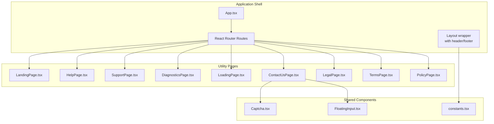

**Diagram sources**
- [App.tsx](file://App.tsx#L248-L276)
- [LandingPage.tsx](file://pages/LandingPage.tsx#L1-L76)
- [HelpPage.tsx](file://pages/HelpPage.tsx#L1-L162)
- [SupportPage.tsx](file://pages/SupportPage.tsx#L1-L215)
- [DiagnosticsPage.tsx](file://pages/DiagnosticsPage.tsx#L1-L51)
- [LoadingPage.tsx](file://pages/LoadingPage.tsx#L1-L67)
- [ContactUsPage.tsx](file://pages/ContactUsPage.tsx#L1-L338)
- [LegalPage.tsx](file://pages/LegalPage.tsx#L1-L66)
- [TermsPage.tsx](file://pages/TermsPage.tsx#L1-L57)
- [PolicyPage.tsx](file://pages/PolicyPage.tsx#L1-L52)
- [Captcha.tsx](file://components/Captcha.tsx#L1-L117)
- [FloatingInput.tsx](file://components/FloatingInput.tsx#L1-L85)
- [constants.tsx](file://constants.tsx#L312-L360)

**Section sources**
- [App.tsx](file://App.tsx#L248-L276)
- [constants.tsx](file://constants.tsx#L312-L360)

## Core Components
- LandingPage: Brand-first entry page with hero messaging, actions, and subtle decorative background.
- HelpPage: Centralized help hub with quick actions, FAQs, and navigation to related pages.
- SupportPage: Support portal with search, cards, topic links, and contact banner.
- DiagnosticsPage: Real-time health metrics presentation for identity network status.
- LoadingPage: Animated loader overlay with fade-in and progress indicator.
- ContactUsPage: Multi-field form with categories, departments, submission states, and success/error messages.
- LegalPage: Legal framework presentation with thematic sections and consent call-to-action.
- TermsPage: Terms of Service with protocol sections and navigation.
- PolicyPage: Privacy policy presentation with accept action.

**Section sources**
- [LandingPage.tsx](file://pages/LandingPage.tsx#L7-L76)
- [HelpPage.tsx](file://pages/HelpPage.tsx#L6-L162)
- [SupportPage.tsx](file://pages/SupportPage.tsx#L57-L215)
- [DiagnosticsPage.tsx](file://pages/DiagnosticsPage.tsx#L7-L51)
- [LoadingPage.tsx](file://pages/LoadingPage.tsx#L4-L67)
- [ContactUsPage.tsx](file://pages/ContactUsPage.tsx#L37-L338)
- [LegalPage.tsx](file://pages/LegalPage.tsx#L6-L66)
- [TermsPage.tsx](file://pages/TermsPage.tsx#L6-L57)
- [PolicyPage.tsx](file://pages/PolicyPage.tsx#L6-L52)

## Architecture Overview
The utility pages are routed through a single-page application with a shared layout. Lazy loading is used for heavier pages. The contact form integrates with a simulated email pipeline and displays feedback states. Legal and policy pages are navigable from headers and footers.

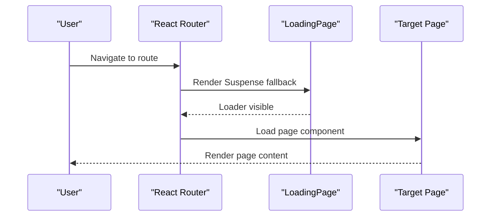

**Diagram sources**
- [App.tsx](file://App.tsx#L200-L204)
- [LoadingPage.tsx](file://pages/LoadingPage.tsx#L4-L67)

**Section sources**
- [App.tsx](file://App.tsx#L248-L276)

## Detailed Component Analysis

### Landing Page
- Purpose: First impression with brand, value proposition, and primary actions.
- Design: Centered hero with decorative mesh background, prominent logo, and two action cards.
- Navigation: Links to sign-up and sign-in flows.

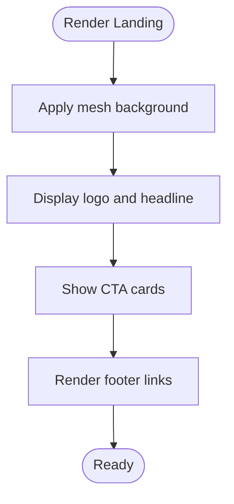

**Diagram sources**
- [LandingPage.tsx](file://pages/LandingPage.tsx#L9-L71)

**Section sources**
- [LandingPage.tsx](file://pages/LandingPage.tsx#L7-L76)

### Help Page
- Purpose: Self-service help hub with FAQs and quick actions.
- Features: Hero branding, quick action cards, FAQ list, and footer links to legal pages.

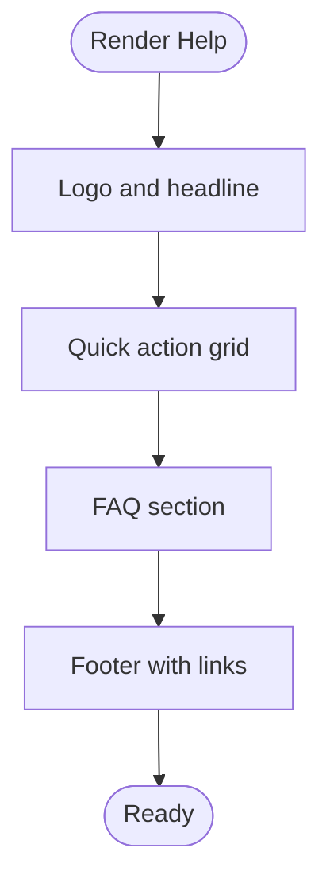

**Diagram sources**
- [HelpPage.tsx](file://pages/HelpPage.tsx#L44-L157)

**Section sources**
- [HelpPage.tsx](file://pages/HelpPage.tsx#L6-L162)

### Support Page
- Purpose: Central support portal with search, cards, topic links, and contact banner.
- Features: Header with navigation, hero, search bar, support cards, popular topics, and contact CTA.

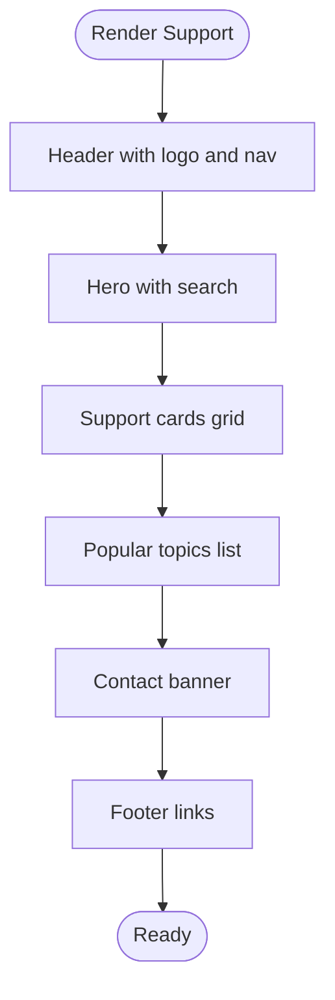

**Diagram sources**
- [SupportPage.tsx](file://pages/SupportPage.tsx#L68-L211)

**Section sources**
- [SupportPage.tsx](file://pages/SupportPage.tsx#L57-L215)

### Diagnostics Page
- Purpose: Present real-time health metrics for the identity network.
- Features: Back navigation, metric cards with status indicators.

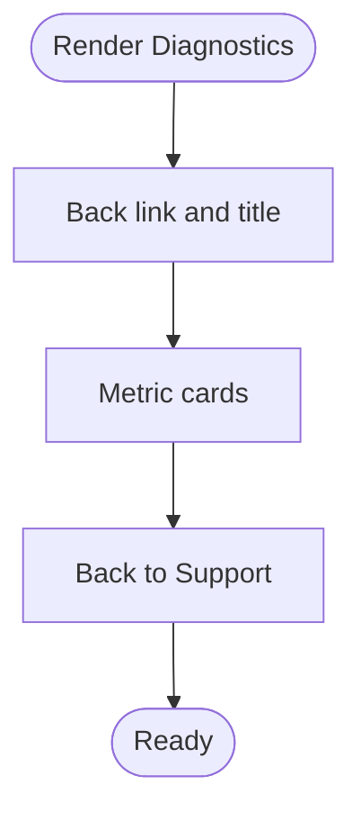

**Diagram sources**
- [DiagnosticsPage.tsx](file://pages/DiagnosticsPage.tsx#L8-L46)

**Section sources**
- [DiagnosticsPage.tsx](file://pages/DiagnosticsPage.tsx#L7-L51)

### Loading Page
- Purpose: Smooth transition and perceived performance during route changes.
- Features: Fade-in animation, geometric blocks loader, progress indicator, and keyframe animation.

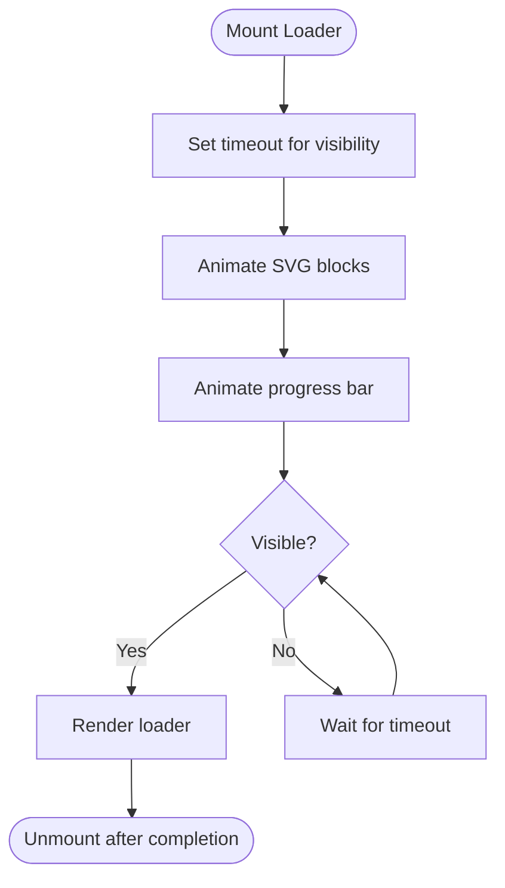

**Diagram sources**
- [LoadingPage.tsx](file://pages/LoadingPage.tsx#L8-L63)

**Section sources**
- [LoadingPage.tsx](file://pages/LoadingPage.tsx#L4-L67)

### Contact Us Page
- Purpose: Capture user inquiries with categorization and department routing.
- Features: Form with floating labels, categories and departments dropdowns, submit states, success/error messages, and alternative contact method.

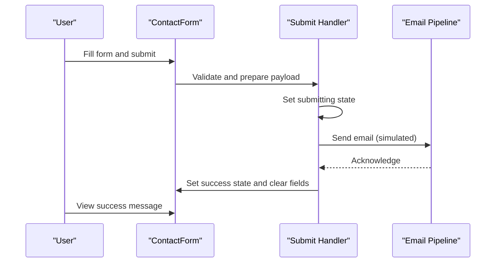

**Diagram sources**
- [ContactUsPage.tsx](file://pages/ContactUsPage.tsx#L54-L97)

**Section sources**
- [ContactUsPage.tsx](file://pages/ContactUsPage.tsx#L37-L338)

### Legal Compliance Pages
- LegalPage: Thematic legal framework presentation with sections and consent CTA.
- TermsPage: Terms of Service with protocol sections and navigation.
- PolicyPage: Privacy policy presentation with accept action.

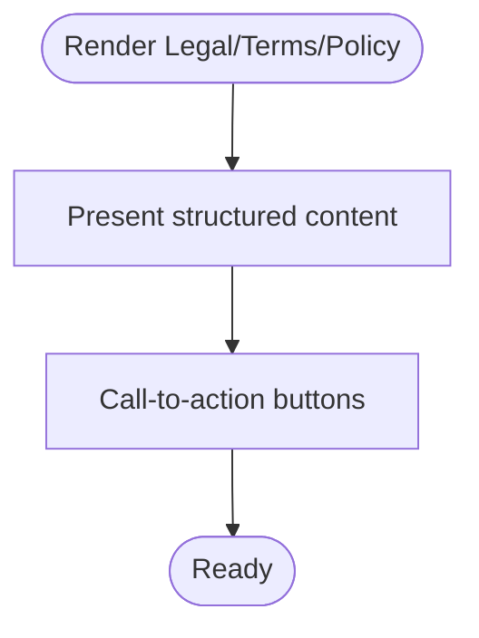

**Diagram sources**
- [LegalPage.tsx](file://pages/LegalPage.tsx#L9-L62)
- [TermsPage.tsx](file://pages/TermsPage.tsx#L9-L53)
- [PolicyPage.tsx](file://pages/PolicyPage.tsx#L14-L48)

**Section sources**
- [LegalPage.tsx](file://pages/LegalPage.tsx#L6-L66)
- [TermsPage.tsx](file://pages/TermsPage.tsx#L6-L57)
- [PolicyPage.tsx](file://pages/PolicyPage.tsx#L6-L52)

### Shared Components Used by Contact Form
- Captcha: Canvas-based verification with dynamic text and input validation callback.
- FloatingInput: Reusable input/select with floating label behavior and invalid state styling.

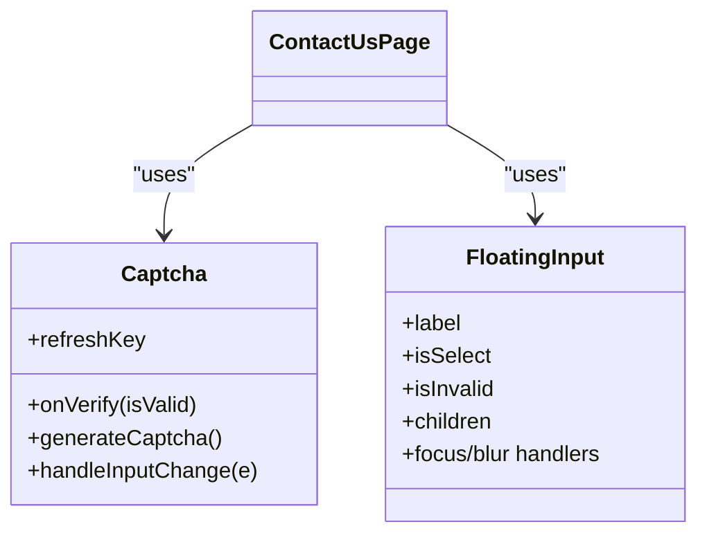

**Diagram sources**
- [Captcha.tsx](file://components/Captcha.tsx#L9-L117)
- [FloatingInput.tsx](file://components/FloatingInput.tsx#L11-L85)
- [ContactUsPage.tsx](file://pages/ContactUsPage.tsx#L37-L338)

**Section sources**
- [Captcha.tsx](file://components/Captcha.tsx#L1-L117)
- [FloatingInput.tsx](file://components/FloatingInput.tsx#L1-L85)

## Dependency Analysis
- Routing: App.tsx defines routes for all utility pages and lazy-loads heavy pages.
- Branding: constants.tsx centralizes logos and theme variants used across pages.
- Icons: lucide-react icons are used in support and contact pages.
- External integrations: Supabase and Gemini SDKs are declared in package.json; the contact form currently simulates email sending.

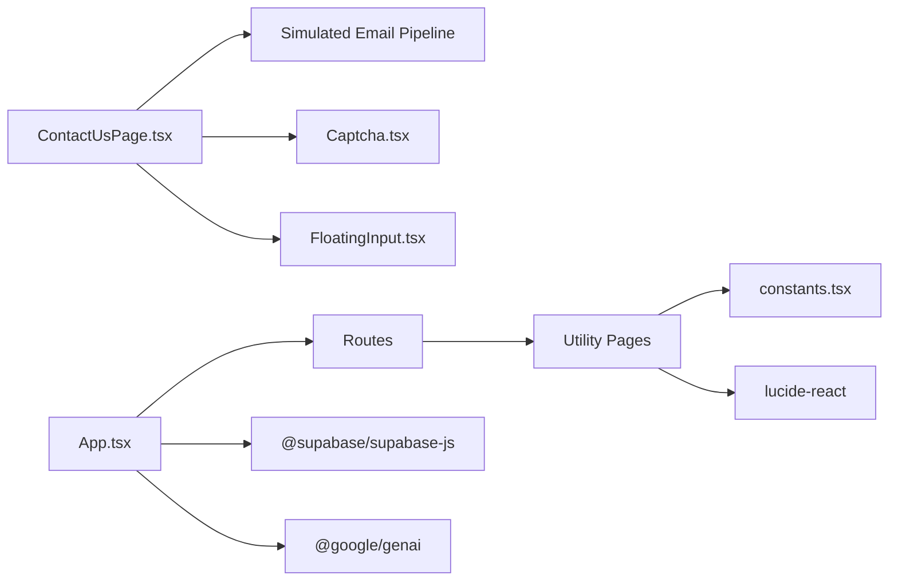

**Diagram sources**
- [App.tsx](file://App.tsx#L248-L276)
- [package.json](file://package.json#L12-L26)
- [constants.tsx](file://constants.tsx#L312-L360)
- [ContactUsPage.tsx](file://pages/ContactUsPage.tsx#L37-L338)

**Section sources**
- [App.tsx](file://App.tsx#L248-L276)
- [package.json](file://package.json#L12-L26)

## Performance Considerations
- Lazy loading: Heavy pages are lazy-loaded to reduce initial bundle size.
- Suspense fallback: LoadingPage acts as a smooth transition during navigation.
- Minimal re-renders: Contact form uses controlled components and local state to avoid unnecessary updates.
- SVG animations: LoadingPage uses lightweight SVG animations; keep durations reasonable to preserve performance.

[No sources needed since this section provides general guidance]

## Troubleshooting Guide
- Navigation issues: Ensure routes are defined in App.tsx and linked correctly in headers/footers.
- Form submission errors: Check submit handler logic and console logs for thrown exceptions.
- Captcha validation: Confirm onVerify callback is wired properly to enable/disable form submission.
- Responsive layout: Verify Tailwind breakpoints and spacing classes across screen sizes.

**Section sources**
- [App.tsx](file://App.tsx#L248-L276)
- [ContactUsPage.tsx](file://pages/ContactUsPage.tsx#L54-L97)
- [Captcha.tsx](file://components/Captcha.tsx#L83-L87)

## Conclusion
The utility pages provide a cohesive informational and support experience, with clear pathways to help, diagnostics, and legal content. The contact form offers structured submission with feedback, while the loading state ensures smooth transitions. Legal and policy pages present essential compliance information. The architecture leverages routing, lazy loading, and shared components to maintain performance and consistency.

[No sources needed since this section summarizes without analyzing specific files]

## Appendices

### SEO Optimization Examples
- Use semantic headings and concise page titles in each page component.
- Include meta description in metadata.json for improved search visibility.
- Provide clear navigation and breadcrumbs via header/footer links.

**Section sources**
- [metadata.json](file://metadata.json#L1-L5)

### Integration with External Support Systems
- Current contact form simulates email sending; integrate with your backend or email service in the submit handler.
- Consider adding analytics events on form submission and navigation.

**Section sources**
- [ContactUsPage.tsx](file://pages/ContactUsPage.tsx#L54-L97)

### Responsive Design Patterns
- Mobile-first Tailwind classes with responsive variants (md:, lg:).
- Flexible grids and spacing adapt to various viewport widths.

**Section sources**
- [HelpPage.tsx](file://pages/HelpPage.tsx#L62-L111)
- [SupportPage.tsx](file://pages/SupportPage.tsx#L108-L149)
- [ContactUsPage.tsx](file://pages/ContactUsPage.tsx#L116-L318)

### Accessibility Compliance
- Keyboard navigation: Ensure focus styles and tab order are logical across interactive elements.
- ARIA roles and labels: Provide meaningful labels for icons and buttons.
- Contrast and readability: Maintain sufficient contrast for text and backgrounds.

[No sources needed since this section provides general guidance]