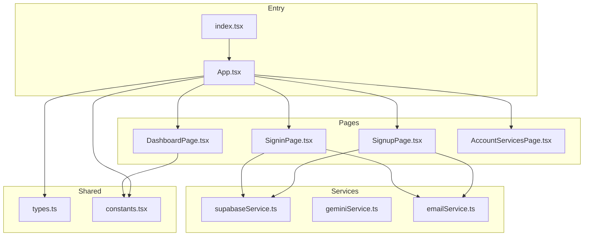
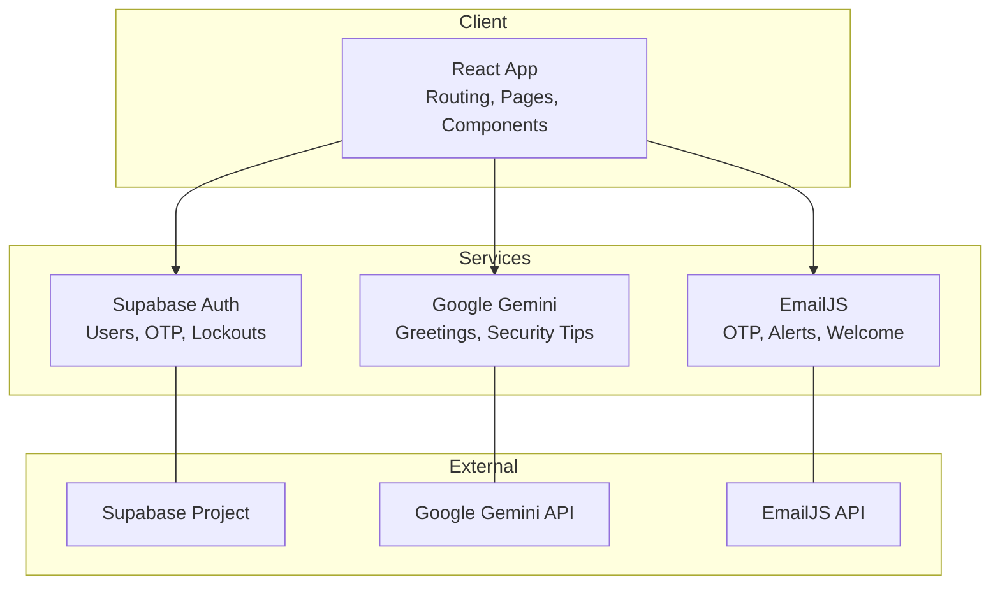
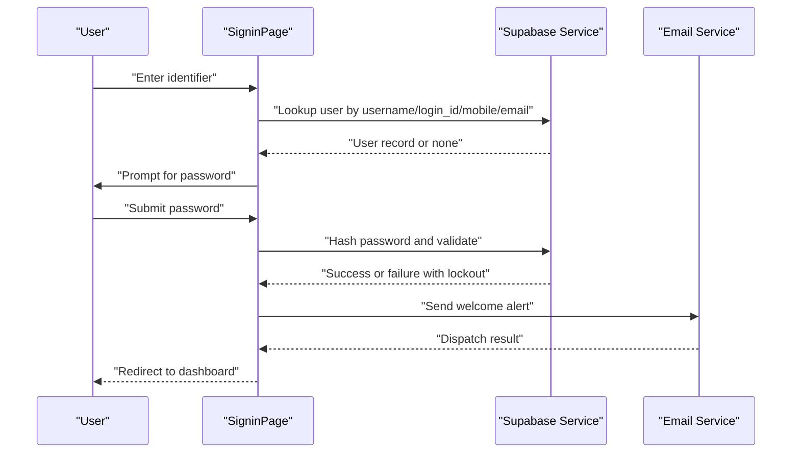
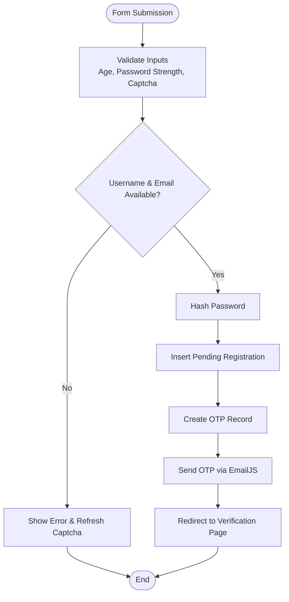
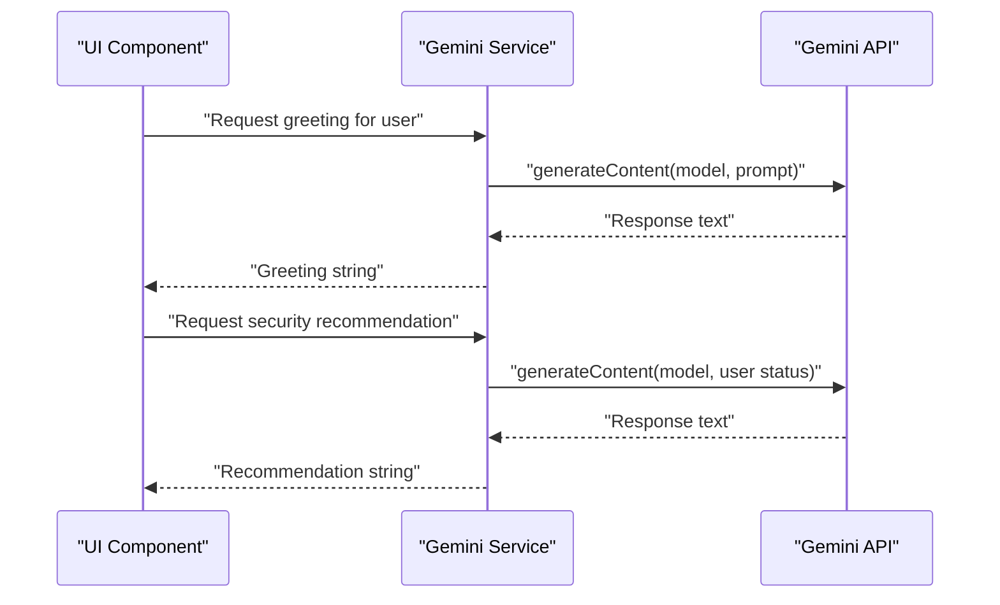
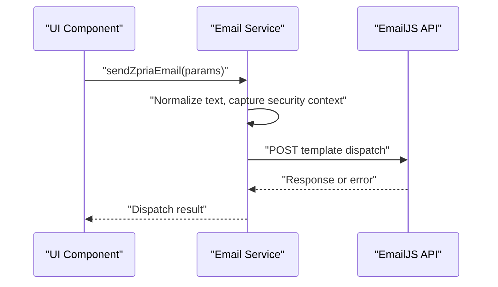
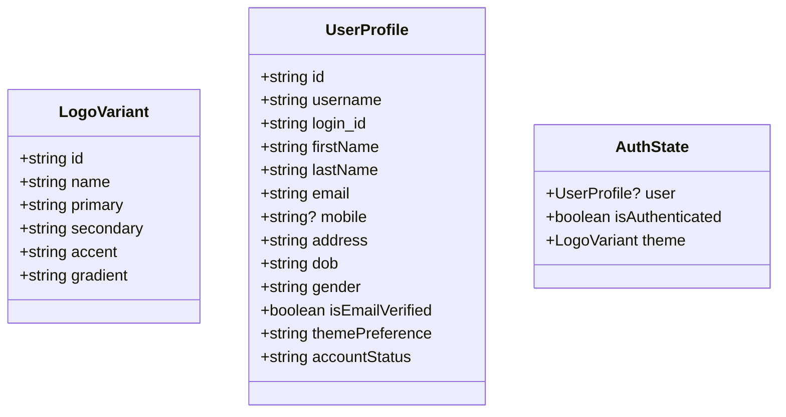
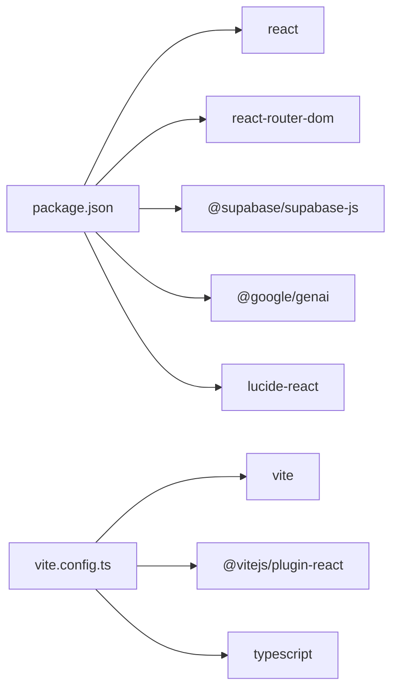

# Project Overview

<cite>
**Referenced Files in This Document**
- [README.md](file://README.md)
- [package.json](file://package.json)
- [vite.config.ts](file://vite.config.ts)
- [App.tsx](file://App.tsx)
- [index.tsx](file://index.tsx)
- [types.ts](file://types.ts)
- [constants.tsx](file://constants.tsx)
- [services/supabaseService.ts](file://services/supabaseService.ts)
- [services/geminiService.ts](file://services/geminiService.ts)
- [services/emailService.ts](file://services/emailService.ts)
- [pages/DashboardPage.tsx](file://pages/DashboardPage.tsx)
- [pages/SigninPage.tsx](file://pages/SigninPage.tsx)
- [pages/SignupPage.tsx](file://pages/SignupPage.tsx)
- [pages/AccountServicesPage.tsx](file://pages/AccountServicesPage.tsx)
- [metadata.json](file://metadata.json)
</cite>

## Table of Contents
1. [Introduction](#introduction)
2. [Project Structure](#project-structure)
3. [Core Components](#core-components)
4. [Architecture Overview](#architecture-overview)
5. [Detailed Component Analysis](#detailed-component-analysis)
6. [Dependency Analysis](#dependency-analysis)
7. [Performance Considerations](#performance-considerations)
8. [Troubleshooting Guide](#troubleshooting-guide)
9. [Conclusion](#conclusion)
10. [Appendices](#appendices)

## Introduction
The ZPRIA Account Management System is a privacy-focused unified digital identity platform designed to serve as the single sign-on and identity backbone for the ZPRIA creative ecosystem. Its core value proposition centers on providing a sovereign, encrypted, and unified identity that spans multiple products and services while maintaining strict user control over personal data. The system targets professionals and creators who require seamless access to ZPRIA tools under a single, secure account.

Key positioning pillars:
- Privacy-first identity architecture from “Z” (zero-point data) to “A” (application output)
- Unified access across the ZPRIA ecosystem with a single, sovereign identity
- Strong security controls including multi-factor readiness, lockout policies, and encrypted storage
- Human-in-the-loop verification and AI-assisted personalization

Target audience:
- Creative professionals and teams operating within the ZPRIA ecosystem
- Organizations requiring a unified, privacy-preserving identity layer for distributed tools
- Users prioritizing data sovereignty and minimal exposure across platforms

## Project Structure
The application follows a React/TypeScript monorepo-style layout with a Vite-powered build pipeline. Pages are organized by feature, services encapsulate third-party integrations, and shared types/constants unify the UI and logic.

**Diagram sources**
- [index.tsx](file://index.tsx#L1-L17)
- [App.tsx](file://App.tsx#L1-L279)
- [DashboardPage.tsx](file://pages/DashboardPage.tsx#L1-L217)
- [SigninPage.tsx](file://pages/SigninPage.tsx#L1-L231)
- [SignupPage.tsx](file://pages/SignupPage.tsx#L1-L293)
- [AccountServicesPage.tsx](file://pages/AccountServicesPage.tsx#L1-L40)
- [services/supabaseService.ts](file://services/supabaseService.ts#L1-L67)
- [services/geminiService.ts](file://services/geminiService.ts#L1-L39)
- [services/emailService.ts](file://services/emailService.ts#L1-L194)
- [types.ts](file://types.ts#L1-L79)
- [constants.tsx](file://constants.tsx#L1-L361)

**Section sources**
- [index.tsx](file://index.tsx#L1-L17)
- [App.tsx](file://App.tsx#L1-L279)
- [package.json](file://package.json#L1-L27)
- [vite.config.ts](file://vite.config.ts#L1-L24)

## Core Components
- Authentication and Identity Layer
  - Supabase integration for secure user storage, credential hashing, and lockout policies
  - Multi-identifier login (username, login_id, email, mobile)
  - Session persistence via local storage with theme preferences
- Personalization Engine
  - Dynamic theming variants and logo branding
  - Onboarding and dashboard animations to reinforce brand identity
- AI Integration
  - Google Gemini for contextual greeting generation and security recommendations
- Email Services
  - EmailJS integration for OTP delivery, welcome notifications, and security alerts
  - Security context injection (device, IP, location, time) for transparency
- Routing and Navigation
  - React Router-based SPA with lazy-loaded routes for optimal performance
- UI/UX Foundation
  - TypeScript types for profiles, auth state, and product metadata
  - Shared constants for themes, countries, and animated logos

**Section sources**
- [services/supabaseService.ts](file://services/supabaseService.ts#L1-L67)
- [services/geminiService.ts](file://services/geminiService.ts#L1-L39)
- [services/emailService.ts](file://services/emailService.ts#L1-L194)
- [App.tsx](file://App.tsx#L1-L279)
- [types.ts](file://types.ts#L1-L79)
- [constants.tsx](file://constants.tsx#L1-L361)

## Architecture Overview
The system is built on a modern frontend stack with clear separation of concerns:
- Frontend: React 19 with TypeScript, Vite for development and production builds
- Backend-as-a-service: Supabase for database, auth primitives, and row-level security
- AI: Google Gemini for lightweight personalization and security prompts
- Communication: EmailJS for transactional email orchestration
- Routing: React Router DOM for client-side navigation
- Theming and branding: Shared constants and theme variants

**Diagram sources**
- [package.json](file://package.json#L12-L18)
- [vite.config.ts](file://vite.config.ts#L1-L24)
- [services/supabaseService.ts](file://services/supabaseService.ts#L1-L7)
- [services/geminiService.ts](file://services/geminiService.ts#L1-L20)
- [services/emailService.ts](file://services/emailService.ts#L1-L137)

## Detailed Component Analysis

### Authentication and Identity Flow
The authentication flow supports multi-identifier login, password hashing, and lockout enforcement. It integrates with Supabase for user lookup, credential validation, and session management.

**Diagram sources**
- [pages/SigninPage.tsx](file://pages/SigninPage.tsx#L23-L95)
- [services/supabaseService.ts](file://services/supabaseService.ts#L26-L66)
- [services/emailService.ts](file://services/emailService.ts#L152-L172)

**Section sources**
- [pages/SigninPage.tsx](file://pages/SigninPage.tsx#L1-L231)
- [services/supabaseService.ts](file://services/supabaseService.ts#L1-L67)
- [services/emailService.ts](file://services/emailService.ts#L1-L194)

### Registration and Verification Pipeline
The registration pipeline validates user inputs, stores a pending registration, generates an OTP, and sends it via EmailJS. It also enforces availability checks for usernames and emails.

**Diagram sources**
- [pages/SignupPage.tsx](file://pages/SignupPage.tsx#L82-L149)
- [services/supabaseService.ts](file://services/supabaseService.ts#L17-L24)
- [services/emailService.ts](file://services/emailService.ts#L139-L147)

**Section sources**
- [pages/SignupPage.tsx](file://pages/SignupPage.tsx#L1-L293)
- [services/supabaseService.ts](file://services/supabaseService.ts#L1-L67)
- [services/emailService.ts](file://services/emailService.ts#L1-L194)

### AI-Powered Personalization
The system integrates Google Gemini to generate contextual greetings and security recommendations, enhancing user onboarding and awareness.

**Diagram sources**
- [services/geminiService.ts](file://services/geminiService.ts#L4-L20)
- [services/geminiService.ts](file://services/geminiService.ts#L22-L38)

**Section sources**
- [services/geminiService.ts](file://services/geminiService.ts#L1-L39)

### Email Delivery and Security Context
EmailJS is used for transactional messages. The system enriches each email with security context (device, IP, location, time) to improve trust and compliance.

**Diagram sources**
- [services/emailService.ts](file://services/emailService.ts#L70-L137)

**Section sources**
- [services/emailService.ts](file://services/emailService.ts#L1-L194)

### Theming and Branding
The application supports multiple theme variants and animated logos, enabling a consistent and customizable brand experience across the ecosystem.

**Diagram sources**
- [types.ts](file://types.ts#L2-L31)
- [constants.tsx](file://constants.tsx#L5-L25)

**Section sources**
- [types.ts](file://types.ts#L1-L79)
- [constants.tsx](file://constants.tsx#L1-L361)

## Dependency Analysis
The project relies on a focused set of libraries and services:
- React 19 and React Router DOM for UI and routing
- Supabase for backend-as-a-service (authentication, storage, RLS)
- Google GenAI for lightweight AI assistance
- EmailJS for email delivery
- Vite for build tooling and dev server

**Diagram sources**
- [package.json](file://package.json#L12-L25)
- [vite.config.ts](file://vite.config.ts#L1-L24)

**Section sources**
- [package.json](file://package.json#L1-L27)
- [vite.config.ts](file://vite.config.ts#L1-L24)

## Performance Considerations
- Client-side routing with lazy-loaded pages reduces initial bundle size and improves perceived performance.
- Local storage usage for session and theme preferences minimizes server round-trips during navigation.
- Environment variable injection for API keys ensures runtime configuration without recompilation.
- Minimal third-party dependencies reduce attack surface and maintenance overhead.

[No sources needed since this section provides general guidance]

## Troubleshooting Guide
Common issues and resolutions:
- Missing API keys
  - Ensure the Gemini API key is configured in the environment for AI features.
- Supabase connectivity
  - Verify Supabase URL and anonymous key are correct and reachable.
- Email dispatch failures
  - Confirm EmailJS credentials and template IDs; check network errors and rate limits.
- Authentication lockouts
  - Accounts may be temporarily locked after repeated failed attempts; wait for lockout period to expire.
- Captcha verification
  - If CAPTCHA fails, refresh the challenge and retry to reset the verification state.

**Section sources**
- [README.md](file://README.md#L16-L20)
- [services/supabaseService.ts](file://services/supabaseService.ts#L38-L42)
- [services/emailService.ts](file://services/emailService.ts#L114-L137)

## Conclusion
The ZPRIA Account Management System establishes a privacy-centric, unified identity foundation for the ZPRIA ecosystem. By combining robust authentication, AI-driven personalization, and secure email communications, it delivers a cohesive, sovereign identity experience. The modular architecture, clear service boundaries, and thoughtful UX design position it as a scalable and maintainable cornerstone of the broader ZPRIA platform.

[No sources needed since this section summarizes without analyzing specific files]

## Appendices

### Technology Stack Highlights
- Frontend: React 19, TypeScript, Vite
- Backend: Supabase (PostgreSQL, Auth, RLS)
- AI: Google Gemini GenAI
- Email: EmailJS
- Routing: React Router DOM
- Icons: Lucide React

**Section sources**
- [package.json](file://package.json#L12-L25)
- [vite.config.ts](file://vite.config.ts#L1-L24)

### System Capabilities and Positioning
- Unified identity across ZPRIA products with sovereign control
- Privacy-first architecture from data origin to application output
- AI-assisted onboarding and security guidance
- Secure, compliant email communications with transparency
- Extensible theming and branding for diverse user experiences

**Section sources**
- [metadata.json](file://metadata.json#L1-L5)
- [pages/DashboardPage.tsx](file://pages/DashboardPage.tsx#L155-L180)
- [pages/AccountServicesPage.tsx](file://pages/AccountServicesPage.tsx#L18-L29)