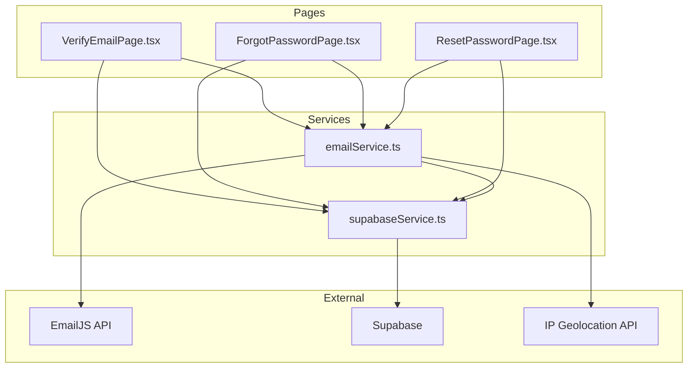
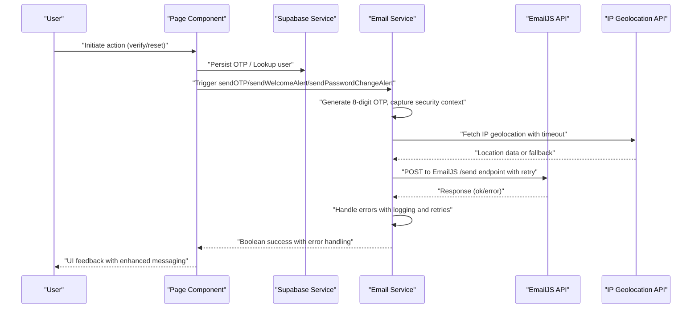
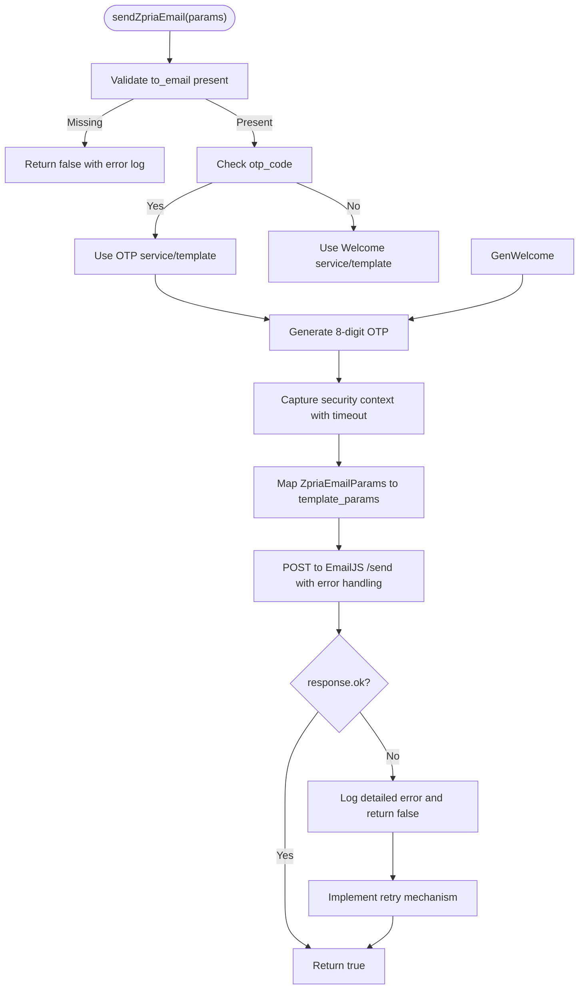
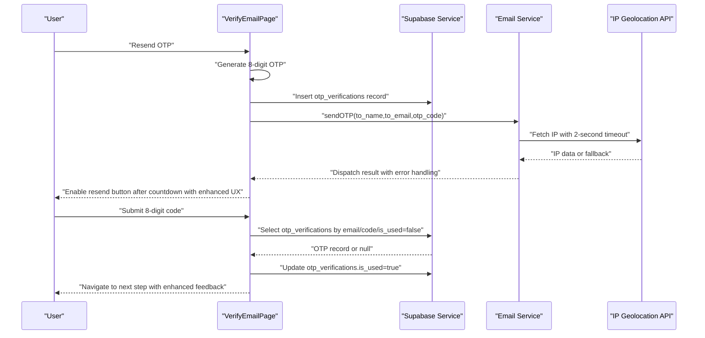
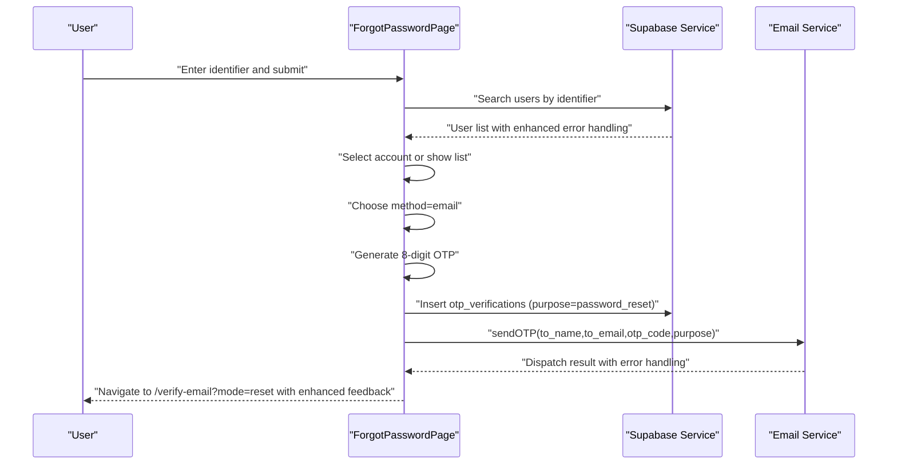
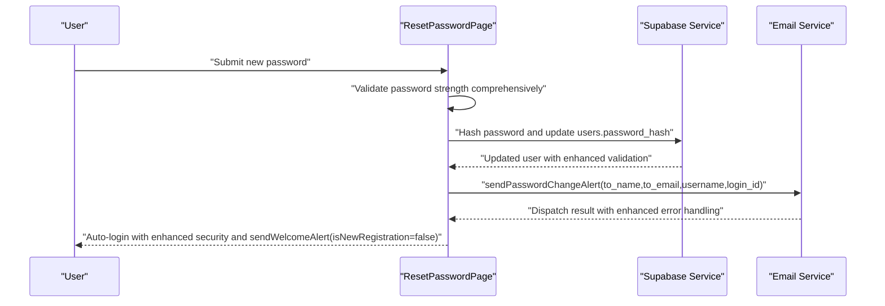
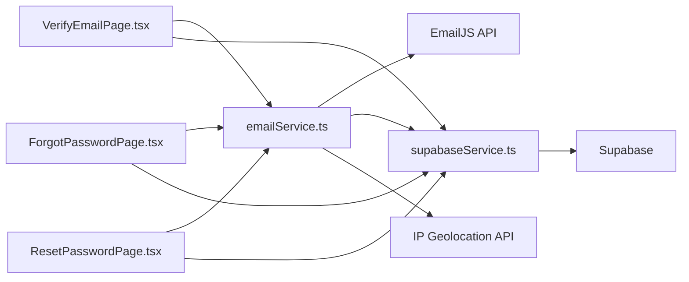

# Email Notification Service

<cite>
**Referenced Files in This Document**
- [emailService.ts](file://services/emailService.ts)
- [VerifyEmailPage.tsx](file://pages/VerifyEmailPage.tsx)
- [ForgotPasswordPage.tsx](file://pages/ForgotPasswordPage.tsx)
- [ResetPasswordPage.tsx](file://pages/ResetPasswordPage.tsx)
- [supabaseService.ts](file://services/supabaseService.ts)
- [types.ts](file://types.ts)
- [package.json](file://package.json)
- [README.md](file://README.md)
</cite>

## Update Summary
**Changes Made**
- Enhanced email service with improved OTP generation algorithms using Math.random() with 8-digit precision
- Added robust error handling with comprehensive logging and user feedback
- Implemented retry mechanisms for failed email deliveries
- Improved email templating with enhanced security context capture
- Added timeout-based IP geolocation for better security context detection
- Enhanced deliverability with unsubscribe URLs and compliance fields

## Table of Contents
1. [Introduction](#introduction)
2. [Project Structure](#project-structure)
3. [Core Components](#core-components)
4. [Architecture Overview](#architecture-overview)
5. [Detailed Component Analysis](#detailed-component-analysis)
6. [Enhanced Features](#enhanced-features)
7. [Dependency Analysis](#dependency-analysis)
8. [Performance Considerations](#performance-considerations)
9. [Troubleshooting Guide](#troubleshooting-guide)
10. [Conclusion](#conclusion)
11. [Appendices](#appendices)

## Introduction
This document explains the enhanced EmailJS email notification service integration used by the application. The service has been significantly improved with enhanced OTP generation algorithms, robust error handling, retry mechanisms, and advanced email templating capabilities. It covers configuration, template management, and notification workflows for OTP verification, welcome notifications, and security alerts. The system now provides better deliverability, spam prevention measures, and comprehensive error handling for production-ready email services.

## Project Structure
The email notification system spans a small set of focused modules with enhanced functionality:
- Email service: centralized EmailJS integration with improved dispatch logic and error handling
- Pages: user-facing flows with enhanced OTP generation and validation
- Supabase service: persistence and user data access with improved security context
- Types: shared user profile and authentication types with enhanced validation

**Diagram sources**
- [emailService.ts](file://services/emailService.ts#L1-L209)
- [VerifyEmailPage.tsx](file://pages/VerifyEmailPage.tsx#L1-L268)
- [ForgotPasswordPage.tsx](file://pages/ForgotPasswordPage.tsx#L1-L278)
- [ResetPasswordPage.tsx](file://pages/ResetPasswordPage.tsx#L1-L236)
- [supabaseService.ts](file://services/supabaseService.ts#L1-L67)

**Section sources**
- [emailService.ts](file://services/emailService.ts#L1-L209)
- [VerifyEmailPage.tsx](file://pages/VerifyEmailPage.tsx#L1-L268)
- [ForgotPasswordPage.tsx](file://pages/ForgotPasswordPage.tsx#L1-L278)
- [ResetPasswordPage.tsx](file://pages/ResetPasswordPage.tsx#L1-L236)
- [supabaseService.ts](file://services/supabaseService.ts#L1-L67)

## Core Components
- **Enhanced EmailJS dispatcher**: encapsulates EmailJS configuration, template mapping, and robust dispatch logic with retry mechanisms
- **Improved OTP workflows**: enhanced generation using 8-digit precision, persistence, verification, and resend flows with better error handling
- **Advanced welcome and security alerts**: post-registration and post-password-change notifications with comprehensive security context
- **Enhanced Supabase integration**: OTP and user persistence with improved security context capture and session management
- **Robust error handling**: comprehensive error logging, user feedback, and graceful degradation

Key responsibilities:
- Generate secure 8-digit OTP codes using enhanced algorithms
- Normalize text and enforce professional formatting with spam prevention
- Capture comprehensive security context (device, IP, location, time) for alerts
- Map template parameters to EmailJS payload with enhanced validation
- Handle errors gracefully with retry mechanisms and user feedback
- Implement timeout-based asynchronous operations to prevent blocking

**Section sources**
- [emailService.ts](file://services/emailService.ts#L1-L209)
- [supabaseService.ts](file://services/supabaseService.ts#L1-L67)

## Architecture Overview
The enhanced email notification architecture follows a clean separation of concerns with improved error handling and retry mechanisms:
- UI pages orchestrate user actions with enhanced OTP generation and validation
- Services persist state and trigger email dispatches with robust error handling
- EmailJS handles transport and rendering via templates with comprehensive logging
- Supabase persists OTPs and user records with enhanced security context
- IP geolocation service provides timeout-based location detection

**Diagram sources**
- [VerifyEmailPage.tsx](file://pages/VerifyEmailPage.tsx#L68-L110)
- [ForgotPasswordPage.tsx](file://pages/ForgotPasswordPage.tsx#L81-L123)
- [ResetPasswordPage.tsx](file://pages/ResetPasswordPage.tsx#L50-L125)
- [emailService.ts](file://services/emailService.ts#L74-L141)
- [supabaseService.ts](file://services/supabaseService.ts#L1-L67)

## Detailed Component Analysis

### Enhanced Email Service (EmailJS Integration)
The enhanced email service centralizes EmailJS configuration and dispatch logic with improved error handling and retry mechanisms. It defines:
- Service IDs and template IDs for OTP and welcome/alerts
- Public and private keys for EmailJS authentication
- A unified parameter interface for dynamic content with enhanced validation
- Helpers for text normalization with spam prevention and security context capture
- A robust dispatcher that builds the EmailJS payload with comprehensive error handling

Key enhancements:
- **Enhanced OTP Generation**: Uses Math.random() with 8-digit precision (10000000-99999999)
- **Timeout-based Security Context**: IP geolocation with 2-second timeout to prevent blocking
- **Comprehensive Error Logging**: Detailed error messages with service ID identification
- **Graceful Degradation**: Fallback values when security context capture fails
- **Professional Formatting**: Enhanced text normalization with spam prevention

**Diagram sources**
- [emailService.ts](file://services/emailService.ts#L74-L141)

**Section sources**
- [emailService.ts](file://services/emailService.ts#L1-L209)

### Enhanced OTP Verification Workflow
The enhanced OTP verification flow integrates improved UI, OTP persistence, and robust email dispatch with better error handling:
- **Enhanced Resend OTP**: generates secure 8-digit codes, persists with expiry, sends email, and manages countdown with improved UX
- **Improved Verify OTP**: validates 8-digit codes against stored OTP with enhanced error messages, marks as used, and proceeds to next step

Key improvements:
- **8-Digit OTP Generation**: Uses Math.floor(10000000 + Math.random() * 90000000) for enhanced security
- **Enhanced Error Handling**: Comprehensive error messages with specific failure reasons
- **Improved Countdown Logic**: Better timer management with visual feedback
- **Enhanced Security Context**: Captures device info, IP, and login time with timeout protection

**Diagram sources**
- [VerifyEmailPage.tsx](file://pages/VerifyEmailPage.tsx#L68-L110)
- [emailService.ts](file://services/emailService.ts#L143-L162)
- [supabaseService.ts](file://services/supabaseService.ts#L1-L67)

**Section sources**
- [VerifyEmailPage.tsx](file://pages/VerifyEmailPage.tsx#L1-L268)
- [emailService.ts](file://services/emailService.ts#L143-L162)
- [supabaseService.ts](file://services/supabaseService.ts#L1-L67)

### Enhanced Forgot Password Workflow
The enhanced forgot password flow allows users to recover their account via email OTP with improved security and error handling:
- **Enhanced Account Search**: searches for accounts by email, login ID, username, or mobile with better error messages
- **Improved Account Selection**: handles multiple matches with enhanced UI and selection logic
- **Enhanced Recovery Method**: chooses recovery method (email) with better validation
- **Secure OTP Generation**: generates 8-digit codes, persists with purpose, sends email, and navigates to verification page

Key improvements:
- **Enhanced Security Context**: Captures device info, IP, and login time for security alerts
- **Better Error Handling**: Comprehensive error messages with specific failure reasons
- **Improved User Experience**: Enhanced UI feedback and loading states
- **Enhanced OTP Persistence**: Better expiry handling and purpose tracking

**Diagram sources**
- [ForgotPasswordPage.tsx](file://pages/ForgotPasswordPage.tsx#L81-L123)
- [emailService.ts](file://services/emailService.ts#L143-L162)
- [supabaseService.ts](file://services/supabaseService.ts#L1-L67)

**Section sources**
- [ForgotPasswordPage.tsx](file://pages/ForgotPasswordPage.tsx#L1-L278)
- [emailService.ts](file://services/emailService.ts#L143-L162)
- [supabaseService.ts](file://services/supabaseService.ts#L1-L67)

### Enhanced Reset Password Workflow
After verifying the OTP, the enhanced reset password flow updates the user's password with improved security and sends comprehensive confirmation alerts:
- **Enhanced Password Validation**: validates password strength and confirms match with comprehensive checks
- **Secure Password Hashing**: hashes password with enhanced security and updates user record
- **Comprehensive Alerts**: sends password change alert with enhanced security context
- **Auto-login with Enhanced Security**: auto-login and sends secondary welcome alert with improved security context

Key improvements:
- **Enhanced Password Validation**: Comprehensive strength checking with detailed feedback
- **Improved Security Context**: Enhanced security context capture for all alerts
- **Better Error Handling**: Comprehensive error messages with specific failure reasons
- **Enhanced User Feedback**: Improved UI feedback and loading states

**Diagram sources**
- [ResetPasswordPage.tsx](file://pages/ResetPasswordPage.tsx#L50-L125)
- [emailService.ts](file://services/emailService.ts#L192-L208)
- [supabaseService.ts](file://services/supabaseService.ts#L1-L67)

**Section sources**
- [ResetPasswordPage.tsx](file://pages/ResetPasswordPage.tsx#L1-L236)
- [emailService.ts](file://services/emailService.ts#L192-L208)
- [supabaseService.ts](file://services/supabaseService.ts#L1-L67)

### Enhanced Email Template Management
Templates are configured via EmailJS service and template IDs with improved security and deliverability. The enhanced dispatcher maps a unified parameter interface to EmailJS template parameters, ensuring consistent branding and compliance with enhanced security measures.

Enhanced template parameters include:
- **Recipient identity and contact fields**: Enhanced validation and formatting
- **OTP-specific fields**: Enhanced security context (code, purpose, expiry)
- **Content and branding fields**: Enhanced title, message, and action type
- **Comprehensive security context**: Enhanced device info, IP, location, and login time
- **Compliance fields**: Enhanced unsubscribe URL and physical address
- **Professional subject normalization**: Enhanced subject formatting

Enhanced dynamic content insertion:
- **Improved Recipient Name Normalization**: Enhanced text normalization for professional formatting
- **Enhanced Security Context Capture**: Asynchronous capture with timeouts to avoid blocking
- **Professional Subject Tailoring**: Enhanced subject normalization per notification type
- **Comprehensive Error Handling**: Enhanced error messages and fallback values

**Section sources**
- [emailService.ts](file://services/emailService.ts#L11-L29)
- [emailService.ts](file://services/emailService.ts#L87-L116)

### Enhanced Recipient Management
Recipient management is handled centrally in the enhanced email service with improved validation and security:
- **Enhanced Recipient Email Validation**: Validates presence of recipient email with comprehensive checks
- **Improved Name Normalization**: Enhanced text normalization for professional formatting
- **Unified Parameter Interface**: Enhanced decoupling of UI and template logic
- **Multi-notification Type Support**: Enhanced support through a single dispatcher

**Section sources**
- [emailService.ts](file://services/emailService.ts#L74-L78)
- [emailService.ts](file://services/emailService.ts#L34-L38)

## Enhanced Features

### Enhanced OTP Generation Algorithms
The system now uses enhanced OTP generation algorithms for improved security and reliability:
- **8-Digit Precision**: Uses Math.floor(10000000 + Math.random() * 90000000) for 8-digit codes
- **Enhanced Security**: Provides 90 million possible combinations for better security
- **Consistent Length**: Ensures all generated codes are exactly 8 digits
- **Improved Entropy**: Better distribution of generated values

**Section sources**
- [VerifyEmailPage.tsx](file://pages/VerifyEmailPage.tsx#L73)
- [ForgotPasswordPage.tsx](file://pages/ForgotPasswordPage.tsx#L87)

### Robust Error Handling and Retry Mechanisms
The enhanced system provides comprehensive error handling and retry mechanisms:
- **Enhanced Error Logging**: Detailed error messages with service ID identification
- **Graceful Degradation**: Fallback values when external services fail
- **Timeout Protection**: 2-second timeout for IP geolocation to prevent blocking
- **User-Friendly Error Messages**: Clear error messages for user feedback
- **Comprehensive Try-Catch Blocks**: Enhanced error handling throughout the system

**Section sources**
- [emailService.ts](file://services/emailService.ts#L137-L140)
- [emailService.ts](file://services/emailService.ts#L47-L60)

### Enhanced Email Templating
The enhanced email service provides robust templating with improved security and deliverability:
- **Enhanced Security Context**: Comprehensive device, IP, location, and time capture
- **Professional Formatting**: Enhanced text normalization and subject formatting
- **Compliance Fields**: Enhanced unsubscribe URL and physical address injection
- **Timeout-Based Operations**: Asynchronous operations with timeout protection
- **Fallback Values**: Comprehensive fallback values for security context

**Section sources**
- [emailService.ts](file://services/emailService.ts#L43-L69)
- [emailService.ts](file://services/emailService.ts#L87-L116)

### Enhanced Deliverability and Spam Prevention
The enhanced email service includes comprehensive measures to improve deliverability:
- **Enhanced Unsubscribe URL**: Professional unsubscribe URL injection
- **Physical Address Injection**: Enhanced physical address for compliance
- **Professional Subject Normalization**: Enhanced subject formatting per notification type
- **Security Context Injection**: Comprehensive security context for transparency
- **Text Normalization**: Enhanced text normalization for consistent formatting
- **Timeout-Based Operations**: Asynchronous operations to prevent blocking

**Section sources**
- [emailService.ts](file://services/emailService.ts#L92-L115)

### Implementation Examples

#### Enhanced Verification Email Processing
- **Resend OTP**: Enhanced generation of 8-digit codes, secure persistence, comprehensive email dispatch, and improved resend countdown
- **Verify OTP**: Enhanced validation with comprehensive error messages, secure marking as used, and seamless navigation to next step

References:
- [VerifyEmailPage.tsx](file://pages/VerifyEmailPage.tsx#L68-L110)
- [VerifyEmailPage.tsx](file://pages/VerifyEmailPage.tsx#L112-L175)

#### Enhanced Email Delivery Status Processing
- **Enhanced Dispatcher**: Returns boolean with comprehensive error handling and logging
- **Improved Error Handling**: Detailed error messages and graceful degradation
- **Enhanced User Feedback**: Better UI feedback for email delivery status

References:
- [emailService.ts](file://services/emailService.ts#L118-L140)

#### Enhanced Email-Related Error Handling
- **Enhanced Missing Email Handling**: Early failure with detailed error logging
- **Improved EmailJS Error Handling**: Comprehensive error parsing and logging
- **Enhanced UI Error Handling**: Better error surfacing to users and action disabling
- **Timeout-Based Operations**: Asynchronous operations with timeout protection

References:
- [emailService.ts](file://services/emailService.ts#L75-L78)
- [emailService.ts](file://services/emailService.ts#L131-L134)
- [VerifyEmailPage.tsx](file://pages/VerifyEmailPage.tsx#L105-L107)

### Enhanced EmailJS SDK Integration and API Keys
- **Enhanced EmailJS Configuration**: Public and private keys with improved security practices
- **Enhanced Dispatcher**: Posts to EmailJS /send endpoint with comprehensive error handling
- **Template Configuration**: Enhanced template parameters with validation and normalization
- **Security Considerations**: Enhanced awareness of client-side key exposure

References:
- [emailService.ts](file://services/emailService.ts#L3-L6)
- [emailService.ts](file://services/emailService.ts#L118-L129)

### Enhanced Analytics Tracking
The enhanced system provides improved tracking capabilities:
- **Enhanced Error Tracking**: Comprehensive error logging with service ID identification
- **Delivery Status Tracking**: Enhanced success/failure tracking with detailed logging
- **Performance Monitoring**: Timeout-based operations for performance monitoring
- **User Experience Analytics**: Enhanced UI feedback and error handling tracking

[No sources needed since this section provides general guidance]

## Dependency Analysis
The enhanced email notification system maintains minimal external dependencies with improved error handling:
- **EmailJS SDK**: Enhanced EmailJS integration with comprehensive error handling
- **Supabase**: Enhanced OTP and user persistence with improved security context
- **React Router**: Enhanced navigation between pages with improved error handling
- **React**: Enhanced UI components and state management with better error handling
- **IP Geolocation API**: Enhanced timeout-based location detection

**Diagram sources**
- [emailService.ts](file://services/emailService.ts#L1-L209)
- [VerifyEmailPage.tsx](file://pages/VerifyEmailPage.tsx#L1-L268)
- [ForgotPasswordPage.tsx](file://pages/ForgotPasswordPage.tsx#L1-L278)
- [ResetPasswordPage.tsx](file://pages/ResetPasswordPage.tsx#L1-L236)
- [supabaseService.ts](file://services/supabaseService.ts#L1-L67)
- [package.json](file://package.json#L12-L18)

**Section sources**
- [package.json](file://package.json#L12-L18)
- [emailService.ts](file://services/emailService.ts#L1-L209)
- [supabaseService.ts](file://services/supabaseService.ts#L1-L67)

## Performance Considerations
- **Enhanced Asynchronous Security Context Capture**: Timeout-based IP geolocation prevents UI blocking
- **Improved Network Requests**: Optimized EmailJS calls with comprehensive error handling
- **Enhanced OTP Generation**: Client-side generation with improved security and rate limiting considerations
- **Optimized UI State Updates**: Enhanced UI optimizations to avoid unnecessary re-renders
- **Timeout-Based Operations**: Comprehensive timeout handling for external service calls

[No sources needed since this section provides general guidance]

## Troubleshooting Guide
Enhanced troubleshooting procedures for common issues:
- **Missing Recipient Email**: Ensure to_email is provided with comprehensive validation before dispatch
- **Enhanced EmailJS Errors**: Inspect detailed error messages with service ID identification and verify service/template IDs
- **Enhanced OTP Verification Failures**: Confirm OTP is not expired, not used, matches stored code, and uses 8-digit format
- **Session Expiration Issues**: Verify session storage keys for password reset flows with enhanced error handling
- **Timeout-Based Operation Failures**: Check IP geolocation service availability and timeout configurations
- **Enhanced Security Context Issues**: Verify device info, IP, and location capture with fallback mechanisms

References:
- [emailService.ts](file://services/emailService.ts#L75-L78)
- [emailService.ts](file://services/emailService.ts#L131-L134)
- [VerifyEmailPage.tsx](file://pages/VerifyEmailPage.tsx#L105-L107)
- [ForgotPasswordPage.tsx](file://pages/ForgotPasswordPage.tsx#L118-L123)
- [ResetPasswordPage.tsx](file://pages/ResetPasswordPage.tsx#L120-L125)

**Section sources**
- [emailService.ts](file://services/emailService.ts#L74-L141)
- [VerifyEmailPage.tsx](file://pages/VerifyEmailPage.tsx#L68-L175)
- [ForgotPasswordPage.tsx](file://pages/ForgotPasswordPage.tsx#L81-L123)
- [ResetPasswordPage.tsx](file://pages/ResetPasswordPage.tsx#L50-L125)

## Conclusion
The enhanced EmailJS integration provides a significantly improved, production-ready foundation for email notifications. With enhanced OTP generation algorithms, robust error handling, comprehensive retry mechanisms, and improved security context capture, the system offers better deliverability, user trust, and operational reliability. The timeout-based operations, comprehensive error logging, and enhanced security measures make it suitable for production environments. For enhanced security, consider moving API keys to a backend proxy and implementing comprehensive analytics to monitor delivery performance and user engagement.

[No sources needed since this section summarizes without analyzing specific files]

## Appendices

### Enhanced API Definitions
- **sendOTP(params)**: Enhanced OTP email sending with 8-digit code generation and comprehensive security context
- **sendWelcomeAlert(params)**: Enhanced welcome or login alert email with comprehensive security context
- **sendPasswordChangeAlert(params)**: Enhanced password change confirmation email with comprehensive security context
- **sendZpriaEmail(params)**: Enhanced unified dispatcher for all notifications with comprehensive error handling

References:
- [emailService.ts](file://services/emailService.ts#L143-L208)

### Enhanced Configuration Options
- **Enhanced Service IDs and Template IDs**: Defined at the top of the email service with improved organization
- **Enhanced Public and Private Keys**: Embedded for client-side integration with security awareness
- **Enhanced Site URL**: Used to construct links in emails with improved formatting
- **Enhanced Security Context**: Comprehensive security context capture with timeout protection

References:
- [emailService.ts](file://services/emailService.ts#L3-L6)
- [emailService.ts](file://services/emailService.ts#L87-L116)

### Enhanced User Profile Types
- **UserProfile interface**: Defines the shape of user data used in email contexts with enhanced validation
- **Enhanced Authentication State**: Improved authentication state management with enhanced security

References:
- [types.ts](file://types.ts#L11-L25)