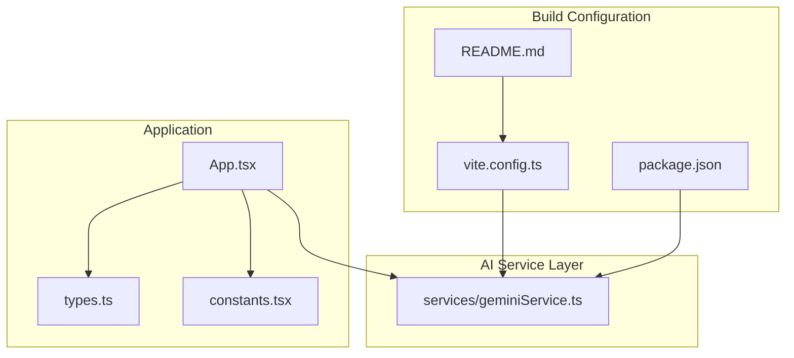
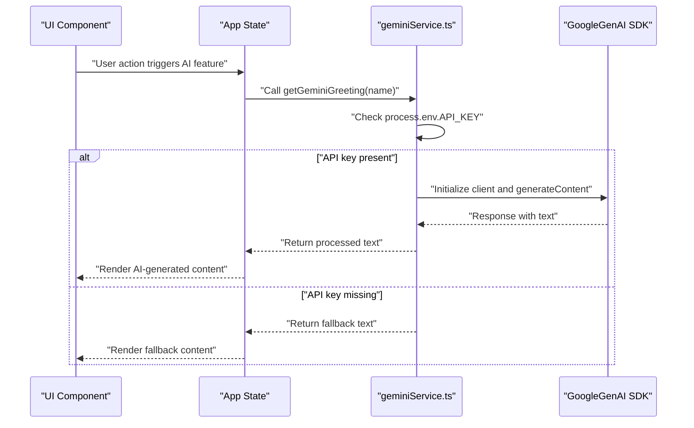
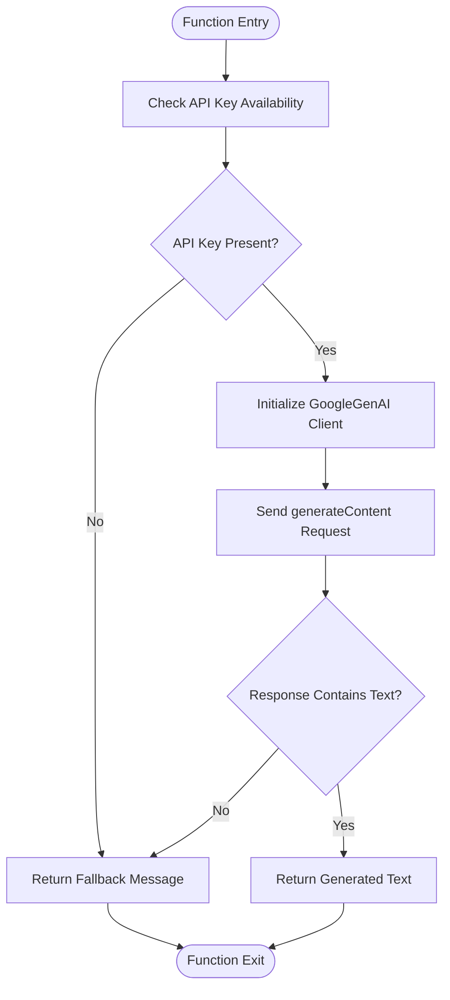
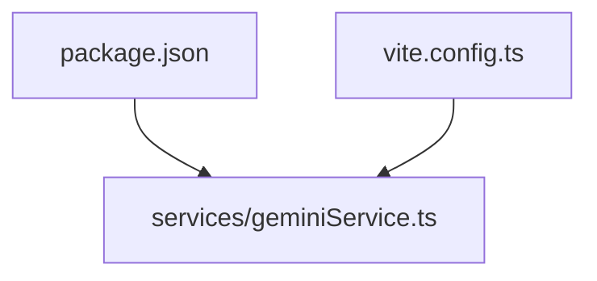

# Gemini AI Service

<cite>
**Referenced Files in This Document**
- [geminiService.ts](file://services/geminiService.ts)
- [vite.config.ts](file://vite.config.ts)
- [README.md](file://README.md)
- [App.tsx](file://App.tsx)
- [types.ts](file://types.ts)
- [constants.tsx](file://constants.tsx)
- [package.json](file://package.json)
</cite>

## Table of Contents
1. [Introduction](#introduction)
2. [Project Structure](#project-structure)
3. [Core Components](#core-components)
4. [Architecture Overview](#architecture-overview)
5. [Detailed Component Analysis](#detailed-component-analysis)
6. [Dependency Analysis](#dependency-analysis)
7. [Performance Considerations](#performance-considerations)
8. [Troubleshooting Guide](#troubleshooting-guide)
9. [Conclusion](#conclusion)
10. [Appendices](#appendices)

## Introduction
This document provides comprehensive documentation for the Google Gemini AI service integration within the ZPRIA application. It covers client configuration, API key management, content generation capabilities, and practical guidance for extending AI-powered features such as contextual greeting generation, security recommendations, and content personalization. The guide also details request/response patterns, prompt engineering strategies, response processing workflows, error handling, performance optimization, caching strategies, monitoring approaches, and extension guidelines.

## Project Structure
The Gemini integration is encapsulated in a dedicated service module and wired into the build configuration to inject the API key at runtime. The application state and UI components are defined separately, while the AI service remains independent and reusable across pages.

**Diagram sources**
- [App.tsx](file://App.tsx#L1-L279)
- [types.ts](file://types.ts#L1-L79)
- [constants.tsx](file://constants.tsx#L1-L361)
- [geminiService.ts](file://services/geminiService.ts#L1-L39)
- [vite.config.ts](file://vite.config.ts#L1-L24)
- [package.json](file://package.json#L1-L27)
- [README.md](file://README.md#L1-L21)

**Section sources**
- [geminiService.ts](file://services/geminiService.ts#L1-L39)
- [vite.config.ts](file://vite.config.ts#L1-L24)
- [README.md](file://README.md#L1-L21)
- [App.tsx](file://App.tsx#L1-L279)
- [types.ts](file://types.ts#L1-L79)
- [constants.tsx](file://constants.tsx#L1-L361)
- [package.json](file://package.json#L1-L27)

## Core Components
- Gemini AI Service: Provides two primary functions:
  - Contextual greeting generation based on user name
  - Security recommendation generation based on user verification status
- Build-time API Key Injection: Uses Vite to inject the Gemini API key via environment variables during development and build.
- Application State and UI: The main application manages authentication state and routes; AI features can be integrated into pages as needed.

Key implementation references:
- [getGeminiGreeting](file://services/geminiService.ts#L4-L20)
- [getSecurityRecommendation](file://services/geminiService.ts#L22-L38)
- [Vite define block for API key injection](file://vite.config.ts#L13-L16)
- [README instructions for setting API key](file://README.md#L16-L20)

**Section sources**
- [geminiService.ts](file://services/geminiService.ts#L1-L39)
- [vite.config.ts](file://vite.config.ts#L13-L16)
- [README.md](file://README.md#L16-L20)

## Architecture Overview
The AI integration follows a clean separation of concerns:
- The AI service initializes the Gemini client with the API key and executes content generation requests.
- The build configuration ensures the API key is available at runtime without exposing secrets in client-side bundles.
- The application state and UI remain agnostic of AI internals, enabling easy integration and testing.

**Diagram sources**
- [geminiService.ts](file://services/geminiService.ts#L4-L20)
- [vite.config.ts](file://vite.config.ts#L13-L16)

**Section sources**
- [geminiService.ts](file://services/geminiService.ts#L1-L39)
- [vite.config.ts](file://vite.config.ts#L13-L16)

## Detailed Component Analysis

### Gemini Client Configuration and API Key Management
- Client Initialization: The service creates a new GoogleGenAI client instance for each request using the API key from environment variables.
- Environment Variable Injection: Vite defines process.env.API_KEY and process.env.GEMINI_API_KEY at build time, sourcing the value from the local environment.
- Fallback Behavior: If the API key is unavailable, the service returns a safe fallback message to maintain UX continuity.

Implementation references:
- [Client initialization and request](file://services/geminiService.ts#L7-L15)
- [API key injection in Vite](file://vite.config.ts#L13-L16)
- [README API key setup](file://README.md#L16-L20)

**Section sources**
- [geminiService.ts](file://services/geminiService.ts#L7-L15)
- [vite.config.ts](file://vite.config.ts#L13-L16)
- [README.md](file://README.md#L16-L20)

### Content Generation Capabilities
- Contextual Greeting Generation:
  - Purpose: Generate a short, enthusiastic welcome message for a returning user.
  - Inputs: User name.
  - Prompt Strategy: Clear persona, tone, and length constraints to ensure concise, brand-aligned output.
  - Output Processing: Returns the generated text or a fallback message if unavailable.
  - Reference: [getGeminiGreeting](file://services/geminiService.ts#L4-L20)

- Security Recommendation Generation:
  - Purpose: Provide a concise security tip based on user verification status.
  - Inputs: Verification flags for email and mobile.
  - Prompt Strategy: Structured data insertion and directive for brevity.
  - Output Processing: Returns the generated text or a fallback message if unavailable.
  - Reference: [getSecurityRecommendation](file://services/geminiService.ts#L22-L38)

**Diagram sources**
- [geminiService.ts](file://services/geminiService.ts#L4-L38)

**Section sources**
- [geminiService.ts](file://services/geminiService.ts#L4-L38)

### Request/Response Patterns and Prompt Engineering Strategies
- Request Pattern:
  - Model Selection: Uses a specific model identifier for content generation.
  - Content Composition: Builds a prompt string incorporating user-specific data.
  - Response Access: Reads the text field from the response object.
- Prompt Engineering:
  - Contextual Greeting: Includes persona, brand context, and word limit constraints.
  - Security Recommendation: Encodes user verification status into the prompt for tailored advice.
- Response Processing:
  - Graceful Degradation: Falls back to predefined messages when the AI response is empty or unavailable.

References:
- [Contextual greeting prompt composition](file://services/geminiService.ts#L10-L15)
- [Security recommendation prompt composition](file://services/geminiService.ts#L27-L33)

**Section sources**
- [geminiService.ts](file://services/geminiService.ts#L10-L15)
- [geminiService.ts](file://services/geminiService.ts#L27-L33)

### Integrating with Application State
- Authentication State: The main application manages user authentication state and theme preferences. AI features can be invoked after authentication is established.
- UI Integration Points: Pages can call AI functions to enrich content dynamically (e.g., personalized greetings or tips) based on user context stored in state.
- References:
  - [Application state and routing](file://App.tsx#L218-L276)
  - [User profile interface](file://types.ts#L11-L25)

**Section sources**
- [App.tsx](file://App.tsx#L218-L276)
- [types.ts](file://types.ts#L11-L25)

### Implementation Examples
- Personalized Greeting:
  - Trigger: On dashboard or account page load for authenticated users.
  - Call: [getGeminiGreeting](file://services/geminiService.ts#L4-L20)
  - Rendering: Display returned text in the UI.
- Security Recommendation:
  - Trigger: On account services or security-focused pages.
  - Call: [getSecurityRecommendation](file://services/geminiService.ts#L22-L38)
  - Rendering: Show the recommendation alongside security actions.

Note: Replace the placeholder references with actual UI integration points in your pages.

**Section sources**
- [geminiService.ts](file://services/geminiService.ts#L4-L20)
- [geminiService.ts](file://services/geminiService.ts#L22-L38)

## Dependency Analysis
- External Dependencies:
  - @google/genai: SDK for interacting with Gemini APIs.
  - React and React Router: UI framework and routing.
- Internal Dependencies:
  - vite.config.ts defines environment variable substitution for the API key.
  - README documents the required environment variable setup.

**Diagram sources**
- [package.json](file://package.json#L12-L18)
- [vite.config.ts](file://vite.config.ts#L13-L16)
- [geminiService.ts](file://services/geminiService.ts#L2)

**Section sources**
- [package.json](file://package.json#L12-L18)
- [vite.config.ts](file://vite.config.ts#L13-L16)
- [geminiService.ts](file://services/geminiService.ts#L2)

## Performance Considerations
- Client Initialization Overhead:
  - Current implementation initializes the client per request. Consider reusing a single client instance to reduce overhead if multiple calls occur in quick succession.
- Network Latency:
  - Introduce loading states and optimistic UI updates to improve perceived performance while awaiting AI responses.
- Prompt Complexity:
  - Keep prompts concise to minimize latency and token usage. Use structured data insertion to avoid verbose templates.
- Rate Limiting Awareness:
  - Monitor API quotas and implement retry/backoff strategies for transient failures.
- Caching Strategies:
  - Cache AI responses keyed by user identity and prompt parameters to reduce repeated calls for identical inputs.
  - Invalidate cache entries upon user profile changes or policy updates.
- Monitoring:
  - Track request success rates, latency, and quota consumption. Log errors with minimal sensitive data exposure.

[No sources needed since this section provides general guidance]

## Troubleshooting Guide
- API Key Issues:
  - Symptom: Fallback messages appear instead of AI-generated content.
  - Resolution: Ensure the environment variable is set in the local environment and loaded by Vite. Confirm the README steps for setting the key.
  - References: [README API key setup](file://README.md#L16-L20), [Vite define block](file://vite.config.ts#L13-L16)
- Empty or Missing Response Text:
  - Symptom: Returned text is empty or undefined.
  - Resolution: The service falls back to a predefined message. Verify prompt clarity and model availability.
  - Reference: [Response text handling](file://services/geminiService.ts#L14-L15)
- Unexpected Errors:
  - Symptom: Console logs indicate errors during AI generation.
  - Resolution: Inspect error logs and confirm network connectivity. Implement retry logic and circuit breaker patterns for resilience.
  - Reference: [Error handling blocks](file://services/geminiService.ts#L16-L19), [Error handling blocks](file://services/geminiService.ts#L34-L37)

**Section sources**
- [README.md](file://README.md#L16-L20)
- [vite.config.ts](file://vite.config.ts#L13-L16)
- [geminiService.ts](file://services/geminiService.ts#L14-L19)
- [geminiService.ts](file://services/geminiService.ts#L34-L37)

## Conclusion
The Gemini AI integration is designed for simplicity and resilience, with clear fallbacks and straightforward configuration. By centralizing AI logic in a dedicated service and injecting the API key at build time, the system maintains security and flexibility. Extending the integration involves adding new functions, refining prompts, and implementing robust caching and monitoring strategies to ensure reliable, high-performance AI-powered experiences.

[No sources needed since this section summarizes without analyzing specific files]

## Appendices

### API Key Management Checklist
- Set the environment variable locally as documented.
- Confirm Vite is configured to inject the key into the build.
- Verify the service reads the key from the expected environment variable.
- Test fallback behavior when the key is absent.

References:
- [README API key setup](file://README.md#L16-L20)
- [Vite define block](file://vite.config.ts#L13-L16)
- [Gemini service key usage](file://services/geminiService.ts#L5-L6)

**Section sources**
- [README.md](file://README.md#L16-L20)
- [vite.config.ts](file://vite.config.ts#L13-L16)
- [geminiService.ts](file://services/geminiService.ts#L5-L6)