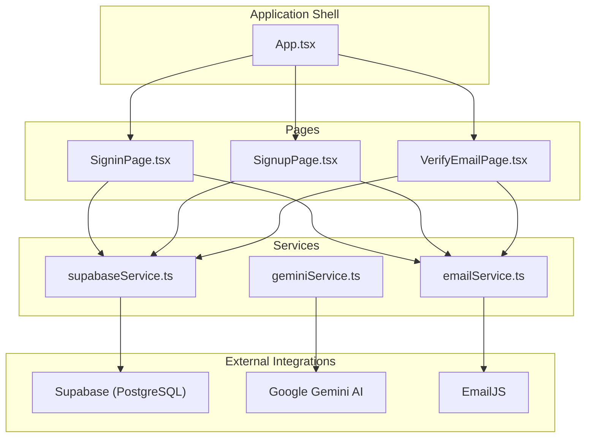
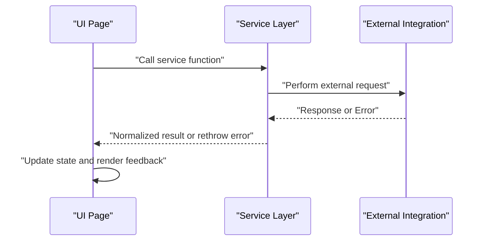
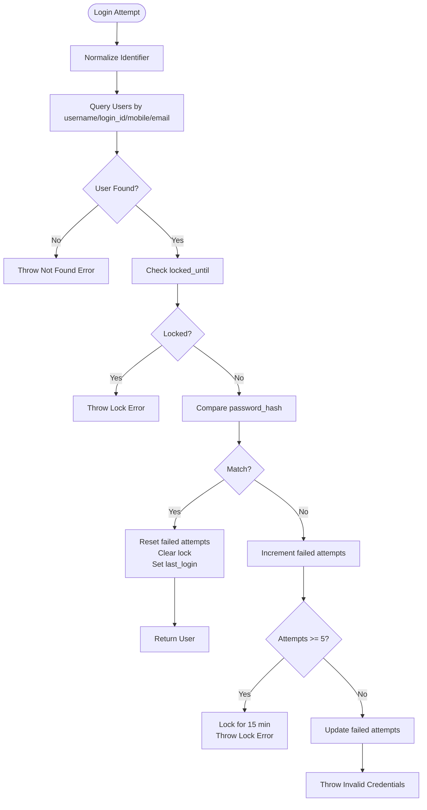
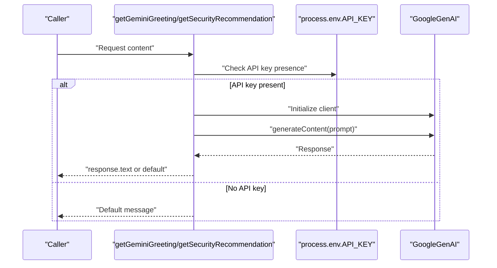
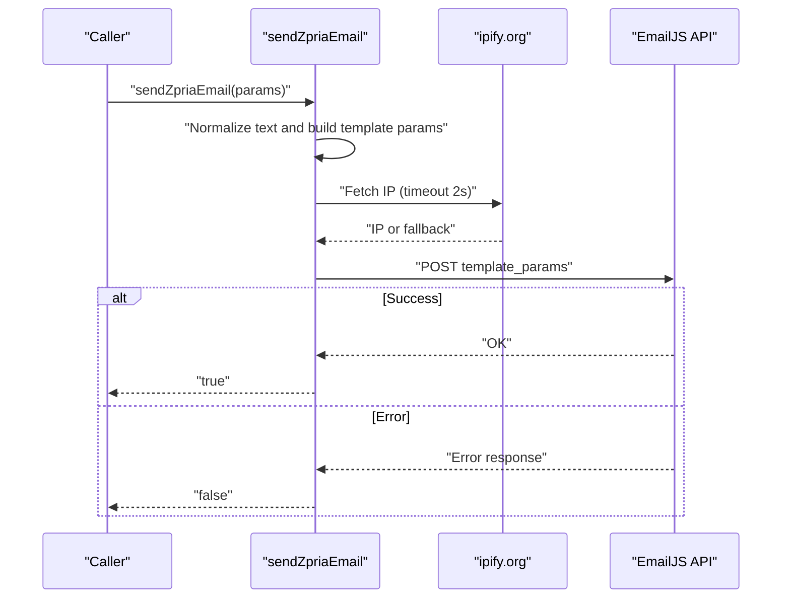
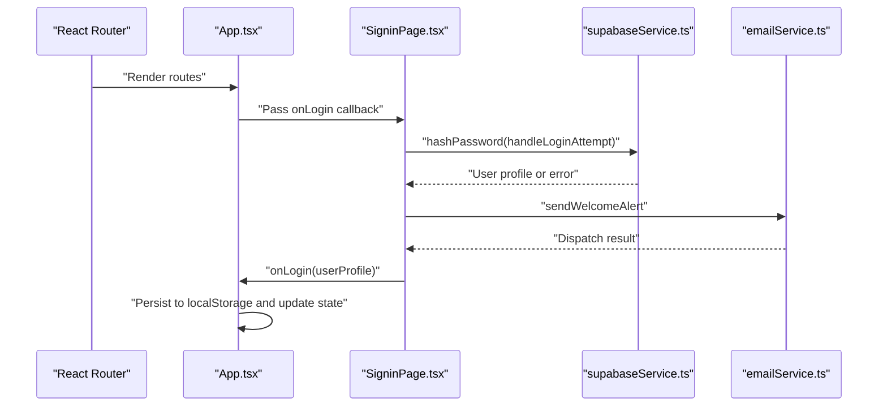
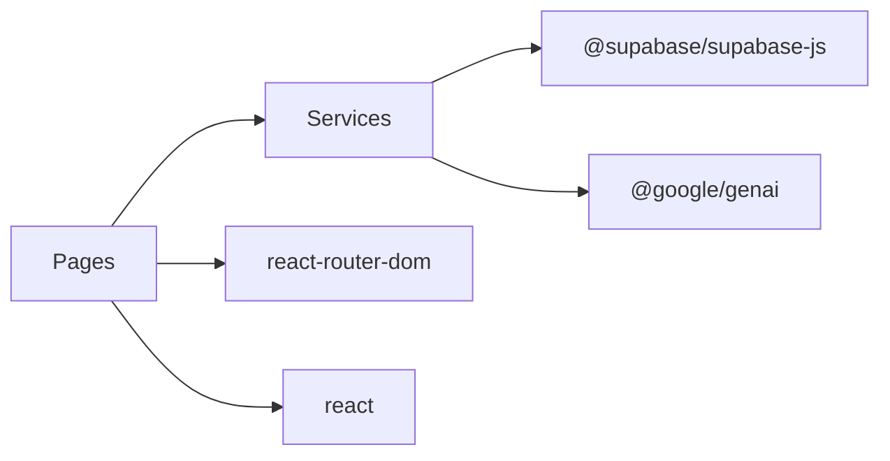

# Service Layer

<cite>
**Referenced Files in This Document**
- [services/supabaseService.ts](file://services/supabaseService.ts)
- [services/geminiService.ts](file://services/geminiService.ts)
- [services/emailService.ts](file://services/emailService.ts)
- [pages/SigninPage.tsx](file://pages/SigninPage.tsx)
- [pages/SignupPage.tsx](file://pages/SignupPage.tsx)
- [pages/VerifyEmailPage.tsx](file://pages/VerifyEmailPage.tsx)
- [App.tsx](file://App.tsx)
- [types.ts](file://types.ts)
- [constants.tsx](file://constants.tsx)
- [package.json](file://package.json)
- [README.md](file://README.md)
</cite>

## Table of Contents
1. [Introduction](#introduction)
2. [Project Structure](#project-structure)
3. [Core Components](#core-components)
4. [Architecture Overview](#architecture-overview)
5. [Detailed Component Analysis](#detailed-component-analysis)
6. [Dependency Analysis](#dependency-analysis)
7. [Performance Considerations](#performance-considerations)
8. [Troubleshooting Guide](#troubleshooting-guide)
9. [Conclusion](#conclusion)
10. [Appendices](#appendices)

## Introduction
This document describes the ZPRIA service layer architecture and how it integrates external systems for authentication, database operations, AI content generation, and email notifications. It explains initialization patterns, error handling, retry strategies, configuration management, API interfaces, request/response patterns, and integration with the main application state. It also covers testing strategies, monitoring approaches, security considerations, and guidance for extending the service layer with additional integrations.

## Project Structure
The service layer is organized under a dedicated services directory and consumed by page components and the main application shell. The key elements are:
- Supabase service for authentication and database operations
- Gemini AI service for content generation
- EmailJS service for transactional emails
- Page components that orchestrate flows and integrate with the service layer
- Types and constants that define shared data contracts and UI themes

**Diagram sources**
- [App.tsx](file://App.tsx#L218-L279)
- [pages/SigninPage.tsx](file://pages/SigninPage.tsx#L1-L231)
- [pages/SignupPage.tsx](file://pages/SignupPage.tsx#L1-L293)
- [pages/VerifyEmailPage.tsx](file://pages/VerifyEmailPage.tsx#L1-L255)
- [services/supabaseService.ts](file://services/supabaseService.ts#L1-L67)
- [services/geminiService.ts](file://services/geminiService.ts#L1-L39)
- [services/emailService.ts](file://services/emailService.ts#L1-L194)

**Section sources**
- [App.tsx](file://App.tsx#L218-L279)
- [package.json](file://package.json#L12-L25)

## Core Components
- Supabase service encapsulates client initialization, password hashing, availability checks, and login attempt handling with lockout and attempt tracking.
- Gemini service wraps content generation requests with graceful fallbacks when API keys are missing.
- EmailJS service centralizes email dispatch with normalization, security context capture, and robust error handling.

Key responsibilities:
- Supabase service: authentication, user availability checks, login attempt enforcement, and database operations for registration and OTP lifecycle.
- Gemini service: greeting and security recommendation generation with API key management and error handling.
- EmailJS service: OTP and welcome/alert dispatch with security context and compliance fields.

**Section sources**
- [services/supabaseService.ts](file://services/supabaseService.ts#L1-L67)
- [services/geminiService.ts](file://services/geminiService.ts#L1-L39)
- [services/emailService.ts](file://services/emailService.ts#L1-L194)

## Architecture Overview
The service layer follows a functional composition pattern:
- Services export pure functions and initialized clients.
- Pages import and call service functions, handling UI state and errors.
- External integrations are isolated behind service boundaries with explicit error propagation.

[No sources needed since this diagram shows conceptual workflow, not actual code structure]

## Detailed Component Analysis

### Supabase Service
Responsibilities:
- Initialize Supabase client with URL and anonymous key
- Hash passwords using SHA-256
- Check availability of usernames and emails across users and pending registrations
- Handle login attempts with lockout and attempt tracking
- Update user records on successful login and failure

Implementation highlights:
- Password hashing trims input to prevent hidden-space issues
- Availability checks normalize identifiers and query both users and pending registrations
- Login attempt logic enforces lockout windows and updates failed attempts and lock timestamps
- Uses Supabase SQL filters and maybeSingle for safe reads

**Diagram sources**
- [services/supabaseService.ts](file://services/supabaseService.ts#L26-L66)

**Section sources**
- [services/supabaseService.ts](file://services/supabaseService.ts#L1-L67)

### Gemini Service
Responsibilities:
- Generate greeting messages for users
- Provide security recommendations based on user verification status
- Initialize Google GenAI client using API key from environment
- Fallback to default messages when API key is missing or requests fail

Implementation highlights:
- Initializes GoogleGenAI client per request using process.env.API_KEY
- Uses a lightweight prompt for greeting and security recommendations
- Returns default messages on API key absence or error, logging errors for diagnostics

**Diagram sources**
- [services/geminiService.ts](file://services/geminiService.ts#L4-L38)

**Section sources**
- [services/geminiService.ts](file://services/geminiService.ts#L1-L39)

### EmailJS Service
Responsibilities:
- Send OTP and welcome/alert emails via EmailJS
- Normalize text and enrich security context (IP, device info, login time)
- Enforce compliance fields and branding subjects
- Robust error handling with logging and non-blocking fallbacks

Implementation highlights:
- Uses public and private keys configured within the module
- Fetches IP asynchronously with a timeout to avoid blocking
- Maps template parameters explicitly to match EmailJS templates
- Returns booleans indicating success/failure for caller-side handling

**Diagram sources**
- [services/emailService.ts](file://services/emailService.ts#L70-L137)

**Section sources**
- [services/emailService.ts](file://services/emailService.ts#L1-L194)

### Integration with Application State
The main application state is managed in the application shell and passed down to pages. Services are invoked by pages to perform authentication, registration, and email operations. The state is updated upon successful login and persisted to local storage.

**Diagram sources**
- [App.tsx](file://App.tsx#L218-L279)
- [pages/SigninPage.tsx](file://pages/SigninPage.tsx#L53-L95)
- [services/supabaseService.ts](file://services/supabaseService.ts#L9-L66)
- [services/emailService.ts](file://services/emailService.ts#L152-L172)

**Section sources**
- [App.tsx](file://App.tsx#L218-L279)
- [types.ts](file://types.ts#L11-L31)
- [pages/SigninPage.tsx](file://pages/SigninPage.tsx#L1-L231)

## Dependency Analysis
External dependencies:
- @supabase/supabase-js for database and auth operations
- @google/genai for AI content generation
- react and react-router-dom for routing and UI

Internal dependencies:
- Pages depend on services for business logic
- Services depend on external SDKs and APIs
- Types define contracts for state and data

**Diagram sources**
- [package.json](file://package.json#L12-L25)
- [pages/SigninPage.tsx](file://pages/SigninPage.tsx#L7-L8)
- [pages/SignupPage.tsx](file://pages/SignupPage.tsx#L7-L8)
- [pages/VerifyEmailPage.tsx](file://pages/VerifyEmailPage.tsx#L5-L6)

**Section sources**
- [package.json](file://package.json#L12-L25)

## Performance Considerations
- Supabase queries use targeted selects and or filters to minimize payload and improve latency.
- EmailJS dispatch uses a timeout for IP capture to avoid blocking the main thread.
- Gemini requests initialize the client per call; consider caching or batching if frequent calls are expected.
- Local storage usage for theme and user persistence reduces server round trips during navigation.

[No sources needed since this section provides general guidance]

## Troubleshooting Guide
Common issues and resolutions:
- Supabase authentication failures:
  - Verify normalized identifiers and ensure user exists
  - Check lockout timestamps and failed attempts thresholds
  - Inspect error messages returned by the service for actionable feedback
- Gemini content generation failures:
  - Confirm API key presence in environment
  - Review logs for thrown errors and ensure fallback messages are displayed
- EmailJS dispatch failures:
  - Validate service and template IDs
  - Check network connectivity and response status codes
  - Inspect console logs for detailed error messages

**Section sources**
- [services/supabaseService.ts](file://services/supabaseService.ts#L26-L66)
- [services/geminiService.ts](file://services/geminiService.ts#L16-L19)
- [services/emailService.ts](file://services/emailService.ts#L127-L136)

## Conclusion
The ZPRIA service layer cleanly abstracts external integrations, enabling robust authentication, AI-driven content, and reliable email delivery. The functional composition pattern promotes testability and maintainability. With clear error handling, fallbacks, and state integration, the system provides a solid foundation for extension and scaling.

[No sources needed since this section summarizes without analyzing specific files]

## Appendices

### API Interfaces and Request/Response Patterns
- Supabase service:
  - Functions: hashPassword, checkAvailability, handleLoginAttempt
  - Inputs: password string, field and value for availability, identifier and hashed password for login
  - Outputs: hashed password string, boolean availability, user object or throws error
- Gemini service:
  - Functions: getGeminiGreeting, getSecurityRecommendation
  - Inputs: user name or verification status object
  - Outputs: generated text string or default fallback
- EmailJS service:
  - Functions: sendZpriaEmail, sendOTP, sendWelcomeAlert, sendPasswordChangeAlert
  - Inputs: ZpriaEmailParams with name, email, optional OTP fields, and optional welcome/alert fields
  - Outputs: boolean success indicator

**Section sources**
- [services/supabaseService.ts](file://services/supabaseService.ts#L9-L66)
- [services/geminiService.ts](file://services/geminiService.ts#L4-L38)
- [services/emailService.ts](file://services/emailService.ts#L11-L194)

### Configuration Management
- Supabase:
  - Hardcoded client URL and anonymous key in service module
  - Consider moving to environment variables for production deployments
- Gemini:
  - API key loaded from process.env.API_KEY
  - README instructs setting GEMINI_API_KEY in .env.local
- EmailJS:
  - Public and private keys embedded in service module
  - Prefer environment variables or a configuration loader for secrets

**Section sources**
- [services/supabaseService.ts](file://services/supabaseService.ts#L4-L7)
- [services/geminiService.ts](file://services/geminiService.ts#L5)
- [services/emailService.ts](file://services/emailService.ts#L3-L6)
- [README.md](file://README.md#L18)

### Testing Strategies for External Integrations
- Unit tests:
  - Mock external SDKs and APIs using jest or vitest
  - Test happy paths and error branches for each service function
- Integration tests:
  - Use test environments with stubbed external services
  - Validate request shapes and response handling
- E2E tests:
  - Automate page flows that invoke services (login, signup, email verification)
  - Capture and assert UI feedback for success and error scenarios

[No sources needed since this section provides general guidance]

### Monitoring Approaches
- Logging:
  - Log external API errors and fallbacks for observability
- Metrics:
  - Track service call durations and error rates
- Health checks:
  - Periodically probe external endpoints for availability

[No sources needed since this section provides general guidance]

### Security Considerations
- API key management:
  - Avoid embedding secrets in client-side code; prefer environment variables or backend proxies
  - Rotate keys regularly and limit permissions
- Rate limiting:
  - Implement client-side throttling and backoff for external calls
  - Respect provider limits and handle 429 responses gracefully
- Service availability:
  - Design fallbacks and degrade gracefully when external services are unavailable
- Data protection:
  - Sanitize inputs and enforce validation before invoking services
  - Use HTTPS and secure transport for all external communications

[No sources needed since this section provides general guidance]

### Extending the Service Layer
- Add new service modules under services/ with clear exports
- Integrate with pages by importing service functions and handling results
- Follow existing patterns for error handling, fallbacks, and configuration
- Document new interfaces and update types as needed

[No sources needed since this section provides general guidance]