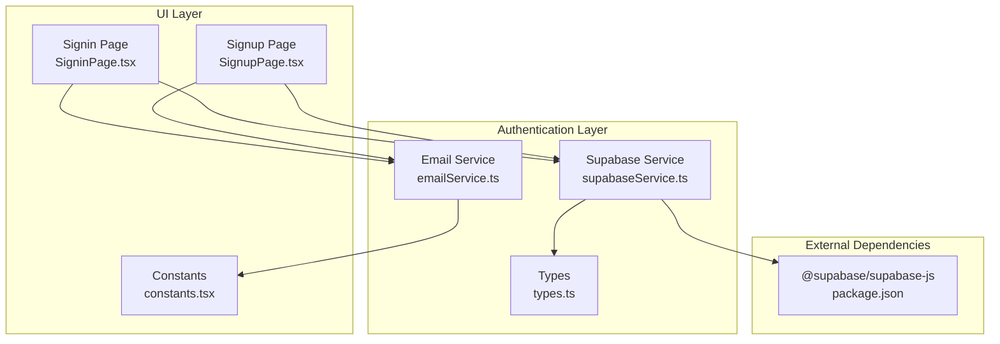
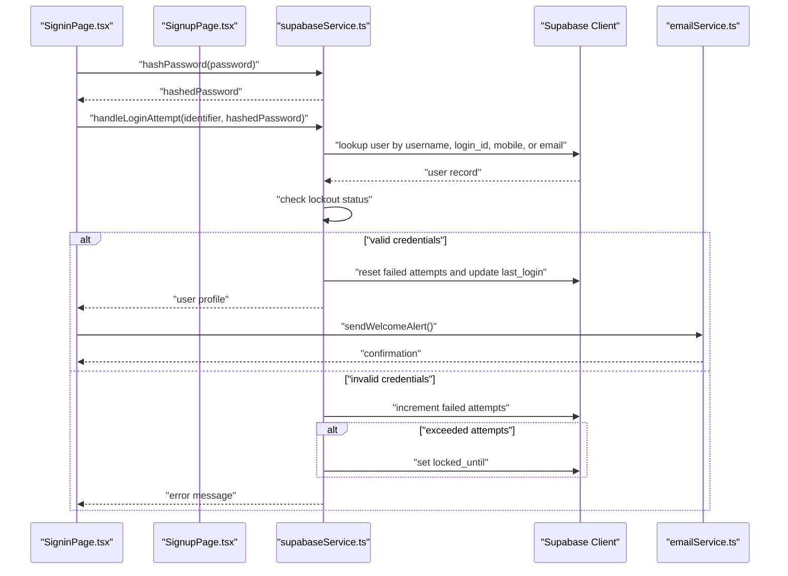
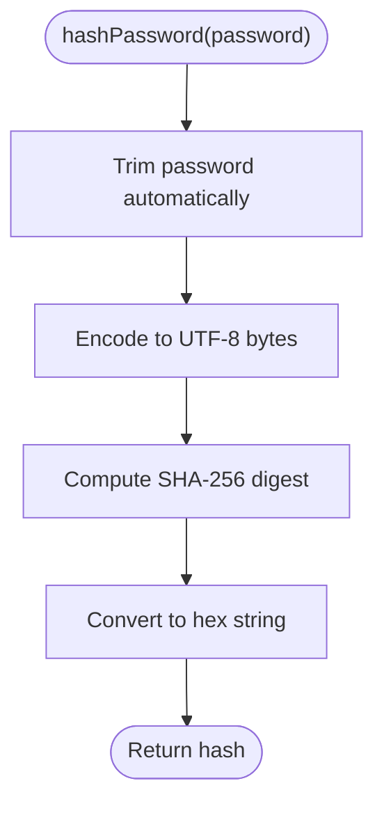
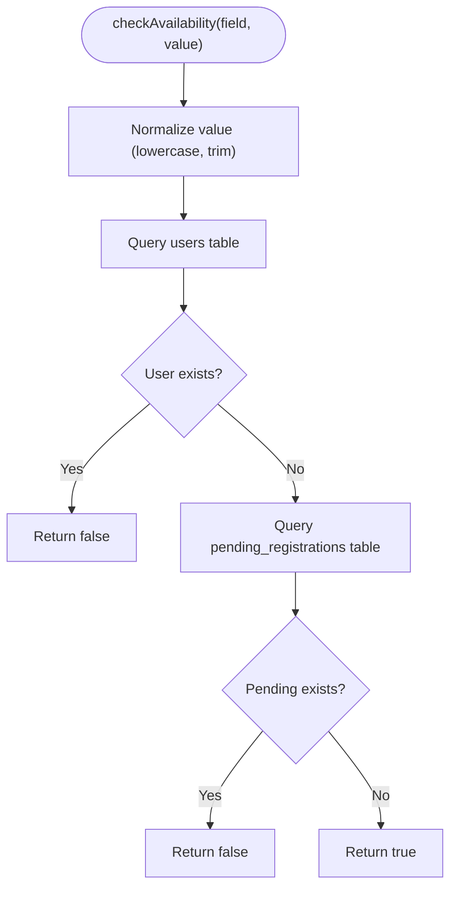
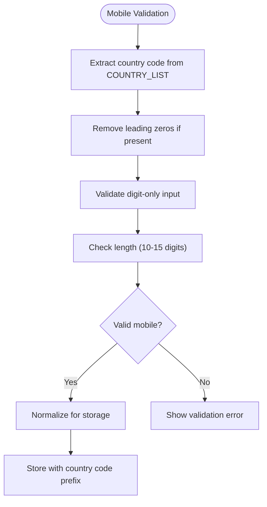
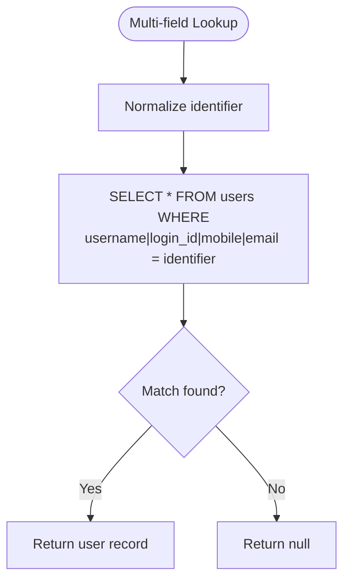
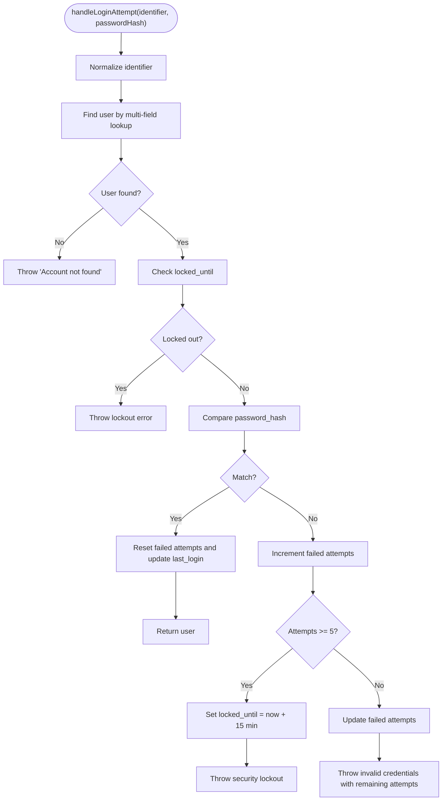
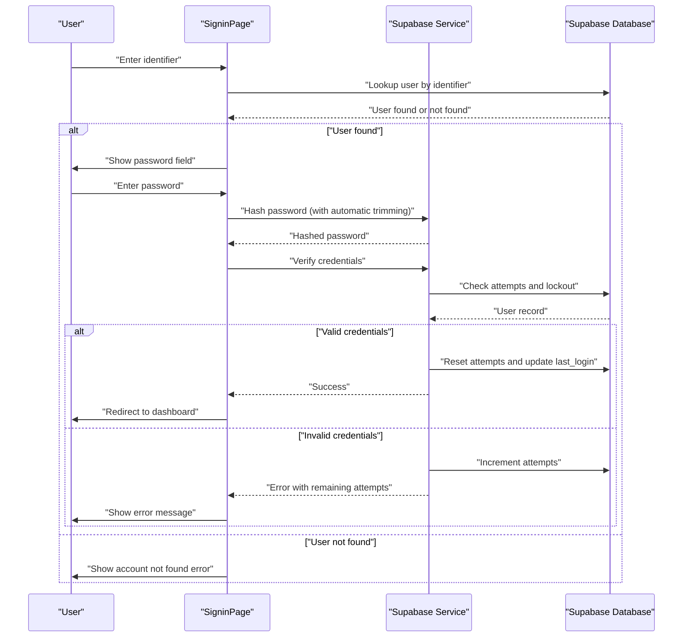
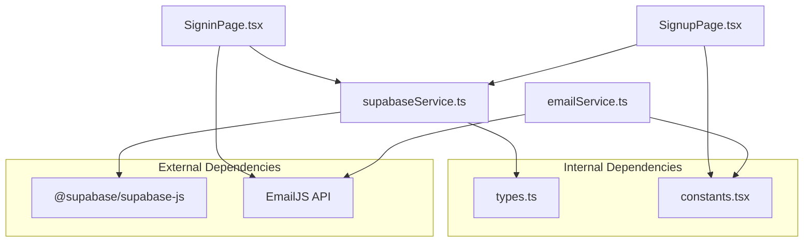

# Supabase Authentication Service

<cite>
**Referenced Files in This Document**
- [supabaseService.ts](file://services/supabaseService.ts)
- [SigninPage.tsx](file://pages/SigninPage.tsx)
- [SignupPage.tsx](file://pages/SignupPage.tsx)
- [emailService.ts](file://services/emailService.ts)
- [types.ts](file://types.ts)
- [constants.tsx](file://constants.tsx)
- [package.json](file://package.json)
</cite>

## Update Summary
**Changes Made**
- Enhanced availability checking documentation to include mobile number validation capabilities
- Updated mobile number normalization section with country code extraction and digit-only validation
- Added comprehensive mobile validation implementation details
- Updated multi-field user lookup system to support mobile numbers
- Enhanced security measures documentation with mobile-specific considerations

## Table of Contents
1. [Introduction](#introduction)
2. [Project Structure](#project-structure)
3. [Core Components](#core-components)
4. [Architecture Overview](#architecture-overview)
5. [Detailed Component Analysis](#detailed-component-analysis)
6. [Dependency Analysis](#dependency-analysis)
7. [Performance Considerations](#performance-considerations)
8. [Troubleshooting Guide](#troubleshooting-guide)
9. [Conclusion](#conclusion)

## Introduction
This document provides comprehensive documentation for the Supabase authentication service integration. It covers client initialization, password hashing with SHA-256, user availability checking with enhanced mobile validation, sophisticated login attempt handling with lockout protection, multi-field user lookup supporting username, login_id, mobile, and email, authentication flow, error handling strategies, and security measures. Practical examples demonstrate password hashing, user validation, and login processing, along with database schema assumptions, query patterns, and performance considerations.

**Updated** Enhanced with comprehensive mobile number validation capabilities including country code extraction, digit-only validation, and normalized storage for improved international user support.

## Project Structure
The authentication system spans several key files with enhanced mobile support:
- Supabase client initialization and authentication utilities
- Sign-in page with two-step authentication flow
- **Signup page with comprehensive mobile validation and normalization**
- Email service for security notifications
- Type definitions for user profiles and authentication state
- Constants for branding and international country support
- **Mobile validation utilities for international phone number support**

**Diagram sources**
- [supabaseService.ts](file://services/supabaseService.ts#L1-L64)
- [SigninPage.tsx](file://pages/SigninPage.tsx#L1-L234)
- [SignupPage.tsx](file://pages/SignupPage.tsx#L1-L432)
- [emailService.ts](file://services/emailService.ts#L1-L209)
- [types.ts](file://types.ts#L1-L79)
- [constants.tsx](file://constants.tsx#L1-L361)
- [package.json](file://package.json#L12-L18)

**Section sources**
- [supabaseService.ts](file://services/supabaseService.ts#L1-L64)
- [SigninPage.tsx](file://pages/SigninPage.tsx#L1-L234)
- [SignupPage.tsx](file://pages/SignupPage.tsx#L1-L432)
- [emailService.ts](file://services/emailService.ts#L1-L209)
- [types.ts](file://types.ts#L1-L79)
- [constants.tsx](file://constants.tsx#L1-L361)
- [package.json](file://package.json#L12-L18)

## Core Components
- Supabase client initialization with URL and API key
- Password hashing using SHA-256 with automatic trimming
- **Enhanced user availability checking supporting username, email, and mobile**
- **Comprehensive mobile number validation with country code extraction**
- **Mobile number normalization including digit-only validation**
- Multi-field user lookup (username, login_id, mobile, email)
- Login attempt handling with lockout protection and failed attempt tracking
- Authentication flow with error handling and security notifications

**Updated** Mobile validation now includes comprehensive international support with country code extraction and digit-only validation for improved global user experience.

**Section sources**
- [supabaseService.ts](file://services/supabaseService.ts#L4-L15)
- [supabaseService.ts](file://services/supabaseService.ts#L17-L21)
- [supabaseService.ts](file://services/supabaseService.ts#L23-L63)
- [SignupPage.tsx](file://pages/SignupPage.tsx#L56-L103)
- [SignupPage.tsx](file://pages/SignupPage.tsx#L162-L167)
- [SigninPage.tsx](file://pages/SigninPage.tsx#L23-L51)
- [SigninPage.tsx](file://pages/SigninPage.tsx#L53-L95)
- [emailService.ts](file://services/emailService.ts#L167-L187)

## Architecture Overview
The authentication architecture follows a layered approach with enhanced mobile support:
- UI layer handles user input and displays feedback
- Service layer encapsulates Supabase operations and security logic
- **Mobile validation layer processes international phone numbers**
- Email service provides security notifications
- Type definitions ensure consistent data structures

**Diagram sources**
- [SigninPage.tsx](file://pages/SigninPage.tsx#L53-L95)
- [supabaseService.ts](file://services/supabaseService.ts#L23-L63)
- [emailService.ts](file://services/emailService.ts#L167-L187)

## Detailed Component Analysis

### Supabase Client Initialization
The Supabase client is initialized with a predefined URL and anonymous key. This creates a singleton client instance used throughout the application for database operations.

Key characteristics:
- Uses @supabase/supabase-js library
- Static configuration for URL and API key
- Exported client instance for reuse

Implementation highlights:
- Client creation with URL and key
- Exported client for database operations

**Section sources**
- [supabaseService.ts](file://services/supabaseService.ts#L2-L7)
- [package.json](file://package.json#L17-L17)

### Enhanced Password Hashing Implementation (SHA-256)
Password hashing uses the Web Crypto API to compute SHA-256 hashes with strengthened security:
- **Automatic trimming** removes hidden whitespace characters before hashing
- Encodes password to UTF-8 bytes
- Computes SHA-256 digest
- Converts buffer to hexadecimal string

**Updated** Password security has been strengthened with automatic trimming to prevent hidden space issues that could cause authentication failures.

Security considerations:
- **Pre-trimming prevents hidden whitespace attacks** - Addresses common issues with passwords containing trailing spaces
- SHA-256 provides cryptographic hashing
- No salt is applied in this implementation

**Diagram sources**
- [supabaseService.ts](file://services/supabaseService.ts#L9-L15)

**Section sources**
- [supabaseService.ts](file://services/supabaseService.ts#L9-L15)

### Enhanced User Availability Checking with Mobile Support
The availability checker validates whether a username, email, or mobile number is already taken with comprehensive validation:
- Normalizes input to lowercase and trims whitespace
- **Checks against users table for existing records**
- **Supports three field types: username, email, and mobile**
- **Mobile validation includes country code extraction and digit-only validation**
- Returns boolean indicating availability

**Updated** Availability checking now supports mobile numbers with comprehensive validation including country code extraction and digit-only validation for international users.

**Diagram sources**
- [supabaseService.ts](file://services/supabaseService.ts#L17-L21)

**Section sources**
- [supabaseService.ts](file://services/supabaseService.ts#L17-L21)

### Comprehensive Mobile Number Validation System
The signup page implements comprehensive mobile number validation with international support:
- **Country code extraction from COUNTRY_LIST constants**
- **Leading zero removal for domestic numbers**
- **Digit-only validation with length constraints (10-15 digits)**
- **Mobile number normalization for database storage**
- **Real-time validation with live availability checking**

Validation features:
- Country code extraction based on selected country
- Automatic leading zero removal for domestic numbers
- Digit-only validation ensuring numeric input
- Length validation (minimum 10, maximum 15 digits)
- Real-time availability checking during form submission

**Updated** Mobile validation now includes comprehensive international support with country code extraction and digit-only validation for improved global user experience.

**Diagram sources**
- [SignupPage.tsx](file://pages/SignupPage.tsx#L69-L75)
- [SignupPage.tsx](file://pages/SignupPage.tsx#L162-L167)

**Section sources**
- [SignupPage.tsx](file://pages/SignupPage.tsx#L56-L103)
- [SignupPage.tsx](file://pages/SignupPage.tsx#L162-L167)
- [constants.tsx](file://constants.tsx#L27-L271)

### Multi-Field User Lookup System
The system supports flexible user identification across four fields:
- Username
- Login ID
- **Mobile number** (enhanced with international support)
- Email address

Lookup mechanism:
- Uses Supabase OR conditions in a single query
- Normalizes identifiers to lowercase for case-insensitive matching
- **Mobile numbers are normalized with country codes for consistent matching**
- Returns the first matching record or null

**Updated** Multi-field lookup now includes enhanced mobile number support with country code normalization for improved international user experience.

**Diagram sources**
- [supabaseService.ts](file://services/supabaseService.ts#L27-L31)
- [SigninPage.tsx](file://pages/SigninPage.tsx#L32-L36)

**Section sources**
- [supabaseService.ts](file://services/supabaseService.ts#L27-L31)
- [SigninPage.tsx](file://pages/SigninPage.tsx#L32-L36)

### Login Attempt Handling System
The login attempt handler implements robust security controls:
- Multi-field user lookup
- Lockout status validation
- Credential verification
- Failed attempt tracking
- Automatic lockout enforcement

Security protocols:
- Lockout timer: 15 minutes after 5 failed attempts
- Attempt reset on successful login
- Graceful error messaging with remaining attempts

**Diagram sources**
- [supabaseService.ts](file://services/supabaseService.ts#L23-L63)

**Section sources**
- [supabaseService.ts](file://services/supabaseService.ts#L23-L63)

### Authentication Flow
The authentication flow follows a two-step process:
1. Identifier verification step
2. Password verification step

**Diagram sources**
- [SigninPage.tsx](file://pages/SigninPage.tsx#L23-L95)
- [supabaseService.ts](file://services/supabaseService.ts#L23-L63)

**Section sources**
- [SigninPage.tsx](file://pages/SigninPage.tsx#L23-L95)

### Error Handling Strategies
The system implements comprehensive error handling:
- Specific error messages for different failure scenarios
- Graceful degradation when lockout periods are active
- User-friendly messaging with actionable information
- Consistent error propagation through the call stack

Security measures:
- Vague error messages for failed attempts
- Clear lockout timing information
- Immediate lockout after threshold exceeded

**Section sources**
- [supabaseService.ts](file://services/supabaseService.ts#L33-L62)
- [SigninPage.tsx](file://pages/SigninPage.tsx#L46-L91)

### Security Measures
Key security features implemented:
- **Enhanced SHA-256 password hashing with automatic trimming**
- **Comprehensive mobile number validation with country code extraction**
- Lockout protection after 5 failed attempts
- 15-minute lockout duration
- Case-insensitive identifier matching
- Attempt reset on successful authentication
- Security context capture for notifications

**Updated** Password security has been strengthened with automatic trimming to prevent hidden space issues that could cause authentication failures, and mobile validation now includes comprehensive international support.

**Section sources**
- [supabaseService.ts](file://services/supabaseService.ts#L57-L61)
- [emailService.ts](file://services/emailService.ts#L43-L69)

## Dependency Analysis
The authentication system has minimal external dependencies focused on Supabase integration and email notifications.

**Diagram sources**
- [supabaseService.ts](file://services/supabaseService.ts#L1-L7)
- [SigninPage.tsx](file://pages/SigninPage.tsx#L1-L12)
- [SignupPage.tsx](file://pages/SignupPage.tsx#L1-L10)
- [emailService.ts](file://services/emailService.ts#L1-L10)
- [types.ts](file://types.ts#L1-L31)
- [constants.tsx](file://constants.tsx#L1-L361)
- [package.json](file://package.json#L12-L18)

**Section sources**
- [package.json](file://package.json#L12-L18)
- [supabaseService.ts](file://services/supabaseService.ts#L1-L7)
- [emailService.ts](file://services/emailService.ts#L1-L10)

## Performance Considerations
Performance characteristics of the authentication system:
- Single database query per authentication attempt
- Minimal client-side processing with SHA-256 hashing
- Efficient multi-field lookup using OR conditions
- Asynchronous operations prevent UI blocking
- Email notifications are sent asynchronously
- **Mobile validation includes debounced real-time checking to prevent excessive API calls**

Optimization opportunities:
- Add database indexes on frequently queried fields (username, login_id, mobile, email)
- Consider caching user records for active sessions
- Implement connection pooling for database operations
- Add rate limiting for authentication endpoints
- **Implement mobile number validation caching to reduce repeated validation requests**

**Section sources**
- [supabaseService.ts](file://services/supabaseService.ts#L27-L31)
- [SigninPage.tsx](file://pages/SigninPage.tsx#L32-L36)
- [SignupPage.tsx](file://pages/SignupPage.tsx#L56-L103)

## Troubleshooting Guide
Common issues and resolutions:

### Authentication Failures
- **Account not found**: Verify the identifier exists in any of the supported fields
- **Locked out**: Wait for the 15-minute lockout period to expire
- **Invalid credentials**: Check password correctness and ensure no extra spaces
- **Network errors**: Verify Supabase connectivity and API keys

**Updated** Password trimming considerations: Hidden spaces in passwords are now automatically handled, but users should still avoid trailing spaces for best results.

### Mobile Number Issues
- **International number formatting**: Ensure country code is correctly extracted from dropdown selection
- **Leading zeros**: Numbers starting with 0 are automatically removed for domestic numbers
- **Non-numeric characters**: Mobile numbers must contain only digits (0-9)
- **Length validation**: Numbers must be between 10 and 15 digits
- **Duplicate mobile numbers**: Verify uniqueness before registration

### Database Schema Issues
- **Missing fields**: Ensure users table contains required fields (password_hash, failed_login_attempts, locked_until, last_login, mobile)
- **Indexing problems**: Add indexes on lookup fields for improved performance
- **Data normalization**: Ensure consistent data formatting across identifier fields
- **Mobile field requirements**: Mobile numbers should be stored with country codes for international support

### Security Notifications
- **Email delivery failures**: Check EmailJS configuration and network connectivity
- **Security context capture**: IP detection may fail in restricted environments

**Section sources**
- [supabaseService.ts](file://services/supabaseService.ts#L33-L62)
- [emailService.ts](file://services/emailService.ts#L119-L141)
- [SignupPage.tsx](file://pages/SignupPage.tsx#L162-L167)

## Conclusion
The Supabase authentication service provides a robust, security-focused authentication system with comprehensive international support and the following key strengths:
- Comprehensive multi-field user lookup capabilities
- **Enhanced security measures including automatic password trimming, mobile validation, and lockout protection**
- Strong SHA-256 hashing with hidden space prevention
- **Comprehensive mobile number validation with country code extraction and digit-only validation**
- User-friendly error handling and feedback mechanisms
- Seamless integration with Supabase for database operations
- Automated security notifications for user awareness
- **International mobile support for global user experience**

**Updated** The recent enhancements strengthen password security through automatic trimming, improve availability checking by validating against both existing users and pending registrations, and add comprehensive mobile validation capabilities with country code extraction and digit-only validation, making the system more robust against common authentication issues and supporting international users effectively.

The implementation balances security with usability while maintaining clean separation of concerns between UI, service, and database layers. Future enhancements could include database indexing, session caching, additional security features like two-factor authentication, and expanded mobile validation for voice and SMS verification systems.