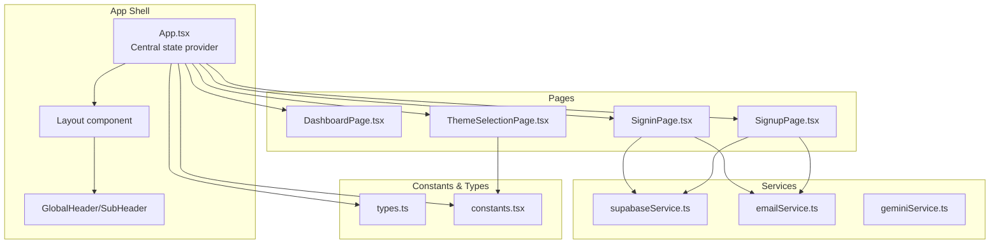
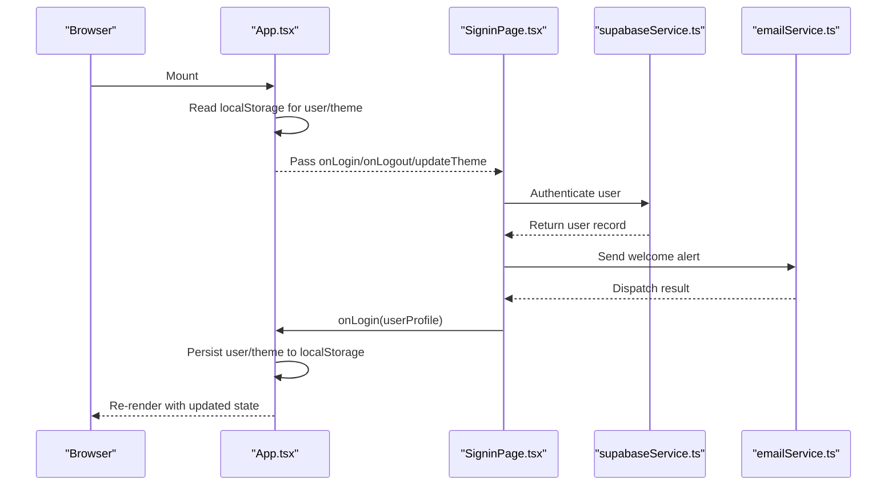
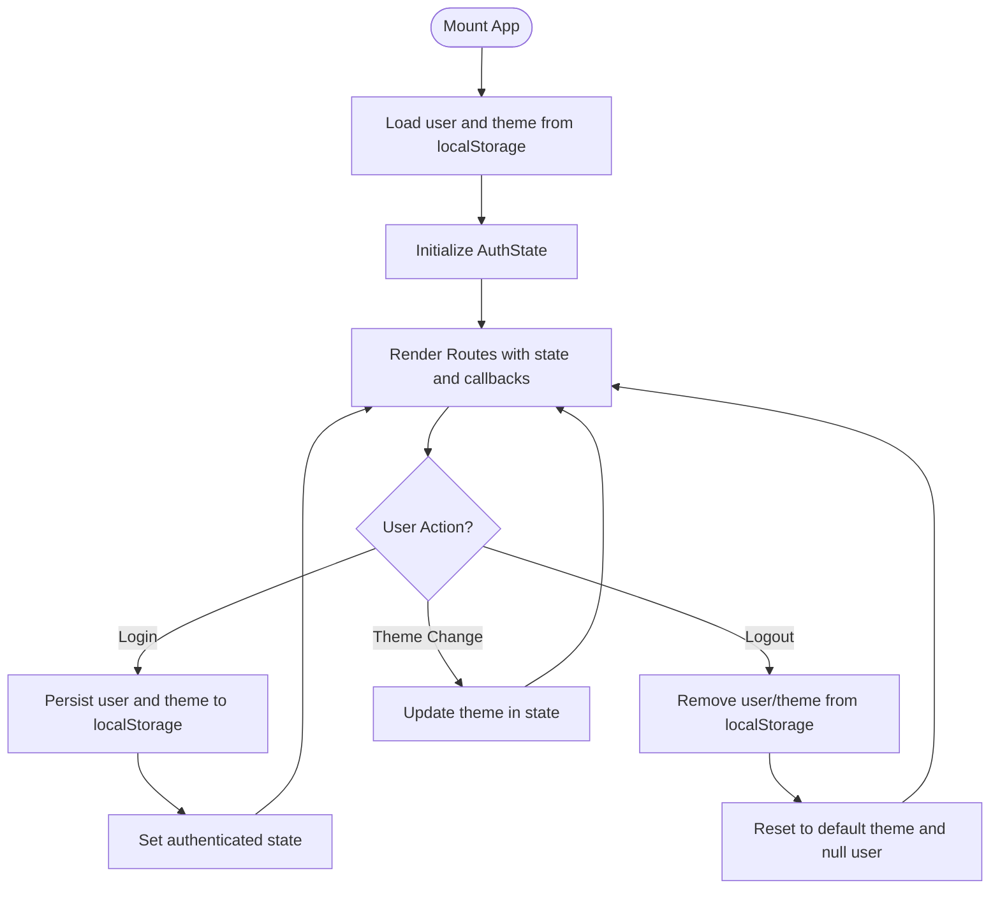
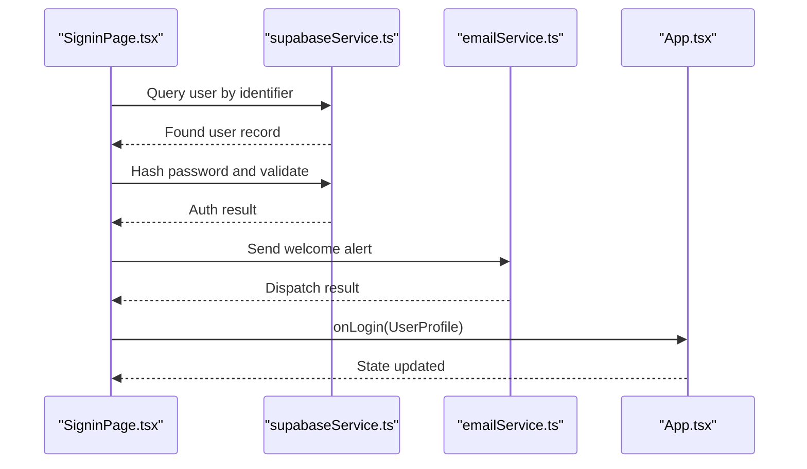
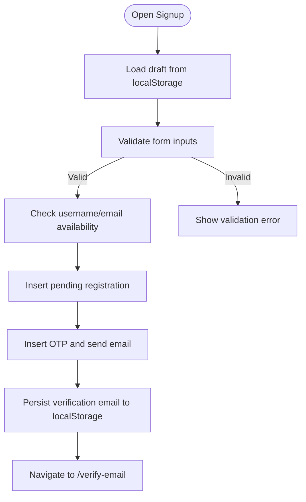
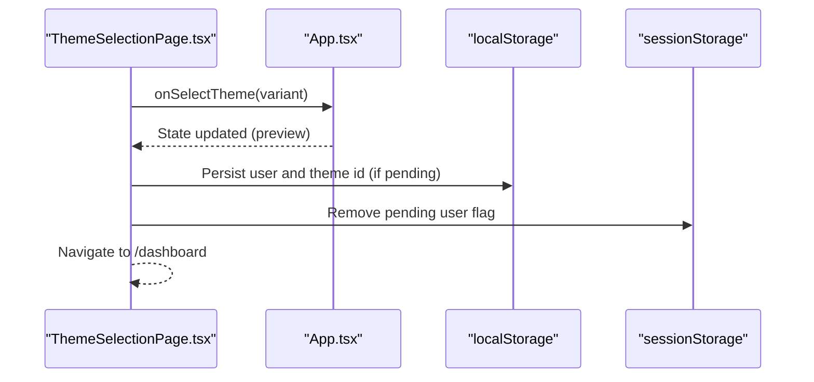
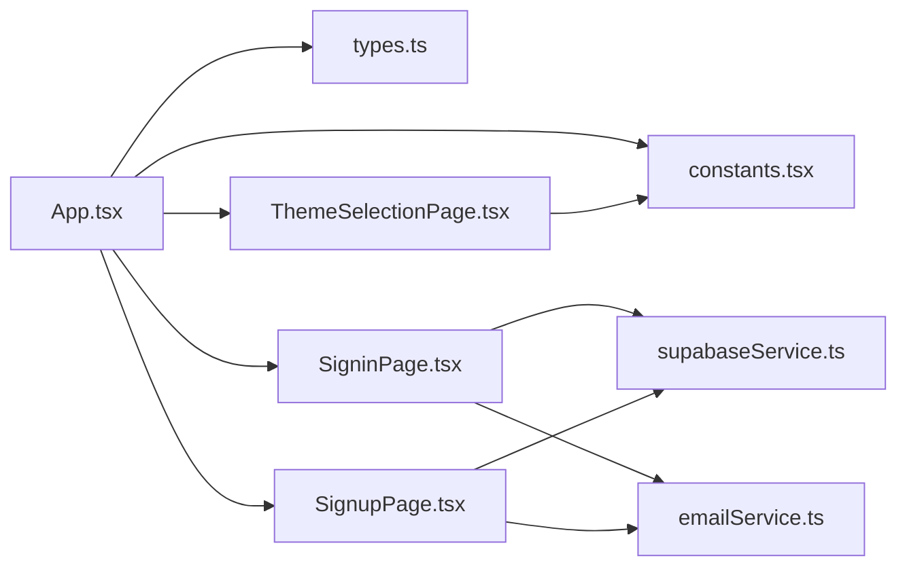

# State Management

<cite>
**Referenced Files in This Document**
- [App.tsx](file://App.tsx)
- [types.ts](file://types.ts)
- [constants.tsx](file://constants.tsx)
- [supabaseService.ts](file://services/supabaseService.ts)
- [emailService.ts](file://services/emailService.ts)
- [geminiService.ts](file://services/geminiService.ts)
- [SigninPage.tsx](file://pages/SigninPage.tsx)
- [SignupPage.tsx](file://pages/SignupPage.tsx)
- [DashboardPage.tsx](file://pages/DashboardPage.tsx)
- [ThemeSelectionPage.tsx](file://pages/ThemeSelectionPage.tsx)
</cite>

## Table of Contents
1. [Introduction](#introduction)
2. [Project Structure](#project-structure)
3. [Core Components](#core-components)
4. [Architecture Overview](#architecture-overview)
5. [Detailed Component Analysis](#detailed-component-analysis)
6. [Dependency Analysis](#dependency-analysis)
7. [Performance Considerations](#performance-considerations)
8. [Troubleshooting Guide](#troubleshooting-guide)
9. [Conclusion](#conclusion)
10. [Appendices](#appendices)

## Introduction
This document explains the ZPRIA state management system with a focus on centralized authentication state, user profile management, and theme state handling. It covers React state patterns used across the app, how state is synchronized through the component hierarchy, and how persistence is achieved via localStorage and sessionStorage. It also documents state update mechanisms, subscription patterns, performance optimizations, and practical guidance for extending the system.

## Project Structure
The state lifecycle centers around a single App-level state container that holds authentication state and theme preferences. Pages and services integrate with this state through props and local hooks, while persistence is handled by localStorage and sessionStorage.

**Diagram sources**
- [App.tsx](file://App.tsx#L218-L276)
- [DashboardPage.tsx](file://pages/DashboardPage.tsx#L13-L217)
- [SigninPage.tsx](file://pages/SigninPage.tsx#L14-L231)
- [SignupPage.tsx](file://pages/SignupPage.tsx#L12-L293)
- [ThemeSelectionPage.tsx](file://pages/ThemeSelectionPage.tsx#L12-L31)
- [supabaseService.ts](file://services/supabaseService.ts#L1-L67)
- [emailService.ts](file://services/emailService.ts#L1-L194)
- [geminiService.ts](file://services/geminiService.ts#L1-L39)
- [types.ts](file://types.ts#L1-L79)
- [constants.tsx](file://constants.tsx#L1-L361)

**Section sources**
- [App.tsx](file://App.tsx#L218-L276)
- [types.ts](file://types.ts#L27-L31)
- [constants.tsx](file://constants.tsx#L5-L25)

## Core Components
- Centralized state container: App.tsx maintains an AuthState object with user, isAuthenticated, and theme fields. It initializes state from localStorage and exposes login, logout, and theme update functions.
- Persistence: localStorage stores the serialized user profile and the selected theme id; sessionStorage is used for ephemeral UI/session flags.
- Type safety: types.ts defines AuthState, UserProfile, and LogoVariant to ensure consistent state shapes across the app.
- Theme variants: constants.tsx provides predefined theme configurations and a default theme.

Key responsibilities:
- App.tsx: initialize state from storage, expose state update APIs, and propagate state to child components.
- Pages: consume state via props and trigger updates via callbacks passed down from App.tsx.
- Services: encapsulate external integrations (authentication, email, AI) and return data consumed by pages and state updates.

**Section sources**
- [App.tsx](file://App.tsx#L218-L247)
- [types.ts](file://types.ts#L11-L31)
- [constants.tsx](file://constants.tsx#L5-L25)

## Architecture Overview
The state architecture follows a unidirectional flow:
- Initialization: On mount, App.tsx reads localStorage to hydrate user and theme.
- Updates: Pages call callback props (login, logout, updateTheme) to mutate state.
- Propagation: App.tsx re-renders, passing the updated state down to routes and components.
- Persistence: Mutations write to localStorage and sessionStorage as needed.

**Diagram sources**
- [App.tsx](file://App.tsx#L218-L247)
- [SigninPage.tsx](file://pages/SigninPage.tsx#L53-L95)
- [supabaseService.ts](file://services/supabaseService.ts#L26-L66)
- [emailService.ts](file://services/emailService.ts#L152-L172)

## Detailed Component Analysis

### App.tsx: Central State Provider
- Initializes AuthState from localStorage on mount.
- Exposes three mutation functions:
  - login: persists user and theme preference, sets authenticated state.
  - logout: clears persisted user and theme, resets to default theme.
  - updateTheme: updates theme without persistence (intended for preview).
- Routes render pages conditionally based on authentication state and pass down callbacks.

**Diagram sources**
- [App.tsx](file://App.tsx#L218-L247)

**Section sources**
- [App.tsx](file://App.tsx#L218-L247)

### Authentication Flow: SigninPage.tsx
- Collects identifier and password, queries Supabase for user, hashes password, and validates against stored hash.
- Builds a UserProfile from database fields and invokes onLogin to update central state.
- Sends a welcome alert via email service after successful login.

**Diagram sources**
- [SigninPage.tsx](file://pages/SigninPage.tsx#L23-L95)
- [supabaseService.ts](file://services/supabaseService.ts#L26-L66)
- [emailService.ts](file://services/emailService.ts#L152-L172)
- [App.tsx](file://App.tsx#L231-L236)

**Section sources**
- [SigninPage.tsx](file://pages/SigninPage.tsx#L14-L95)
- [supabaseService.ts](file://services/supabaseService.ts#L9-L15)
- [emailService.ts](file://services/emailService.ts#L152-L172)
- [App.tsx](file://App.tsx#L231-L236)

### Registration Flow: SignupPage.tsx
- Maintains a form draft in localStorage to improve UX.
- Validates inputs, checks availability, hashes password, writes to pending registrations, and sends OTP.
- Persists verification email to localStorage for downstream flows.

**Diagram sources**
- [SignupPage.tsx](file://pages/SignupPage.tsx#L82-L149)
- [supabaseService.ts](file://services/supabaseService.ts#L17-L24)
- [emailService.ts](file://services/emailService.ts#L139-L147)

**Section sources**
- [SignupPage.tsx](file://pages/SignupPage.tsx#L12-L149)
- [supabaseService.ts](file://services/supabaseService.ts#L17-L24)
- [emailService.ts](file://services/emailService.ts#L139-L147)

### Theme Selection: ThemeSelectionPage.tsx
- Allows users to preview and confirm a theme selection.
- Persists theme preference to localStorage and sessionStorage when a pending user exists, then navigates to dashboard.

**Diagram sources**
- [ThemeSelectionPage.tsx](file://pages/ThemeSelectionPage.tsx#L12-L31)
- [App.tsx](file://App.tsx#L244-L246)

**Section sources**
- [ThemeSelectionPage.tsx](file://pages/ThemeSelectionPage.tsx#L12-L31)
- [App.tsx](file://App.tsx#L244-L246)

### Dashboard: DashboardPage.tsx
- Uses theme prop to render branded content.
- Uses session storage to show an intro animation once per session.

**Section sources**
- [DashboardPage.tsx](file://pages/DashboardPage.tsx#L13-L53)
- [constants.tsx](file://constants.tsx#L5-L25)

## Dependency Analysis
- App.tsx depends on:
  - types.ts for AuthState and UserProfile.
  - constants.tsx for theme variants and default theme.
  - services for authentication and notifications.
- Pages depend on App.tsx callbacks and services for data operations.
- Services encapsulate external integrations and return plain data consumed by pages and state updates.

**Diagram sources**
- [App.tsx](file://App.tsx#L218-L276)
- [types.ts](file://types.ts#L1-L79)
- [constants.tsx](file://constants.tsx#L1-L361)
- [SigninPage.tsx](file://pages/SigninPage.tsx#L1-L231)
- [SignupPage.tsx](file://pages/SignupPage.tsx#L1-L293)
- [ThemeSelectionPage.tsx](file://pages/ThemeSelectionPage.tsx#L1-L31)
- [supabaseService.ts](file://services/supabaseService.ts#L1-L67)
- [emailService.ts](file://services/emailService.ts#L1-L194)

**Section sources**
- [App.tsx](file://App.tsx#L218-L276)
- [types.ts](file://types.ts#L1-L79)
- [constants.tsx](file://constants.tsx#L1-L361)
- [supabaseService.ts](file://services/supabaseService.ts#L1-L67)
- [emailService.ts](file://services/emailService.ts#L1-L194)

## Performance Considerations
- Local hydration: App.tsx hydrates state from localStorage only once on mount, minimizing unnecessary work.
- Minimal re-renders: State updates are atomic (user, isAuthenticated, theme), reducing cascade effects.
- Lazy loading: Secondary pages are lazy-loaded to reduce initial bundle size.
- Memoization: SignupPage.tsx uses useMemo for password strength and age validation to avoid recomputation.
- Session-scoped UI flags: sessionStorage is used for ephemeral UI behavior (e.g., intro seen) to avoid polluting localStorage.

[No sources needed since this section provides general guidance]

## Troubleshooting Guide
Common issues and remedies:
- Corrupted localStorage entries:
  - Symptom: App fails to parse user or theme on startup.
  - Resolution: Clear localStorage keys related to user and theme; App falls back to defaults.
- Stale theme preference:
  - Symptom: Theme does not persist after login.
  - Resolution: Ensure login writes both user and theme id to localStorage; verify theme id matches a known variant.
- Pending user persistence:
  - Symptom: Theme selection does not persist during registration flow.
  - Resolution: Confirm pending user is written to localStorage and cleared after persistence; ensure theme id is set before navigation.
- Session flags:
  - Symptom: Intro animation appears repeatedly.
  - Resolution: Verify sessionStorage flag is set after first render; clear flag if testing repeated views.

**Section sources**
- [App.tsx](file://App.tsx#L219-L229)
- [ThemeSelectionPage.tsx](file://pages/ThemeSelectionPage.tsx#L18-L30)
- [DashboardPage.tsx](file://pages/DashboardPage.tsx#L21-L40)

## Conclusion
ZPRIA’s state management is intentionally simple and centralized. App.tsx manages authentication and theme state, with localStorage and sessionStorage providing persistence. Pages consume state via props and update it through callback handlers. Services encapsulate external dependencies, returning data that flows into state updates. This design is easy to debug, maintain, and extend.

[No sources needed since this section summarizes without analyzing specific files]

## Appendices

### State Update Mechanisms and Subscription Patterns
- Update mechanisms:
  - login: persists user and theme id; sets authenticated state.
  - logout: clears persisted keys; resets to default theme.
  - updateTheme: updates theme in state (preview mode).
- Subscription pattern:
  - App.tsx passes state and callbacks down via props.
  - Pages invoke callbacks to mutate state; App.tsx re-renders and propagates updated state.

**Section sources**
- [App.tsx](file://App.tsx#L231-L246)

### State Persistence Strategies
- localStorage:
  - Stores serialized user profile and theme id.
  - Used for long-term persistence across browser sessions.
- sessionStorage:
  - Used for ephemeral UI/session flags (e.g., intro seen).
  - Ensures temporary state does not leak into persistent storage.

**Section sources**
- [App.tsx](file://App.tsx#L220-L222)
- [DashboardPage.tsx](file://pages/DashboardPage.tsx#L21-L40)
- [ThemeSelectionPage.tsx](file://pages/ThemeSelectionPage.tsx#L18-L27)

### State Cleanup Procedures
- Logout removes persisted user and theme entries and resets state to default.
- Registration flow cleans up pending user data after successful persistence.

**Section sources**
- [App.tsx](file://App.tsx#L238-L242)
- [ThemeSelectionPage.tsx](file://pages/ThemeSelectionPage.tsx#L25-L27)

### Extensibility and Integrations
- To add new state slices:
  - Extend AuthState in types.ts and initialize in App.tsx.
  - Add persistence logic in App.tsx mutations and ensure pages consume new props.
- To integrate additional state libraries:
  - Wrap App.tsx with a provider (e.g., a Redux or Zustand store) and bridge existing callbacks to library actions.
  - Keep localStorage/sessionStorage as the single source of truth for cross-tab and hard reload consistency.

[No sources needed since this section provides general guidance]