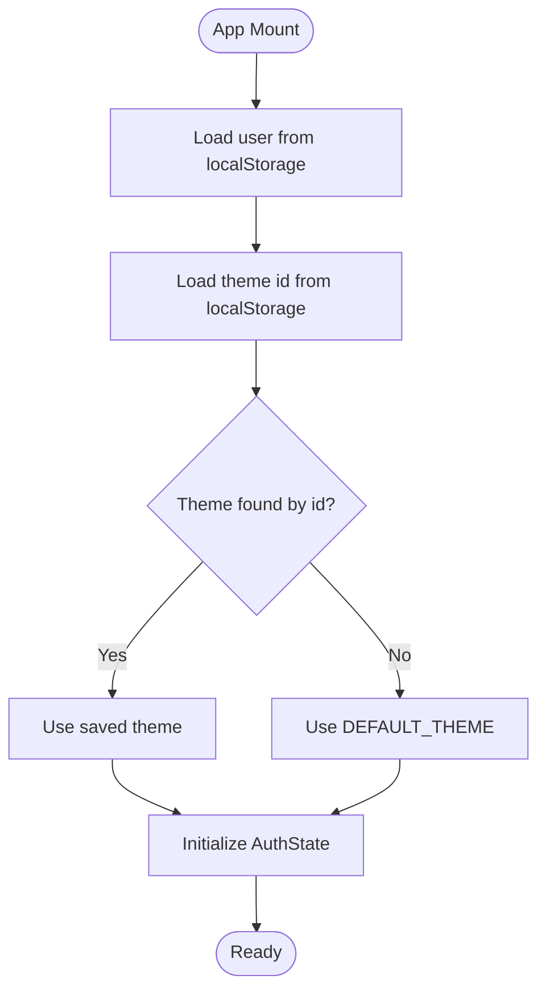

# Theme and Personalization System

<cite>
**Referenced Files in This Document**
- [App.tsx](file://App.tsx)
- [ThemeSelectionPage.tsx](file://pages/ThemeSelectionPage.tsx)
- [constants.tsx](file://constants.tsx)
- [types.ts](file://types.ts)
- [DashboardPage.tsx](file://pages/DashboardPage.tsx)
- [SigninPage.tsx](file://pages/SigninPage.tsx)
- [VerifyPhonePage.tsx](file://pages/VerifyPhonePage.tsx)
- [LandingPage.tsx](file://pages/LandingPage.tsx)
</cite>

## Table of Contents
1. [Introduction](#introduction)
2. [Project Structure](#project-structure)
3. [Core Components](#core-components)
4. [Architecture Overview](#architecture-overview)
5. [Detailed Component Analysis](#detailed-component-analysis)
6. [Dependency Analysis](#dependency-analysis)
7. [Performance Considerations](#performance-considerations)
8. [Troubleshooting Guide](#troubleshooting-guide)
9. [Conclusion](#conclusion)
10. [Appendices](#appendices)

## Introduction
This document explains the ZPRIA theme and personalization system. It covers the 10 logo variants with dynamic color schemes, the animated logo system, the theme selection interface, theme state management, user preference persistence using localStorage, and integration with the main application layout. It also details color scheme configuration, animation triggers, customization options, and accessibility features. Guidance is provided for extending the theme system with additional variants and customization options.

## Project Structure
The theme system spans several key files:
- Application shell and routing manage theme state and persistence.
- Theme selection page renders the 10 logo variants and applies user choices.
- Constants define logo variants, default theme, and animated logos.
- Types define the shape of theme data and user profiles.
- Pages integrate the animated logos and apply theme-aware styles.

**Diagram sources**
- [App.tsx](file://App.tsx#L218-L276)
- [ThemeSelectionPage.tsx](file://pages/ThemeSelectionPage.tsx#L1-L78)
- [constants.tsx](file://constants.tsx#L5-L361)
- [types.ts](file://types.ts#L2-L31)
- [DashboardPage.tsx](file://pages/DashboardPage.tsx#L13-L217)
- [SigninPage.tsx](file://pages/SigninPage.tsx#L14-L231)
- [VerifyPhonePage.tsx](file://pages/VerifyPhonePage.tsx#L12-L159)
- [LandingPage.tsx](file://pages/LandingPage.tsx#L7-L76)

**Section sources**
- [App.tsx](file://App.tsx#L218-L276)
- [ThemeSelectionPage.tsx](file://pages/ThemeSelectionPage.tsx#L1-L78)
- [constants.tsx](file://constants.tsx#L5-L361)
- [types.ts](file://types.ts#L2-L31)

## Core Components
- Logo variants: 10 predefined variants with primary, secondary, accent colors and gradient definitions.
- Animated logos: Corner logo with a build-in/build-out sequence and a main logo assembly animation.
- Theme state: Centralized in App.tsx with localStorage persistence for user and theme.
- Theme selection UI: Grid of variants with visual preview and selection feedback.
- Integration: Animated logos appear in landing and dashboard pages; header and navigation adapt to theme.

Key implementation examples:
- Theme state initialization and persistence: [App.tsx](file://App.tsx#L219-L229)
- Theme update handler: [App.tsx](file://App.tsx#L244-L246)
- Theme selection rendering and persistence: [ThemeSelectionPage.tsx](file://pages/ThemeSelectionPage.tsx#L12-L78)
- Variant definitions and animated logos: [constants.tsx](file://constants.tsx#L5-L361)
- Type definitions: [types.ts](file://types.ts#L2-L31)

**Section sources**
- [App.tsx](file://App.tsx#L219-L246)
- [ThemeSelectionPage.tsx](file://pages/ThemeSelectionPage.tsx#L12-L78)
- [constants.tsx](file://constants.tsx#L5-L361)
- [types.ts](file://types.ts#L2-L31)

## Architecture Overview
The theme system follows a centralized state pattern:
- App.tsx holds the AuthState with user and theme.
- ThemeSelectionPage.tsx updates the theme via a callback passed down from App.tsx.
- constants.tsx provides the variant palette and animated SVGs.
- Pages consume the theme to render branded visuals and interactive elements.

**Diagram sources**
- [App.tsx](file://App.tsx#L248-L276)
- [ThemeSelectionPage.tsx](file://pages/ThemeSelectionPage.tsx#L12-L78)
- [constants.tsx](file://constants.tsx#L5-L361)

## Detailed Component Analysis

### Theme State Management and Persistence
- Initialization: On mount, App.tsx reads user and theme from localStorage and selects the theme by id.
- Login flow: On successful login, App.tsx persists the user and resolves the theme by user’s themePreference.
- Logout: Removes persisted user and theme, resets to default theme.
- Theme update: updateTheme replaces the current theme in state.

**Diagram sources**
- [App.tsx](file://App.tsx#L219-L229)

**Section sources**
- [App.tsx](file://App.tsx#L219-L246)

### Theme Selection Interface
- Renders a grid of 10 variants with gradient previews and names.
- Tracks selected variant in local state.
- Persists selection to localStorage and navigates to dashboard.
- Supports immediate skip to dashboard.

**Diagram sources**
- [ThemeSelectionPage.tsx](file://pages/ThemeSelectionPage.tsx#L12-L78)
- [App.tsx](file://App.tsx#L244-L246)

**Section sources**
- [ThemeSelectionPage.tsx](file://pages/ThemeSelectionPage.tsx#L12-L78)

### Color Scheme Configuration and Variants
- Each variant defines id, name, primary, secondary, accent, and gradient.
- Default theme is the first variant.
- These values drive animated logo colors and UI accents.

**Diagram sources**
- [types.ts](file://types.ts#L2-L9)
- [constants.tsx](file://constants.tsx#L5-L25)

**Section sources**
- [types.ts](file://types.ts#L2-L9)
- [constants.tsx](file://constants.tsx#L5-L25)

### Animated Logo System
- Corner logo: A compact, animated symbol with layered shapes and timing controls.
- Main logo: A multi-stage assembly animation with sliding squares, fading circle, sequential dots, dropping dot, and sliding bar.
- Breathing text animation for “ZPRIA” in corner logo.

**Diagram sources**
- [constants.tsx](file://constants.tsx#L273-L310)
- [constants.tsx](file://constants.tsx#L312-L360)

**Section sources**
- [constants.tsx](file://constants.tsx#L273-L360)

### Integration with Application Layout
- Header and navigation use theme-aware colors and gradients.
- Dashboard and landing pages render animated logos with theme-appropriate styling.
- SubHeader and GlobalHeader adapt to theme via inline styles and className tokens.

**Diagram sources**
- [App.tsx](file://App.tsx#L109-L123)
- [App.tsx](file://App.tsx#L125-L180)
- [DashboardPage.tsx](file://pages/DashboardPage.tsx#L103-L104)
- [LandingPage.tsx](file://pages/LandingPage.tsx#L24-L26)
- [constants.tsx](file://constants.tsx#L273-L310)

**Section sources**
- [App.tsx](file://App.tsx#L109-L180)
- [DashboardPage.tsx](file://pages/DashboardPage.tsx#L103-L104)
- [LandingPage.tsx](file://pages/LandingPage.tsx#L24-L26)

### Theme-Aware Pages
- DashboardPage.tsx displays the main logo animation on first visit and links to theme selection.
- LandingPage.tsx showcases the main logo with decorative background mesh.
- SigninPage.tsx and VerifyPhonePage.tsx include the main logo in their layouts.

**Section sources**
- [DashboardPage.tsx](file://pages/DashboardPage.tsx#L13-L217)
- [LandingPage.tsx](file://pages/LandingPage.tsx#L7-L76)
- [SigninPage.tsx](file://pages/SigninPage.tsx#L14-L231)
- [VerifyPhonePage.tsx](file://pages/VerifyPhonePage.tsx#L12-L159)

## Dependency Analysis
- App.tsx depends on constants.tsx for LOGO_VARIANTS and DEFAULT_THEME, and types.ts for LogoVariant and AuthState.
- ThemeSelectionPage.tsx depends on constants.tsx for LOGO_VARIANTS and types.ts for LogoVariant.
- Pages depend on constants.tsx for animated logos and types.ts for typed props.

**Diagram sources**
- [App.tsx](file://App.tsx#L4-L5)
- [ThemeSelectionPage.tsx](file://pages/ThemeSelectionPage.tsx#L4-L5)
- [constants.tsx](file://constants.tsx#L2-L3)
- [types.ts](file://types.ts#L2-L3)

**Section sources**
- [App.tsx](file://App.tsx#L4-L5)
- [ThemeSelectionPage.tsx](file://pages/ThemeSelectionPage.tsx#L4-L5)
- [constants.tsx](file://constants.tsx#L2-L3)
- [types.ts](file://types.ts#L2-L3)

## Performance Considerations
- Theme switching is lightweight: it updates a single state field and re-renders affected components.
- Animated logos use SVG animations; keep durations reasonable to avoid jank.
- Avoid excessive re-renders by passing memoized callbacks and stable references where possible.
- Consider lazy-loading heavy assets if the number of variants grows substantially.

[No sources needed since this section provides general guidance]

## Troubleshooting Guide
- Theme not persisting across sessions:
  - Ensure localStorage keys are present and not cleared by browser policies.
  - Confirm that updateTheme is invoked and that App.tsx persists the theme id.
- Incorrect default theme:
  - Verify DEFAULT_THEME and LOGO_VARIANTS order.
- Variant not selectable:
  - Check that the variant id matches the stored theme id.
- Animated logo not visible:
  - Confirm className and inline styles are applied consistently across pages.

**Section sources**
- [App.tsx](file://App.tsx#L219-L246)
- [ThemeSelectionPage.tsx](file://pages/ThemeSelectionPage.tsx#L16-L31)
- [constants.tsx](file://constants.tsx#L5-L25)

## Conclusion
The ZPRIA theme and personalization system centers around a clean, centralized state model with robust persistence and a visually engaging animated logo suite. The 10 logo variants provide rich customization while maintaining brand consistency. The system integrates seamlessly with the application layout and offers a smooth user experience for selecting and applying themes.

[No sources needed since this section summarizes without analyzing specific files]

## Appendices

### Accessibility Features
- Focus management: Buttons and links use focus-visible rings for keyboard navigation.
- Contrast: Theme colors are chosen to maintain readable contrast against backgrounds.
- Motion: Animations are designed to be short and non-intrusive; consider reduced-motion preferences in future enhancements.

[No sources needed since this section provides general guidance]

### Extending the Theme System
- Adding a new variant:
  - Define a new LogoVariant in constants.tsx with id, name, primary, secondary, accent, and gradient.
  - Ensure id uniqueness and consistency with user themePreference.
- Customizing animations:
  - Modify ZPRIA_CORNER_LOGO or ZPRIA_MAIN_LOGO in constants.tsx to reflect new color roles.
- Persisting user preferences:
  - Ensure user objects include themePreference and that App.tsx resolves theme by id on login.

**Section sources**
- [constants.tsx](file://constants.tsx#L5-L25)
- [types.ts](file://types.ts#L23-L24)
- [App.tsx](file://App.tsx#L231-L236)