# Troubleshooting and FAQ

<cite>
**Referenced Files in This Document**
- [README.md](file://README.md)
- [package.json](file://package.json)
- [vite.config.ts](file://vite.config.ts)
- [index.tsx](file://index.tsx)
- [App.tsx](file://App.tsx)
- [types.ts](file://types.ts)
- [constants.tsx](file://constants.tsx)
- [services/supabaseService.ts](file://services/supabaseService.ts)
- [services/geminiService.ts](file://services/geminiService.ts)
- [services/emailService.ts](file://services/emailService.ts)
- [pages/SigninPage.tsx](file://pages/SigninPage.tsx)
- [pages/SignupPage.tsx](file://pages/SignupPage.tsx)
- [pages/VerifyEmailPage.tsx](file://pages/VerifyEmailPage.tsx)
- [pages/ForgotPasswordPage.tsx](file://pages/ForgotPasswordPage.tsx)
- [pages/DiagnosticsPage.tsx](file://pages/DiagnosticsPage.tsx)
</cite>

## Table of Contents
1. [Introduction](#introduction)
2. [Project Structure](#project-structure)
3. [Core Components](#core-components)
4. [Architecture Overview](#architecture-overview)
5. [Detailed Component Analysis](#detailed-component-analysis)
6. [Dependency Analysis](#dependency-analysis)
7. [Performance Considerations](#performance-considerations)
8. [Troubleshooting Guide](#troubleshooting-guide)
9. [Conclusion](#conclusion)
10. [Appendices](#appendices)

## Introduction
This document provides comprehensive troubleshooting guidance for the ZPRIA Account Management System. It focuses on diagnosing and resolving authentication failures, API integration issues, build and deployment concerns, browser compatibility, performance bottlenecks, and network connectivity problems. It also outlines logging strategies, error monitoring approaches, diagnostic tools, and frequently asked questions covering setup, configuration, customization, and integration challenges.

## Project Structure
The application is a React SPA built with Vite. Authentication and identity management integrate with Supabase for database operations and user records, EmailJS for transactional emails, and the Gemini AI SDK for dynamic content generation. Pages implement multi-step flows for sign-up, email verification, sign-in, and password recovery.

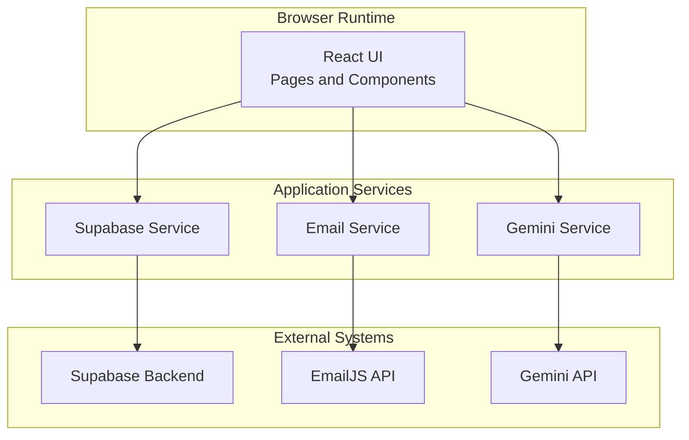

**Diagram sources**
- [App.tsx](file://App.tsx#L218-L279)
- [services/supabaseService.ts](file://services/supabaseService.ts#L1-L67)
- [services/emailService.ts](file://services/emailService.ts#L1-L194)
- [services/geminiService.ts](file://services/geminiService.ts#L1-L39)

**Section sources**
- [README.md](file://README.md#L1-L21)
- [package.json](file://package.json#L1-L27)
- [vite.config.ts](file://vite.config.ts#L1-L24)

## Core Components
- Authentication and routing: Centralized in the application shell with route guards and local storage-backed auth state.
- Supabase integration: Handles user lookup, credential validation, lockout logic, and OTP/pending registration persistence.
- Email delivery: Sends OTP and welcome/alert messages via EmailJS with contextual security metadata.
- AI-driven content: Generates dynamic greeting and security recommendation messages using Gemini.
- UI flows: Multi-step forms for sign-up, email verification, sign-in, and password recovery.

**Section sources**
- [App.tsx](file://App.tsx#L218-L279)
- [services/supabaseService.ts](file://services/supabaseService.ts#L1-L67)
- [services/emailService.ts](file://services/emailService.ts#L1-L194)
- [services/geminiService.ts](file://services/geminiService.ts#L1-L39)
- [pages/SigninPage.tsx](file://pages/SigninPage.tsx#L1-L231)
- [pages/SignupPage.tsx](file://pages/SignupPage.tsx#L1-L293)
- [pages/VerifyEmailPage.tsx](file://pages/VerifyEmailPage.tsx#L1-L255)
- [pages/ForgotPasswordPage.tsx](file://pages/ForgotPasswordPage.tsx#L1-L265)

## Architecture Overview
The system follows a client-side SPA architecture with explicit separation of concerns:
- UI pages orchestrate user actions and render feedback.
- Service modules encapsulate external API interactions and business logic.
- Local storage persists minimal auth state and theme preferences.
- Supabase stores user profiles, pending registrations, OTP verifications, and enforces security policies.
- EmailJS delivers transactional emails with security context.
- Gemini provides optional AI-generated content with graceful fallbacks.

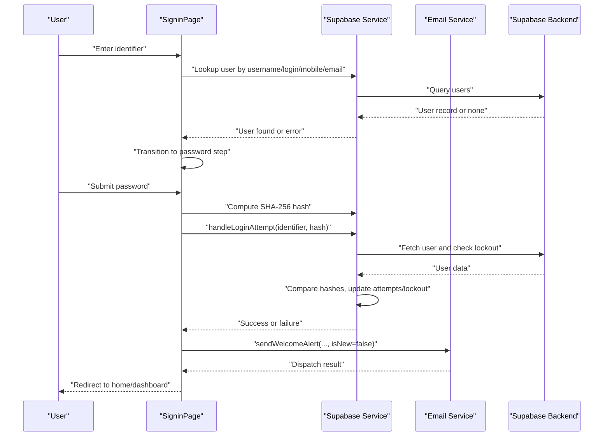

**Diagram sources**
- [pages/SigninPage.tsx](file://pages/SigninPage.tsx#L23-L95)
- [services/supabaseService.ts](file://services/supabaseService.ts#L26-L66)
- [services/emailService.ts](file://services/emailService.ts#L152-L172)

## Detailed Component Analysis

### Authentication and Session Management
- Auth state is initialized from local storage and updated on login/logout.
- Theme preference is persisted alongside user profile.
- Routing guards redirect unauthenticated users to sign-in.

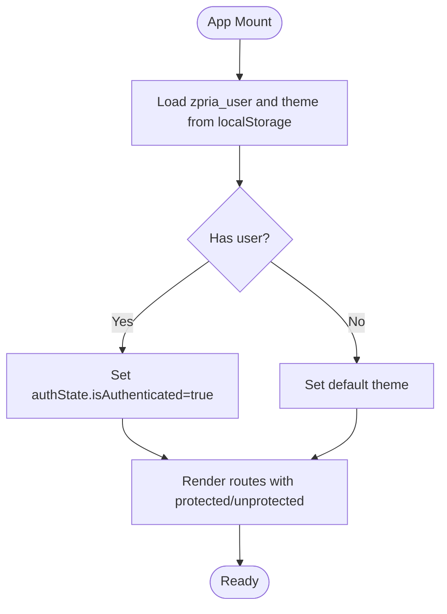

**Diagram sources**
- [App.tsx](file://App.tsx#L218-L247)

**Section sources**
- [App.tsx](file://App.tsx#L218-L247)

### Supabase Authentication Flow
- Identifier lookup supports username, login_id, mobile, or email.
- Password comparison uses SHA-256 hashing with trimming to mitigate hidden-space issues.
- Lockout policy increments failed attempts and locks accounts temporarily after threshold breaches.
- On success, attempts are reset and last login timestamp updated.

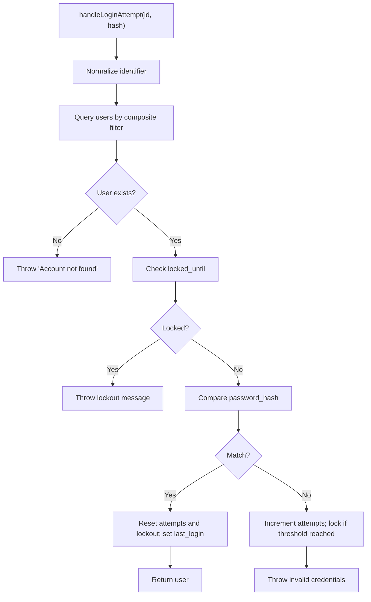

**Diagram sources**
- [services/supabaseService.ts](file://services/supabaseService.ts#L26-L66)

**Section sources**
- [services/supabaseService.ts](file://services/supabaseService.ts#L1-L67)

### Email Delivery Pipeline
- Uses EmailJS to send OTP and welcome/alert notifications.
- Adds security context (device info, IP, location, login time) with timeouts and fallbacks.
- Provides dedicated functions for OTP, welcome, and password change alerts.

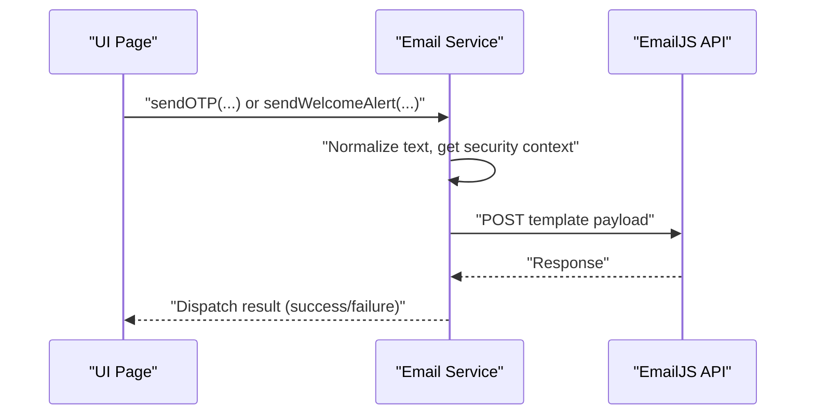

**Diagram sources**
- [services/emailService.ts](file://services/emailService.ts#L70-L137)

**Section sources**
- [services/emailService.ts](file://services/emailService.ts#L1-L194)

### Gemini AI Content Generation
- Optional AI greeting and security recommendation generation.
- Graceful fallbacks when API key is missing or requests fail.

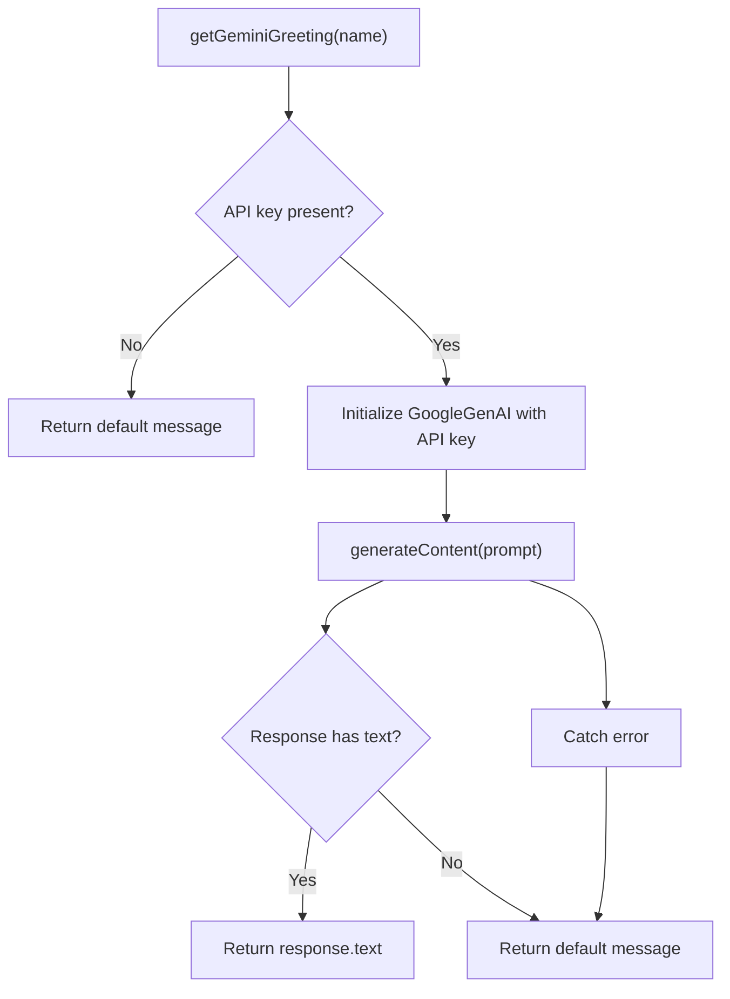

**Diagram sources**
- [services/geminiService.ts](file://services/geminiService.ts#L4-L20)

**Section sources**
- [services/geminiService.ts](file://services/geminiService.ts#L1-L39)

### Sign-In Page Workflow
- Two-step flow: identifier lookup followed by password submission.
- Displays user’s name during password step for confirmation.
- On success, triggers welcome alert and navigates to home.

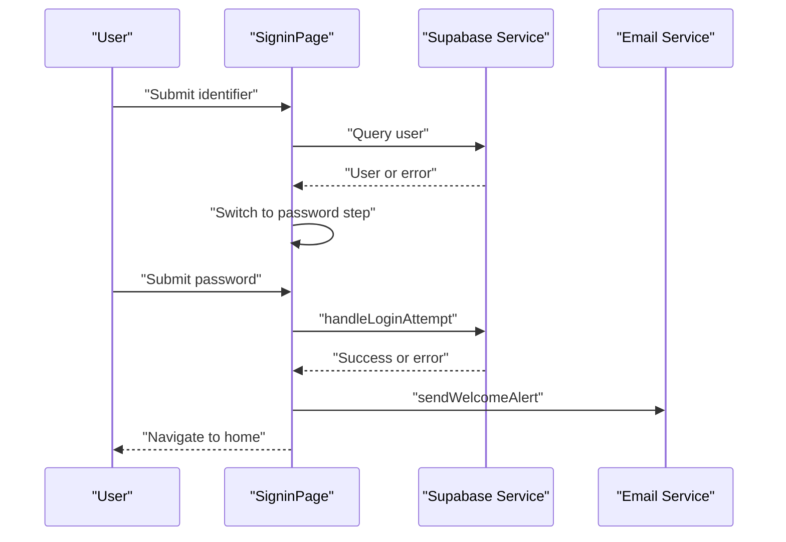

**Diagram sources**
- [pages/SigninPage.tsx](file://pages/SigninPage.tsx#L23-L95)
- [services/supabaseService.ts](file://services/supabaseService.ts#L26-L66)
- [services/emailService.ts](file://services/emailService.ts#L152-L172)

**Section sources**
- [pages/SigninPage.tsx](file://pages/SigninPage.tsx#L1-L231)

### Sign-Up Page Workflow
- Draft state persisted in local storage for continuity.
- Validates age, password strength, CAPTCHA, and terms.
- Inserts pending registration and OTP, then navigates to email verification.

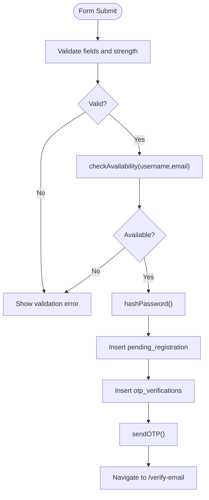

**Diagram sources**
- [pages/SignupPage.tsx](file://pages/SignupPage.tsx#L82-L149)
- [services/supabaseService.ts](file://services/supabaseService.ts#L17-L24)

**Section sources**
- [pages/SignupPage.tsx](file://pages/SignupPage.tsx#L1-L293)
- [services/supabaseService.ts](file://services/supabaseService.ts#L1-L67)

### Email Verification and Password Reset
- OTP entry with auto-focus and backspace navigation.
- Resend timer with controlled re-sends.
- Supports both registration and password reset modes.

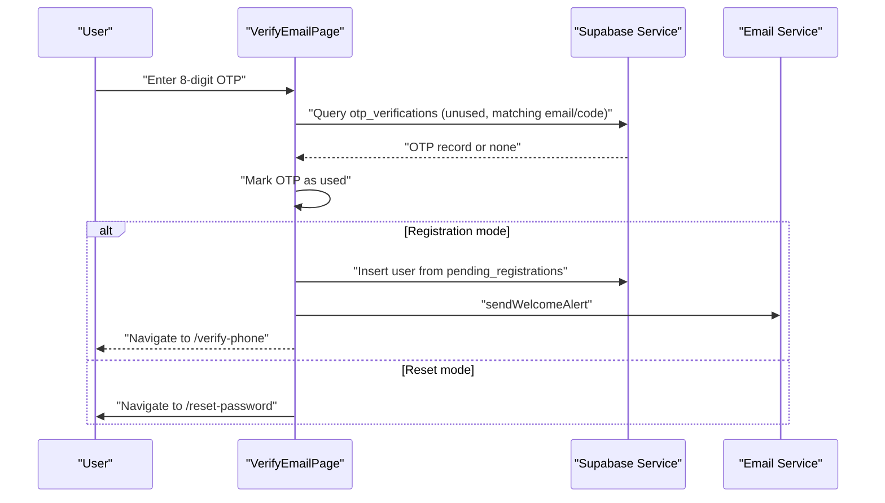

**Diagram sources**
- [pages/VerifyEmailPage.tsx](file://pages/VerifyEmailPage.tsx#L99-L162)

**Section sources**
- [pages/VerifyEmailPage.tsx](file://pages/VerifyEmailPage.tsx#L1-L255)

### Password Recovery Flow
- Searches accounts by email, login_id, username, or mobile.
- Presents account selection if multiple matches.
- Sends OTP via email for password reset.

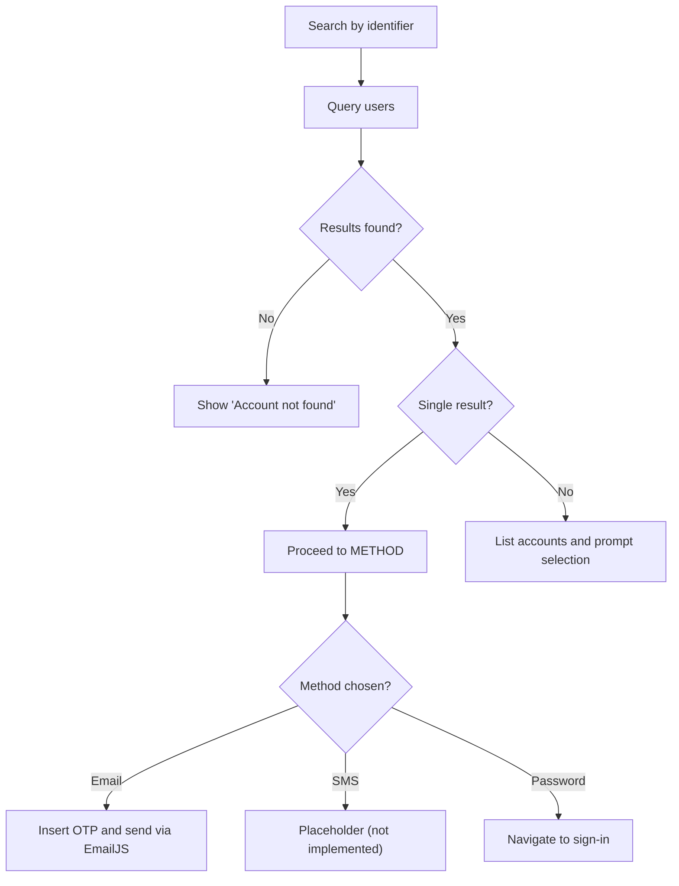

**Diagram sources**
- [pages/ForgotPasswordPage.tsx](file://pages/ForgotPasswordPage.tsx#L34-L110)

**Section sources**
- [pages/ForgotPasswordPage.tsx](file://pages/ForgotPasswordPage.tsx#L1-L265)

## Dependency Analysis
- Frontend framework: React 19 with React Router DOM 7.x.
- Build toolchain: Vite with React plugin.
- External libraries: @google/genai for AI, @supabase/supabase-js for database, lucide-react for icons.
- Environment configuration: Vite injects Gemini API key into process.env at build time.

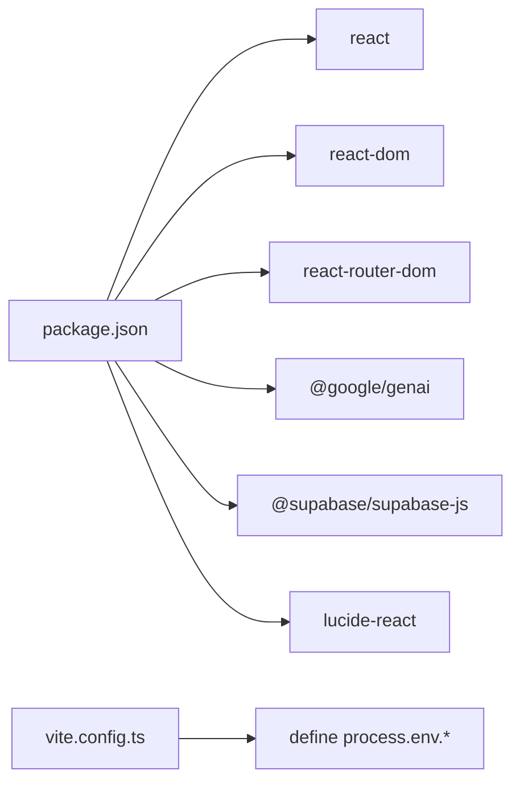

**Diagram sources**
- [package.json](file://package.json#L12-L25)
- [vite.config.ts](file://vite.config.ts#L13-L16)

**Section sources**
- [package.json](file://package.json#L1-L27)
- [vite.config.ts](file://vite.config.ts#L1-L24)

## Performance Considerations
- Network-bound operations:
  - Supabase queries and inserts should be monitored for latency; consider adding retry/backoff and caching for repeated reads.
  - EmailJS dispatches are asynchronous; ensure UI indicates progress and handles failures gracefully.
- Rendering:
  - React.lazy is used for secondary pages; verify chunk loading and fallback UX.
  - Avoid unnecessary re-renders by memoizing derived values (e.g., password strength).
- Build/runtime:
  - Vite dev server runs on port 3000; ensure firewall and host binding are configured for your environment.
  - API key injection occurs at build time; verify environment variable presence during CI/CD.

[No sources needed since this section provides general guidance]

## Troubleshooting Guide

### Authentication Failures
Common symptoms:
- “Account not found” during sign-in.
- “Invalid credentials” with remaining attempts count.
- Account locked for a period after multiple failures.

Resolution steps:
1. Verify the identifier used for sign-in matches username, login_id, mobile, or email stored in the system.
2. Confirm password meets minimum requirements and is not padded with spaces.
3. Check lockout status; wait for the lockout period to expire before retrying.
4. Clear browser local storage keys related to auth state if stuck in inconsistent state.

Diagnostic tips:
- Inspect Supabase logs for query outcomes and lockout timestamps.
- Review console errors for thrown messages from the authentication flow.

**Section sources**
- [services/supabaseService.ts](file://services/supabaseService.ts#L26-L66)
- [pages/SigninPage.tsx](file://pages/SigninPage.tsx#L23-L95)

### API Integration Problems
Symptoms:
- Email dispatch failures.
- Gemini content generation errors.
- Supabase query errors.

Resolution steps:
1. EmailJS:
   - Confirm service_id, template_id, public/private keys are correct.
   - Validate that the recipient email is present and formatted properly.
   - Check network connectivity and CORS restrictions for the EmailJS endpoint.
2. Gemini:
   - Ensure the GEMINI_API_KEY environment variable is set and injected at build time.
   - Verify the model name and prompt are valid; confirm fallback behavior when API is unreachable.
3. Supabase:
   - Validate Supabase URL and anonymous key.
   - Confirm database schema and row-level security policies allow required operations.

Diagnostic tips:
- Use browser DevTools Network tab to inspect request/response bodies and status codes.
- Log error messages returned by external APIs and surface them to users with actionable guidance.

**Section sources**
- [services/emailService.ts](file://services/emailService.ts#L114-L137)
- [services/geminiService.ts](file://services/geminiService.ts#L4-L20)
- [services/supabaseService.ts](file://services/supabaseService.ts#L4-L7)
- [vite.config.ts](file://vite.config.ts#L13-L16)

### Build Errors
Symptoms:
- Missing dependencies or module resolution errors.
- Vite server fails to start or binds incorrectly.

Resolution steps:
1. Install dependencies using the documented command.
2. Ensure Node.js version satisfies project requirements.
3. Verify Vite dev server port and host bindings.
4. Confirm environment variables are loaded and API keys are injected.

Diagnostic tips:
- Re-run installation after clearing node_modules and cache if stale dependency issues occur.
- Check Vite config for alias and define directives.

**Section sources**
- [README.md](file://README.md#L16-L20)
- [package.json](file://package.json#L6-L11)
- [vite.config.ts](file://vite.config.ts#L8-L16)

### Deployment Issues
Symptoms:
- Application loads blank or throws runtime errors.
- Environment-specific API keys not applied.

Resolution steps:
1. Build the project and preview the bundle.
2. Validate environment variables are present in the deployed environment.
3. Confirm CDN/host allows cross-origin requests to external APIs.

Diagnostic tips:
- Compare local and production console outputs for differences in error messages.
- Verify static asset paths and base href if applicable.

**Section sources**
- [README.md](file://README.md#L16-L20)
- [package.json](file://package.json#L8-L10)
- [vite.config.ts](file://vite.config.ts#L13-L16)

### Browser Compatibility Issues
Symptoms:
- Certain UI elements not rendering or animations not working.
- JavaScript features unsupported in older browsers.

Resolution steps:
1. Test on supported modern browsers.
2. Polyfill or transpile features as needed for legacy environments.
3. Validate SVG animations and CSS variables used in branding assets.

Diagnostic tips:
- Use browser developer tools to inspect computed styles and layout issues.
- Validate that required polyfills are included.

[No sources needed since this section provides general guidance]

### Performance Troubleshooting
Symptoms:
- Slow sign-in/sign-up flows.
- Delays in email delivery.

Resolution steps:
1. Monitor network latency to external services.
2. Optimize UI rendering and reduce heavy computations in event handlers.
3. Implement client-side caching for frequently accessed data.

Diagnostic tips:
- Use performance profiling tools to identify bottlenecks.
- Track external API latencies and implement timeouts.

[No sources needed since this section provides general guidance]

### Network Connectivity Problems
Symptoms:
- Requests to EmailJS or Gemini fail intermittently.
- Supabase queries time out.

Resolution steps:
1. Verify DNS resolution and firewall rules.
2. Configure proxy or allow-list required domains.
3. Implement retry logic with exponential backoff.

Diagnostic tips:
- Check network tab for failed requests and error codes.
- Validate rate limits and quotas for external services.

[No sources needed since this section provides general guidance]

### Logging Strategies and Error Monitoring
Recommended practices:
- Capture structured logs for authentication events, OTP operations, and external API calls.
- Surface user-friendly messages while preserving technical details in logs.
- Integrate with an observability platform to track error rates and latency.

Diagnostic tips:
- Use console.error for failures and console.log for informational events.
- Tag logs with correlation IDs for end-to-end tracing.

[No sources needed since this section provides general guidance]

### Diagnostic Tools
- Built-in diagnostics page: Use the diagnostics page to verify basic system health signals.
- Browser DevTools: Network, Console, and Performance panels for runtime insights.
- Supabase dashboard: Monitor queries, RLS policies, and real-time events.
- EmailJS dashboard: Validate sent messages and template rendering.

**Section sources**
- [pages/DiagnosticsPage.tsx](file://pages/DiagnosticsPage.tsx#L1-L51)

### Frequently Asked Questions (FAQ)

Q: How do I configure the Gemini API key?
A: Set the GEMINI_API_KEY environment variable and rebuild the project. Vite injects it into process.env at build time.

Q: Why does the sign-in show “Account not found”?
A: Ensure you are using a valid identifier (username, login_id, email, or mobile) that matches the stored user record.

Q: My account is locked. How long do I wait?
A: After multiple failed attempts, accounts are locked for a fixed period. Wait until the lockout expires before retrying.

Q: Why did the email not arrive?
A: Check the recipient email, spam/junk folder, and verify EmailJS credentials. Use the resend mechanism if available.

Q: Can I reset my password via SMS?
A: Currently, password reset via SMS is not implemented. Use email-based OTP instead.

Q: How do I verify my email?
A: Enter the 8-digit code sent to your email. If you did not receive it, use the resend timer.

Q: What should I do if I see a blank screen after deployment?
A: Verify environment variables, check console errors, and ensure the build artifacts are served correctly.

Q: How do I customize themes?
A: Select a theme from the theme selection page; preferences are persisted locally.

Q: How do I report a bug or request support?
A: Use the support links available in the UI and attach relevant logs and screenshots.

**Section sources**
- [vite.config.ts](file://vite.config.ts#L13-L16)
- [services/supabaseService.ts](file://services/supabaseService.ts#L38-L42)
- [services/emailService.ts](file://services/emailService.ts#L114-L137)
- [pages/ForgotPasswordPage.tsx](file://pages/ForgotPasswordPage.tsx#L237-L238)
- [pages/VerifyEmailPage.tsx](file://pages/VerifyEmailPage.tsx#L63-L97)
- [pages/DiagnosticsPage.tsx](file://pages/DiagnosticsPage.tsx#L1-L51)

## Conclusion
By following the systematic debugging approaches outlined above—covering authentication, API integrations, builds, deployments, browser compatibility, performance, and network connectivity—you can efficiently diagnose and resolve most issues in the ZPRIA Account Management System. Leverage the provided diagnostic tools, maintain robust logging, and apply the recommended preventive measures to minimize downtime and improve reliability.

[No sources needed since this section summarizes without analyzing specific files]

## Appendices

### Step-by-Step Resolution Guides

- Authentication failure:
  1. Confirm identifier correctness.
  2. Verify password requirements.
  3. Check lockout status and wait if locked.
  4. Clear local storage auth keys if stuck.
  5. Retry and monitor console for error messages.

- Email delivery failure:
  1. Validate EmailJS credentials and templates.
  2. Confirm recipient email presence.
  3. Check network connectivity and CORS.
  4. Use resend mechanism and monitor response.

- Gemini content generation error:
  1. Ensure GEMINI_API_KEY is set.
  2. Verify model name and prompt validity.
  3. Confirm fallback behavior is triggered on failure.

- Build error:
  1. Install dependencies and rebuild.
  2. Verify Node.js version and environment variables.
  3. Check Vite configuration and aliases.

- Deployment issue:
  1. Preview the build locally.
  2. Validate environment variables in production.
  3. Confirm external API allow-lists and CDN settings.

- Diagnostics:
  1. Visit the diagnostics page to check system health signals.
  2. Use browser DevTools for deeper inspection.
  3. Cross-check external service dashboards.

**Section sources**
- [services/supabaseService.ts](file://services/supabaseService.ts#L26-L66)
- [services/emailService.ts](file://services/emailService.ts#L114-L137)
- [services/geminiService.ts](file://services/geminiService.ts#L4-L20)
- [README.md](file://README.md#L16-L20)
- [vite.config.ts](file://vite.config.ts#L13-L16)
- [pages/DiagnosticsPage.tsx](file://pages/DiagnosticsPage.tsx#L1-L51)