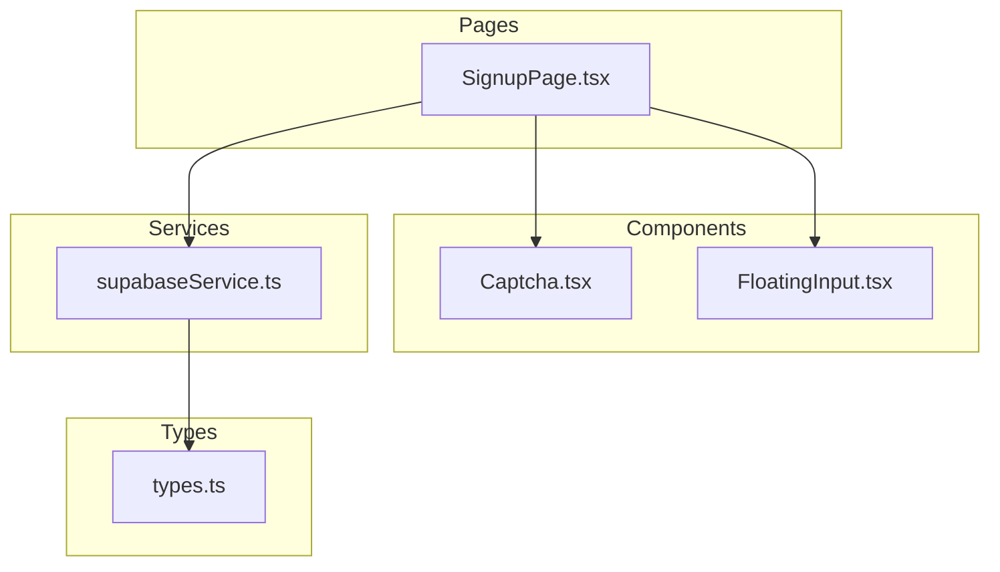
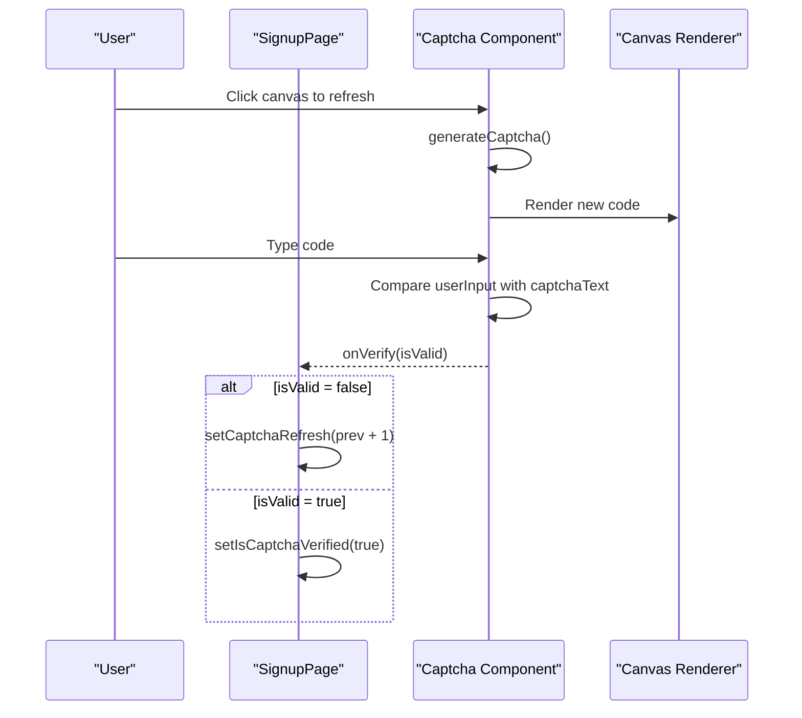
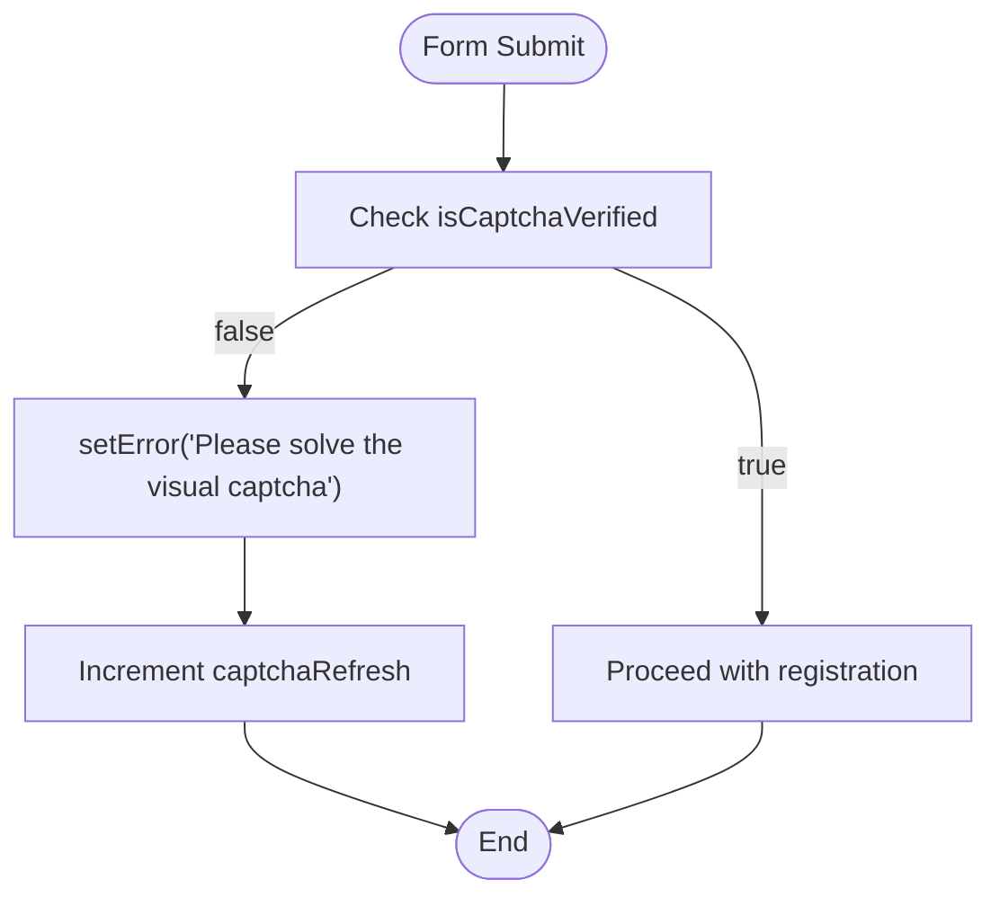
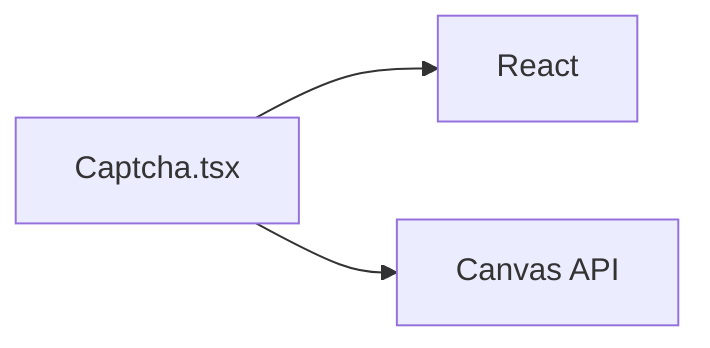

# Captcha Component

<cite>
**Referenced Files in This Document**
- [Captcha.tsx](file://components/Captcha.tsx)
- [SignupPage.tsx](file://pages/SignupPage.tsx)
- [FloatingInput.tsx](file://components/FloatingInput.tsx)
- [supabaseService.ts](file://services/supabaseService.ts)
- [types.ts](file://types.ts)
</cite>

## Table of Contents
1. [Introduction](#introduction)
2. [Project Structure](#project-structure)
3. [Core Components](#core-components)
4. [Architecture Overview](#architecture-overview)
5. [Detailed Component Analysis](#detailed-component-analysis)
6. [Dependency Analysis](#dependency-analysis)
7. [Performance Considerations](#performance-considerations)
8. [Troubleshooting Guide](#troubleshooting-guide)
9. [Conclusion](#conclusion)
10. [Appendices](#appendices)

## Introduction
This document provides comprehensive documentation for the Captcha component used in the authentication flow. The component generates a random 5-character alphanumeric code rendered on a canvas, displays it alongside a user input field, and validates user input against the generated code. It integrates with the signup flow to prevent automated submissions and enhance security.

The component is intentionally self-contained and does not integrate with external CAPTCHA services. Instead, it implements a client-side visual challenge designed to deter bots while maintaining simplicity and performance.

## Project Structure
The Captcha component resides in the components directory and is integrated into the signup page. It relies on minimal external dependencies and uses React hooks for state and lifecycle management.

**Diagram sources**
- [Captcha.tsx](file://components/Captcha.tsx#L1-L117)
- [SignupPage.tsx](file://pages/SignupPage.tsx#L1-L293)
- [FloatingInput.tsx](file://components/FloatingInput.tsx#L1-L85)
- [supabaseService.ts](file://services/supabaseService.ts#L1-L67)
- [types.ts](file://types.ts#L1-L79)

**Section sources**
- [Captcha.tsx](file://components/Captcha.tsx#L1-L117)
- [SignupPage.tsx](file://pages/SignupPage.tsx#L1-L293)

## Core Components
The Captcha component exposes a simple interface:
- Props:
  - onVerify: Callback invoked with a boolean indicating whether the user input matches the generated code.
  - refreshKey: Optional numeric prop that triggers regeneration of the CAPTCHA when changed.
- Internal state:
  - captchaText: The currently displayed code.
  - userInput: The user’s input value.
- Canvas rendering:
  - Generates a 5-character code from a restricted set of characters.
  - Renders the code with noise and distortion on a canvas for visual verification.

Integration points:
- The component is embedded in the signup page and controls a local verification flag.
- On verification failure, the page refreshes the CAPTCHA by incrementing a refresh key.

**Section sources**
- [Captcha.tsx](file://components/Captcha.tsx#L4-L27)
- [SignupPage.tsx](file://pages/SignupPage.tsx#L15-L271)

## Architecture Overview
The CAPTCHA workflow is straightforward: generate a code, render it visually, accept user input, and validate. The signup page coordinates the verification state and triggers CAPTCHA refresh on errors.

**Diagram sources**
- [Captcha.tsx](file://components/Captcha.tsx#L14-L87)
- [SignupPage.tsx](file://pages/SignupPage.tsx#L15-L149)

## Detailed Component Analysis

### Props Interface
- onVerify: Function that receives a boolean indicating verification result.
- refreshKey: Optional number used to force regeneration of the CAPTCHA.

Behavior:
- Changing refreshKey triggers a new code generation.
- The component resets user input and sets verification to false upon regeneration.

**Section sources**
- [Captcha.tsx](file://components/Captcha.tsx#L4-L27)

### Canvas Rendering and Validation
Rendering pipeline:
- Background fill and noise dots.
- Randomly drawn lines for interference.
- Multiplied rendering of the code characters with randomized fonts, sizes, rotations, and scales.
- Dual-layer rendering for depth effect.

Validation:
- Case-insensitive comparison of user input to the generated code.
- Immediate callback to parent with verification result.

User interaction:
- Clicking the canvas triggers a refresh.
- Hovering the canvas reveals a “New Code” overlay.

Accessibility:
- The canvas is not programmatically labeled; consider adding aria-label for screen readers.

**Section sources**
- [Captcha.tsx](file://components/Captcha.tsx#L29-L81)
- [Captcha.tsx](file://components/Captcha.tsx#L83-L114)

### Integration with Authentication Flow
The signup page integrates the CAPTCHA as follows:
- Local state tracks verification status and refresh key.
- Form submission validates that CAPTCHA is verified before proceeding.
- On submission errors, the refresh key is incremented to regenerate the CAPTCHA.

**Diagram sources**
- [SignupPage.tsx](file://pages/SignupPage.tsx#L82-L149)

**Section sources**
- [SignupPage.tsx](file://pages/SignupPage.tsx#L15-L149)

### User Interaction Patterns
- Refresh mechanism:
  - Clicking the canvas triggers a new code generation.
  - The overlay indicates the refresh action.
- Input handling:
  - Uppercase conversion ensures case-insensitive matching.
  - Real-time verification updates the parent component immediately.
- Feedback:
  - Verification state drives form submission gating.
  - Errors are displayed prominently on the page.

**Section sources**
- [Captcha.tsx](file://components/Captcha.tsx#L92-L114)
- [SignupPage.tsx](file://pages/SignupPage.tsx#L15-L149)

### Security Considerations and Best Practices
Current implementation:
- Uses a small character set to reduce ambiguity.
- Renders noise and distortion to hinder OCR.
- Client-side validation only; does not communicate with external services.

Recommended enhancements:
- Enforce minimum entropy for generated codes.
- Add rate limiting on refresh attempts.
- Consider server-side validation for high-risk flows.
- Implement CAPTCHA challenges with external providers (e.g., reCAPTCHA) for stronger bot protection.
- Add accessibility attributes to the canvas element.
- Consider adding a timeout or expiration for CAPTCHA codes.

[No sources needed since this section provides general guidance]

### Accessibility Compliance
- The canvas element lacks an accessible label. Add aria-label or an associated label element.
- Ensure keyboard navigation allows focusing the input field.
- Provide visual indicators for invalid states and clear error messages.

[No sources needed since this section provides general guidance]

### Event Handlers and Integration Patterns
- onVerify: Used by the parent to track verification state.
- refreshKey: Passed down to trigger regeneration from the parent.
- Integration with FloatingInput: The signup page uses FloatingInput for other form fields, demonstrating consistent UX patterns.

**Section sources**
- [Captcha.tsx](file://components/Captcha.tsx#L4-L7)
- [SignupPage.tsx](file://pages/SignupPage.tsx#L15-L271)
- [FloatingInput.tsx](file://components/FloatingInput.tsx#L1-L85)

## Dependency Analysis
The Captcha component has minimal dependencies and is self-contained:
- React hooks for state and effects.
- Canvas API for rendering.
- No external libraries or services.

**Diagram sources**
- [Captcha.tsx](file://components/Captcha.tsx#L2-L81)

**Section sources**
- [Captcha.tsx](file://components/Captcha.tsx#L2-L81)

## Performance Considerations
- Canvas rendering cost:
  - Noise dots and lines are precomputed; consider reducing counts for mobile devices.
  - Font rendering and transformations occur on every code change; keep the character count low.
- Memory usage:
  - Avoid retaining unused canvases; rely on React ref cleanup.
- Network independence:
  - Client-side CAPTCHA avoids network latency and reduces server load.

[No sources needed since this section provides general guidance]

## Troubleshooting Guide
Common issues and resolutions:
- CAPTCHA not refreshing:
  - Ensure refreshKey prop changes when invoking regeneration.
  - Verify click handler on the canvas container is not blocked by overlays.
- Verification not updating:
  - Confirm onVerify callback is wired correctly in the parent component.
  - Check that user input is converted to uppercase before comparison.
- Visual artifacts:
  - Reduce noise density or line count for slower devices.
  - Adjust font sizes and rotation ranges to balance readability and security.

**Section sources**
- [Captcha.tsx](file://components/Captcha.tsx#L25-L87)
- [SignupPage.tsx](file://pages/SignupPage.tsx#L15-L149)

## Conclusion
The Captcha component provides a lightweight, client-side solution for human verification during sign-up. It integrates cleanly with the signup page and offers immediate feedback to users. While it does not replace robust anti-bot measures, it adds a useful barrier against simple automation. For production environments requiring stronger protection, consider integrating with dedicated CAPTCHA services and enhancing accessibility and security practices.

[No sources needed since this section summarizes without analyzing specific files]

## Appendices

### Example Usage Within Forms
- Embed the component inside a form section.
- Track verification state locally and gate submission until verified.
- On submission errors, refresh the CAPTCHA to prevent retry attacks.

**Section sources**
- [SignupPage.tsx](file://pages/SignupPage.tsx#L269-L287)
- [Captcha.tsx](file://components/Captcha.tsx#L4-L7)

### Error State Management
- Display a clear error message when CAPTCHA is not verified.
- Increment refreshKey to force a new code on verification failure.
- Reset verification state when returning to earlier steps.

**Section sources**
- [SignupPage.tsx](file://pages/SignupPage.tsx#L94-L149)

### Relationship with Other Security Features
- Works alongside password hashing and availability checks.
- Integrates with the broader authentication system for user registration.

**Section sources**
- [supabaseService.ts](file://services/supabaseService.ts#L9-L24)
- [types.ts](file://types.ts#L11-L31)