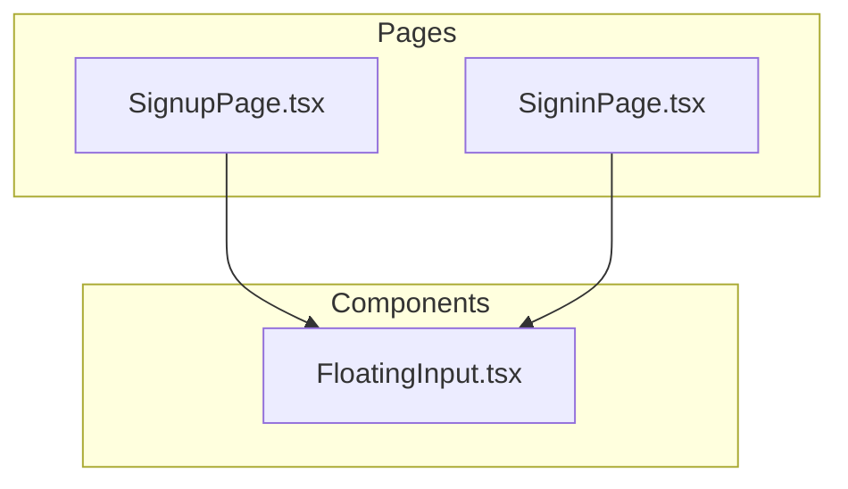
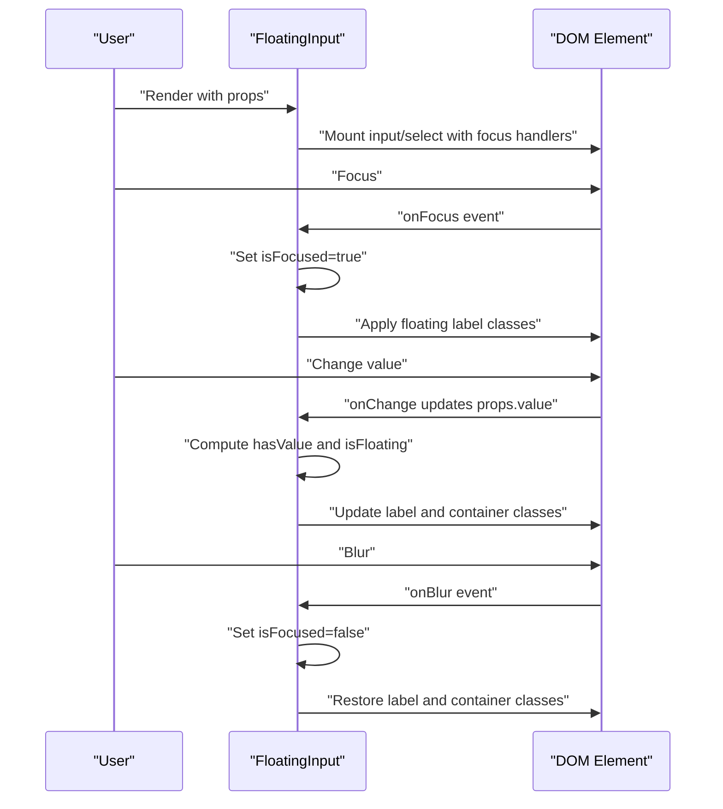
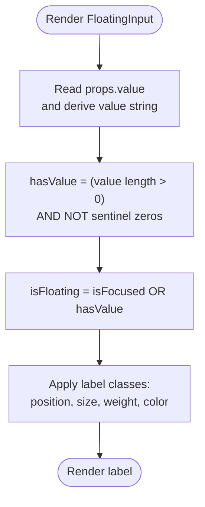
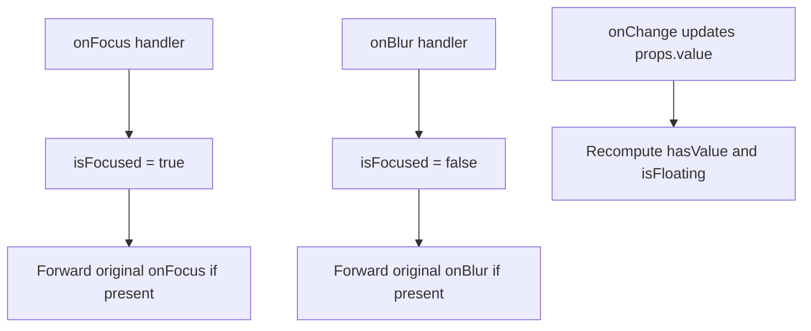
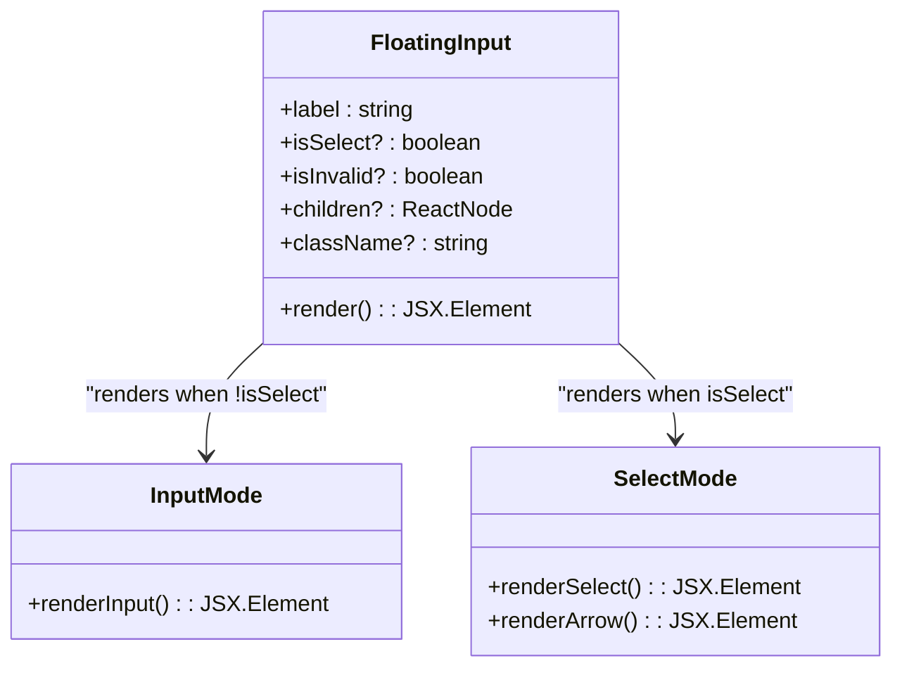
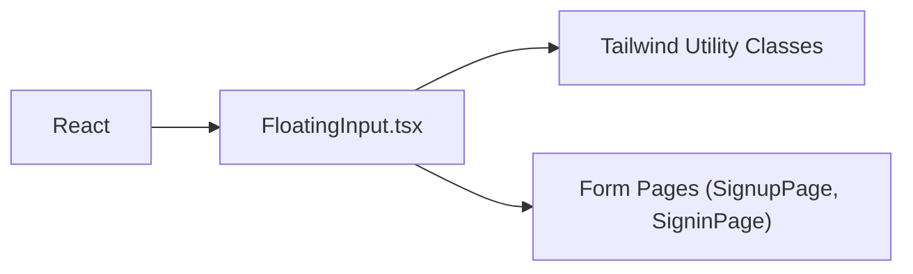

# FloatingInput Component

<cite>
**Referenced Files in This Document**
- [FloatingInput.tsx](file://components/FloatingInput.tsx)
- [SignupPage.tsx](file://pages/SignupPage.tsx)
- [SigninPage.tsx](file://pages/SigninPage.tsx)
</cite>

## Table of Contents
1. [Introduction](#introduction)
2. [Project Structure](#project-structure)
3. [Core Components](#core-components)
4. [Architecture Overview](#architecture-overview)
5. [Detailed Component Analysis](#detailed-component-analysis)
6. [Dependency Analysis](#dependency-analysis)
7. [Performance Considerations](#performance-considerations)
8. [Troubleshooting Guide](#troubleshooting-guide)
9. [Conclusion](#conclusion)
10. [Appendices](#appendices)

## Introduction
FloatingInput is a reusable form field component that implements a modern floating label animation. It supports both input and select modes, manages focus and value states to drive the label position and styling, and integrates with Tailwind-based design tokens for responsive behavior across mobile and desktop. The component exposes a compact set of props for labeling, validation states, select mode, and standard input attributes, while providing a consistent visual language aligned with the application’s design system.

## Project Structure
FloatingInput is located under the components directory and is consumed by page-level forms such as the sign-up and sign-in flows.

**Diagram sources**
- [FloatingInput.tsx](file://components/FloatingInput.tsx#L1-L85)
- [SignupPage.tsx](file://pages/SignupPage.tsx#L175-L224)
- [SigninPage.tsx](file://pages/SigninPage.tsx#L130-L195)

**Section sources**
- [FloatingInput.tsx](file://components/FloatingInput.tsx#L1-L85)

## Core Components
FloatingInput renders either an input or a select element depending on the isSelect prop. It maintains internal focus state and derives whether the label should float based on focus or presence of non-empty value. The component composes Tailwind classes to reflect focus, invalid, and disabled states, and applies a custom SVG arrow for select mode.

Key behaviors:
- Focus-driven label animation: label floats above the input when focused or when there is a non-empty value.
- Dual-mode rendering: input or select based on isSelect.
- Validation-aware styling: invalid state changes border and label color.
- Responsive sizing: reduced height on mobile versus desktop for a refined DPI feel.
- Select-specific UX: custom arrow indicator and transparent text when no selection is made.

**Section sources**
- [FloatingInput.tsx](file://components/FloatingInput.tsx#L11-L82)

## Architecture Overview
FloatingInput encapsulates state and styling logic internally, exposing a minimal prop interface. Consumers pass standard input attributes (including onChange, value, name, etc.), and FloatingInput augments them with focus handlers and computed classes.

**Diagram sources**
- [FloatingInput.tsx](file://components/FloatingInput.tsx#L19-L23)
- [FloatingInput.tsx](file://components/FloatingInput.tsx#L52-L69)

## Detailed Component Analysis

### Floating label animation system
The floating label is controlled by two state signals:
- Focus state: isFocused toggles when the element receives focus.
- Value presence: hasValue is derived from props.value and excludes sentinel zero-like placeholders.

The floating condition is isFloating = isFocused OR hasValue. The label’s position and typography adjust accordingly, including top offset, font size, weight, and color.

**Diagram sources**
- [FloatingInput.tsx](file://components/FloatingInput.tsx#L19-L23)
- [FloatingInput.tsx](file://components/FloatingInput.tsx#L33-L40)

**Section sources**
- [FloatingInput.tsx](file://components/FloatingInput.tsx#L19-L23)
- [FloatingInput.tsx](file://components/FloatingInput.tsx#L33-L40)

### State management for focus and value detection
- Internal state: isFocused tracks focus events.
- Value detection: value is coerced to string; hasValue ignores sentinel placeholder values used for month/day/year and year fields in forms.
- Event handlers: onFocus and onBlur update isFocused and forward original handlers if provided.

**Diagram sources**
- [FloatingInput.tsx](file://components/FloatingInput.tsx#L55-L56)
- [FloatingInput.tsx](file://components/FloatingInput.tsx#L64-L65)
- [FloatingInput.tsx](file://components/FloatingInput.tsx#L20-L23)

**Section sources**
- [FloatingInput.tsx](file://components/FloatingInput.tsx#L19-L23)
- [FloatingInput.tsx](file://components/FloatingInput.tsx#L52-L69)

### Dual-mode functionality: input and select
- Mode selection: isSelect determines whether to render an input or a select.
- Select customization: children are passed to the select; a custom SVG arrow is rendered for select mode.
- Transparent text for unselected select: when not floating, the select text appears transparent to hide placeholder text until a selection is made.

**Diagram sources**
- [FloatingInput.tsx](file://components/FloatingInput.tsx#L52-L78)

**Section sources**
- [FloatingInput.tsx](file://components/FloatingInput.tsx#L52-L78)

### Sophisticated styling system with dynamic class switching
The component builds Tailwind-based class strings for:
- Container: border, rounded corners, background, hover/focus rings, disabled opacity, and invalid state highlighting.
- Label: position, typography, and color that adapt to floating state, focus, and invalid state.
- Input: padding, height, text size, and select-specific appearance and transparency.

Responsive behavior:
- Rounded corners: md:rounded for larger screens.
- Typography: md: variants for label and text sizes.
- Height: h-[64px] on mobile vs h-[74px] on desktop for a refined DPI feel.

Validation and disabled states:
- Invalid: red border, subtle red shadow, and label color change.
- Focus: blue border and ring.
- Disabled: reduced opacity and muted background.

**Section sources**
- [FloatingInput.tsx](file://components/FloatingInput.tsx#L25-L47)

### Responsive design implementation
- Mobile-first heights: input height is smaller on mobile to reduce perceived density.
- Desktop scaling: md: prefixes increase padding, text size, and label positioning.
- Rounded corners: md:rounded increases on larger screens for a more open feel.

**Section sources**
- [FloatingInput.tsx](file://components/FloatingInput.tsx#L43-L47)

### Prop documentation
- label: string — The floating label text.
- isSelect?: boolean — Enables select mode; defaults to false (input mode).
- isInvalid?: boolean — Applies invalid state styling (red border and label).
- children?: ReactNode — Required in select mode to populate option elements.
- className?: string — Additional Tailwind classes appended to the container.
- Standard input attributes (e.g., name, value, onChange, onFocus, onBlur, disabled, required) are forwarded to the underlying input/select element.

Usage examples in the codebase:
- Input mode with label and standard attributes.
- Select mode with isSelect and children for options.
- Select mode with transparent text when no selection is made.

**Section sources**
- [FloatingInput.tsx](file://components/FloatingInput.tsx#L4-L9)
- [FloatingInput.tsx](file://components/FloatingInput.tsx#L11-L18)
- [SignupPage.tsx](file://pages/SignupPage.tsx#L179-L180)
- [SignupPage.tsx](file://pages/SignupPage.tsx#L184-L197)
- [SignupPage.tsx](file://pages/SignupPage.tsx#L200-L206)
- [SigninPage.tsx](file://pages/SigninPage.tsx#L133-L138)
- [SigninPage.tsx](file://pages/SigninPage.tsx#L158-L164)

### Usage examples
- Integration with forms:
  - Input fields for names and identifiers.
  - Select dropdowns for date-of-birth components and gender/country selection.
- Validation patterns:
  - Using isInvalid to reflect backend or client-side validation failures.
  - Combining with form-level validation to highlight invalid states.
- Accessibility features:
  - Proper label association via the label element.
  - Focus management through onFocus/onBlur handlers.
  - Disabled state support for read-only or conditional fields.

**Section sources**
- [SignupPage.tsx](file://pages/SignupPage.tsx#L175-L224)
- [SigninPage.tsx](file://pages/SigninPage.tsx#L130-L195)

### Custom SVG arrow for select elements
- A small arrow icon is rendered inside the container for select mode.
- Positioned absolutely at the trailing edge and vertically centered.
- Uses a simple path with stroke and fixed stroke width for consistent appearance.

**Section sources**
- [FloatingInput.tsx](file://components/FloatingInput.tsx#L72-L78)

### Design philosophy behind the floating label behavior
- Minimalist, clean input surfaces with floating labels that reduce cognitive load by keeping labels visible during interaction.
- Consistent motion: smooth transitions for label movement and container state changes.
- Responsive refinement: subtle adjustments in size and spacing to improve readability and touch target ergonomics on mobile devices.
- Validation clarity: explicit invalid state feedback without cluttering the layout.

**Section sources**
- [FloatingInput.tsx](file://components/FloatingInput.tsx#L33-L40)
- [FloatingInput.tsx](file://components/FloatingInput.tsx#L25-L31)
- [FloatingInput.tsx](file://components/FloatingInput.tsx#L43-L47)

## Dependency Analysis
FloatingInput depends on React for state and rendering. It does not import any external libraries; styling relies on Tailwind utility classes and the application’s design tokens.

**Diagram sources**
- [FloatingInput.tsx](file://components/FloatingInput.tsx#L2-L2)
- [SignupPage.tsx](file://pages/SignupPage.tsx#L6)
- [SigninPage.tsx](file://pages/SigninPage.tsx#L6)

**Section sources**
- [FloatingInput.tsx](file://components/FloatingInput.tsx#L2-L2)
- [SignupPage.tsx](file://pages/SignupPage.tsx#L6)
- [SigninPage.tsx](file://pages/SigninPage.tsx#L6)

## Performance Considerations
- Rendering cost: The component computes classes on each render; keep re-renders minimal by lifting state to parent forms.
- Event handlers: onFocus/onBlur are lightweight; avoid unnecessary re-renders in consumers.
- Select mode: children are passed directly to select; ensure option lists are generated efficiently.

## Troubleshooting Guide
- Label not floating:
  - Ensure value is non-empty and not equal to sentinel placeholder values.
  - Confirm focus events are firing and not overridden by consumer handlers.
- Select shows placeholder text:
  - In select mode without a selection, text appears transparent; select an option to display it.
- Invalid state not visible:
  - Pass isInvalid to enable red border and label styling.
- Disabled state not applied:
  - Ensure disabled is passed to the component; confirm Tailwind utilities are available.

**Section sources**
- [FloatingInput.tsx](file://components/FloatingInput.tsx#L20-L23)
- [FloatingInput.tsx](file://components/FloatingInput.tsx#L27-L29)
- [FloatingInput.tsx](file://components/FloatingInput.tsx#L46-L47)

## Conclusion
FloatingInput delivers a cohesive, accessible, and visually consistent input experience across input and select modes. Its floating label animation, responsive sizing, and validation-aware styling integrate seamlessly with form flows, while its minimal prop surface keeps integration straightforward.

## Appendices
- Example usage patterns are demonstrated in the sign-up and sign-in pages, showcasing both input and select modes with realistic form data binding and validation.