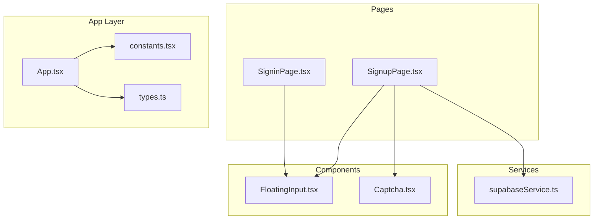
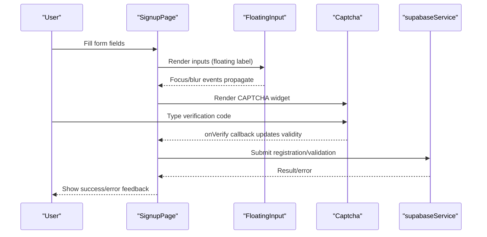
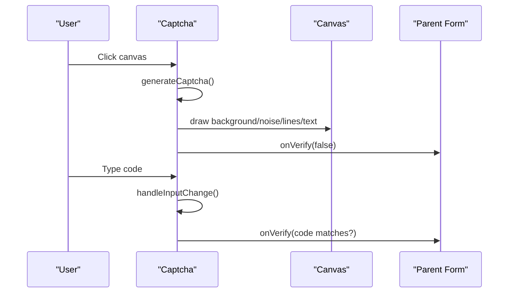
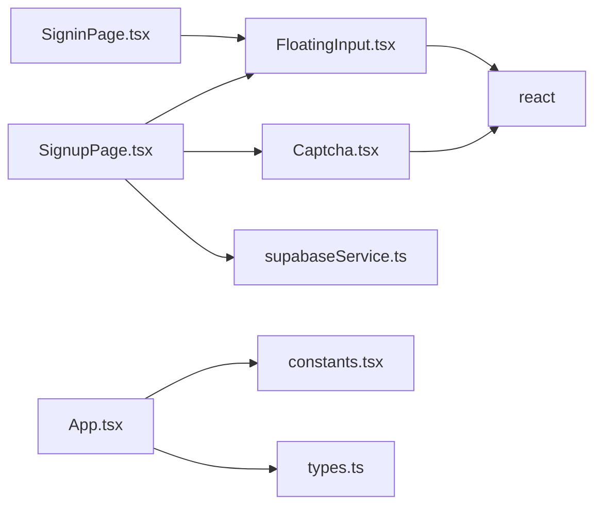

# UI Component Library

<cite>
**Referenced Files in This Document**
- [FloatingInput.tsx](file://components/FloatingInput.tsx)
- [Captcha.tsx](file://components/Captcha.tsx)
- [SignupPage.tsx](file://pages/SignupPage.tsx)
- [SigninPage.tsx](file://pages/SigninPage.tsx)
- [App.tsx](file://App.tsx)
- [types.ts](file://types.ts)
- [constants.tsx](file://constants.tsx)
- [supabaseService.ts](file://services/supabaseService.ts)
- [package.json](file://package.json)
</cite>

## Table of Contents
1. [Introduction](#introduction)
2. [Project Structure](#project-structure)
3. [Core Components](#core-components)
4. [Architecture Overview](#architecture-overview)
5. [Detailed Component Analysis](#detailed-component-analysis)
6. [Dependency Analysis](#dependency-analysis)
7. [Performance Considerations](#performance-considerations)
8. [Troubleshooting Guide](#troubleshooting-guide)
9. [Conclusion](#conclusion)
10. [Appendices](#appendices)

## Introduction
This document describes the ZPRIA UI component library with a focus on two reusable components: FloatingInput and Captcha. It explains floating label behavior, validation patterns, accessibility features, customization options, and integration with forms and the application theme. It also covers responsive design, styling customization, cross-browser compatibility, performance optimization, state management, error handling, and integration with the broader application theme system.

## Project Structure
The UI components live under components/, while pages/ demonstrate real-world usage within application flows. Types and constants define shared interfaces and theme variants. Services encapsulate backend integrations used in conjunction with the components.

**Diagram sources**
- [FloatingInput.tsx](file://components/FloatingInput.tsx#L1-L85)
- [Captcha.tsx](file://components/Captcha.tsx#L1-L117)
- [SignupPage.tsx](file://pages/SignupPage.tsx#L1-L293)
- [SigninPage.tsx](file://pages/SigninPage.tsx#L1-L231)
- [App.tsx](file://App.tsx#L1-L279)
- [types.ts](file://types.ts#L1-L79)
- [constants.tsx](file://constants.tsx#L1-L361)
- [supabaseService.ts](file://services/supabaseService.ts#L1-L67)

**Section sources**
- [package.json](file://package.json#L1-L27)

## Core Components
- FloatingInput: A flexible input/select wrapper that animates labels and supports validation states, disabled states, and custom styling via Tailwind classes.
- Captcha: A client-side visual verification widget that renders a random 5-character code on canvas and compares user input to the generated text.

**Section sources**
- [FloatingInput.tsx](file://components/FloatingInput.tsx#L4-L18)
- [Captcha.tsx](file://components/Captcha.tsx#L4-L7)

## Architecture Overview
The components integrate with page-level forms and the global application layout. Forms orchestrate state, validation, and submission, while the App layer manages routing, theming, and persistence.

**Diagram sources**
- [SignupPage.tsx](file://pages/SignupPage.tsx#L175-L293)
- [FloatingInput.tsx](file://components/FloatingInput.tsx#L11-L82)
- [Captcha.tsx](file://components/Captcha.tsx#L9-L117)
- [supabaseService.ts](file://services/supabaseService.ts#L17-L66)

## Detailed Component Analysis

### FloatingInput Component
FloatingInput provides a floating label effect for inputs and selects, with dynamic styling based on focus, value presence, invalid state, and disabled state. It accepts native input/select attributes and forwards them to the underlying element.

Key behaviors:
- Floating label: moves up and reduces size when focused or when the field has a non-empty value.
- Select mode: renders a native select with a custom dropdown indicator and transparent text when empty.
- Validation state: applies invalid styles when isInvalid is true.
- Accessibility: forwards all input attributes (e.g., required, aria-*), and removes placeholder text to keep the floating label visible.
- Responsive design: adjusts padding and height for mobile and desktop.

Props
- label: string (required)
- isSelect: boolean (optional)
- isInvalid: boolean (optional)
- children: React.ReactNode (optional; required when isSelect is true)
- className: string (optional; appended to computed classes)
- ...React.InputHTMLAttributes<HTMLInputElement | HTMLSelectElement>: forwarded to the input/select element

Events
- onFocus/onBlur: managed internally and forwarded to user handlers
- onChange: forwarded to user handlers

Styling customization
- Container: border, rounded corners, hover/focus rings, disabled opacity, and invalid highlight
- Label: position, typography, and color transitions
- Input/Select: padding, height, font sizes, and select-specific appearance

Accessibility
- Uses semantic input/select elements
- Preserves required, aria-* attributes
- No placeholder text to avoid overlapping with floating label

Integration patterns
- Used extensively in forms for personal info, identity claims, security credentials, and contact details
- Combined with inline adornments (e.g., domain suffix) and tooltips for password strength

Usage example paths
- [FloatingInput usage in SignupPage](file://pages/SignupPage.tsx#L179-L206)
- [FloatingInput usage in SigninPage](file://pages/SigninPage.tsx#L133-L164)

**Diagram sources**
- [FloatingInput.tsx](file://components/FloatingInput.tsx#L11-L82)

**Section sources**
- [FloatingInput.tsx](file://components/FloatingInput.tsx#L4-L84)
- [SignupPage.tsx](file://pages/SignupPage.tsx#L179-L206)
- [SigninPage.tsx](file://pages/SigninPage.tsx#L133-L164)

### Captcha Component
Captcha generates a random 5-character code, renders it on canvas with noise and distortion, and validates user input against the generated text. It exposes an onVerify callback to signal validity to parent forms.

Key behaviors
- Generation: produces a random code and resets user input; triggers onVerify(false)
- Canvas rendering: draws background, noise pixels, random lines, and distorted characters
- Interaction: clicking the canvas regenerates the code; typing in the input triggers onVerify
- Refresh: consuming pages can force regeneration by changing refreshKey

Props
- onVerify: (isValid: boolean) => void (required)
- refreshKey: number (optional; default 0)

Events
- onClick on canvas container: regenerates CAPTCHA
- onChange on input: compares user input to generated text and calls onVerify

Security considerations
- Client-side only: no server-side validation occurs here; it is intended for basic bot deterrence
- Case-insensitive comparison: input is normalized to uppercase
- Refresh mechanism: allows re-rendering when verification fails

Integration patterns
- Used in SignupPage within a dedicated verification section
- Controlled externally via a boolean flag and a refresh key

Usage example paths
- [Captcha usage in SignupPage](file://pages/SignupPage.tsx#L271)
- [Captcha component implementation](file://components/Captcha.tsx#L9-L117)

**Diagram sources**
- [Captcha.tsx](file://components/Captcha.tsx#L9-L117)
- [SignupPage.tsx](file://pages/SignupPage.tsx#L271)

**Section sources**
- [Captcha.tsx](file://components/Captcha.tsx#L4-L117)
- [SignupPage.tsx](file://pages/SignupPage.tsx#L271)

## Dependency Analysis
- FloatingInput depends on React and Tailwind utility classes for styling; it does not import external libraries.
- Captcha depends on React and the Canvas API; it does not import external libraries.
- Pages depend on components and services for form orchestration and backend integration.
- App integrates routing, theming, and persistence; constants/types define theme variants and shared interfaces.

**Diagram sources**
- [FloatingInput.tsx](file://components/FloatingInput.tsx#L2)
- [Captcha.tsx](file://components/Captcha.tsx#L2)
- [SignupPage.tsx](file://pages/SignupPage.tsx#L5-L6)
- [SigninPage.tsx](file://pages/SigninPage.tsx#L6)
- [App.tsx](file://App.tsx#L1-L279)
- [constants.tsx](file://constants.tsx#L1-L361)
- [types.ts](file://types.ts#L1-L79)
- [supabaseService.ts](file://services/supabaseService.ts#L1-L67)

**Section sources**
- [package.json](file://package.json#L12-L25)

## Performance Considerations
- FloatingInput
  - Minimal re-renders: state is scoped per instance; label animation uses CSS transitions.
  - Avoid unnecessary DOM: placeholder is removed to prevent layout thrashing.
- Captcha
  - Canvas drawing runs only when captchaText changes; consider debouncing heavy redraws if extended.
  - Random generation and drawing are lightweight but can be optimized further if needed (e.g., caching fonts or reducing pixel count).
- Forms
  - Memoization of derived values (e.g., password strength) prevents recomputation on unrelated changes.
  - Local storage usage for draft persistence avoids server round-trips during editing.

[No sources needed since this section provides general guidance]

## Troubleshooting Guide
Common issues and resolutions
- FloatingInput label overlaps with placeholder
  - Ensure placeholder is not set; the component removes it intentionally to maintain floating label visibility.
- FloatingInput select shows placeholder text
  - The component hides text when empty in select mode; confirm isSelect is true and children are provided.
- Captcha not updating after failure
  - Trigger a refresh by incrementing refreshKey in the parent to force regeneration.
- Captcha validation not firing
  - Confirm onVerify is passed and that user input is uppercase compared to the generated code.
- Form validation errors not visible
  - Use isInvalid on FloatingInput and display error messages near the component; ensure required attributes are present.

**Section sources**
- [FloatingInput.tsx](file://components/FloatingInput.tsx#L67-L70)
- [Captcha.tsx](file://components/Captcha.tsx#L22-L27)
- [SignupPage.tsx](file://pages/SignupPage.tsx#L95-L96)

## Conclusion
FloatingInput and Captcha provide robust, accessible, and customizable building blocks for ZPRIA’s forms. FloatingInput’s floating label behavior, validation states, and responsive design integrate seamlessly with page-level forms. Captcha offers a lightweight client-side verification mechanism suitable for initial bot deterrence. Together with the theme system and service integrations, these components enable consistent UX across the application.

[No sources needed since this section summarizes without analyzing specific files]

## Appendices

### Prop Reference: FloatingInput
- label: string (required)
- isSelect: boolean (optional)
- isInvalid: boolean (optional)
- children: React.ReactNode (optional; required for select)
- className: string (optional)
- ...React.InputHTMLAttributes<HTMLInputElement | HTMLSelectElement> (forwarded)

**Section sources**
- [FloatingInput.tsx](file://components/FloatingInput.tsx#L4-L18)

### Prop Reference: Captcha
- onVerify: (isValid: boolean) => void (required)
- refreshKey: number (optional; default 0)

**Section sources**
- [Captcha.tsx](file://components/Captcha.tsx#L4-L7)

### Integration Patterns
- Form composition
  - Combine FloatingInput for all textual inputs and selects; wrap related fields for cohesive UX.
  - Place Captcha in a dedicated verification section with clear instructions.
- Validation
  - Use isInvalid to reflect backend or frontend validation results.
  - Display contextual error messages adjacent to components.
- Theming
  - Leverage theme variants defined in constants.tsx for consistent brand alignment.
- Accessibility
  - Ensure required fields are marked; forward aria-* attributes; test keyboard navigation and screen reader support.

**Section sources**
- [SignupPage.tsx](file://pages/SignupPage.tsx#L175-L293)
- [SigninPage.tsx](file://pages/SigninPage.tsx#L130-L195)
- [constants.tsx](file://constants.tsx#L5-L25)