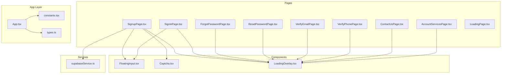
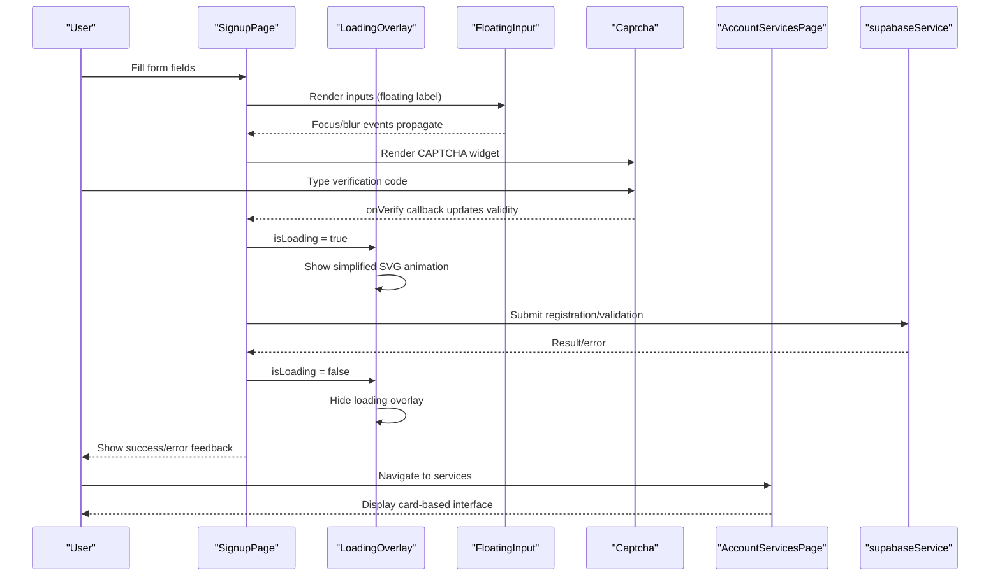
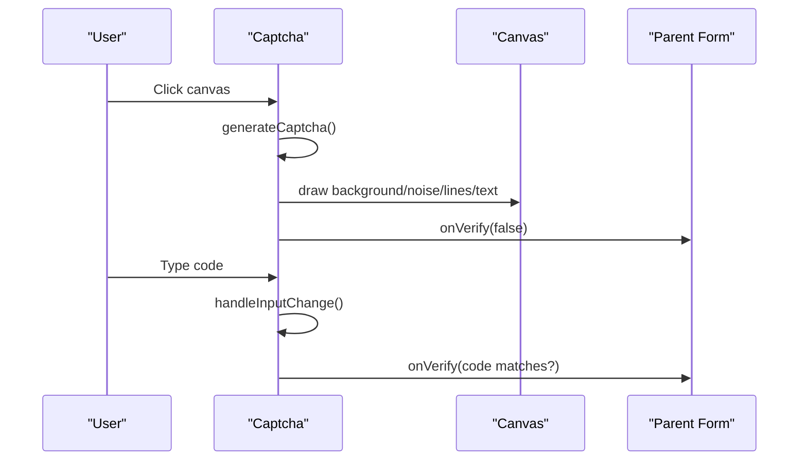
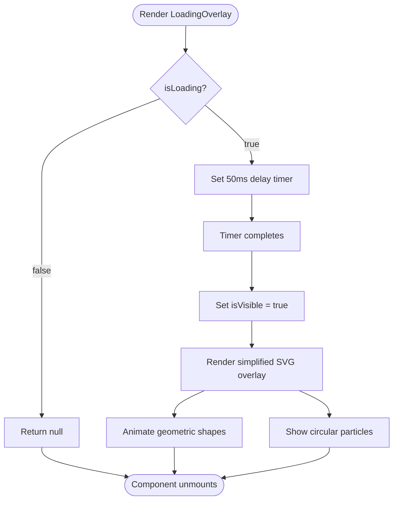
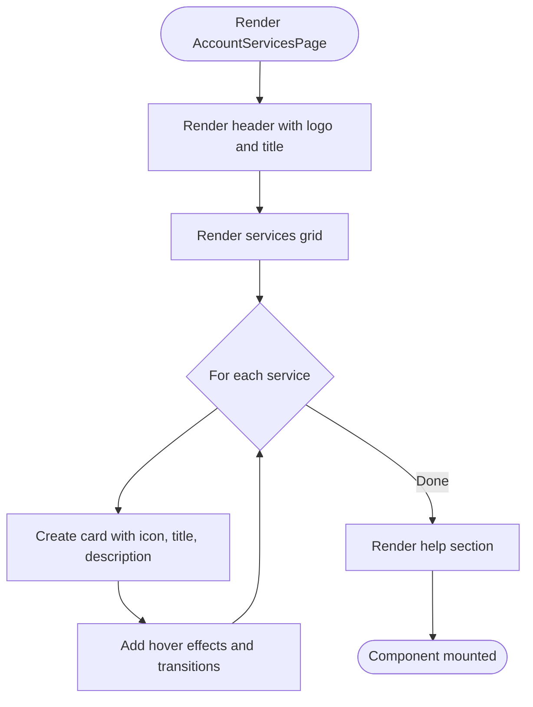
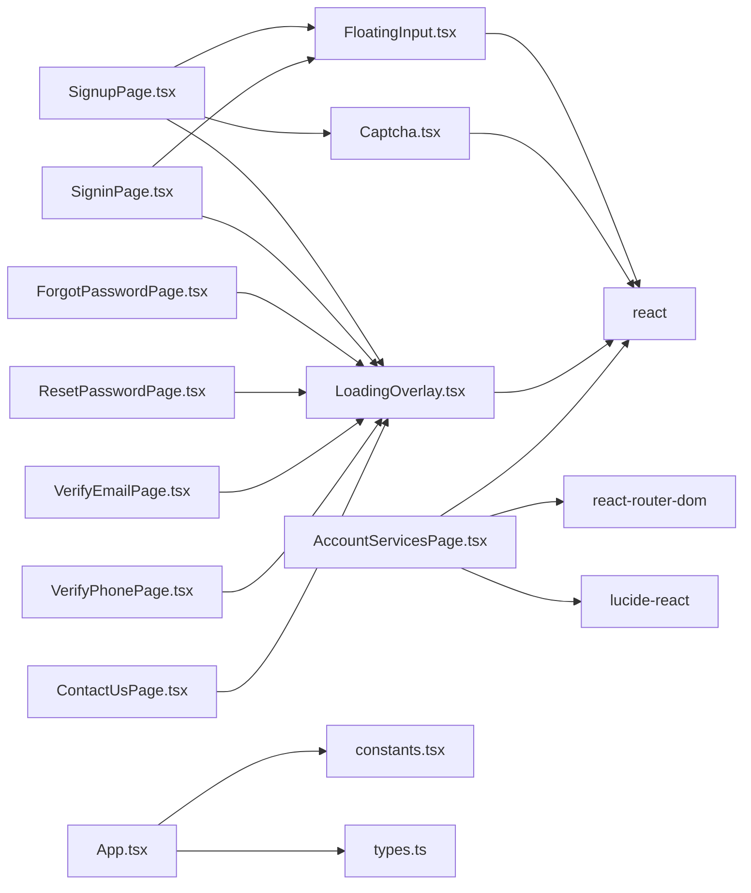

# UI Component Library

<cite>
**Referenced Files in This Document**
- [FloatingInput.tsx](file://components/FloatingInput.tsx)
- [Captcha.tsx](file://components/Captcha.tsx)
- [LoadingOverlay.tsx](file://components/LoadingOverlay.tsx)
- [LoadingPage.tsx](file://pages/LoadingPage.tsx)
- [SignupPage.tsx](file://pages/SignupPage.tsx)
- [SigninPage.tsx](file://pages/SigninPage.tsx)
- [ForgotPasswordPage.tsx](file://pages/ForgotPasswordPage.tsx)
- [ResetPasswordPage.tsx](file://pages/ResetPasswordPage.tsx)
- [VerifyEmailPage.tsx](file://pages/VerifyEmailPage.tsx)
- [VerifyPhonePage.tsx](file://pages/VerifyPhonePage.tsx)
- [ContactUsPage.tsx](file://pages/ContactUsPage.tsx)
- [AccountServicesPage.tsx](file://pages/AccountServicesPage.tsx)
- [App.tsx](file://App.tsx)
- [types.ts](file://types.ts)
- [constants.tsx](file://constants.tsx)
- [supabaseService.ts](file://services/supabaseService.ts)
- [package.json](file://package.json)
</cite>

## Update Summary
**Changes Made**
- Updated LoadingOverlay component documentation to reflect simplified SVG animation with reduced complexity
- Enhanced AccountServicesPage documentation to cover modern card-based interface redesign
- Revised Detailed Component Analysis section to include updated LoadingOverlay behavior
- Updated Integration Patterns to reflect simplified LoadingOverlay usage
- Removed references to complex geometric block animations in favor of streamlined SVG approach

## Table of Contents
1. [Introduction](#introduction)
2. [Project Structure](#project-structure)
3. [Core Components](#core-components)
4. [Architecture Overview](#architecture-overview)
5. [Detailed Component Analysis](#detailed-component-analysis)
6. [Dependency Analysis](#dependency-analysis)
7. [Performance Considerations](#performance-considerations)
8. [Troubleshooting Guide](#troubleshooting-guide)
9. [Conclusion](#conclusion)
10. [Appendices](#appendices)

## Introduction
This document describes the ZPRIA UI component library with a focus on three reusable components: FloatingInput, Captcha, and LoadingOverlay. It explains floating label behavior, validation patterns, accessibility features, customization options, and integration with forms and the application theme. The LoadingOverlay component provides streamlined animated loading states with a simplified SVG animation, serving as a centralized loading solution across all application pages. The AccountServicesPage demonstrates a modern card-based interface redesign with enhanced user experience through improved visual hierarchy and interactive elements.

## Project Structure
The UI components live under components/, while pages/ demonstrate real-world usage within application flows. The LoadingOverlay component serves as a centralized loading solution across all pages, while the AccountServicesPage showcases modern card-based design patterns. Types and constants define shared interfaces and theme variants. Services encapsulate backend integrations used in conjunction with the components.

**Diagram sources**
- [FloatingInput.tsx](file://components/FloatingInput.tsx#L1-L85)
- [Captcha.tsx](file://components/Captcha.tsx#L1-L117)
- [LoadingOverlay.tsx](file://components/LoadingOverlay.tsx#L1-L56)
- [SignupPage.tsx](file://pages/SignupPage.tsx#L1-L432)
- [SigninPage.tsx](file://pages/SigninPage.tsx#L1-L234)
- [ForgotPasswordPage.tsx](file://pages/ForgotPasswordPage.tsx#L1-L281)
- [ResetPasswordPage.tsx](file://pages/ResetPasswordPage.tsx#L1-L240)
- [VerifyEmailPage.tsx](file://pages/VerifyEmailPage.tsx#L1-L290)
- [VerifyPhonePage.tsx](file://pages/VerifyPhonePage.tsx#L1-L160)
- [ContactUsPage.tsx](file://pages/ContactUsPage.tsx#L1-L340)
- [AccountServicesPage.tsx](file://pages/AccountServicesPage.tsx#L1-L104)
- [LoadingPage.tsx](file://pages/LoadingPage.tsx#L1-L67)
- [App.tsx](file://App.tsx#L1-L279)
- [types.ts](file://types.ts#L1-L79)
- [constants.tsx](file://constants.tsx#L1-L361)
- [supabaseService.ts](file://services/supabaseService.ts#L1-L67)

**Section sources**
- [package.json](file://package.json#L1-L27)

## Core Components
- FloatingInput: A flexible input/select wrapper that animates labels and supports validation states, disabled states, and custom styling via Tailwind classes.
- Captcha: A client-side visual verification widget that renders a random 5-character code on canvas and compares user input to the generated text.
- LoadingOverlay: A streamlined loading overlay component featuring a simplified SVG animation with geometric shapes and circular particles, designed to provide efficient loading states across all application pages.

**Section sources**
- [FloatingInput.tsx](file://components/FloatingInput.tsx#L4-L18)
- [Captcha.tsx](file://components/Captcha.tsx#L4-L7)
- [LoadingOverlay.tsx](file://components/LoadingOverlay.tsx#L3-L6)

## Architecture Overview
The components integrate with page-level forms and the global application layout. The LoadingOverlay component provides centralized loading state management across all pages, while FloatingInput and Captcha handle form interactions. The AccountServicesPage demonstrates modern card-based design patterns with enhanced user experience. Forms orchestrate state, validation, and submission, while the App layer manages routing, theming, and persistence.

**Diagram sources**
- [SignupPage.tsx](file://pages/SignupPage.tsx#L420-L426)
- [LoadingOverlay.tsx](file://components/LoadingOverlay.tsx#L8-L17)
- [FloatingInput.tsx](file://components/FloatingInput.tsx#L11-L82)
- [Captcha.tsx](file://components/Captcha.tsx#L9-L117)
- [AccountServicesPage.tsx](file://pages/AccountServicesPage.tsx#L60-L84)
- [supabaseService.ts](file://services/supabaseService.ts#L17-L66)

## Detailed Component Analysis

### FloatingInput Component
FloatingInput provides a floating label effect for inputs and selects, with dynamic styling based on focus, value presence, invalid state, and disabled state. It accepts native input/select attributes and forwards them to the underlying element.

Key behaviors:
- Floating label: moves up and reduces size when focused or when the field has a non-empty value.
- Select mode: renders a native select with a custom dropdown indicator and transparent text when empty.
- Validation state: applies invalid styles when isInvalid is true.
- Accessibility: forwards all input attributes (e.g., required, aria-*), and removes placeholder text to keep the floating label visible.
- Responsive design: adjusts padding and height for mobile and desktop.

Props
- label: string (required)
- isSelect: boolean (optional)
- isInvalid: boolean (optional)
- children: React.ReactNode (optional; required when isSelect is true)
- className: string (optional; appended to computed classes)
- ...React.InputHTMLAttributes<HTMLInputElement | HTMLSelectElement>: forwarded to the input/select element

Events
- onFocus/onBlur: managed internally and forwarded to user handlers
- onChange: forwarded to user handlers

Styling customization
- Container: border, rounded corners, hover/focus rings, disabled opacity, and invalid highlight
- Label: position, typography, and color transitions
- Input/Select: padding, height, font sizes, and select-specific appearance

Accessibility
- Uses semantic input/select elements
- Preserves required, aria-* attributes
- No placeholder text to avoid overlapping with floating label

Integration patterns
- Used extensively in forms for personal info, identity claims, security credentials, and contact details
- Combined with inline adornments (e.g., domain suffix) and tooltips for password strength

Usage example paths
- [FloatingInput usage in SignupPage](file://pages/SignupPage.tsx#L316-L391)
- [FloatingInput usage in SigninPage](file://pages/SigninPage.tsx#L133-L164)

```mermaid
flowchart TD
Start(["Render FloatingInput"]) --> CheckSelect{"isSelect?"}
CheckSelect --> |Yes| SelectMode["Render <select> with children"]
CheckSelect --> |No| InputMode["Render <input>"]
SelectMode --> FocusSelect["onFocus/onBlur manage state"]
InputMode --> FocusInput["onFocus/onBlur manage state"]
FocusSelect --> Compute["Compute isFloating based on focus/value"]
FocusInput --> Compute
Compute --> ApplyStyles["Apply container/label/input classes"]
ApplyStyles --> End(["Render"])
```

**Diagram sources**
- [FloatingInput.tsx](file://components/FloatingInput.tsx#L11-L82)

**Section sources**
- [FloatingInput.tsx](file://components/FloatingInput.tsx#L4-L84)
- [SignupPage.tsx](file://pages/SignupPage.tsx#L316-L391)
- [SigninPage.tsx](file://pages/SigninPage.tsx#L133-L164)

### Captcha Component
Captcha generates a random 5-character code, renders it on canvas with noise and distortion, and validates user input against the generated text. It exposes an onVerify callback to signal validity to parent forms.

Key behaviors
- Generation: produces a random code and resets user input; triggers onVerify(false)
- Canvas rendering: draws background, noise pixels, random lines, and distorted characters
- Interaction: clicking the canvas regenerates the code; typing in the input triggers onVerify
- Refresh: consuming pages can force regeneration by changing refreshKey

Props
- onVerify: (isValid: boolean) => void (required)
- refreshKey: number (optional; default 0)

Events
- onClick on canvas container: regenerates CAPTCHA
- onChange on input: compares user input to generated text and calls onVerify

Security considerations
- Client-side only: no server-side validation occurs here; it is intended for basic bot deterrence
- Case-insensitive comparison: input is normalized to uppercase
- Refresh mechanism: allows re-rendering when verification fails

Integration patterns
- Used in SignupPage within a dedicated verification section
- Controlled externally via a boolean flag and a refresh key

Usage example paths
- [Captcha usage in SignupPage](file://pages/SignupPage.tsx#L408)
- [Captcha component implementation](file://components/Captcha.tsx#L9-L117)

**Diagram sources**
- [Captcha.tsx](file://components/Captcha.tsx#L9-L117)
- [SignupPage.tsx](file://pages/SignupPage.tsx#L408)

**Section sources**
- [Captcha.tsx](file://components/Captcha.tsx#L4-L117)
- [SignupPage.tsx](file://pages/SignupPage.tsx#L408)

### LoadingOverlay Component
LoadingOverlay provides streamlined animated loading states with a simplified SVG animation featuring geometric shapes and circular particles. It serves as a centralized loading solution across all application pages, offering consistent user experience during asynchronous operations with reduced complexity compared to previous versions.

Key behaviors:
- Simplified SVG animation: Features a streamlined geometric design with coordinated color schemes (#7C3AED, #06B6D4, #EC4899, #10B981)
- Reduced complexity: Contains fewer animated elements compared to previous versions, focusing on essential visual feedback
- Smooth fade transitions: Implements staggered fade-in/fade-out effects with 300ms duration
- Delayed visibility: Uses 50ms delay to prevent flickering on quick operations
- Responsive design: Adapts scaling for mobile and desktop views
- Lightweight implementation: Optimized for performance with minimal DOM overhead

Props:
- isLoading: boolean (required) - Controls overlay visibility and animation state

Animation features:
- Geometric shape movement: Rectangles translate vertically with staggered timing
- Circular particle effects: Multiple circles with varying sizes and colors
- Device-centered positioning: Animation is centered within the overlay container
- Gradient color scheme: Synchronized with application's primary colors

Styling customization:
- Background: Semi-transparent white backdrop with blur effect
- Overlay positioning: Fixed z-index with full viewport coverage
- Animation timing: Configurable duration and easing functions
- Color scheme: Synchronized with application's primary colors

Integration patterns:
- Page-level loading: Used in all major form submissions and authentication flows
- Form validation: Provides loading state during async validation processes
- User feedback: Offers consistent loading experience across different page contexts

Usage example paths:
- [LoadingOverlay in SignupPage](file://pages/SignupPage.tsx#L426)
- [LoadingOverlay in SigninPage](file://pages/SigninPage.tsx#L228)
- [LoadingOverlay in ForgotPasswordPage](file://pages/ForgotPasswordPage.tsx#L275)
- [LoadingOverlay in ResetPasswordPage](file://pages/ResetPasswordPage.tsx#L232)
- [LoadingOverlay in VerifyEmailPage](file://pages/VerifyEmailPage.tsx#L282)
- [LoadingOverlay in VerifyPhonePage](file://pages/VerifyPhonePage.tsx#L155)
- [LoadingOverlay in ContactUsPage](file://pages/ContactUsPage.tsx#L334)

**Diagram sources**
- [LoadingOverlay.tsx](file://components/LoadingOverlay.tsx#L8-L17)
- [LoadingOverlay.tsx](file://components/LoadingOverlay.tsx#L21-L52)

**Section sources**
- [LoadingOverlay.tsx](file://components/LoadingOverlay.tsx#L3-L56)
- [SignupPage.tsx](file://pages/SignupPage.tsx#L426)
- [SigninPage.tsx](file://pages/SigninPage.tsx#L228)
- [ForgotPasswordPage.tsx](file://pages/ForgotPasswordPage.tsx#L275)
- [ResetPasswordPage.tsx](file://pages/ResetPasswordPage.tsx#L232)
- [VerifyEmailPage.tsx](file://pages/VerifyEmailPage.tsx#L282)
- [VerifyPhonePage.tsx](file://pages/VerifyPhonePage.tsx#L155)
- [ContactUsPage.tsx](file://pages/ContactUsPage.tsx#L334)

### AccountServicesPage Component
AccountServicesPage demonstrates a modern card-based interface redesign with enhanced user experience through improved visual hierarchy and interactive elements. The component features a clean grid layout of service cards with icons, descriptions, and hover effects.

Key behaviors:
- Card-based layout: Each service is presented as a self-contained card with rounded corners and subtle shadows
- Interactive elements: Cards feature hover effects with shadow enhancements and color transitions
- Icon integration: Each service includes a colored icon with white styling for visual consistency
- Navigation: Cards are clickable links that navigate to respective service pages
- Responsive design: Adapts spacing and typography for different screen sizes
- Modern styling: Uses contemporary design patterns with rounded corners, smooth transitions, and clean typography

Props:
- None (functional component with internal state management)

Design features:
- Header section with logo and descriptive text
- Service grid with four distinct service categories
- Hover animations: Shadow expansion and color transitions on interaction
- Color-coded service indicators: Each service has a unique color scheme
- Chevron indicators: Right-pointing chevrons indicate navigable cards
- Help section: Prominent support link at the bottom of the page

Integration patterns:
- Routes to individual service pages (profile, security, devices, privacy)
- Uses Lucide React icons for consistent visual language
- Integrates with application branding through logo and color schemes
- Provides clear navigation hierarchy for account management

Usage example paths:
- [AccountServicesPage implementation](file://pages/AccountServicesPage.tsx#L7-L101)

**Diagram sources**
- [AccountServicesPage.tsx](file://pages/AccountServicesPage.tsx#L43-L84)

**Section sources**
- [AccountServicesPage.tsx](file://pages/AccountServicesPage.tsx#L1-L104)

## Dependency Analysis
- FloatingInput depends on React and Tailwind utility classes for styling; it does not import external libraries.
- Captcha depends on React and the Canvas API; it does not import external libraries.
- LoadingOverlay depends on React and SVG animations; it does not import external libraries.
- AccountServicesPage depends on React, react-router-dom for navigation, Lucide React for icons, and Tailwind CSS for styling.
- Pages depend on components and services for form orchestration and backend integration.
- App integrates routing, theming, and persistence; constants/types define theme variants and shared interfaces.

**Diagram sources**
- [FloatingInput.tsx](file://components/FloatingInput.tsx#L2)
- [Captcha.tsx](file://components/Captcha.tsx#L2)
- [LoadingOverlay.tsx](file://components/LoadingOverlay.tsx#L1)
- [AccountServicesPage.tsx](file://pages/AccountServicesPage.tsx#L2-L5)
- [SignupPage.tsx](file://pages/SignupPage.tsx#L5-L6)
- [SigninPage.tsx](file://pages/SigninPage.tsx#L6)
- [ForgotPasswordPage.tsx](file://pages/ForgotPasswordPage.tsx#L7)
- [ResetPasswordPage.tsx](file://pages/ResetPasswordPage.tsx#L5)
- [VerifyEmailPage.tsx](file://pages/VerifyEmailPage.tsx#L4)
- [VerifyPhonePage.tsx](file://pages/VerifyPhonePage.tsx#L4)
- [ContactUsPage.tsx](file://pages/ContactUsPage.tsx#L4)
- [App.tsx](file://App.tsx#L1-L279)
- [constants.tsx](file://constants.tsx#L1-L361)
- [types.ts](file://types.ts#L1-L79)

**Section sources**
- [package.json](file://package.json#L12-L25)

## Performance Considerations
- FloatingInput
  - Minimal re-renders: state is scoped per instance; label animation uses CSS transitions.
  - Avoid unnecessary DOM: placeholder is removed to prevent layout thrashing.
- Captcha
  - Canvas drawing runs only when captchaText changes; consider debouncing heavy redraws if extended.
  - Random generation and drawing are lightweight but can be optimized further if needed (e.g., caching fonts or reducing pixel count).
- LoadingOverlay
  - Efficient animation: Uses CSS transforms and opacity for smooth GPU-accelerated animations.
  - Memory management: Automatically cleans up timers and animations when component unmounts.
  - Conditional rendering: Returns null when not loading to minimize DOM overhead.
  - SVG optimization: Leverages hardware acceleration for complex animations with reduced complexity.
- AccountServicesPage
  - Lightweight implementation: Uses simple card components with minimal JavaScript.
  - Efficient rendering: Static content with minimal re-rendering requirements.
  - Responsive design: Optimized for various screen sizes with Tailwind's utility-first approach.
- Forms
  - Memoization of derived values (e.g., password strength) prevents recomputation on unrelated changes.
  - Local storage usage for draft persistence avoids server round-trips during editing.

## Troubleshooting Guide
Common issues and resolutions
- FloatingInput label overlaps with placeholder
  - Ensure placeholder is not set; the component removes it intentionally to maintain floating label visibility.
- FloatingInput select shows placeholder text
  - The component hides text when empty in select mode; confirm isSelect is true and children are provided.
- Captcha not updating after failure
  - Trigger a refresh by incrementing refreshKey in the parent to force regeneration.
- Captcha validation not firing
  - Confirm onVerify is passed and that user input is uppercase compared to the generated code.
- LoadingOverlay not appearing
  - Ensure isLoading prop is properly controlled and set to true during async operations.
- LoadingOverlay animation not smooth
  - Check that the component is not being unmounted immediately after mounting; the 50ms delay prevents flickering.
- LoadingOverlay showing complex animations instead of simplified version
  - Verify the component is using the latest simplified SVG animation with reduced elements.
- AccountServicesPage cards not displaying correctly
  - Ensure Tailwind CSS is properly configured and all required dependencies are installed.
- AccountServicesPage hover effects not working
  - Check that hover utilities are enabled in Tailwind configuration and CSS is properly loaded.
- Form validation errors not visible
  - Use isInvalid on FloatingInput and display error messages near the component; ensure required attributes are present.

**Section sources**
- [FloatingInput.tsx](file://components/FloatingInput.tsx#L67-L70)
- [Captcha.tsx](file://components/Captcha.tsx#L22-L27)
- [LoadingOverlay.tsx](file://components/LoadingOverlay.tsx#L14-L17)
- [AccountServicesPage.tsx](file://pages/AccountServicesPage.tsx#L60-L84)
- [SignupPage.tsx](file://pages/SignupPage.tsx#L95-L96)

## Conclusion
FloatingInput, Captcha, LoadingOverlay, and AccountServicesPage provide robust, accessible, and customizable building blocks for ZPRIA's forms and loading states. FloatingInput's floating label behavior, validation states, and responsive design integrate seamlessly with page-level forms. Captcha offers a lightweight client-side verification mechanism suitable for initial bot deterrence. LoadingOverlay provides streamlined animated loading states with simplified SVG animations, ensuring efficient performance while maintaining consistent user experience across all application pages. AccountServicesPage demonstrates modern card-based design patterns with enhanced user experience through improved visual hierarchy and interactive elements. Together with the theme system and service integrations, these components enable consistent UX across the application.

## Appendices

### Prop Reference: FloatingInput
- label: string (required)
- isSelect: boolean (optional)
- isInvalid: boolean (optional)
- children: React.ReactNode (optional; required for select)
- className: string (optional)
- ...React.InputHTMLAttributes<HTMLInputElement | HTMLSelectElement> (forwarded)

**Section sources**
- [FloatingInput.tsx](file://components/FloatingInput.tsx#L4-L18)

### Prop Reference: Captcha
- onVerify: (isValid: boolean) => void (required)
- refreshKey: number (optional; default 0)

**Section sources**
- [Captcha.tsx](file://components/Captcha.tsx#L4-L7)

### Prop Reference: LoadingOverlay
- isLoading: boolean (required) - Controls overlay visibility and animation state

**Section sources**
- [LoadingOverlay.tsx](file://components/LoadingOverlay.tsx#L3-L6)

### Integration Patterns
- Form composition
  - Combine FloatingInput for all textual inputs and selects; wrap related fields for cohesive UX.
  - Place Captcha in a dedicated verification section with clear instructions.
  - Integrate LoadingOverlay as a child component to provide loading feedback during form submission.
- Validation
  - Use isInvalid to reflect backend or frontend validation results.
  - Display contextual error messages adjacent to components.
  - Implement LoadingOverlay alongside validation to provide immediate feedback.
- Theming
  - Leverage theme variants defined in constants.tsx for consistent brand alignment.
  - LoadingOverlay automatically adapts to the application's color scheme.
- Accessibility
  - Ensure required fields are marked; forward aria-* attributes; test keyboard navigation and screen reader support.
  - LoadingOverlay provides visual feedback for screen readers through animated elements.
- State Management
  - Control LoadingOverlay via isLoading state in parent components.
  - Coordinate LoadingOverlay with form submission lifecycle.
  - Use LoadingOverlay for both synchronous and asynchronous operations.
- AccountServicesPage Design
  - Utilize card-based layout for service organization.
  - Implement hover effects for interactive feedback.
  - Use consistent color schemes and iconography.
  - Ensure responsive design across device sizes.

**Section sources**
- [SignupPage.tsx](file://pages/SignupPage.tsx#L420-L426)
- [SigninPage.tsx](file://pages/SigninPage.tsx#L227-L228)
- [ForgotPasswordPage.tsx](file://pages/ForgotPasswordPage.tsx#L274-L275)
- [ResetPasswordPage.tsx](file://pages/ResetPasswordPage.tsx#L232)
- [VerifyEmailPage.tsx](file://pages/VerifyEmailPage.tsx#L282)
- [VerifyPhonePage.tsx](file://pages/VerifyPhonePage.tsx#L155)
- [ContactUsPage.tsx](file://pages/ContactUsPage.tsx#L334)
- [AccountServicesPage.tsx](file://pages/AccountServicesPage.tsx#L60-L84)
- [constants.tsx](file://constants.tsx#L5-L25)