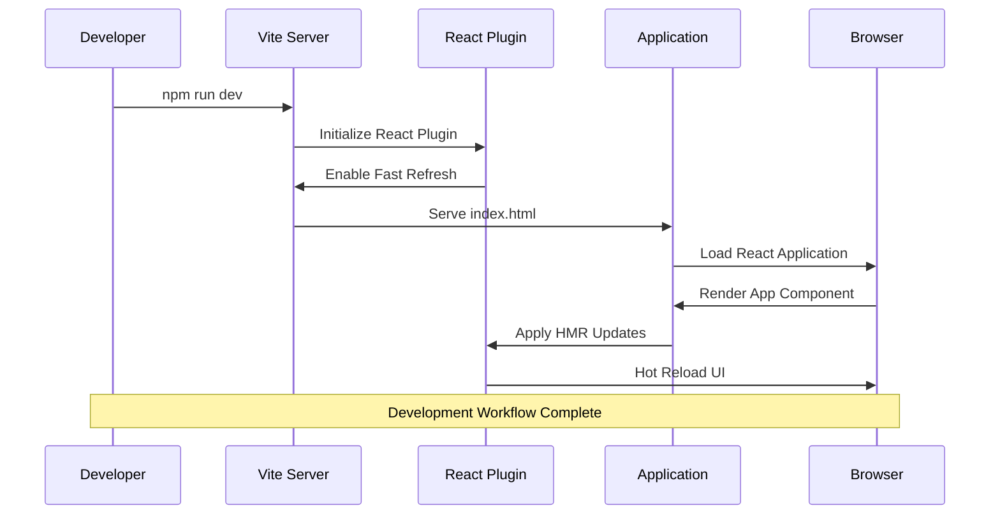
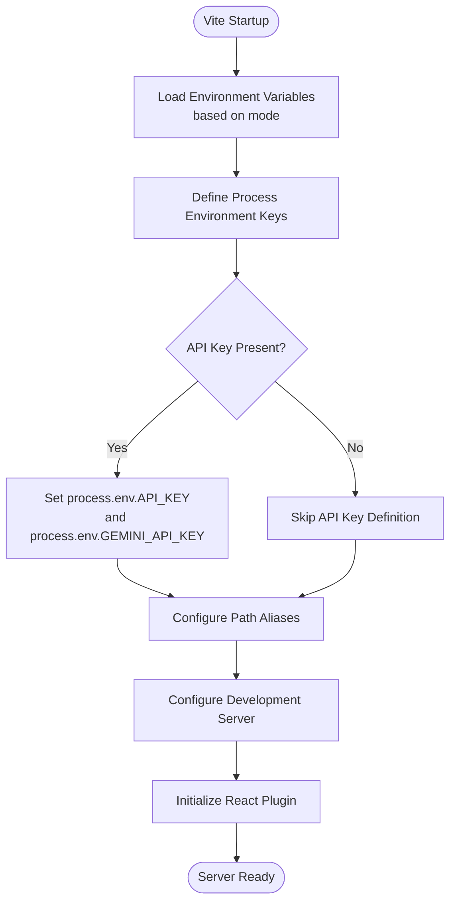
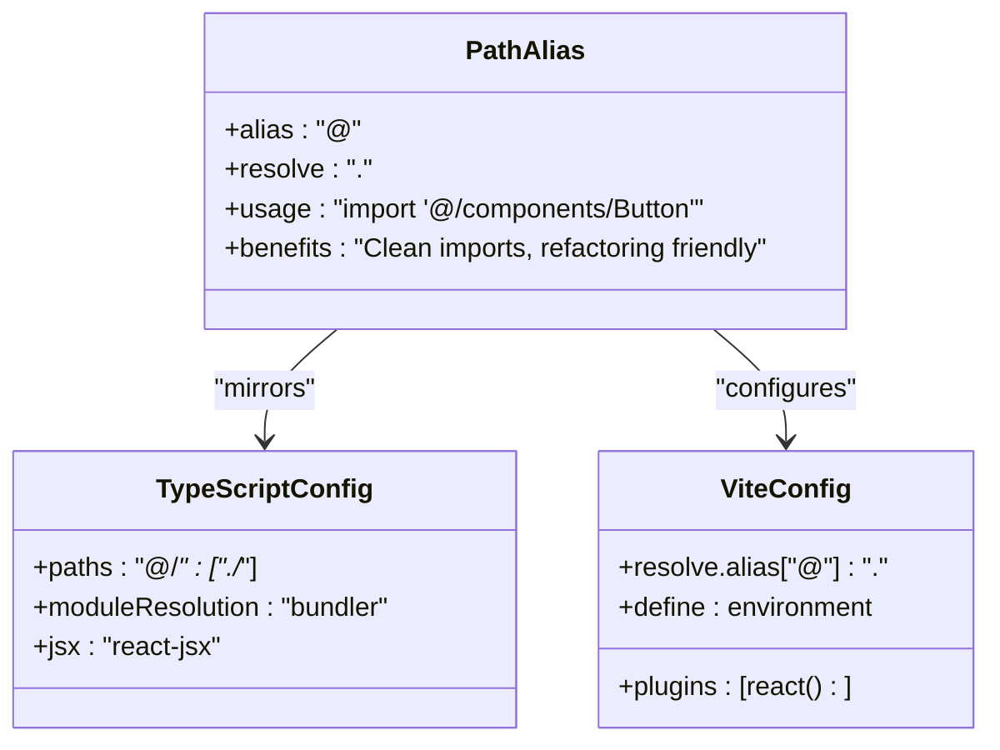

# Vite Configuration

<cite>
**Referenced Files in This Document**
- [vite.config.ts](file://vite.config.ts)
- [package.json](file://package.json)
- [tsconfig.json](file://tsconfig.json)
- [index.html](file://index.html)
- [index.tsx](file://index.tsx)
- [App.tsx](file://App.tsx)
- [README.md](file://README.md)
- [services/geminiService.ts](file://services/geminiService.ts)
- [services/supabaseService.ts](file://services/supabaseService.ts)
- [constants.tsx](file://constants.tsx)
- [types.ts](file://types.ts)
</cite>

## Table of Contents
1. [Introduction](#introduction)
2. [Project Structure](#project-structure)
3. [Core Components](#core-components)
4. [Architecture Overview](#architecture-overview)
5. [Detailed Component Analysis](#detailed-component-analysis)
6. [Dependency Analysis](#dependency-analysis)
7. [Performance Considerations](#performance-considerations)
8. [Troubleshooting Guide](#troubleshooting-guide)
9. [Conclusion](#conclusion)

## Introduction
This document provides comprehensive analysis of the Vite configuration for a modern React TypeScript application. The project utilizes Vite 6.2.0 as the build tool and development server, configured with React Fast Refresh, TypeScript compilation, and environment variable handling. The configuration demonstrates best practices for modern web development including hot module replacement, efficient asset handling, and seamless integration with React applications.

## Project Structure
The project follows a conventional React application structure with Vite as the build system. The configuration enables efficient development workflows and optimized production builds.

```mermaid
graph TB
subgraph "Application Root"
Vite[vite.config.ts]
Package[package.json]
TSConfig[tsconfig.json]
HTML[index.html]
IndexTS[index.tsx]
AppTSX[App.tsx]
end
subgraph "Source Code"
Services[services/]
Pages[pages/]
Components[components/]
Types[types.ts]
Constants[constants.tsx]
end
subgraph "External Dependencies"
React[react ^19.2.4]
Supabase[@supabase/supabase-js ^2.48.1]
Gemini[@google/genai ^1.39.0]
Router[react-router-dom ^7.13.0]
end
Vite --> React
Vite --> Supabase
Vite --> Gemini
Vite --> Router
AppTSX --> Services
AppTSX --> Pages
AppTSX --> Components
AppTSX --> Types
AppTSX --> Constants
```

**Diagram sources**
- [vite.config.ts](file://vite.config.ts#L1-L25)
- [package.json](file://package.json#L1-L27)
- [index.html](file://index.html#L1-L108)

**Section sources**
- [vite.config.ts](file://vite.config.ts#L1-L25)
- [package.json](file://package.json#L1-L27)
- [tsconfig.json](file://tsconfig.json#L1-L29)

## Core Components

### Vite Configuration Analysis
The Vite configuration provides a robust foundation for development and production builds with several key features:

**Development Server Configuration**
- Port 3000 with host binding to '0.0.0.0' for network accessibility
- React Fast Refresh enabled for instant UI updates during development
- Hot Module Replacement (HMR) support for seamless development experience

**Environment Variable Management**
- Dynamic loading of environment variables based on mode
- API key exposure through process.env for runtime configuration
- Secure handling of sensitive configuration data

**Module Resolution**
- Path alias '@' pointing to project root for clean imports
- TypeScript path mapping synchronization
- Enhanced developer experience with shorter import paths

**Build Optimization**
- Automatic plugin detection and configuration
- Efficient asset bundling and optimization
- Production-ready code splitting and minification

**Section sources**
- [vite.config.ts](file://vite.config.ts#L5-L24)

### Package Management Configuration
The project utilizes modern JavaScript tooling with carefully selected dependencies:

**Runtime Dependencies**
- React 19.2.4 with concurrent features and improved performance
- React Router DOM 7.13.0 for client-side routing
- Supabase client for database and authentication services
- Google Gemini SDK for AI-powered features
- Lucide React for consistent iconography

**Development Dependencies**
- Vite 6.2.0 as the build tool and development server
- TypeScript ~5.8.2 for type safety
- React plugin for Vite integration
- Node types for development environment support

**Section sources**
- [package.json](file://package.json#L12-L25)

### TypeScript Configuration
The TypeScript setup ensures type safety while maintaining development flexibility:

**Compiler Options**
- ES2022 target with experimental decorators support
- Bundler module resolution for optimal tree-shaking
- Isolated modules for faster incremental builds
- JSX React JSX transformation for React 18+ features

**Path Mapping**
- Root alias '@' for cleaner import statements
- Consistent with Vite configuration
- Improved code organization and maintainability

**Section sources**
- [tsconfig.json](file://tsconfig.json#L2-L28)

## Architecture Overview

The Vite configuration integrates seamlessly with the React application architecture, providing optimal development and production experiences.



**Diagram sources**
- [vite.config.ts](file://vite.config.ts#L9-L13)
- [index.html](file://index.html#L104-L107)
- [index.tsx](file://index.tsx#L11-L16)

The architecture demonstrates the separation of concerns between Vite's build system, React's component system, and the browser rendering engine. Environment variables are properly scoped and accessible only where needed.

## Detailed Component Analysis

### Environment Variable Configuration
The Vite configuration implements secure and flexible environment variable handling:



**Diagram sources**
- [vite.config.ts](file://vite.config.ts#L6-L17)

The environment variable system ensures that API keys are only exposed to the application runtime and are not bundled into client-side code for security reasons.

**Section sources**
- [vite.config.ts](file://vite.config.ts#L6-L17)

### React Integration and Fast Refresh
The React plugin configuration enables advanced development features:

**Fast Refresh Capabilities**
- Instant component updates without losing state
- Error boundaries for graceful error handling
- Optimized rebuild times for large applications

**Development Server Features**
- Port 3000 with external access capability
- Host binding for containerized deployments
- Automatic browser opening and live reloading

**Section sources**
- [vite.config.ts](file://vite.config.ts#L13-L13)
- [vite.config.ts](file://vite.config.ts#L9-L12)

### Path Resolution and Module Aliasing
The path alias configuration improves code organization and maintainability:



**Diagram sources**
- [vite.config.ts](file://vite.config.ts#L18-L22)
- [tsconfig.json](file://tsconfig.json#L21-L25)

**Section sources**
- [vite.config.ts](file://vite.config.ts#L18-L22)
- [tsconfig.json](file://tsconfig.json#L21-L25)

## Dependency Analysis

The Vite configuration creates a cohesive dependency graph that optimizes both development and production workflows:

```mermaid
graph TB
subgraph "Vite Core"
ViteCore[Vite Core]
ReactPlugin[@vitejs/plugin-react]
end
subgraph "Application Layer"
React[React ^19.2.4]
Router[react-router-dom ^7.13.0]
AppCode[App.tsx]
end
subgraph "Service Layer"
Gemini[@google/genai ^1.39.0]
Supabase[@supabase/supabase-js ^2.48.1]
GeminiService[services/geminiService.ts]
SupabaseService[services/supabaseService.ts]
end
subgraph "Infrastructure"
Env[Environment Variables]
Config[vite.config.ts]
Types[types.ts]
end
ViteCore --> ReactPlugin
ReactPlugin --> React
React --> AppCode
AppCode --> GeminiService
AppCode --> SupabaseService
GeminiService --> Gemini
SupabaseService --> Supabase
AppCode --> Types
Config --> Env
Config --> ReactPlugin
```

**Diagram sources**
- [package.json](file://package.json#L12-L19)
- [vite.config.ts](file://vite.config.ts#L3-L3)
- [App.tsx](file://App.tsx#L1-L279)

**Section sources**
- [package.json](file://package.json#L12-L19)
- [vite.config.ts](file://vite.config.ts#L3-L3)

## Performance Considerations

The Vite configuration incorporates several performance optimization strategies:

**Development Performance**
- Fast refresh reduces rebuild times significantly
- Hot module replacement maintains application state
- Efficient asset caching during development
- Parallel plugin initialization

**Production Performance**
- Code splitting for optimal bundle loading
- Tree shaking for unused code elimination
- Minification and compression for reduced payload
- Asset optimization and bundling

**Memory Management**
- Efficient module resolution prevents memory leaks
- Lazy loading for route components
- Proper cleanup of event listeners and subscriptions

## Troubleshooting Guide

Common issues and their solutions when working with the Vite configuration:

**Environment Variable Issues**
- Ensure `.env.local` file contains the required `GEMINI_API_KEY`
- Verify environment variables are loaded correctly in development mode
- Check that API keys are properly scoped and not exposed in production builds

**Import Resolution Problems**
- Verify path aliases are correctly configured in both Vite and TypeScript
- Ensure file extensions are properly handled in imports
- Check for circular dependencies that might break module resolution

**Development Server Issues**
- Port 3000 conflicts: Change port in Vite configuration or free the port
- Host binding issues: Verify network permissions and firewall settings
- Fast refresh problems: Clear browser cache and restart development server

**Build Issues**
- TypeScript compilation errors: Check compiler options and type definitions
- Plugin conflicts: Verify plugin versions are compatible with Vite
- Asset loading problems: Check public directory configuration and asset paths

**Section sources**
- [README.md](file://README.md#L16-L20)
- [vite.config.ts](file://vite.config.ts#L6-L6)

## Conclusion

The Vite configuration for this React TypeScript application demonstrates modern web development best practices. The setup provides excellent developer experience with fast refresh, efficient module resolution, and secure environment variable handling. The configuration balances development productivity with production performance, making it suitable for both local development and deployment scenarios.

Key strengths of the configuration include:
- Clean separation of concerns between development and production
- Secure handling of sensitive environment variables
- Optimized module resolution with path aliases
- Seamless integration with React's development tools
- Comprehensive TypeScript support with modern compiler options

The configuration serves as a solid foundation for scalable React applications and can be easily extended for additional features like custom plugins, advanced optimization, or deployment-specific configurations.